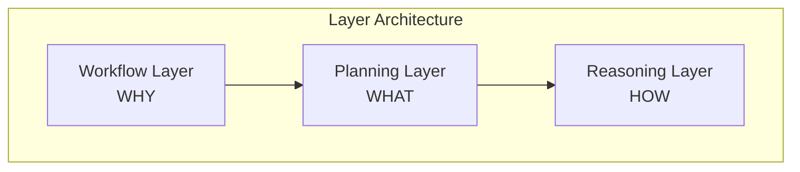

<!-- markdownlint-disable MD041 -->
<!-- markdownlint-disable MD033 -->
<p align="center">
  
</p>

# DXA - Domain-Expert Agent Framework

DXA is a Python framework that enables building intelligent agents with domain expertise, powered by Large Language Models (LLMs).

## Getting Started

First things first, set up your development environment:

```bash
# Set up development environment
% ./setup_env.sh

# Activate virtual environment
% source .venv/bin/activate

# Include this package in your environment
% pip install -e .

# Then try running the tests
% pytest tests
```

## Contents

- [What is DXA?](#what-is-dxa)
- [Key Features](#key-features)
- [Installation](#installation)
- [Quick Start](#quick-start)
- [Documentation](#documentation)
- [Framework Comparison](#strategic-framework-selection-matrix)
- [Project Structure](#project-structure)
- [Contributing](#contributing)

## What is DXA?

DXA is a framework for building intelligent agents powered by Large Language Models (LLMs). It specializes in embedding domain expertise into agents through a unique three-layer architecture that maps business workflows to concrete plans to reasoning patterns:

1. **Workflows (WHY)** define what agents can do - from simple Q&A to complex research patterns
2. **Plans (WHAT)** break down workflows into concrete, executable steps
3. **Reasoning (HOW)** executes each step using appropriate thinking patterns



This architecture means you can:

- Start simple (like basic Q&A)
- Add capabilities progressively
- Scale to complex domain-specific tasks
- Maintain clean separation of concerns

## Component Overview

DXA consists of several core components that work together:

- **Agent System** - Executes workflows and manages resources
- **Execution System** - Implements the 3-layer architecture

The Execution system is organized in a 3-layer architecture:

- **Workflow Layer** (`dxa.execution.workflow`) - Defines what agents can do (WHY)
- **Planning Layer** (`dxa.execution.planning`) - Converts workflows to executable plans (WHAT)
- **Reasoning Layer** (`dxa.execution.reasoning`) - Executes plans with thinking patterns (HOW)

Agents have modular components for different functionalities:

- **Capability System** (`dxa.agent.capability`) - Defines agent abilities like memory, expertise
- **Resource System** (`dxa.agent.resource`) - Integrates external tools and services
- **IO System** (`dxa.agent.io`) - Handles input and output for the agent
- **State System** (`dxa.agent.state`) - Manages agent and execution state

## Key Features

- **Domain Expertise Integration** - Embed expert knowledge into agent behavior
- **Progressive Complexity** - Start simple, scale to complex tasks
- **Composable Architecture** - Mix and match capabilities as needed
- **Built-in Best Practices** - Pre-configured templates for common patterns
- **Full Customization** - Complete control when needed

## Installation

```bash
git clone <repository-url>
cd dxa-prototype
bash setup_env.sh
source venv/bin/activate  # Windows: source venv/Scripts/activate
```

Prerequisites:

- Python 3.x
- bash shell (Unix) or Git Bash (Windows)

## Quick Start

```python
from dxa.agent import Agent
from dxa.agent.resource import LLMResource
from dxa.execution import WorkflowFactory, PlanStrategy, ReasoningStrategy

# Simple Q&A
answer = Agent().ask("What is quantum computing?")

# Research workflow
workflow = WorkflowFactory.create_default_workflow("Research quantum computing")
agent = Agent(name="researcher").with_llm(LLMResource())
result = agent.run(workflow)

# Custom workflow with strategies
agent = Agent(name="advanced_agent")\
    .with_llm(LLMResource(config={"model": "openai:gpt-4"}))\
    .with_planning(PlanStrategy.DEFAULT)\
    .with_reasoning(ReasoningStrategy.DEFAULT)
result = agent.run(workflow)
```

## Documentation

- **[Framework Overview](dxa/README.md)** - Detailed system architecture
- **[Examples](examples/README.md)** - Usage patterns and tutorials
- **[Agent Documentation](dxa/agent/README.md)** - Agent components
- **[Execution Documentation](dxa/execution/README.md)** - Workflow, Planning, and Reasoning

## Strategic Framework Selection Matrix

DXA provides distinct advantages in several key areas when compared to other agent frameworks:

| Use Case | DXA | LangChain | AutoGPT | BabyAGI |
|----------|-----|-----------|----------|----------|
| **Quick Start** | ✨ Template-based initialization | Direct chain construction | Command interface | Simple task queue |
| **Simple Tasks** | ✨ Pre-configured templates | Chain composition | Command sequences | Task scheduling |
| **Complex Tasks** | ✨ Full cognitive architecture | Multiple chains | Command sequences | Task recursion |
| **Domain Expertise** | ✨ Built-in expertise system | Tool integration | Command-based tools | Task-based tools |
| **Autonomous Operation** | ✨ Structured autonomy | Chain automation | Free-form commands | Task loops |
| **Growth Path** | ✨ Seamless capability expansion | Chain rebuilding | New commands | New tasks |

✨ = Optimal choice for category

### Framework Selection Guide

| Need | Best Choice | Why |
|------|-------------|-----|
| Fast Start | DXA/LangChain | Equivalent simplicity with better growth |
| Simple Tasks | DXA/LangChain | Standard patterns with full power available |
| Complex Systems | DXA | Superior architecture and capabilities |
| Expert Systems | DXA | Native expertise and knowledge integration |
| Autonomous Agents | DXA/AutoGPT | Structured autonomy with better control |

### Implementation Complexity

| Framework | Initial | Growth | Maintenance |
|-----------|---------|--------|-------------|
| DXA | Low | Linear | Low |
| LangChain | Low | Step Function | Medium |
| AutoGPT | Low | Limited | High |
| BabyAGI | Low | Limited | Medium |

## Project Structure

```text
dxa/                    # Project root
├── dxa/                # Main package
│   ├── agent/          # Agent implementation
│   │   ├── capability/ # Agent capabilities
│   │   ├── io/         # I/O handlers
│   │   ├── resource/   # External resources
│   │   └── state/      # State management
│   ├── common/         # Shared utilities
│   ├── factory/        # Factory components
│   └── execution/      # Execution system
│       ├── pipeline/   # Pipeline execution
│       ├── planning/   # Strategic planning
│       ├── workflow/   # Process workflows
│       └── reasoning/  # Reasoning patterns
│
├── examples/           # Usage examples
│
├── tests/              # Test suite
│
└── docs/               # Documentation
```

## Contributing

DXA is proprietary software developed by Aitomatic, Inc. Contributions are limited to authorized Aitomatic employees and contractors. If you're an authorized contributor:

1. Please ensure you have signed the necessary Confidentiality and IP agreements
2. Follow the internal development guidelines
3. Submit your changes through the company's approved development workflow
4. Contact the project maintainers for access to the internal Contributing Guide

For external users or organizations interested in collaborating with Aitomatic on DXA development, please contact our business development team.

## License

This software is proprietary and confidential. Copyright © 2024 Aitomatic, Inc. All rights reserved.

Unauthorized copying, transfer, or reproduction of this software, via any medium, is strictly prohibited. This software is protected by copyright law and international treaties.

## Basic Logging

```python
from dxa.common import DXA_LOGGER

DXA_LOGGER.info("Application started")
DXA_LOGGER.log_llm(
    prompt="What is 2+2?",
    response="4",
    model="gpt-3.5"
)
```

## Advanced Configuration

```python
from dxa.common.utils.logging import DXALogger

custom_logger = DXALogger()
custom_logger.configure(
    console=True,
    level="debug"
)
```
