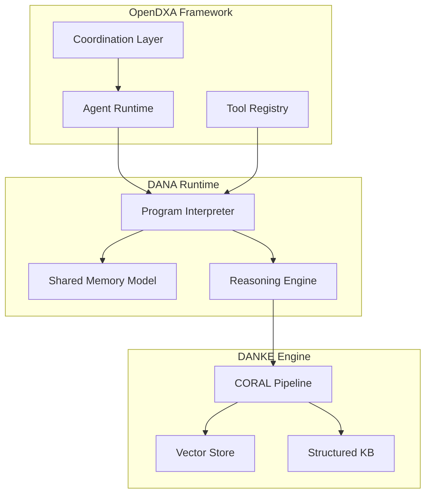

<p align="center">
  
</p>

[Main Documentation](docs/README.md)

# OpenDXA - Domain-Expert Agent Framework

## Overview

OpenDXA is a comprehensive framework for building intelligent multi-agent systems with domain expertise, powered by Large Language Models (LLMs). It consists of three core components:

### Example Use Case

Consider a simple but practical use case: a Customer Support Agent that can handle basic inquiries and escalate when needed.

**Objective:** Create an agent that can:
- Understand customer inquiries
- Search knowledge base for answers
- Provide responses
- Escalate complex issues

Let's implement this in LangChain, and OpenDXA:

#### 1. OpenDXA Implementation

With OpenDXA, we can implement the password-reset customer support agent as a simple DANA program, with the workflow cleanly mapped to the program's control flow.

```python
# customer_support.na
if world.customer.query.type == "password_reset":
    # Search knowledge-base engine (KE)
    private.ke_result = use("danke.support.password_reset")
    
    # If no clear answer, escalate
    if private.ke_result.confidence < 0.8:
        private.analysis = reason("Should this be escalated to human support?", context=[world.customer, private.ke_result])
        if private.analysis == "yes":
            use("tools.support.escalate")
            system.status = "escalated"
            return

    system.response = private.ke_result.answer
```

🧠 What DANA can express clearly:

| Capability | Supported in DANA? | Notes |
|------------|--------------------|-------|
| ✅ Tool calling | Yes `use(...)` | Cleanly supported |
| ✅ Conditional logic | Yes `if` | First-class Pythonic control flow |
| ✅ Reasoning with LLMs | Yes `reason(...)` | Explicit and simple |
| ✅ Private memory/state | Yes `private` | Analogous to short-term state |
| ✅ Final output | Yes `system` | Structured output |
| ✅ Human-in-the-loop triggers | Yes (via escalation) | Clean and declarative |

---

#### 2. LangChain Implementation

With LangChain, we implement this as a chain of components (tools, prompts, and agents) that are composed together. The workflow is defined through the agent's prompt template and tool configuration, with the execution flow being determined by the agent's decision-making process.

```python
# customer_support_langchain.py

from langchain.agents import Tool, initialize_agent
from langchain.agents.agent_types import AgentType
from langchain.chat_models import ChatOpenAI
from langchain.memory import ConversationBufferMemory

# Define tools
def search_knowledge_base(query: str) -> str:
    if "password" in query.lower():
        return "To reset your password, go to the login page and click 'Forgot Password'."
    return "I'm not sure. Let me escalate this to a human."

def escalate_to_human(reason: str) -> str:
    return f"Escalated to human support. Reason: {reason}"

tools = [
    Tool(
        name="SearchKB",
        func=search_knowledge_base,
        description="Search the knowledge base for answers"
    ),
    Tool(
        name="Escalate",
        func=escalate_to_human,
        description="Escalate to human support if confidence is low or answer is unclear"
    )
]

# Set up the agent
llm = ChatOpenAI(temperature=0)
memory = ConversationBufferMemory(memory_key="chat_history")

agent_executor = initialize_agent(
    tools,
    llm,
    agent=AgentType.CHAT_ZERO_SHOT_REACT_DESCRIPTION,
    memory=memory,
    verbose=True
)

# Run agent
if __name__ == "__main__":
    response = agent_executor.run("How do I reset my password?")
    print("Agent Response:", response)
```

---

#### 3. LangGraph Implementation

LangGraph models the workflow as a stateful graph of nodes, where each node transforms part of the agent's state and execution follows explicitly defined edges

```python
# customer_support_langgraph.py

from typing import Annotated, TypedDict
from langgraph.graph import StateGraph
from langchain_core.tools import tool
from langchain_openai import ChatOpenAI
from langchain_core.messages import HumanMessage


# ----------------------------
# Agent State Definition
# ----------------------------

class AgentState(TypedDict):
    customer_query: Annotated[str, "The customer's query"]
    kb_result: Annotated[dict, "Result from knowledge base"]
    should_escalate: Annotated[bool, "Whether to escalate to human"]
    response: Annotated[str, "Final response to customer"]


# ----------------------------
# Tools
# ----------------------------

@tool
def search_knowledge_base(query: str) -> dict:
    """Search the knowledge base for answers."""
    if "password" in query.lower():
        return {
            "answer": "To reset your password, go to the login page and click 'Forgot Password'.",
            "confidence": 0.9
        }
    return {
        "answer": "I'm not sure. Let me check with a human.",
        "confidence": 0.4
    }

@tool
def escalate_to_human(reason: str) -> str:
    """Escalate the issue to human support."""
    return f"Escalated to human support. Reason: {reason}"


# ----------------------------
# Node Functions
# ----------------------------

def node_search_kb(state: AgentState) -> dict:
    result = search_knowledge_base(state["customer_query"])
    return {"kb_result": result}

def node_analyze_escalation(state: AgentState) -> dict:
    llm = ChatOpenAI()
    prompt = f"""
    Should this issue be escalated to a human?

    Customer Query: {state['customer_query']}
    KB Answer: {state['kb_result']['answer']}
    Confidence: {state['kb_result']['confidence']}

    Reply with only 'yes' or 'no'.
    """
    response = llm.invoke([HumanMessage(content=prompt)])
    return {"should_escalate": response.content.strip().lower() == "yes"}

def node_handle_response(state: AgentState) -> dict:
    if state["should_escalate"]:
        response = escalate_to_human(
            f"Low confidence ({state['kb_result']['confidence']}) for query: {state['customer_query']}"
        )
    else:
        response = state["kb_result"]["answer"]
    return {"response": response}


# ----------------------------
# Graph Assembly
# ----------------------------

def create_graph():
    builder = StateGraph(AgentState)

    builder.add_node("search_kb", node_search_kb)
    builder.add_node("analyze_escalation", node_analyze_escalation)
    builder.add_node("handle_response", node_handle_response)

    builder.set_entry_point("search_kb")
    builder.add_edge("search_kb", "analyze_escalation")
    builder.add_edge("analyze_escalation", "handle_response")
    builder.set_finish_point("handle_response")

    return builder.compile()


# ----------------------------
# Runner
# ----------------------------

def run_customer_query(query: str) -> str:
    graph = create_graph()
    state = {
        "customer_query": query,
        "kb_result": {},
        "should_escalate": False,
        "response": ""
    }
    result = graph.invoke(state)
    return result["response"]


# ----------------------------
# Example Usage
# ----------------------------

if __name__ == "__main__":
    queries = [
        "How do I reset my password?",
        "What’s the status of my refund from last month?"
    ]
    for q in queries:
        print(f"Query: {q}")
        print("Response:", run_customer_query(q))
        print("---")
```

---

#### 4. Google ADK Implementation

Google ADK orchestrates agentic workflows as declarative Python functions using tool calls, state tracking, and LLM-based reasoning for step-by-step execution.

```javascript
# customer_support_agent.py

from adk import agent, tool
from adk.runtime import run_agent

# ------------------------
# TOOLS
# ------------------------

@tool
def kb_support_password_reset(customer_query):
    """Simulates a KB lookup for password reset."""
    # Example result with low confidence
    return {
        "answer": "You can reset your password using the link on the login page.",
        "confidence": 0.65
    }

@tool
def escalate_decision(context):
    """LLM-based reasoning to decide escalation."""
    # You would typically call an LLM here
    customer = context["customer"]
    kb_result = context["kb_result"]
    
    # Simulated logic
    if "angry" in customer.get("tone", "").lower() or "urgent" in customer.get("query", {}).get("text", "").lower():
        return "yes"
    return "no"

@tool
def kb_support_escalate(customer_data):
    """Simulate escalating the issue to human support."""
    print("Escalation triggered for customer:", customer_data["query"]["text"])
    return {"status": "escalated"}

# ------------------------
# AGENT POLICY
# ------------------------

@agent
def customer_support_agent(world, execution, temp):
    if world["customer"]["query"]["type"] == "password_reset":
        temp["kb_result"] = kb_support_password_reset(world["customer"]["query"])
        
        if temp["kb_result"]["confidence"] < 0.8:
            temp["analysis"] = escalate_decision({
                "customer": world["customer"],
                "kb_result": temp["kb_result"]
            })
            if temp["analysis"] == "yes":
                kb_support_escalate(world["customer"])
                execution["status"] = "escalated"
            else:
                execution["response"] = temp["kb_result"]["answer"]
        else:
            execution["response"] = temp["kb_result"]["answer"]

# ------------------------
# RUNTIME ENTRYPOINT
# ------------------------

if __name__ == "__main__":
    world = {
        "customer": {
            "query": {
                "type": "password_reset",
                "text": "I forgot my password"
            },
            "tone": "normal"
        }
    }
    execution = {}
    temp = {}

    result = run_agent(customer_support_agent, world=world, execution=execution, temp=temp)
    print("Final Execution:", result)
```

#### 5. Microsoft AutoGen Implementation

The AutoGen approach to your workflow would implement it as a multi-agent conversation, where:
- Each agent plays a specific role (e.g., UserProxyAgent, SupportAgent, EscalationAgent)
- Agents communicate via LLM-mediated messages
- Tool usage (like KB search or escalation) is embedded in an agent’s function or tool call
- You define the flow by structuring interactions and termination conditions

```python
# customer_support_autogen.py

from autogen import AssistantAgent, UserProxyAgent, GroupChat, GroupChatManager

# Tool: KB search
def search_kb_tool(message: str) -> str:
    if "password" in message.lower():
        return "To reset your password, go to the login page and click 'Forgot Password'. (Confidence: 0.9)"
    return "I'm not sure. Please escalate this to a human. (Confidence: 0.4)"

# Tool: Escalation
def escalate_tool(reason: str) -> str:
    return f"Escalated to human support. Reason: {reason}"

# Agent: SupportAgent
support_agent = AssistantAgent(
    name="SupportAgent",
    system_message="You are a customer support agent. Use the search_kb_tool to find answers. If the confidence is below 0.8, ask EscalationAgent to help.",
    code_execution_config={"use_docker": False}
)

# Agent: EscalationAgent
escalation_agent = AssistantAgent(
    name="EscalationAgent",
    system_message="You handle escalations. If SupportAgent asks for help, respond with an escalation confirmation."
)

# User Agent (simulating customer)
user_agent = UserProxyAgent(
    name="Customer",
    system_message="You are a customer trying to get help.",
    human_input_mode="NEVER",  # Fully autonomous loop
    default_auto_reply="Thanks."
)

# Group chat coordination
groupchat = GroupChat(
    agents=[user_agent, support_agent, escalation_agent],
    messages=[],
    max_round=5,
    speaker_selection_method="auto"
)

manager = GroupChatManager(groupchat=groupchat)

# Custom functions for agents
support_agent.register_function(
    function_map={"search_kb_tool": search_kb_tool}
)

escalation_agent.register_function(
    function_map={"escalate_tool": escalate_tool}
)

# Kick off the conversation
user_agent.initiate_chat(
    manager,
    message="How do I reset my password?"
)
```

---

#### 6. CrewAI Implementation

With CrewAI, your workflow would be implemented as a team of structured agents ("crew members"), each with a defined role, goal, and optional tools, working collaboratively on a shared task. The flow is orchestrated by a crew that delegates the steps in sequence.

```python
# customer_support_crewai.py

from crewai import Agent, Crew, Task
from langchain.tools import tool
from langchain_openai import ChatOpenAI

# KB search tool
@tool
def search_kb(query: str) -> dict:
    if "password" in query.lower():
        return {
            "answer": "To reset your password, visit the login page and click 'Forgot Password'.",
            "confidence": 0.9
        }
    return {
        "answer": "I'm not sure. You might need to escalate this.",
        "confidence": 0.4
    }

@tool
def escalate(reason: str) -> str:
    return f"Escalated to human support. Reason: {reason}"

# Agents
llm = ChatOpenAI(model="gpt-4", temperature=0)

support_specialist = Agent(
    role="Support Specialist",
    goal="Help users resolve support queries or decide if escalation is needed",
    backstory="An expert in knowledge base search and triage",
    tools=[search_kb],
    llm=llm,
    verbose=True
)

escalation_specialist = Agent(
    role="Escalation Specialist",
    goal="Handle escalations that the support specialist cannot resolve",
    backstory="A human support liaison ready to help with complex issues",
    tools=[escalate],
    llm=llm,
    verbose=True
)

# Task
support_task = Task(
    description="Handle a customer question: 'How do I reset my password?' If you cannot confidently answer, escalate.",
    expected_output="A direct answer or confirmation of escalation.",
    agent=support_specialist,
    async_execution=False,
    output_key="support_output"
)

# Crew
crew = Crew(
    agents=[support_specialist, escalation_specialist],
    tasks=[support_task],
    verbose=True
)

# Run the workflow
if __name__ == "__main__":
    result = crew.run()
    print("Final Response:", result["support_output"])
```

---

#### 7. DANA Implementation


### Core Components

1. **DANA (Domain-Aware NeuroSymbolic Architecture)**
   - A universal program format and execution runtime that enables intelligent agents to reason and collaborate. It provides:
     - **Universal Program Format**: A simple, declarative language for expressing agent behaviors and workflows
     - **Deterministic Execution**: Predictable runtime behavior with controlled non-determinism
     - **Structured State Management**: Three standard scopes for state management:
       - `private:` - Agent-specific internal state
       - `public:` - Shared world state and observations
       - `system:` - Runtime configuration and execution state
     - **Knowledge Integration**: Seamless access to structured knowledge and tools
     - **Security Controls**: Built-in access control and execution monitoring
   - DANA programs are executed by the DANA runtime, which provides:
     - Deterministic execution of standard operations
     - Controlled non-determinism for reasoning steps
     - State management and scope enforcement
     - Tool and knowledge base integration
     - Execution monitoring and logging
   - Example DANA program:
     ```python
     # Set up initial state
     private.user.name = "Alice"
     public.weather.temperature = 72

     # Perform reasoning
     private.analysis = reason("Should we recommend a jacket?", 
                             context=[private.user, public.weather])

     # Take action based on reasoning
     if private.analysis == "yes":
         use("kb.recommendations.jacket")
     else:
         use("kb.recommendations.no_jacket")
     ```
   - [Learn more about DANA](docs/dana/README.md)

2. **DANKE (Domain-Aware NeuroSymbolic Knowledge Engine)**
   - Knowledge management system implementing the CORAL methodology:
     - **C**ollect: Gather and ingest domain knowledge
     - **O**rganize: Structure and index knowledge
     - **R**etrieve: Access relevant information
     - **A**pply: Use knowledge in context
     - **L**earn: Improve and evolve knowledge
   - Combines the best of both worlds: vector-based and structured knowledge organizations
   - Enables both semantic search and precise rule-based reasoning
   - Helps ensure the right knowledge is available in the right context
   - [Learn more about DANKE](docs/danke/README.md)

3. **OpenDXA Framework**
   - Orchestrates DANA and DANKE components
   - Provides agent lifecycle management
   - Handles multi-agent coordination
   - Manages tool integration and execution
   - [Learn more about OpenDXA](docs/README.md)

### How They Work Together



The components interact as follows:

1. **Agent Runtime** (OpenDXA)
   - Receives objectives and coordinates execution
   - Manages agent lifecycle and state
   - Handles tool registration and access

2. **DANA Programs**
   - Express agent behavior and reasoning
   - Access shared memory model
   - Call tools and perform reasoning
   - Interact with DANKE for knowledge

3. **DANKE Knowledge**
   - Provides domain expertise
   - Enables semantic search
   - Maintains structured rules
   - Supports learning and evolution

This architecture enables:
- **Structured Reasoning**: DANA programs provide clear, auditable execution
- **Domain Expertise**: DANKE ensures accurate, contextual knowledge
- **Flexible Integration**: OpenDXA coordinates components and tools
- **Continuous Learning**: CORAL methodology enables knowledge evolution

To immediately leverage domain expertise, you can also utilize Aitomatic's separate open-source [Domain Knowledge Base project]([link-to-knowledge-base-repo]) (provides both general technical knowledge and specific domain expertise, e.g., SOPs, taxonomies, specs), which is compatible with any agent framework, including OpenDXA.

For detailed documentation on the OpenDXA framework itself, see the [main documentation](docs/README.md).

> "The real race in AI is the race to get right context to have AI Agents solve the user's problem fully. Organizing or indexing the right data, understanding a domain deeply, getting enough activity for useful memory, and connecting to the right tools. This is the big prize."
> 
> — Aaron Levie, CEO of Box

> "Domain expertise is key. It's the efficiency of focus."
> 
> — Christopher Nguyen, CEO of Aitomatic

## License

OpenDXA is released under the [MIT License](LICENSE.md).

## Why OpenDXA?

OpenDXA stands out by enabling you to build truly expert agents grounded in your specific domain knowledge.

### For Business Users:

*   **Leverage Your *Existing* Knowledge Accurately:** Build agents that tap into your company's documents, databases, and expertise – *how?* using connectors and ingestion tools – ensuring relevance and high fidelity crucial for industrial or financial accuracy.
*   **Embed Deep Domain Expertise:** Go beyond generic AI. Create reliable agents that understand and apply your specialized processes and terminology – *how?* through structured knowledge representation and rule definition – for consistent, compliant results.
*   **Comprehensive & Adaptive Knowledge Management:** Manage the full lifecycle of knowledge. Build agents that learn and adapt as your knowledge base evolves – *how?* via built-in versioning, evolution tracking, and learning mechanisms – maintaining long-term value.
*   **True Interoperability:** Seamlessly connect agents and systems, even those based on different underlying standards (like A2A, MCP) – *how?* by using NLIP as a translation layer – preventing vendor lock-in.

### For Engineering Users:

*   **Integrate Diverse Enterprise Knowledge Sources:** Connect to and represent knowledge from various existing enterprise sources (docs, DBs, APIs) – *how?* using provided APIs and connectors designed for enterprise data formats – simplifying data integration.
*   **Robust & Maintainable Architecture:** The clear separation between *what* an agent knows (declarative) and *how* it acts (imperative) – *how?* enforced by distinct framework modules – facilitates building complex, testable, reliable, and scalable systems, especially with structured knowledge.
*   **Built-in Tools for Advanced Knowledge Management:** Utilize dedicated APIs for the full knowledge lifecycle (capture, structure, versioning, evolution, query) – *how?* through specific classes like `KnowledgeBase` and related utilities – supporting both structured and conceptual data for accuracy and consistency.
*   **Framework Support for Controlled Learning:** Implement agent learning grounded in updates to the managed knowledge base – *how?* via patterns linking feedback loops to knowledge update mechanisms – enabling adaptation while maintaining consistency.
*   **Solve Multi-Protocol Interoperability (NLIP Federation):** Leverage the NLIP implementation – *how?* through specific adapters and translators provided within the framework – to bridge communication between agents built on different standards (A2A, MCP).

## Getting Started

First things first, set up your development environment:

```bash
# Clone the repository
git clone git@github.com:aitomatic/opendxa.git
cd opendxa

# Set up development environment (includes virtual environment, dependencies, and pre-commit hooks)
source ./RUN_ME.sh

# Or if you just need to activate the virtual environment and install the package
source ./VENV.sh
```

## Quick Start

```python
# Simple Q&A
from opendxa.agent import Agent
from opendxa.agent.resource import LLMResource
answer = Agent().ask("What is quantum computing?")

# Basic Workflow Execution
from opendxa.execution import WorkflowExecutor, ExecutionContext
from opendxa.execution.workflow import Workflow
from opendxa.common.graph import NodeType

# Create a workflow
workflow = Workflow(objective="Analyze customer feedback")
workflow.add_node(ExecutionNode(
    node_id="ANALYZE",
    node_type=NodeType.TASK,
    objective="Analyze feedback data"
))

# Set up execution
context = ExecutionContext(
    reasoning_llm=LLMResource(),
    planning_llm=LLMResource(),
    workflow_llm=LLMResource()
)
executor = WorkflowExecutor()
result = await executor.execute(workflow, context)

# Advanced Usage with Custom Workflows
from opendxa.execution import ExecutionNode
from opendxa.common import DXA_LOGGER

# Configure logging
DXA_LOGGER.configure(level=DXA_LOGGER.DEBUG, console=True)

# Create complex workflow with data dependencies
workflow = Workflow(objective="Research quantum computing")
workflow.add_node(ExecutionNode(
    node_id="GATHER",
    node_type=NodeType.TASK,
    objective="Gather research data",
    metadata={"output_key": "research_data"}
))
workflow.add_node(ExecutionNode(
    node_id="ANALYZE",
    node_type=NodeType.TASK,
    objective="Analyze findings",
    metadata={"input_key": "research_data"}
))
workflow.add_edge_between("GATHER", "ANALYZE")
```
## Documentation

For detailed architecture, core concepts, framework comparisons, and advanced usage, please see the **[Main Framework Documentation](docs/README.md)**.

Further documentation:

- **[Examples](examples/README.md)** - Usage patterns and tutorials
- **[Agent Documentation](opendxa/agent/README.md)** - Agent components
- **[Execution Documentation](opendxa/execution/README.md)** - Workflow, Planning, and Reasoning

## Contributing

We welcome contributions! Please see our [Contributing Guide](CONTRIBUTING.md) for details on how to get started.

## Support

For questions or support, please open an issue on the [GitHub repository](https://github.com/aitomatic/opendxa/issues).

---
<p align="center">
Copyright © 2024 Aitomatic, Inc. Licensed under the <a href="LICENSE.md">MIT License</a>.
<br/>
<a href="https://aitomatic.com">https://aitomatic.com</a>
</p>

