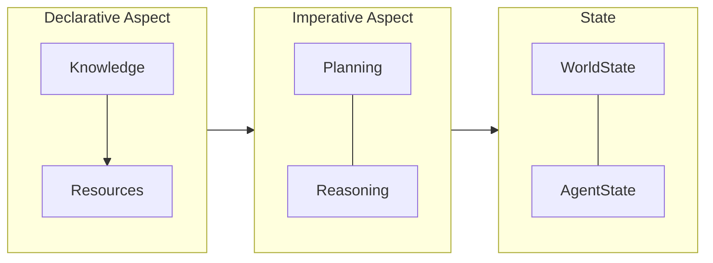

<p align="center">
  
</p>

# OpenDXA - Domain-Expert Agent Framework

## Overview

OpenDXA is a Python framework that enables building intelligent multi-agent systems with domain expertise, powered by Large Language Models (LLMs). The framework features advanced memory management with both short-term and long-term memory capabilities, enabling agents to learn from interactions and maintain context over extended periods. It includes robust knowledge-base management for structured storage and retrieval of domain knowledge, with support for versioning, evolution, and integration with external knowledge sources.

A key concept in how LLMs interact with tools and external systems is **function calling**. LLMs can be instructed to output structured JSON data that specifies a function to be called and the arguments to pass to it. The receiving application (like one built with OpenDXA) then parses this JSON and executes the corresponding function, effectively allowing the LLM to "set variables" or trigger actions within the application's environment.

For detailed documentation, see the [main documentation](opendxa/README.md).

## License

OpenDXA is released under the [MIT License](LICENSE.md).

## Related Concepts

OpenDXA integrates with and supports several key protocols in the AI and agent development space:

- **A2A (Agent-to-Agent)**: Google's framework for enabling direct communication and collaboration between AI agents, focusing on structured interactions and task delegation. OpenDXA supports A2A for agent communication and coordination.

- **MCP (Model Context Protocol)**: Anthropic's protocol for managing context and state in AI systems, providing a standardized way to handle conversation history and system state. OpenDXA implements MCP for robust context management.

- **NLIP (Natural Language Interface Protocol)**: ECMA's standard for natural language interfaces, defining how systems should interpret and respond to human language inputs. OpenDXA significantly leverages NLIP as a unified protocol to translate and federate between A2A, MCP, and other agentic communication protocols, enabling seamless interoperability between different agent frameworks.

These protocols form the foundation of OpenDXA's communication and collaboration capabilities, with NLIP serving as the unifying layer that enables protocol translation and federation.

## What is OpenDXA?

OpenDXA is a framework for building intelligent agents powered by Large Language Models (LLMs). Its architecture is built around a clear distinction between declarative and imperative aspects:

1. **Declarative Aspect**
   - Defines what the agent knows
   - Manages knowledge and resources
   - Handles domain expertise
   - Provides structured access to knowledge

2. **Imperative Aspect**
   - Implements planning and reasoning
   - Executes tasks using available knowledge
   - Manages state and context
   - Coordinates multi-agent interactions

This architecture is complemented by built-in knowledge management, enabling:
- Structured storage and retrieval of domain knowledge
- Versioning and evolution of knowledge
- Integration with external knowledge sources
- Efficient querying and reasoning over knowledge



This architecture means you can:
- Start with simple knowledge bases
- Gradually expand domain expertise
- Scale to complex multi-agent systems
- Maintain clear separation between what agents know and how they act

## Key Differentiators

### Business/Strategic Differentiators
1. **Declarative-Imperative Architecture**: Clear separation between what agents know and how they act, enabling better maintainability and scalability
2. **Knowledge Management**: Built-in support for structured knowledge management and evolution
3. **Domain Expertise Integration**: Specifically designed to embed domain expertise into agents, making it particularly valuable for specialized fields

### Engineering Approaches
1. **Progressive Complexity**: Start with simple implementations and progressively add complexity
2. **Composable Architecture**: Mix and match components as needed for highly customized agents
3. **Clean Separation of Concerns**: Maintain clear boundaries between description and execution layers

### User-Friendly Practices
1. **Model Context Protocol (MCP)**: Standardized interface for all external resources
2. **Built-in Best Practices**: Pre-configured templates and patterns for common behaviors
3. **Resource Management**: Robust handling with support for different transport types
4. **Comprehensive Testing Support**: Encourages thorough testing at each layer
5. **Documentation-First Approach**: Extensive documentation structure for effective use

## Getting Started

First things first, set up your development environment:

```bash
# Clone the repository
git clone git@github.com:aitomatic/opendxa.git
cd opendxa

# Set up development environment (includes virtual environment, dependencies, and pre-commit hooks)
source ./RUN_ME.sh

# Or if you just need to activate the virtual environment and install the package
source ./VENV.sh
```

## Contents

- [What is OpenDXA?](#what-is-opendxa)
- [Key Features](#key-features)
- [Installation](#installation)
- [Quick Start](#quick-start)
- [Documentation](#documentation)
- [Framework Comparison](#strategic-framework-selection-matrix)
- [Project Structure](#project-structure)
- [Contributing](#contributing)
- [Logging](#logging)

## Key Features

- **Domain Expertise Integration** - Embed expert knowledge into agent behavior
- **Progressive Complexity** - Start simple, scale to complex tasks
- **Composable Architecture** - Mix and match capabilities as needed
- **Built-in Best Practices** - Pre-configured templates for common patterns
- **Full Customization** - Complete control when needed

## Installation

```bash
git clone <repository-url>
cd opendxa
bash setup_env.sh
source venv/bin/activate  # Windows: source venv/Scripts/activate
```

Prerequisites:

- Python 3.x
- bash shell (Unix) or Git Bash (Windows)

## Quick Start

```python
# Simple Q&A
from opendxa.agent import Agent
from opendxa.agent.resource import LLMResource
answer = Agent().ask("What is quantum computing?")

# Basic Workflow Execution
from opendxa.execution import WorkflowExecutor, ExecutionContext
from opendxa.execution.workflow import Workflow
from opendxa.common.graph import NodeType

# Create a workflow
workflow = Workflow(objective="Analyze customer feedback")
workflow.add_node(ExecutionNode(
    node_id="ANALYZE",
    node_type=NodeType.TASK,
    objective="Analyze feedback data"
))

# Set up execution
context = ExecutionContext(
    reasoning_llm=LLMResource(),
    planning_llm=LLMResource(),
    workflow_llm=LLMResource()
)
executor = WorkflowExecutor()
result = await executor.execute(workflow, context)

# Advanced Usage with Custom Workflows
from opendxa.execution import ExecutionNode
from opendxa.common import DXA_LOGGER

# Configure logging
DXA_LOGGER.configure(level=DXA_LOGGER.DEBUG, console=True)

# Create complex workflow with data dependencies
workflow = Workflow(objective="Research quantum computing")
workflow.add_node(ExecutionNode(
    node_id="GATHER",
    node_type=NodeType.TASK,
    objective="Gather research data",
    metadata={"output_key": "research_data"}
))
workflow.add_node(ExecutionNode(
    node_id="ANALYZE",
    node_type=NodeType.TASK,
    objective="Analyze findings",
    metadata={"input_key": "research_data"}
))
workflow.add_edge_between("GATHER", "ANALYZE")
```

## Documentation

- **[Framework Overview](opendxa/README.md)** - Detailed system architecture
- **[Examples](examples/README.md)** - Usage patterns and tutorials
- **[Agent Documentation](opendxa/agent/README.md)** - Agent components
- **[Execution Documentation](opendxa/execution/README.md)** - Workflow, Planning, and Reasoning

## Strategic Framework Selection Matrix

OpenDXA provides distinct advantages in several key areas when compared to other agent frameworks:

| Use Case | OpenDXA | LangChain | AutoGPT | BabyAGI |
|----------|-----|-----------|----------|----------|
| **Quick Start** | ✨ Template-based initialization | Direct chain construction | Command interface | Simple task queue |
| **Simple Tasks** | ✨ Pre-configured templates | Chain composition | Command sequences | Task scheduling |
| **Complex Tasks** | ✨ Full cognitive architecture | Multiple chains | Command sequences | Task recursion |
| **Domain Expertise** | ✨ Built-in expertise system | Tool integration | Command-based tools | Task-based tools |
| **Autonomous Operation** | ✨ Structured autonomy | Chain automation | Free-form commands | Task loops |
| **Growth Path** | ✨ Seamless capability expansion | Chain rebuilding | New commands | New tasks |

✨ = Optimal choice for category

### Framework Selection Guide

| Need | Best Choice | Why |
|------|-------------|-----|
| Fast Start | OpenDXA/LangChain | Equivalent simplicity with better growth |
| Simple Tasks | OpenDXA/LangChain | Standard patterns with full power available |
| Complex Systems | OpenDXA | Superior architecture and capabilities |
| Expert Systems | OpenDXA | Native expertise and knowledge integration |
| Autonomous Agents | OpenDXA/AutoGPT | Structured autonomy with better control |

### Implementation Complexity

| Framework | Initial | Growth | Maintenance |
|-----------|---------|--------|-------------|
| OpenDXA | Low | Linear | Low |
| LangChain | Low | Step Function | Medium |
| AutoGPT | Low | Limited | High |
| BabyAGI | Low | Limited | Medium |

## Project Structure

```text
opendxa/                # Project root
├── opendxa/            # Main package
│   ├── agent/          # Agent implementation
│   │   ├── capability/ # Agent capabilities (memory, expertise)
│   │   ├── resource/   # Agent-specific resources
│   │   ├── agent.py    # Core Agent class
│   │   ├── agent_factory.py  # Agent creation factories
│   │   └── ...         # Other agent components
│   ├── common/         # Shared utilities and types
│   ├── execution/      # Execution engine (planning, reasoning)
│   │   ├── planning/   # Planning components
│   │   ├── reasoning/  # Reasoning components
│   │   ├── workflow/   # Workflow definition and management
│   │   └── ...         # Other execution components
│   ├── knowledge/      # Knowledge management components
│   │   ├── knowledge_base.py # Core knowledge base implementation
│   │   └── ...         # Other knowledge components
│   ├── resource/       # General resource management
│   └── ...             # Other top-level components
├── examples/           # Usage examples and tutorials
├── tests/              # Unit and integration tests
├── docs/               # Documentation files (if separate)
├── LICENSE.md          # Project license
├── README.md           # This file
├── RUN_ME.sh           # Development environment setup script
└── VENV.sh             # Virtual environment activation script
```

## Contributing

We welcome contributions! Please see our [Contributing Guide](CONTRIBUTING.md) for details on how to get started.

## Logging

OpenDXA uses a structured logging system. Configure it as follows:

```python
from opendxa.common import DXA_LOGGER

# Configure logging level and output
DXA_LOGGER.configure(level=DXA_LOGGER.INFO, console=True, filename="opendxa.log")

# Use logger within the framework
DXA_LOGGER.info("This is an info message.")
DXA_LOGGER.debug("This is a debug message.")
```

## Support

For questions or support, please open an issue on the [GitHub repository](https://github.com/aitomatic/opendxa/issues).

---

*© 2024 Aitomatic, Inc. All rights reserved.*
