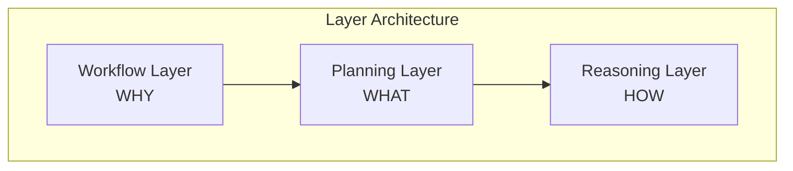

<!-- markdownlint-disable MD041 -->
<!-- markdownlint-disable MD033 -->
<p align="center">
  
</p>

# OpenDXA - Domain-Expert Agent Framework

OpenDXA is a Python framework that enables building intelligent agents with domain expertise, powered by Large Language Models (LLMs).

## Getting Started

First things first, set up your development environment:

```bash
# Set up development environment
% ./setup_env.sh

# Activate virtual environment
% source .venv/bin/activate

# Include this package in your environment
% pip install -e .

# Then try running the tests
% pytest tests
```

## Contents

- [What is OpenDXA?](#what-is-opendxa)
- [Key Features](#key-features)
- [Installation](#installation)
- [Quick Start](#quick-start)
- [Documentation](#documentation)
- [Framework Comparison](#strategic-framework-selection-matrix)
- [Project Structure](#project-structure)
- [Contributing](#contributing)
- [Logging](#logging)

## What is OpenDXA?

OpenDXA is a framework for building intelligent agents powered by Large Language Models (LLMs). It specializes in embedding domain expertise into agents through a unique three-layer architecture that maps business workflows to concrete plans to reasoning patterns:

1. **Workflows (WHY)** define what agents can do - from simple Q&A to complex research patterns
2. **Plans (WHAT)** break down workflows into concrete, executable steps
3. **Reasoning (HOW)** executes each step using appropriate thinking patterns



This architecture means you can:

- Start simple (like basic Q&A)
- Add capabilities progressively
- Scale to complex domain-specific tasks
- Maintain clean separation of concerns

## Key Differentiators

### Business/Strategic Differentiators
1. **Three-Layer Architecture**: Maps business workflows to concrete plans to reasoning patterns, creating a natural progression from requirements to implementation
2. **Domain Expertise Integration**: Specifically designed to embed domain expertise into agents, making it particularly valuable for specialized fields

### Engineering Approaches
1. **Progressive Complexity**: Start with simple implementations and progressively add complexity
2. **Composable Architecture**: Mix and match components as needed for highly customized agents
3. **Clean Separation of Concerns**: Maintain clear boundaries between different components

### User-Friendly Practices
1. **Model Context Protocol (MCP)**: Standardized interface for all external resources
2. **Built-in Best Practices**: Pre-configured templates and patterns for common behaviors
3. **Resource Management**: Robust handling with support for different transport types
4. **Comprehensive Testing Support**: Encourages thorough testing at each layer
5. **Documentation-First Approach**: Extensive documentation structure for effective use

## Component Overview

OpenDXA consists of several core components that work together:

- **Agent System** - Executes workflows and manages resources ([documentation](opendxa/agent/README.md))
- **Execution System** - Implements the 3-layer architecture ([documentation](opendxa/execution/README.md))

The Execution system is organized in a 3-layer architecture:

- **Workflow Layer** (`opendxa.execution.workflow`) - Defines what agents can do (WHY)
  - `Workflow` - Main workflow container
  - `ExecutionNode` - Individual workflow steps
  - `NodeType` - Different types of nodes (START, TASK, END)
  - `Objective` - Goal definition for workflows and nodes

- **Planning Layer** (`opendxa.execution.planning`) - Converts workflows to executable plans (WHAT)
  - Converts high-level workflows into concrete steps
  - Manages dependencies between steps
  - Handles data flow between nodes

- **Reasoning Layer** (`opendxa.execution.reasoning`) - Executes plans with thinking patterns (HOW)
  - Implements specific reasoning strategies
  - Processes execution signals
  - Manages state and context

- **Pipeline Layer** (`opendxa.execution.pipeline`) - Orchestrates execution flow
  - `WorkflowExecutor` - Main execution engine
  - `ExecutionContext` - Manages execution state and resources
  - `ExecutionSignal` - Communication between layers

Agents have modular components for different functionalities:

- **Capability System** (`opendxa.agent.capability`) - Defines agent abilities like memory, expertise
- **Resource System** (`opendxa.agent.resource`) - Integrates external tools and services
- **IO System** (`opendxa.agent.io`) - Handles input and output for the agent
- **State System** (`opendxa.agent.state`) - Manages agent and execution state

## Key Features

- **Domain Expertise Integration** - Embed expert knowledge into agent behavior
- **Progressive Complexity** - Start simple, scale to complex tasks
- **Composable Architecture** - Mix and match capabilities as needed
- **Built-in Best Practices** - Pre-configured templates for common patterns
- **Full Customization** - Complete control when needed

## Installation

```bash
git clone <repository-url>
cd opendxa
bash setup_env.sh
source venv/bin/activate  # Windows: source venv/Scripts/activate
```

Prerequisites:

- Python 3.x
- bash shell (Unix) or Git Bash (Windows)

## Quick Start

```python
# Simple Q&A
from opendxa.agent import Agent
from opendxa.agent.resource import LLMResource
answer = Agent().ask("What is quantum computing?")

# Basic Workflow Execution
from opendxa.execution import WorkflowExecutor, ExecutionContext
from opendxa.execution.workflow import Workflow
from opendxa.common.graph import NodeType

# Create a workflow
workflow = Workflow(objective="Analyze customer feedback")
workflow.add_node(ExecutionNode(
    node_id="ANALYZE",
    node_type=NodeType.TASK,
    objective="Analyze feedback data"
))

# Set up execution
context = ExecutionContext(
    reasoning_llm=LLMResource(),
    planning_llm=LLMResource(),
    workflow_llm=LLMResource()
)
executor = WorkflowExecutor()
result = await executor.execute(workflow, context)

# Advanced Usage with Custom Workflows
from opendxa.execution import ExecutionNode
from opendxa.common import DXA_LOGGER

# Configure logging
DXA_LOGGER.configure(level=DXA_LOGGER.DEBUG, console=True)

# Create complex workflow with data dependencies
workflow = Workflow(objective="Research quantum computing")
workflow.add_node(ExecutionNode(
    node_id="GATHER",
    node_type=NodeType.TASK,
    objective="Gather research data",
    metadata={"output_key": "research_data"}
))
workflow.add_node(ExecutionNode(
    node_id="ANALYZE",
    node_type=NodeType.TASK,
    objective="Analyze findings",
    metadata={"input_key": "research_data"}
))
workflow.add_edge_between("GATHER", "ANALYZE")
```

## Documentation

- **[Framework Overview](opendxa/README.md)** - Detailed system architecture
- **[Examples](examples/README.md)** - Usage patterns and tutorials
- **[Agent Documentation](opendxa/agent/README.md)** - Agent components
- **[Execution Documentation](opendxa/execution/README.md)** - Workflow, Planning, and Reasoning

## Strategic Framework Selection Matrix

OpenDXA provides distinct advantages in several key areas when compared to other agent frameworks:

| Use Case | OpenDXA | LangChain | AutoGPT | BabyAGI |
|----------|-----|-----------|----------|----------|
| **Quick Start** | ✨ Template-based initialization | Direct chain construction | Command interface | Simple task queue |
| **Simple Tasks** | ✨ Pre-configured templates | Chain composition | Command sequences | Task scheduling |
| **Complex Tasks** | ✨ Full cognitive architecture | Multiple chains | Command sequences | Task recursion |
| **Domain Expertise** | ✨ Built-in expertise system | Tool integration | Command-based tools | Task-based tools |
| **Autonomous Operation** | ✨ Structured autonomy | Chain automation | Free-form commands | Task loops |
| **Growth Path** | ✨ Seamless capability expansion | Chain rebuilding | New commands | New tasks |

✨ = Optimal choice for category

### Framework Selection Guide

| Need | Best Choice | Why |
|------|-------------|-----|
| Fast Start | OpenDXA/LangChain | Equivalent simplicity with better growth |
| Simple Tasks | OpenDXA/LangChain | Standard patterns with full power available |
| Complex Systems | OpenDXA | Superior architecture and capabilities |
| Expert Systems | OpenDXA | Native expertise and knowledge integration |
| Autonomous Agents | OpenDXA/AutoGPT | Structured autonomy with better control |

### Implementation Complexity

| Framework | Initial | Growth | Maintenance |
|-----------|---------|--------|-------------|
| OpenDXA | Low | Linear | Low |
| LangChain | Low | Step Function | Medium |
| AutoGPT | Low | Limited | High |
| BabyAGI | Low | Limited | Medium |

## Project Structure

```text
opendxa/                # Project root
├── opendxa/            # Main package
│   ├── agent/          # Agent implementation
│   │   ├── capability/ # Agent capabilities
│   │   ├── io/         # I/O handlers
│   │   ├── resource/   # External resources
│   │   └── state/      # State management
│   ├── common/         # Shared utilities
│   │   └── utils/      # Utility functions
│   │       └── logging.py  # Logging configuration
│   ├── factory/        # Factory components
│   └── execution/      # Execution system
│       ├── pipeline/   # Pipeline execution
│       │   └── executor.py # WorkflowExecutor
│       ├── planning/   # Strategic planning
│       ├── workflow/   # Process workflows
│       │   └── workflow.py # Workflow implementation
│       └── reasoning/  # Reasoning patterns
│
├── examples/           # Usage examples
│   └── learning_paths/ # Tutorial examples
│
├── tests/              # Test suite
│
└── docs/               # Documentation
```

## Contributing

OpenDXA is proprietary software developed by Aitomatic, Inc. Contributions are limited to authorized Aitomatic employees and contractors. If you're an authorized contributor:

1. Please ensure you have signed the necessary Confidentiality and IP agreements
2. Follow the internal development guidelines
3. Submit your changes through the company's approved development workflow
4. Contact the project maintainers for access to the internal Contributing Guide

For external users or organizations interested in collaborating with Aitomatic on OpenDXA development, please contact our business development team.

## License

This software is proprietary and confidential. Copyright © 2024 Aitomatic, Inc. All rights reserved.

Unauthorized copying, transfer, or reproduction of this software, via any medium, is strictly prohibited. This software is protected by copyright law and international treaties.

## Logging

### Basic Usage

```python
from opendxa.common import DXA_LOGGER

DXA_LOGGER.info("Application started")
DXA_LOGGER.log_llm(
    prompt="What is 2+2?",
    response="4",
    model="gpt-3.5"
)
```

### Advanced Configuration

```python
from opendxa.common import DXA_LOGGER

# Configure logging with options
DXA_LOGGER.configure(
    level=DXA_LOGGER.DEBUG,
    console=True,
    log_data=True
)

# Get logger instance
logger = DXA_LOGGER.getLogger(__name__)

# Log execution signals
def process_signals(signals):
    for signal in signals:
        logger.debug("Processing signal: %s", signal)
```

### Signal Processing

```python
from opendxa.execution import ExecutionSignal

def process_execution_results(signals: list[ExecutionSignal]):
    results = {}
    for signal in signals:
        if hasattr(signal, 'content') and 'result' in signal.content:
            results[signal.content.get('node')] = signal.content['result']
    return results
```
