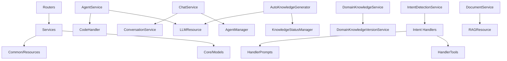

# Dana API Services Module - Comprehensive Analysis

## 1. Project Overview

### Project Type
- **Type**: AI-powered Platform API Service Layer
- **Module**: Business Logic Layer for Dana AI Framework
- **Purpose**: Core services managing AI agents, knowledge systems, conversations, and intelligent chat functionality

### Tech Stack
- **Language**: Python 3.x
- **Framework**: FastAPI (REST API)
- **Database**: SQLAlchemy ORM with SQL migrations
- **AI/ML**: Custom LLM integrations via LLMResource
- **Custom Language**: Dana (.na files) - proprietary agent scripting language

### Architecture Pattern
- **Pattern**: Service-Oriented Architecture (SOA)
- **Design**: Layered architecture with clear separation:
  - Routers (API endpoints) → Services (business logic) → Core (models/database)
  - Intent-based request handling with specialized handlers
  - Resource abstraction for external services (LLM, RAG, etc.)

## 2. Detailed Directory Structure Analysis

### `/dana/api/services/` - Core Service Layer
**Purpose**: Contains all business logic services that power the Dana platform

#### Main Service Files
- **`agent_service.py`**: Agent generation and management logic
  - Creates Dana agents from user conversations
  - Manages agent code generation via LLM
  - Handles multi-file agent projects

- **`agent_manager.py`**: Agent lifecycle management
  - Agent creation, updates, deletion
  - Agent capability analysis
  - Agent execution and testing

- **`agent_generator.py`**: Legacy agent generation service
  - Older implementation of agent code generation
  - Being replaced by agent_service.py

- **`agent_deletion_service.py`**: Safe agent removal
  - Handles cascading deletion of agents
  - Cleans up related documents, conversations, and chat history

#### Knowledge Management Services
- **`domain_knowledge_service.py`**: Domain expertise management
  - Manages hierarchical knowledge trees for agents
  - Handles knowledge persistence and retrieval
  - Version control for domain knowledge

- **`domain_knowledge_version_service.py`**: Knowledge versioning
  - Tracks changes in domain knowledge over time
  - Manages version history and rollbacks
  - Snapshot functionality for knowledge states

- **`auto_knowledge_generator.py`**: Automated knowledge creation
  - Generates knowledge entries using LLM
  - Batch processing for knowledge generation
  - Integration with knowledge status tracking

- **`knowledge_status_manager.py`**: Knowledge generation tracking
  - Monitors knowledge generation progress
  - Manages generation queues and status
  - Provides real-time status updates

#### Communication Services
- **`chat_service.py`**: Chat functionality
  - Manages chat sessions with agents
  - Handles prebuilt agent initialization
  - Chat history management

- **`conversation_service.py`**: Conversation management
  - CRUD operations for conversations
  - Message threading and history
  - Conversation context management

- **`intent_detection_service.py`**: Intent recognition
  - Analyzes user messages to detect intent
  - Routes requests to appropriate handlers
  - Supports multiple intent categories

#### Document & Content Services
- **`document_service.py`**: Document management
  - Handles document upload and storage
  - RAG (Retrieval Augmented Generation) integration
  - Document indexing and search

- **`topic_service.py`**: Topic management
  - Organizes content by topics
  - Topic-based filtering and search
  - Topic hierarchy support

#### Utility Services
- **`code_handler.py`**: Code generation utilities
  - Templates for Dana code generation
  - Code validation and formatting
  - Fallback templates for error scenarios

- **`workflow_parser.py`**: Workflow processing
  - Parses Dana workflow definitions
  - Workflow validation and execution planning

- **`llm_tree_manager.py`**: LLM-based tree operations
  - Manages hierarchical data structures using LLM
  - Tree generation and modification via prompts

- **`avatar_service.py`**: Agent avatar management
  - Handles avatar assignment for agents
  - Avatar customization and storage

### `/dana/api/services/intent_detection/` - Intent Processing Subsystem

#### Core Intent Files
- **`intent_detection_service.py`**: Main intent detection service
- **`intent_prompts.py`**: Prompt templates for intent detection

#### Intent Handlers (`/intent_handlers/`)
- **`abstract_handler.py`**: Base handler interface
- **`knowledge_ops_handler.py`**: Knowledge operations handler
  - Handles knowledge creation, updates, deletion
  - Complex knowledge tree operations

#### Handler Support (`/intent_handlers/handler_*/`)
- **`handler_prompts/`**: Handler-specific prompt templates
  - `knowledge_ops_prompts.py`: Prompts for knowledge operations
  
- **`handler_tools/`**: Specialized tools for handlers
  - `base_tool.py`: Base tool interface
  - `knowledge_ops_tools.py`: Knowledge manipulation tools
  
- **`handler_utility/`**: Handler utility functions
  - `knowledge_ops_utils.py`: Knowledge operation utilities

## 3. File-by-File Breakdown

### Core Application Files

#### Service Layer
- **Agent Services**:
  - `agent_service.py`: Main agent business logic (855 lines)
  - `agent_manager.py`: Agent lifecycle management (1200+ lines)
  - `agent_generator.py`: Legacy generation service
  - `agent_deletion_service.py`: Safe deletion logic

- **Knowledge Services**:
  - `domain_knowledge_service.py`: Domain tree management
  - `domain_knowledge_version_service.py`: Version control
  - `auto_knowledge_generator.py`: Automated generation
  - `knowledge_status_manager.py`: Status tracking

- **Communication Services**:
  - `chat_service.py`: Chat operations
  - `conversation_service.py`: Conversation CRUD
  - `intent_detection_service.py`: Intent analysis

### Configuration Files
- Located in parent directories:
  - `.env`: Environment variables
  - `pyproject.toml`: Python project configuration
  - Database configurations in `/dana/api/core/`

### Data Layer
- **Models** (`/dana/api/core/models.py`):
  - Agent, Conversation, Message, Document models
  - Topic, AgentChatHistory models
  
- **Schemas** (`/dana/api/core/schemas.py`):
  - Pydantic models for API validation
  - Request/Response schemas
  
- **Database** (`/dana/api/core/database.py`):
  - Database connection management
  - Session handling

## 4. API Endpoints Analysis

### Agent Management Endpoints
- **`/agents`** (via `routers/agents.py`):
  - `POST /agents/generate`: Generate new agent
  - `GET /agents/{id}`: Retrieve agent details
  - `PUT /agents/{id}`: Update agent
  - `DELETE /agents/{id}`: Delete agent
  - `POST /agents/{id}/execute`: Execute agent code
  - `GET /agents/{id}/capabilities`: Get agent capabilities

### Knowledge Management Endpoints
- **`/domain-knowledge`** (via `routers/domain_knowledge.py`):
  - `GET /agents/{id}/domain-knowledge`: Get knowledge tree
  - `PUT /agents/{id}/domain-knowledge`: Update knowledge
  - `POST /agents/{id}/domain-knowledge/version`: Create version
  - `GET /agents/{id}/domain-knowledge/versions`: List versions

### Chat & Conversation Endpoints
- **`/chat`** (via `routers/chat.py`):
  - `POST /chat`: Send chat message
  - `GET /chat/history`: Get chat history
  
- **`/conversations`** (via `routers/conversations.py`):
  - `GET /conversations`: List conversations
  - `POST /conversations`: Create conversation
  - `GET /conversations/{id}`: Get conversation details
  - `DELETE /conversations/{id}`: Delete conversation

### Smart Chat Endpoints
- **`/smart-chat`** (via `routers/smart_chat.py` & `smart_chat_v2.py`):
  - `POST /smart-chat/intent`: Detect user intent
  - `POST /smart-chat/generate-knowledge`: Auto-generate knowledge
  - `POST /smart-chat/process`: Process intelligent chat requests

## 5. Architecture Deep Dive

### Overall Application Architecture

```
┌──────────────────────────────────────────────────────────┐
│                    Client Applications                    │
│            (Web UI, CLI, External Systems)                │
└────────────────────┬─────────────────────────────────────┘
                     │ HTTP/WebSocket
┌────────────────────▼─────────────────────────────────────┐
│                    API Gateway Layer                      │
│                  FastAPI Routers                          │
│  ┌──────────┬────────────┬──────────┬──────────────┐    │
│  │ Agents   │    Chat    │ Knowledge│  Documents   │    │
│  │ Router   │   Router   │  Router  │   Router     │    │
│  └──────────┴────────────┴──────────┴──────────────┘    │
└────────────────────┬─────────────────────────────────────┘
                     │
┌────────────────────▼─────────────────────────────────────┐
│                 Business Logic Layer                      │
│               dana/api/services/                          │
│  ┌──────────────────────────────────────────────────┐    │
│  │          Core Services                           │    │
│  ├──────────────────────────────────────────────────┤    │
│  │ • AgentService      • ChatService                │    │
│  │ • AgentManager      • ConversationService        │    │
│  │ • DomainKnowledge   • DocumentService            │    │
│  │   Service           • IntentDetectionService     │    │
│  └──────────────────────────────────────────────────┘    │
│  ┌──────────────────────────────────────────────────┐    │
│  │          Intent Detection Subsystem              │    │
│  ├──────────────────────────────────────────────────┤    │
│  │ • Intent Handlers   • Handler Tools              │    │
│  │ • Handler Prompts   • Handler Utilities          │    │
│  └──────────────────────────────────────────────────┘    │
└────────────────────┬─────────────────────────────────────┘
                     │
┌────────────────────▼─────────────────────────────────────┐
│                    Resource Layer                         │
│               dana/common/resource/                       │
│  ┌──────────┬────────────┬──────────┬──────────────┐    │
│  │   LLM    │    RAG     │  Memory  │   Database   │    │
│  │ Resource │  Resource  │ Resource │   (SQLite)   │    │
│  └──────────┴────────────┴──────────┴──────────────┘    │
└───────────────────────────────────────────────────────────┘
```

### Data Flow and Request Lifecycle

1. **Request Reception**:
   - Client sends request to FastAPI endpoint
   - Router validates request against Pydantic schemas
   - Router calls appropriate service method

2. **Service Processing**:
   - Service receives validated request
   - Business logic execution:
     - Database queries via SQLAlchemy
     - LLM calls via LLMResource
     - File operations for Dana code
   - Response preparation

3. **Intent Detection Flow** (for smart chat):
   ```
   User Message → Intent Detection Service
                          ↓
                  Analyze with LLM
                          ↓
                  Determine Intent Category
                          ↓
            ┌─────────────┴─────────────┐
            │                           │
      Dana Code Intent          Knowledge Ops Intent
            │                           │
      Generate Agent              Update Knowledge
            │                           │
            └─────────────┬─────────────┘
                          ↓
                   Return Response
   ```

4. **Knowledge Generation Flow**:
   ```
   Knowledge Request → Knowledge Status Manager
                              ↓
                    Queue Generation Tasks
                              ↓
                    Auto Knowledge Generator
                              ↓
                    LLM Processing (Batch)
                              ↓
                    Store Generated Knowledge
                              ↓
                    Update Status Tracking
   ```

### Key Design Patterns

1. **Service Pattern**: Each service encapsulates specific business domain
2. **Repository Pattern**: Data access abstracted through services
3. **Factory Pattern**: Agent creation and initialization
4. **Strategy Pattern**: Intent handlers for different intent types
5. **Observer Pattern**: Status tracking and real-time updates
6. **Template Pattern**: Code generation templates

### Dependencies Between Modules



## 6. Environment & Setup Analysis

### Required Environment Variables
```bash
# Database
DATABASE_URL=sqlite:///./dana.db

# LLM Configuration
OPENAI_API_KEY=<api_key>
ANTHROPIC_API_KEY=<api_key>
DEFAULT_LLM_MODEL=gpt-4o

# Dana Configuration
DANA_MOCK_AGENT_GENERATION=false
DANA_AGENT_TIMEOUT=300

# API Configuration
API_HOST=0.0.0.0
API_PORT=8000

# Storage
AGENTS_DIR=./agents
DOCUMENTS_DIR=./documents
```

### Installation Process
1. Install Python dependencies: `pip install -r requirements.txt`
2. Set up environment variables in `.env`
3. Initialize database: `python -m dana.api.core.migrations`
4. Start API server: `uvicorn dana.api.server:app --reload`

### Development Workflow
1. Local development with hot-reload
2. Service-based testing approach
3. Migration-based database changes
4. Modular service development

## 7. Technology Stack Breakdown

### Runtime Environment
- **Python 3.11+**: Primary language
- **Asyncio**: Asynchronous operations
- **UV**: Package management

### Frameworks and Libraries
- **FastAPI**: REST API framework
- **SQLAlchemy**: ORM for database
- **Pydantic**: Data validation
- **LangChain/LlamaIndex**: AI/RAG operations

### AI/ML Technologies
- **LLM Integration**: OpenAI, Anthropic, custom models
- **RAG System**: Document retrieval and generation
- **Vector Databases**: For semantic search
- **Custom Dana Language**: Agent scripting

### Database Technologies
- **SQLite**: Default database
- **PostgreSQL**: Production option
- **Migration System**: SQL-based migrations

### Testing Frameworks
- **Pytest**: Unit and integration testing
- **AsyncIO Testing**: For async services
- **Mock Framework**: Service mocking

## 8. Visual Architecture Diagram

### High-Level System Architecture
```
┌────────────────────────────────────────────────────────────┐
│                      Dana Platform                          │
├────────────────────────────────────────────────────────────┤
│                                                              │
│  ┌──────────────┐  ┌──────────────┐  ┌──────────────┐     │
│  │   Web UI     │  │   CLI Tool   │  │  External    │     │
│  │  (React)     │  │   (Python)   │  │   Systems    │     │
│  └──────┬───────┘  └──────┬───────┘  └──────┬───────┘     │
│         │                  │                  │              │
│         └──────────────────┼──────────────────┘              │
│                            │                                 │
│                     ┌──────▼───────┐                        │
│                     │  API Gateway  │                        │
│                     │   (FastAPI)   │                        │
│                     └──────┬───────┘                        │
│                            │                                 │
│         ┌──────────────────┼──────────────────┐             │
│         │                  │                  │              │
│  ┌──────▼───────┐  ┌──────▼───────┐  ┌──────▼───────┐     │
│  │    Agent     │  │   Knowledge   │  │     Chat      │     │
│  │   Services   │  │   Services    │  │   Services    │     │
│  └──────┬───────┘  └──────┬───────┘  └──────┬───────┘     │
│         │                  │                  │              │
│         └──────────────────┼──────────────────┘              │
│                            │                                 │
│                     ┌──────▼───────┐                        │
│                     │   Resource    │                        │
│                     │     Layer     │                        │
│                     └──────┬───────┘                        │
│                            │                                 │
│         ┌──────────────────┼──────────────────┐             │
│         │                  │                  │              │
│  ┌──────▼───────┐  ┌──────▼───────┐  ┌──────▼───────┐     │
│  │     LLM      │  │     RAG       │  │   Database    │     │
│  │  (GPT/Claude)│  │   (Vector)    │  │  (SQLite)     │     │
│  └──────────────┘  └──────────────┘  └──────────────┘     │
│                                                              │
└────────────────────────────────────────────────────────────┘
```

### Service Interaction Flow
```
User Request
     │
     ▼
[API Router]
     │
     ├─── Intent Detection ──→ [Intent Service]
     │                               │
     │                               ▼
     │                        [Intent Handlers]
     │                               │
     ├─── Agent Operations ──→ [Agent Service]
     │                               │
     │                               ▼
     │                         [LLM Resource]
     │                               │
     ├─── Knowledge Ops ────→ [Knowledge Service]
     │                               │
     │                               ▼
     │                        [Version Service]
     │                               │
     └─── Chat Operations ──→ [Chat Service]
                                     │
                                     ▼
                              [Conversation DB]
```

## 9. Key Insights & Recommendations

### Code Quality Assessment

#### Strengths
1. **Well-Structured Service Layer**: Clear separation of concerns
2. **Comprehensive Intent System**: Flexible handler architecture
3. **Version Control**: Built-in knowledge versioning
4. **Async Support**: Proper async/await implementation
5. **Type Hints**: Good use of type annotations

#### Areas for Improvement
1. **Service Consolidation**: Some overlapping functionality between services
2. **Error Handling**: Could benefit from centralized error handling
3. **Caching Strategy**: Limited caching implementation
4. **Test Coverage**: Need more comprehensive service tests
5. **Documentation**: API documentation could be more detailed

### Security Considerations
1. **Authentication**: Implement robust auth middleware
2. **Input Validation**: Strengthen Pydantic schemas
3. **API Rate Limiting**: Add rate limiting for LLM calls
4. **Secret Management**: Use secure vault for API keys
5. **SQL Injection**: Review raw SQL usage

### Performance Optimization Opportunities
1. **Database Queries**: Optimize N+1 query patterns
2. **Async Processing**: Utilize background tasks for heavy operations
3. **Caching Layer**: Implement Redis for frequent queries
4. **Batch Processing**: Optimize batch knowledge generation
5. **Connection Pooling**: Improve database connection management

### Maintainability Suggestions
1. **Service Interfaces**: Define clear service interfaces
2. **Dependency Injection**: Implement DI container
3. **Logging Strategy**: Standardize logging across services
4. **Migration Management**: Automate migration processes
5. **API Versioning**: Implement versioning strategy

### Recommended Next Steps
1. **Refactor Legacy Services**: Migrate from agent_generator.py to agent_service.py
2. **Implement Service Tests**: Add comprehensive test coverage
3. **API Documentation**: Generate OpenAPI documentation
4. **Performance Monitoring**: Add APM tools
5. **Service Mesh**: Consider microservices architecture for scaling

## Conclusion

The Dana API Services module represents a sophisticated AI platform service layer with robust agent management, knowledge systems, and intelligent chat capabilities. The architecture demonstrates good separation of concerns, though there are opportunities for optimization in areas like caching, testing, and performance. The intent-based system provides flexibility for extending functionality, while the service-oriented design allows for scalable development.

The module is production-ready but would benefit from enhanced monitoring, comprehensive testing, and performance optimizations to support enterprise-scale deployments.