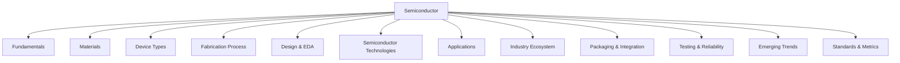

<p align="center">
  
</p>

[Project Overview](../../README.md) | [Main Documentation](../README.md)

# Dana Domain Knowledge Management System

The Dana Domain Knowledge Management System defines how Dana organizes, structures, and manages domain knowledge using ontological principles. This system provides the foundation for semantic understanding, data integration, and knowledge representation across various domains.

## Overview

The Dana Domain Knowledge Management System provides:

* **Domain-Specific Ontology:** Defines the hierarchical structure of domain knowledge
* **Multi-Source Data Integration:** Patterns for integrating data from various sources
* **Semantic Relationships:** Methods for capturing relationships between domain concepts
* **Query and Retrieval:** Efficient mechanisms for accessing domain knowledge



## Core Components

### 1. Ontology Schema Design

The foundation of the knowledge management system is the ontological schema that defines the structure of domain knowledge:

```sql
-- Knowledge Table
CREATE TABLE knowledge (
    id UUID PRIMARY KEY,
    type VARCHAR(20) NOT NULL CHECK (type IN ('fact', 'rule', 'heuristic')),
    data JSONB NOT NULL,
    source_id UUID,
    created_at TIMESTAMP DEFAULT CURRENT_TIMESTAMP,
    updated_at TIMESTAMP DEFAULT CURRENT_TIMESTAMP,
    FOREIGN KEY (source_id) REFERENCES data_source(id)
);

-- Data Source Table
CREATE TABLE data_source (
    id UUID PRIMARY KEY,
    created_at TIMESTAMP DEFAULT CURRENT_TIMESTAMP,
    metadata JSONB NOT NULL
);

-- Create indexes for efficient querying
CREATE INDEX idx_knowledge_type ON knowledge(type);
CREATE INDEX idx_knowledge_source ON knowledge(source_id);
```

The `knowledge` table stores different types of domain knowledge:
- **Facts**: Concrete information about domain concepts
- **Rules**: Logical relationships and constraints in the domain
- **Heuristics**: Expert knowledge and best practices

The `data` JSONB field contains the actual knowledge content, structured according to the node type. For example:

```json
// Example for a Materials node (fact type)
{
    "category": "Materials",
    "subcategory": "Elemental",
    "name": "Silicon",
    "properties": {
        "atomic_number": 14,
        "band_gap": 1.12,
        "crystal_structure": "diamond cubic"
    },
    "relationships": {
        "parent_category_id": "550e8400-e29b-41d4-a716-446655440000",  // ID of the Materials category
        "related_material_ids": [
            "550e8400-e29b-41d4-a716-446655440001",  // ID of Germanium
            "550e8400-e29b-41d4-a716-446655440002"   // ID of Silicon Carbide
        ]
    }
}

// Example for a Fabrication Process rule
{
    "category": "Fabrication Process",
    "subcategory": "Photolithography",
    "rule_type": "process_constraint",
    "conditions": {
        "min_feature_size": 7,
        "wavelength": "193nm"
    },
    "constraints": {
        "max_aspect_ratio": 40,
        "min_critical_dimension": 7
    },
    "relationships": {
        "process_step_ids": [
            "550e8400-e29b-41d4-a716-446655440003",  // ID of Wafer Production
            "550e8400-e29b-41d4-a716-446655440004"   // ID of Etching
        ]
    }
}

// Example for a Testing & Reliability heuristic
{
    "category": "Testing & Reliability",
    "subcategory": "Failure Modes",
    "heuristic_type": "failure_analysis",
    "conditions": {
        "failure_mode": "Electromigration",
        "temperature": "high"
    },
    "recommendations": {
        "prevention_measures": [
            "Increase metal width",
            "Add redundant vias"
        ],
        "monitoring_parameters": [
            "Current density",
            "Temperature"
        ]
    },
    "relationships": {
        "related_failure_mode_ids": [
            "550e8400-e29b-41d4-a716-446655440005",  // ID of TDDB
            "550e8400-e29b-41d4-a716-446655440006"   // ID of HCI
        ]
    }
}
```

The relationships between knowledge entries are maintained through direct references to knowledge IDs within the JSON data. This allows for:
- Flexible relationship types
- Bidirectional relationships
- Easy traversal of the knowledge graph
- Efficient querying of related knowledge

### 2. Data Source Integration

The system supports multiple data sources through a flexible integration layer. Implementation details for data source integration will be provided in the respective integration modules.

### 3. Knowledge Management

The knowledge management system provides interfaces for creating, querying, and managing domain knowledge. Implementation details for knowledge management operations will be provided in the respective management modules.

## Usage Guide

### Creating New Domain Knowledge

Implementation details for creating new domain knowledge entries will be provided in the respective knowledge management modules.

### Querying the Knowledge Base

Implementation details for querying the knowledge base will be provided in the respective query modules.

## Implementation Example

Implementation details for the core knowledge management system will be provided in the respective system modules.

## Knowledge Retrieval Process

The knowledge management system uses a sophisticated retrieval process that combines user queries with the ontology graph to fetch relevant information. Here's how it works:

### Example: Query about MOSFET Fabrication Process

Let's walk through a real example where a user asks: "What are the key considerations for fabricating a 7nm MOSFET using EUV lithography?"

1. **Initial Query Processing**
```json
{
    "user_query": "What are the key considerations for fabricating a 7nm MOSFET using EUV lithography?",
    "ontology_context": {
        "relevant_categories": [
            "Fabrication Process",
            "Device Types",
            "Semiconductor Technologies"
        ],
        "specific_nodes": [
            "A3b2[MOSFET]",
            "A4b2[EUV]",
            "A4[Fabrication Process]"
        ]
    }
}
```

2. **Node Selection and Knowledge Mapping**
The LLM analyzes the query and identifies relevant nodes in the ontology graph:
```json
{
    "selected_nodes": {
        "primary": [
            {
                "category": "Device Types",
                "subcategory": "Transistors",
                "node": "MOSFET",
                "knowledge_ids": ["550e8400-e29b-41d4-a716-446655440007"]
            },
            {
                "category": "Fabrication Process",
                "subcategory": "Photolithography",
                "node": "EUV",
                "knowledge_ids": ["550e8400-e29b-41d4-a716-446655440008"]
            }
        ],
        "related": [
            {
                "category": "Fabrication Process",
                "subcategory": "Wafer Production",
                "knowledge_ids": ["550e8400-e29b-41d4-a716-446655440009"]
            },
            {
                "category": "Testing & Reliability",
                "subcategory": "Yield Analysis",
                "knowledge_ids": ["550e8400-e29b-41d4-a716-446655440010"]
            }
        ]
    }
}
```

3. **Data Retrieval**
The system retrieves knowledge entries using the identified IDs:

```json
// Retrieved knowledge entries
{
    "mosfet_knowledge": {
        "id": "550e8400-e29b-41d4-a716-446655440007",
        "type": "fact",
        "data": {
            "category": "Device Types",
            "subcategory": "Transistors",
            "name": "MOSFET",
            "properties": {
                "min_feature_size": 7,
                "gate_length": "7nm",
                "technology_node": "7nm"
            },
            "relationships": {
                "fabrication_process_ids": [
                    "550e8400-e29b-41d4-a716-446655440008",
                    "550e8400-e29b-41d4-a716-446655440009"
                ]
            }
        }
    },
    "euv_knowledge": {
        "id": "550e8400-e29b-41d4-a716-446655440008",
        "type": "rule",
        "data": {
            "category": "Fabrication Process",
            "subcategory": "Photolithography",
            "rule_type": "process_constraint",
            "conditions": {
                "wavelength": "13.5nm",
                "min_feature_size": 7
            },
            "constraints": {
                "max_aspect_ratio": 40,
                "min_critical_dimension": 7,
                "mask_requirements": [
                    "Multi-layer mask",
                    "Phase-shift mask"
                ]
            }
        }
    }
}
```

4. **Response Generation**
The system combines the retrieved knowledge with the original query context to generate a comprehensive response:

```json
{
    "response": {
        "key_considerations": [
            {
                "aspect": "Process Parameters",
                "details": "EUV lithography at 13.5nm wavelength for 7nm feature size",
                "source_knowledge_ids": ["550e8400-e29b-41d4-a716-446655440008"]
            },
            {
                "aspect": "Mask Requirements",
                "details": "Multi-layer and phase-shift masks needed for EUV process",
                "source_knowledge_ids": ["550e8400-e29b-41d4-a716-446655440008"]
            },
            {
                "aspect": "Process Constraints",
                "details": "Maximum aspect ratio of 40 and minimum critical dimension of 7nm",
                "source_knowledge_ids": ["550e8400-e29b-41d4-a716-446655440008"]
            }
        ],
        "related_processes": [
            {
                "process": "Wafer Production",
                "knowledge_id": "550e8400-e29b-41d4-a716-446655440009"
            }
        ]
    }
}
```

### Process Flow

1. **Query Analysis**
   - User query is received
   - Ontology graph is provided to LLM
   - LLM identifies relevant nodes and relationships

2. **Node Selection and Knowledge Mapping**
   - LLM selects relevant nodes from the ontology graph
   - System maps selected nodes to corresponding knowledge IDs
   - System retrieves content for the identified knowledge entries
   - Retrieved content is prepared for LLM processing

3. **Data Retrieval**
   - System fetches knowledge entries using identified IDs
   - Related knowledge is retrieved through relationship references
   - Data is aggregated and structured

4. **Response Generation**
   - Retrieved knowledge is combined with query context
   - LLM generates comprehensive response
   - Response includes source knowledge references

This process ensures that:
- All relevant knowledge is retrieved
- Relationships between different aspects are maintained
- Responses are grounded in the knowledge base
- Source tracking is maintained throughout

---
<p align="center">
Copyright © 2024 Aitomatic, Inc. Licensed under the [MIT License](../../LICENSE.md).
<br/>
<a href="https://aitomatic.com">https://aitomatic.com</a>
</p>
