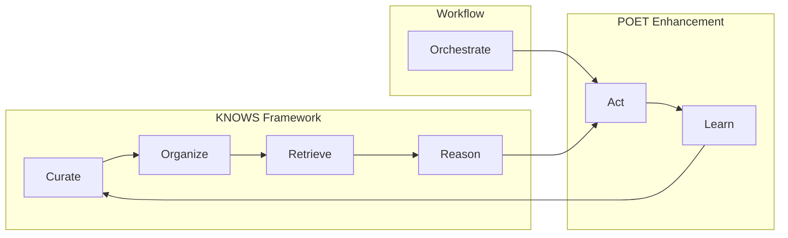

# Dana Frameworks

Intelligent capabilities for knowledge organization, workflow orchestration, and function enhancement.

## Core Components

### **KNOWS** - Knowledge Organization and Workflow System
**Runtime-level** knowledge ingestion, curation, and workflow orchestration.

```python
from dana.frameworks.knows import DocumentLoader, KnowledgeCategorizer, ContextExpander

# Document processing
documents = DocumentLoader().load("docs/")

# Knowledge extraction  
knowledge = KnowledgeCategorizer().extract(documents)

# Context engineering
context = ContextExpander().create(domain="financial", query="assess_credit")
```

### **POET** - Perceive → Operate → Enforce → Train
**Dana-level decorator** that adds intelligent processing to any function.

```dana
@poet(domain="financial_services")
def assess_credit(score: int, income: float) -> str:
    return "approved" if score >= 700 else "declined"

# POET automatically provides:
# - Context injection & fault tolerance (perceive)
# - Deterministic execution with reliability (operate)  
# - Output formatting & validation (enforce)
# - Adaptive learning from feedback (train)
```

### **Workflow** - Composed Functions
Create callable pipelines using Dana's `|` operator.

```dana
# Individual functions
def load_data(source): return load(source)
def analyze_data(data): return analyze(data)
def create_report(analysis): return report(analysis)

# Workflow creates a composed function
data_pipeline = load_data | analyze_data | create_report

# Can be called like any function
result = data_pipeline(data_source)
```

### **CONTEXT** - Context Curation
Intelligent context assembly for any domain, query, and role.

```python
from dana.frameworks.knows import ContextExpander

# Create curated context for LLM interactions
context = ContextExpander().create(domain="financial", query="assess_credit")
```

## How They Work Together

### **The CORRAL Agentic Lifecycle**



### **The Complete Flow**

1. **KNOWS** handles knowledge lifecycle:
   - **Curate** → Extract knowledge from documents (`knows/curation/`)
   - **Organize** → Structure knowledge for retrieval (`knows/core/`)
   - **Retrieve** → Assemble context for queries (`knows/context/`)
   - **Reason** → Use context for decisions (`knows/context/`)

2. **POET** handles execution lifecycle:
   - **Act** → Intelligent processing (`poet/phases/{perceive,operate,enforce}`)
   - **Learn** → Improve from feedback (`poet/phases/train`)

3. **Workflow** orchestrates the Act phase:
   - **Orchestrate** → Compose and execute workflows (`knows/workflow/`)

**Result**: Complete agentic system where knowledge flows into intelligent action and learning.

## Quick Start

```dana
# 1. Enhance functions with POET
@poet(domain="data_processing")
def load_data(source): return load(source)

@poet(domain="analysis") 
def analyze_data(data): return analyze(data)

# 2. Create workflow
data_pipeline = load_data | analyze_data

# 3. The entire workflow can be POETed too!
@poet(domain="enterprise_pipeline", retries=3)
def enhanced_pipeline = load_data | analyze_data

# 4. Execute with intelligent processing
result = enhanced_pipeline(data_source)
```

## Module Structure

### **`knows/` Module** - Knowledge Lifecycle
- **`curation/`**: Knowledge extraction and curation (Curate)
- **`core/`**: Knowledge organization and categorization (Organize)  
- **`context/`**: Context assembly and reasoning (Retrieve + Reason)
- **`workflow/`**: Workflow orchestration (Act orchestration)

### **`poet/` Module** - Execution Lifecycle
- **`phases/`**: Perceive, Operate, Enforce, Train (Act + Learn)
- **`core/`**: Decorator and enhancement logic (Dana-level)
- **`domains/`**: Domain-specific intelligence

---

**Bottom line**: KNOWS provides knowledge and workflows, POET provides intelligent processing, and they work together seamlessly!
