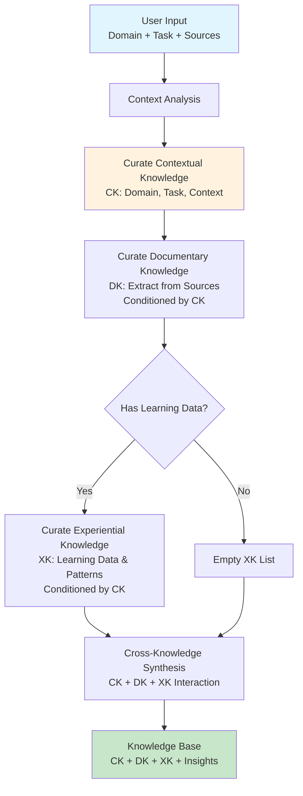

# CORRAL Curate API - Knowledge Curation for Dana Programmers

The Curate phase extracts, organizes, and synthesizes knowledge from three types: Contextual Knowledge (CK), Documentary Knowledge (DK), and Experiential Knowledge (XK).

## How the Three Knowledge Types Interact

CORRAL uses a **Bayesian approach** to knowledge synthesis, treating the three knowledge types as components of a probabilistic reasoning system:

### **Contextual Knowledge (CK) - The Prior**
CK represents our **prior beliefs and assumptions** about the domain, task, and context:
- **Domain priors**: What we know about semiconductor manufacturing, banking, etc.
- **Task priors**: What we expect to accomplish (defect analysis, fraud detection)
- **Contextual priors**: Location, time, constraints, and environmental factors

**CK conditions the likelihood** of what evidence we expect to find and how to interpret it.

### **Documentary Knowledge (DK) - The Evidence**
DK provides **observed evidence and data** from sources:
- **Documents**: Reports, specifications, procedures, logs
- **Databases**: Structured data, records, measurements  
- **Interviews**: Expert knowledge, stakeholder input
- **External sources**: Research papers, industry standards

**DK updates our beliefs** by providing concrete evidence that supports or challenges our priors.

### **Experiential Knowledge (XK) - The Likelihood Model (Optional)**
XK represents **learned likelihood functions** that model relationships and patterns:
- **Pattern recognition**: Correlations between variables
- **Predictive models**: P(outcome | evidence) based on historical data
- **Failure models**: P(failure | conditions) from past experiences
- **Optimization heuristics**: Learned best practices and approaches

**XK enhances likelihood computation** but is not required for basic knowledge synthesis.

### **The Bayesian Synthesis Process**

#### **Core Process (CK + DK)**
1. **Prior (CK)**: Establish domain, task, and contextual beliefs
2. **Evidence (DK)**: Observe data from sources
3. **Likelihood**: Use domain knowledge and reasoning to interpret evidence
4. **Posterior**: Update beliefs using Bayes' rule: P(hypothesis | evidence) ∝ P(evidence | hypothesis) × P(hypothesis)

#### **Enhanced Process (CK + DK + XK)**
1. **Prior (CK)**: Establish domain, task, and contextual beliefs
2. **Evidence (DK)**: Observe data from sources
3. **Likelihood (XK)**: Compute P(evidence | hypothesis) using learned models
4. **Posterior**: Update beliefs using Bayes' rule with enhanced likelihood estimates

### **Examples**

#### **Basic Knowledge Synthesis (CK + DK)**
- **Prior (CK)**: "Temperature control is critical in semiconductor manufacturing"
- **Evidence (DK)**: Process logs showing temperature variations and defect measurements
- **Likelihood**: Domain reasoning suggests temperature variations likely cause defects
- **Posterior**: "Temperature control issue on fab floor 3 is likely causing pattern defects"

#### **Enhanced Knowledge Synthesis (CK + DK + XK)**
- **Prior (CK)**: "Temperature control is critical in semiconductor manufacturing"
- **Evidence (DK)**: Process logs showing temperature variations and defect measurements
- **Likelihood (XK)**: P(defects | temperature_variation) = 0.87 based on historical patterns
- **Posterior**: "Temperature control issue on fab floor 3 is causing pattern defects with 87% confidence"

This **Bayesian synthesis** ensures robust, evidence-based knowledge that continuously updates as new information becomes available, with or without experiential learning.

## How It Works



## Getting Started

```dana
# 1. Hiring a specialist - no sources needed
kb = curate_knowledge(
    domain="semiconductor manufacturing",
    task="defect analysis"
)

# 2. Basic usage with sources
kb = curate_knowledge(
    sources=["./docs/", "./data/"],
    domain="software development",
    task="knowledge extraction"
)
```

## Advanced Usage Patterns

### Domain-Specific Specialists
```dana
# Hire domain specialists using built-in knowledge
semiconductor_specialist = curate_semiconductor_knowledge(
    domain="semiconductor manufacturing and fabrication",
    task="defect analysis and quality control"
)

banking_specialist = curate_banking_knowledge(
    domain="retail banking and financial services", 
    task="fraud detection and risk management"
)

ic_design_specialist = curate_ic_design_knowledge(
    domain="integrated circuit design and verification",
    task="physical design optimization and DRC compliance"
)
```

### Complex Natural Language Context
```dana
# Rich domain and task descriptions
kb = curate_knowledge(
    sources=["./logs/", "./data/", "./reports/"],
    domain="SaaS customer support and product management",
    task="support ticket analysis with focus on onboarding issues and feature request prioritization"
)

# Multi-faceted banking context
kb = curate_knowledge(
    sources=["./transaction_logs/", "./customer_profiles/"],
    domain="retail banking and financial services",
    task="fraud detection with BSA/AML compliance monitoring and small business focus"
)
```

### Learning-Enhanced Knowledge
```dana
# Integrate experiential knowledge
kb = curate_knowledge(
    sources=["./transaction_logs/", "./customer_profiles/"],
    domain="consumer banking and fraud prevention",
    task="fraud detection with historical pattern analysis",
    learning_data={
        "fraud_patterns": [...],
        "detection_performance": [...],
        "expert_feedback": [...]
    }
)
```

### Domain-Specific with Sources
```dana
# Specialized functions with custom sources
defect_analysis = curate_semiconductor_knowledge(
    sources=["./process_logs/", "./equipment_data/", "./defect_maps/"],
    domain="semiconductor manufacturing and plasma etching",
    task="defect analysis on layer 3 with pattern recognition"
)

fraud_detection = curate_banking_knowledge(
    sources=["./transaction_logs/", "./customer_profiles/", "./risk_scores/"],
    domain="small business banking and risk management",
    task="fraud detection with enhanced monitoring and alerting"
)
```

### Error Handling Patterns
```dana
# Handle missing or invalid sources gracefully
kb = curate_knowledge(
    sources=["./valid.md", "./invalid.txt", "./missing.pdf"],
    domain="general documentation",
    task="knowledge extraction"
)

# Check for knowledge gaps
if kb.gaps:
    print(f"Knowledge gaps found: {len(kb.gaps)}")
```

### Integration Patterns
```dana
# Curate knowledge for full CORRAL pipeline
kb = curate_knowledge(
    sources=["./process_logs/", "./equipment_data/"],
    domain="semiconductor manufacturing",
    task="defect analysis"
)

# Pass to Organize phase
organized = organize_knowledge(kb.existing_knowledge, domain=kb.domain)

# Pass to Retrieve phase
context = retrieve_knowledge_context(
    "What causes pattern defects in layer 3?",
    domain=kb.domain,
    organized=organized
)
```

## Core API Functions

### 1. curate_knowledge
```dana
curate_knowledge(
    sources: list = None,
    domain: str = None,
    task: str = None,
    learning_data: dict = None,
    llm_assisted: bool = True)
    -> KnowledgeBase
```
Main entry point for curating the complete knowledge base with natural language domain/task specification.

**Parameters:**
- `sources`: Optional list of file paths to extract knowledge from
- `domain`: Natural language domain description (e.g., "semiconductor manufacturing")
- `task`: Natural language task description (e.g., "defect analysis")
- `learning_data`: Optional dictionary with historical patterns and feedback
- `llm_assisted`: Whether to use LLM for intelligent curation (default: True)

**Returns:**
- KnowledgeBase struct containing curated knowledge across all three types (CK, DK, XK)

**Example:**
```dana
# Basic usage with natural language parameters
kb = curate_knowledge(
    sources=["./process_logs/", "./equipment_data/", "./defect_maps/"],
    domain="semiconductor manufacturing and fabrication",
    task="defect analysis on layer 3 with pattern recognition",
    learning_data={
        "historical_defects": [...],
        "process_improvements": [...],
        "expert_feedback": [...]
    }
)

# Access different knowledge types
ck = kb.contextual_knowledge      # Context about fab operations
dk = kb.documentary_knowledge     # Process logs, equipment data
xk = kb.experiential_knowledge    # Learned defect patterns
insights = kb.synthesis_insights  # Cross-knowledge insights

# Convenience properties
print(f"Domain: {kb.domain}")
print(f"Task: {kb.task}")
print(f"Quality Score: {kb.quality_score}")
print(f"Knowledge Gaps: {len(kb.gaps)}")
```


## Domain-Specific Functions

### 2. curate_semiconductor_knowledge
```dana
curate_semiconductor_knowledge(
    sources: list = None,
    domain: str = None,
    task: str = None,
    learning_data: dict = None)
    -> KnowledgeBase
```
Specialized curation for semiconductor manufacturing knowledge.

**Example:**
```dana
defect_analysis = curate_semiconductor_knowledge(
    sources=["./process_logs/", "./equipment_data/", "./defect_maps/"],
    domain="semiconductor manufacturing and plasma etching",
    task="defect analysis on layer 3 with pattern recognition",
    learning_data={"historical_defects": [...], "process_improvements": [...]}
)
```

### 3. curate_banking_knowledge
```dana
curate_banking_knowledge(
    sources: list = None,
    domain: str = None,
    task: str = None,
    learning_data: dict = None)
    -> KnowledgeBase
```
Specialized curation for banking and financial services knowledge.

**Example:**
```dana
fraud_detection = curate_banking_knowledge(
    sources=["./transaction_logs/", "./customer_profiles/", "./risk_scores/"],
    domain="small business banking and risk management",
    task="fraud detection with enhanced monitoring and alerting",
    learning_data={"fraud_patterns": [...], "false_positives": [...]}
)
```

### 4. curate_ic_design_knowledge
```dana
curate_ic_design_knowledge(
    sources: list = None,
    domain: str = None,
    task: str = None,
    learning_data: dict = None)
    -> KnowledgeBase
```
Specialized curation for IC design and verification knowledge.

**Example:**
```dana
design_support = curate_ic_design_knowledge(
    sources=["./support_tickets/", "./design_docs/", "./tool_documentation/"],
    domain="integrated circuit design and verification",
    task="physical design optimization and DRC compliance",
    learning_data={"common_issues": [...], "resolution_patterns": [...]}
)
```

## Return Value Structure

### Knowledge Base Return Value
```dana
# KnowledgeBase struct with properties for easy access
kb = curate_knowledge(
    sources=["./process_logs/", "./equipment_data/"],
    domain="semiconductor manufacturing",
    task="defect analysis"
)

# Access knowledge types
ck = kb.contextual_knowledge      # ContextualKnowledge struct
dk = kb.documentary_knowledge     # List of DocumentaryKnowledge structs
xk = kb.experiential_knowledge    # List of ExperientialKnowledge structs
insights = kb.synthesis_insights  # Dictionary with synthesis results

# Convenience properties
domain = kb.domain                # String: "semiconductor manufacturing"
task = kb.task                    # String: "defect analysis"
gaps = kb.gaps                    # List of knowledge gaps
quality_score = kb.quality_score  # Float: overall quality score

# Access individual knowledge items
for doc in kb.documentary_knowledge:
    print(f"Source: {doc.source_id}")
    print(f"Type: {doc.source_type}")
    print(f"Quality: {doc.quality_metrics}")

for exp in kb.experiential_knowledge:
    print(f"Pattern: {exp.knowledge_id}")
    print(f"Confidence: {exp.confidence}")
```


## Error Handling

The API handles errors gracefully:

```dana
# Invalid source paths are logged but don't stop processing
kb = curate_knowledge(
    sources=["./valid.md", "./invalid.txt", "./missing.pdf"],
    domain="general documentation",
    task="knowledge extraction"
)

# Check for failed extractions
failed_sources = [
    source for source in sources 
    if source not in [dk.source_id for dk in kb.documentary_knowledge]
]
if failed_sources:
    print(f"Failed to extract: {failed_sources}")

# Check for knowledge gaps
if kb.gaps:
    print(f"Knowledge gaps found: {len(kb.gaps)}")
```

## Integration with Other CORRAL Phases

```dana
# Curate knowledge for the full CORRAL pipeline
kb = curate_knowledge(
    sources=sources,
    domain="semiconductor manufacturing",
    task="defect analysis",
    learning_data=learning_data
)

# Pass to Organize phase
organized = organize_knowledge(kb.documentary_knowledge, domain=kb.domain)

# Pass to Retrieve phase
context = retrieve_knowledge_context(
    "What causes pattern defects in layer 3?", 
    domain=kb.domain, 
    organized=organized
)
```

## Best Practices

1. **Use Domain Context**: Always provide domain and task context for better curation
2. **Include Learning Data**: Add experiential knowledge when available for better insights
3. **Leverage Domain-Specific Functions**: Use specialized functions for known domains
4. **Monitor Knowledge Gaps**: Check synthesis insights for identified gaps
5. **Preserve Context**: Pass contextual knowledge to subsequent CORRAL phases
6. **Enable LLM Assistance**: Use LLM-assisted mode for intelligent curation
7. **Iterate with Feedback**: Use learning data to improve curation over time 