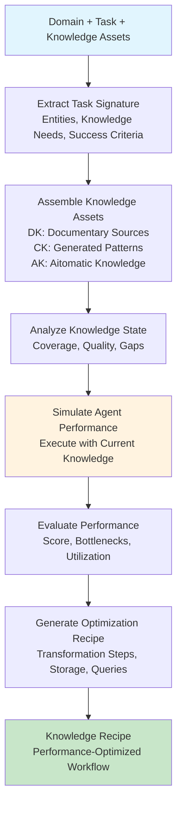

# CORRAL Curate - Knowledge Recipe Generation for Performance Optimization

The Curate phase generates optimal knowledge transformation recipes by simulating agent performance across different knowledge configurations. It identifies the most effective knowledge curation workflows to maximize agent performance on domain-specific tasks.

## How Knowledge Recipe Generation Works

CORRAL Curate uses a **simulation-driven approach** to knowledge optimization, treating knowledge curation as a performance engineering problem:

### **Knowledge Asset Categories**

#### **Documentary Knowledge (DK) - Raw Enterprise Data**
DK represents raw knowledge extracted from enterprise sources:
- **Enterprise documents**: Reports, specifications, procedures, logs
- **IoT streams**: Sensor data, telemetry, real-time feeds
- **Manual content**: SOPs, troubleshooting guides, best practices
- **Workflow data**: Process flows, decision trees, operational procedures

**DK provides the foundational data layer** that agents consume for task execution.

#### **Contextual Knowledge (CK) - Generated Patterns and Templates**
CK represents synthesized knowledge derived from documentary sources:
- **Pattern recognition**: Extracted workflows and decision patterns
- **Template generation**: Prompt templates and response frameworks
- **Scenario mapping**: Context-specific solution mappings
- **Rule extraction**: Business logic and heuristic patterns

**CK enhances agent reasoning** by providing structured interpretation frameworks.

#### **Auxiliary Knowledge (AK) - External Domain Expertise**
AK represents external knowledge from Aitomatic's knowledge repositories:
- **Domain ontologies**: Industry-specific conceptual frameworks
- **Task workflows**: Proven methodologies and best practices
- **Pattern libraries**: Common solution patterns and anti-patterns
- **Expert knowledge**: Curated domain expertise and insights

**AK accelerates knowledge development** by leveraging pre-existing domain expertise.

### **The Recipe Generation Process**

#### **Core Simulation Workflow**
1. **Task Signature Extraction**: Analyze domain-task pair for entities, knowledge needs, and success criteria
2. **Knowledge Asset Assembly**: Curate DK, generate CK, and optionally include AK
3. **Knowledge State Analysis**: Symbolically analyze knowledge coverage and quality
4. **Agent Performance Simulation**: Simulate agent execution with current knowledge configuration
5. **Performance Evaluation**: Assess bottlenecks, gaps, and improvement potential
6. **Recipe Generation**: Output concrete transformation workflows optimized for performance

#### **Knowledge Recipe Output**
The system generates a `KnowledgeRecipe` containing:
- **Transformation steps**: Ordered workflow for knowledge processing
- **Data structures**: Optimal storage schemas (graph, table, tree, vector store)
- **Storage formats**: Technology choices with performance rationale
- **Query patterns**: Runtime access patterns and fallback strategies
- **Performance metrics**: Latency, throughput, and confidence expectations
- **Gap analysis**: Specific missing knowledge preventing optimal performance
- **Priority recommendations**: Score-ordered next steps for knowledge acquisition

### **Example Simulation Flow**

#### **Semiconductor Manufacturing Defect Analysis**
```dana
recipe = curate_knowledge_recipe(
    domain="semiconductor manufacturing",
    task="defect pattern analysis",
    documentary_knowledge=[process_logs, equipment_data, defect_maps],
    include_iot_data=true,
    use_aitomatic_domain_knowledge=true
)

# Recipe output includes:
# - transformation_steps: ["extract_process_parameters", "correlate_defect_patterns", ...]
# - data_structures: ["time_series_db", "graph_network", "vector_embeddings"]
# - performance_notes: "Expected 95% confidence with <200ms query latency"
# - knowledge_gaps: ["real_time_equipment_status", "historical_yield_correlation"]
# - estimated_improvement: 0.73  # 73% performance gain potential
```

## How It Works



## Getting Started

```dana
# Basic recipe generation
recipe = curate_knowledge_recipe(
    domain="customer support",
    task="ticket classification and routing"
)

# With documentary knowledge
recipe = curate_knowledge_recipe(
    domain="manufacturing quality control",
    task="defect prediction",
    documentary_knowledge=[process_logs, quality_reports]
)

# Full configuration with all knowledge types
recipe = curate_knowledge_recipe(
    domain="financial risk management",
    task="fraud detection",
    documentary_knowledge=[transaction_logs, customer_profiles],
    include_iot_data=true,
    use_aitomatic_domain_knowledge=true,
    use_aitomatic_task_knowledge=true
)
```

## Core API

### curate_knowledge_recipe
```dana
curate_knowledge_recipe(
    domain: str = "General",
    task: str = "Q&A", 
    documentary_knowledge: list[KnowledgeAsset] = [],
    include_iot_data: bool = false,
    use_aitomatic_domain_knowledge: bool = false,
    use_aitomatic_task_knowledge: bool = false
) -> KnowledgeRecipe
```

**Parameters:**
- `domain`: Natural language domain description (e.g., "semiconductor manufacturing")
- `task`: Natural language task description (e.g., "defect pattern analysis")
- `documentary_knowledge`: List of enterprise knowledge assets to include
- `include_iot_data`: Whether to simulate IoT data streams
- `use_aitomatic_domain_knowledge`: Include Aitomatic domain expertise
- `use_aitomatic_task_knowledge`: Include Aitomatic task methodologies

**Returns:**
`KnowledgeRecipe` struct with optimized transformation workflow

## Knowledge Asset Structure

### KnowledgeAsset
```dana
struct KnowledgeAsset:
    id: str                         # Unique identifier
    type: str                       # Log_Data, Manual, IoT_Stream, Workflow, Domain_Ontology, PromptTemplate
    source: str                     # Enterprise, Aitomatic, Synthetic, IoT
    content: str                    # Actual knowledge content or summary
    trust_tier: str                 # High/Medium/Low trust classification
    metadata: dict[str, str]        # Provenance, timestamps, schema, quality indicators
    relevance_score: float          # 0.0-1.0 task-specific relevance
    knowledge_category: str         # DK (documentary), CK (contextual), AK (auxiliary)
```

### KnowledgeRecipe
```dana
struct KnowledgeRecipe:
    transformation_steps: list[str]      # Ordered workflow steps
    data_structures: list[str]           # Target schemas (graph, table, tree, vector_store)
    storage_formats: list[str]           # Storage technology choices with rationale
    query_patterns: list[str]            # Runtime access patterns and fallback strategies
    performance_notes: str               # Latency, throughput, confidence metrics
    runtime_queries: list[str]           # Concrete query examples
    knowledge_gaps: list[str]            # Missing knowledge preventing optimal performance
    priority_recommendations: list[str]  # Score-ordered next steps
    estimated_improvement: float         # Quantified performance gain potential (0.0-1.0)
```

## Usage Patterns

### Domain-Specific Recipe Generation
```dana
# Semiconductor manufacturing
semiconductor_recipe = curate_knowledge_recipe(
    domain="semiconductor fabrication and process control",
    task="yield optimization and defect pattern analysis",
    documentary_knowledge=[fab_logs, equipment_data, defect_reports],
    include_iot_data=true,
    use_aitomatic_domain_knowledge=true
)

# Financial services
banking_recipe = curate_knowledge_recipe(
    domain="retail banking and fraud prevention", 
    task="real-time transaction monitoring and risk scoring",
    documentary_knowledge=[transaction_logs, customer_profiles, risk_models],
    use_aitomatic_task_knowledge=true
)
```

### Progressive Knowledge Enhancement
```dana
# Start with basic documentary knowledge
basic_recipe = curate_knowledge_recipe(
    domain="customer support",
    task="ticket resolution", 
    documentary_knowledge=[support_tickets, knowledge_base]
)

# Add IoT data for enhanced context
enhanced_recipe = curate_knowledge_recipe(
    domain="customer support",
    task="ticket resolution",
    documentary_knowledge=[support_tickets, knowledge_base],
    include_iot_data=true
)

# Full enhancement with Aitomatic knowledge
optimal_recipe = curate_knowledge_recipe(
    domain="customer support", 
    task="ticket resolution",
    documentary_knowledge=[support_tickets, knowledge_base],
    include_iot_data=true,
    use_aitomatic_domain_knowledge=true,
    use_aitomatic_task_knowledge=true
)
```

### Recipe Analysis and Implementation
```dana
recipe = curate_knowledge_recipe(
    domain="supply chain management",
    task="demand forecasting",
    documentary_knowledge=[sales_data, inventory_logs],
    use_aitomatic_domain_knowledge=true
)

# Analyze recipe recommendations
print("Transformation workflow:")
for step in recipe.transformation_steps:
    print(f"  - {step}")

print(f"Expected performance improvement: {recipe.estimated_improvement:.1%}")
print(f"Critical knowledge gaps: {len(recipe.knowledge_gaps)}")

# Implement priority recommendations
for i, recommendation in enumerate(recipe.priority_recommendations[:3]):
    print(f"{i+1}. {recommendation}")

# Use suggested storage formats
primary_storage = recipe.storage_formats[0]
print(f"Recommended primary storage: {primary_storage}")
```

## Performance Optimization

### Understanding Recipe Metrics
```dana
recipe = curate_knowledge_recipe(
    domain="network operations",
    task="anomaly detection",
    documentary_knowledge=[network_logs, topology_data]
)

# Performance analysis
print(f"Current knowledge state score: {recipe.performance_notes}")
print(f"Improvement potential: {recipe.estimated_improvement:.1%}")

# Bottleneck identification
for gap in recipe.knowledge_gaps:
    print(f"Gap: {gap}")

# Implementation priorities
for priority in recipe.priority_recommendations:
    print(f"Priority: {priority}")
```

### Iterative Recipe Refinement
```dana
# Generate initial recipe
initial_recipe = curate_knowledge_recipe(
    domain="predictive maintenance",
    task="equipment failure prediction",
    documentary_knowledge=[maintenance_logs]
)

# Add recommended knowledge sources based on gaps
enhanced_knowledge = maintenance_logs + [
    sensor_data,  # Addresses "real-time equipment status" gap
    failure_history  # Addresses "historical failure patterns" gap
]

# Generate improved recipe
improved_recipe = curate_knowledge_recipe(
    domain="predictive maintenance", 
    task="equipment failure prediction",
    documentary_knowledge=enhanced_knowledge,
    include_iot_data=true
)

# Compare improvement
improvement_delta = improved_recipe.estimated_improvement - initial_recipe.estimated_improvement
print(f"Performance gain from enhancement: {improvement_delta:.1%}")
```

## Integration with CORRAL Pipeline

```dana
# Generate recipe for knowledge optimization
recipe = curate_knowledge_recipe(
    domain="semiconductor manufacturing",
    task="defect analysis",
    documentary_knowledge=enterprise_sources,
    use_aitomatic_domain_knowledge=true
)

# Implement recipe in Organize phase
organized_knowledge = organize_knowledge(
    knowledge_assets=recipe.runtime_queries,
    storage_format=recipe.storage_formats[0],
    query_patterns=recipe.query_patterns
)

# Use optimized structure in Retrieve phase
context = retrieve_knowledge_context(
    query="What causes pattern defects in layer 3?",
    organized_knowledge=organized_knowledge,
    retrieval_strategy=recipe.query_patterns[0]
)
```

## Best Practices

1. **Start Simple**: Begin with basic documentary knowledge and progressively enhance
2. **Analyze Gaps**: Use `knowledge_gaps` to identify critical missing information  
3. **Follow Priorities**: Implement `priority_recommendations` in score order
4. **Monitor Performance**: Track `estimated_improvement` across recipe iterations
5. **Leverage Domain Knowledge**: Use Aitomatic knowledge for established domains
6. **Implement Storage Recommendations**: Follow `storage_formats` and `data_structures` guidance
7. **Optimize Query Patterns**: Use suggested `query_patterns` for runtime efficiency
8. **Validate Recipes**: Test transformation steps in development environments before production 