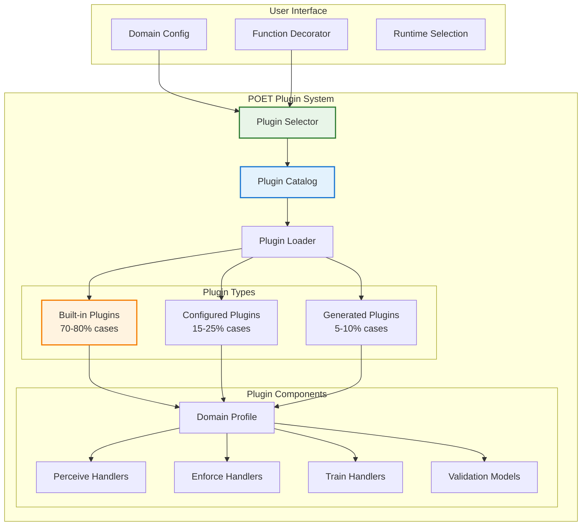

# POET Plugin Architecture

## Overview

This document outlines the design for POET's plugin system - a robust, easy-to-use, and intuitive architecture that enables domain-specific intelligence without requiring extensive custom code. The plugin system allows POET to provide industry-specific capabilities while maintaining the core principle of minimal user code.

## Design Principles

### 1. Zero-to-Minimal Configuration
- Plugins should work out-of-the-box with sensible defaults
- Progressive disclosure of configuration options
- Auto-detection of domain context when possible

### 2. Composability
- Plugins can be combined for cross-domain scenarios
- Clear interfaces between plugin components
- No conflicts between multiple active plugins

### 3. Extensibility Without Complexity
- Simple plugin creation for common patterns
- AI-assisted plugin generation for unique cases
- Clear upgrade path from configuration to custom code

## Plugin Architecture Overview



## Core Plugin Interface

### Base Plugin Structure
```python
# opendxa/common/poet/plugins/base_plugin.py
from abc import ABC, abstractmethod
from typing import Dict, Any, Optional, List, Callable
from dataclasses import dataclass

@dataclass
class PluginMetadata:
    """Metadata for plugin discovery and selection"""
    name: str
    version: str
    domain: str
    sub_domain: Optional[str] = None
    description: str = ""
    author: str = "opendxa"
    capabilities: List[str] = None
    compatibility: Dict[str, str] = None
    confidence_score: float = 1.0  # How well this plugin matches the use case

class POETPlugin(ABC):
    """Base class for all POET plugins"""
    
    def __init__(self, config: Optional[Dict[str, Any]] = None):
        self.config = config or {}
        self.metadata = self._create_metadata()
        self._initialized = False
    
    @abstractmethod
    def _create_metadata(self) -> PluginMetadata:
        """Create plugin metadata for discovery"""
        pass
    
    def initialize(self, context: Dict[str, Any]) -> None:
        """Initialize plugin with runtime context"""
        if self._initialized:
            return
        
        self._validate_config()
        self._setup_handlers()
        self._initialized = True
    
    @abstractmethod
    def _validate_config(self) -> None:
        """Validate plugin configuration"""
        pass
    
    @abstractmethod
    def _setup_handlers(self) -> None:
        """Setup stage-specific handlers"""
        pass
    
    # Stage handler methods
    def get_perceive_handler(self) -> Optional[Callable]:
        """Return perceive stage handler if available"""
        return None
    
    def get_enforce_handler(self) -> Optional[Callable]:
        """Return enforce stage handler if available"""
        return None
    
    def get_train_handler(self) -> Optional[Callable]:
        """Return train stage handler if available"""
        return None
    
    # Configuration helpers
    def get_default_config(self) -> Dict[str, Any]:
        """Return default configuration for this plugin"""
        return {}
    
    def get_config_schema(self) -> Dict[str, Any]:
        """Return JSON schema for configuration validation"""
        return {}

class DomainPlugin(POETPlugin):
    """Specialized base for domain-specific plugins"""
    
    def __init__(self, config: Optional[Dict[str, Any]] = None):
        super().__init__(config)
        self.domain_knowledge = {}
        self.compliance_rules = {}
        self.validation_models = {}
    
    @abstractmethod
    def load_domain_knowledge(self) -> None:
        """Load domain-specific knowledge and rules"""
        pass
```

## Plugin Discovery and Selection

### Automatic Plugin Selection
```python
# opendxa/common/poet/plugins/plugin_selector.py
from typing import List, Optional, Dict, Any
import importlib
import inspect

class PluginSelector:
    """Intelligent plugin selection based on context"""
    
    def __init__(self, plugin_registry: 'PluginRegistry'):
        self.registry = plugin_registry
        self.selection_history = {}
        self.performance_metrics = {}
    
    def select_plugin(self, 
                     domain: Optional[str] = None,
                     function_signature: Optional[Dict[str, Any]] = None,
                     context: Optional[Dict[str, Any]] = None,
                     explicit_plugin: Optional[str] = None) -> POETPlugin:
        """Select the most appropriate plugin for the context"""
        
        # Priority 1: Explicit plugin selection
        if explicit_plugin:
            return self.registry.get_plugin(explicit_plugin)
        
        # Priority 2: Domain-based selection with context
        if domain:
            candidates = self.registry.get_plugins_by_domain(domain)
            if context:
                return self._select_best_match(candidates, context)
            elif len(candidates) == 1:
                return candidates[0]
            else:
                return self._select_by_subdomain(candidates, context)
        
        # Priority 3: Auto-detection from function signature
        if function_signature:
            detected_domain = self._detect_domain_from_signature(function_signature)
            if detected_domain:
                return self.select_plugin(domain=detected_domain, context=context)
        
        # Priority 4: Context-based inference
        if context:
            inferred_domain = self._infer_domain_from_context(context)
            if inferred_domain:
                return self.select_plugin(domain=inferred_domain, context=context)
        
        # Default: Return general-purpose plugin
        return self.registry.get_plugin("general")
    
    def _select_best_match(self, candidates: List[POETPlugin], 
                          context: Dict[str, Any]) -> POETPlugin:
        """Select best matching plugin from candidates"""
        
        scored_candidates = []
        for plugin in candidates:
            score = self._calculate_match_score(plugin, context)
            scored_candidates.append((score, plugin))
        
        # Sort by score and return best match
        scored_candidates.sort(reverse=True, key=lambda x: x[0])
        best_score, best_plugin = scored_candidates[0]
        
        # Log selection for learning
        self._record_selection(best_plugin, context, best_score)
        
        return best_plugin
    
    def _calculate_match_score(self, plugin: POETPlugin, 
                              context: Dict[str, Any]) -> float:
        """Calculate how well a plugin matches the context"""
        
        score = plugin.metadata.confidence_score
        
        # Check capability matches
        required_capabilities = context.get('required_capabilities', [])
        plugin_capabilities = plugin.metadata.capabilities or []
        
        capability_match = len(set(required_capabilities) & set(plugin_capabilities))
        capability_total = len(required_capabilities) if required_capabilities else 1
        
        score *= (capability_match / capability_total)
        
        # Check performance history
        plugin_key = f"{plugin.metadata.domain}:{plugin.metadata.name}"
        if plugin_key in self.performance_metrics:
            historical_performance = self.performance_metrics[plugin_key]
            score *= historical_performance.get('success_rate', 0.5)
        
        return score
    
    def _detect_domain_from_signature(self, signature: Dict[str, Any]) -> Optional[str]:
        """Auto-detect domain from function signature and parameter names"""
        
        # Financial domain indicators
        financial_keywords = ['credit', 'loan', 'risk', 'portfolio', 'trading', 
                            'interest_rate', 'balance', 'transaction']
        
        # Manufacturing domain indicators  
        manufacturing_keywords = ['temperature', 'pressure', 'yield', 'defect',
                                'sensor', 'equipment', 'batch', 'process']
        
        # Healthcare domain indicators
        healthcare_keywords = ['patient', 'diagnosis', 'symptom', 'treatment',
                             'medication', 'vital', 'clinical', 'medical']
        
        # Check function name and parameters
        all_text = ' '.join([
            signature.get('function_name', ''),
            ' '.join(signature.get('parameters', {}).keys())
        ]).lower()
        
        # Score each domain
        scores = {
            'financial_services': sum(1 for kw in financial_keywords if kw in all_text),
            'manufacturing': sum(1 for kw in manufacturing_keywords if kw in all_text),
            'healthcare': sum(1 for kw in healthcare_keywords if kw in all_text)
        }
        
        # Return domain with highest score (if above threshold)
        best_domain = max(scores.items(), key=lambda x: x[1])
        return best_domain[0] if best_domain[1] >= 2 else None
```

## Built-in Domain Plugins

### Financial Services Plugin
```python
# opendxa/common/poet/plugins/domains/financial_services.py
from typing import Dict, Any, Optional, Tuple
import re

class FinancialServicesPlugin(DomainPlugin):
    """Built-in plugin for financial services domain"""
    
    def _create_metadata(self) -> PluginMetadata:
        return PluginMetadata(
            name="financial_services_standard",
            version="1.0.0",
            domain="financial_services",
            description="Standard financial services compliance and processing",
            capabilities=["compliance", "risk_assessment", "audit_trail", 
                         "data_validation", "regulatory_reporting"]
        )
    
    def _setup_handlers(self):
        """Setup financial-specific handlers"""
        self.perceive_handler = FinancialPerceiveHandler(self.config)
        self.enforce_handler = FinancialEnforceHandler(self.config)
        self.train_handler = FinancialTrainHandler(self.config)
    
    def load_domain_knowledge(self):
        """Load financial domain knowledge"""
        
        # Compliance frameworks
        self.compliance_rules = {
            "FCRA": FCRAComplianceRules(),
            "ECOA": ECOAComplianceRules(),
            "SOX": SOXComplianceRules(),
            "GDPR": GDPRComplianceRules()
        }
        
        # Data validation patterns
        self.validation_models = {
            "credit_score": CreditScoreValidator(),
            "income": IncomeValidator(),
            "ssn": SSNValidator(pii_protection=True),
            "account_number": AccountNumberValidator()
        }
        
        # Domain patterns
        self.domain_knowledge = {
            "risk_thresholds": {
                "credit_score": {"min": 300, "max": 850, "high_risk": 600},
                "debt_to_income": {"max": 0.43, "preferred": 0.36},
                "loan_to_value": {"max": 0.95, "preferred": 0.80}
            },
            "regulatory_requirements": {
                "adverse_action_notice": True,
                "fair_lending_analysis": True,
                "audit_retention": "7_years"
            }
        }
    
    def get_perceive_handler(self) -> Callable:
        """Return financial perceive handler"""
        
        def perceive_financial_data(inputs: Dict[str, Any], 
                                   poet_status: Dict[str, Any]) -> Dict[str, Any]:
            """Perceive handler for financial data"""
            
            normalized_inputs = {}
            
            for field_name, field_value in inputs.items():
                # Apply domain-specific normalization
                if field_name in self.validation_models:
                    validator = self.validation_models[field_name]
                    normalized_value = validator.normalize(field_value)
                    validation_result = validator.validate(normalized_value)
                    
                    if not validation_result.is_valid:
                        # Handle validation failure based on configuration
                        if self.config.get("strict_validation", False):
                            raise ValueError(f"Invalid {field_name}: {validation_result.error}")
                        else:
                            # Use intelligent defaults
                            normalized_value = validator.get_safe_default()
                    
                    normalized_inputs[field_name] = normalized_value
                else:
                    normalized_inputs[field_name] = field_value
            
            # Enrich with market context
            if self.config.get("enable_market_data", True):
                market_context = self._get_current_market_context()
                normalized_inputs["_market_context"] = market_context
            
            return {
                "normalized_inputs": normalized_inputs,
                "validation_status": self._get_validation_summary(inputs),
                "compliance_context": self._get_compliance_context()
            }
        
        return perceive_financial_data

class FinancialPerceiveHandler:
    """Specialized perceive handler for financial data"""
    
    def __init__(self, config: Dict[str, Any]):
        self.config = config
        self.normalizers = self._setup_normalizers()
    
    def _setup_normalizers(self) -> Dict[str, Any]:
        """Setup field-specific normalizers"""
        return {
            "credit_score": self._normalize_credit_score,
            "income": self._normalize_income,
            "currency": self._normalize_currency,
            "percentage": self._normalize_percentage,
            "date": self._normalize_date
        }
    
    def _normalize_credit_score(self, value: Any) -> int:
        """Normalize credit score from various formats"""
        
        if isinstance(value, int):
            return max(300, min(850, value))  # Enforce bounds
        
        if isinstance(value, str):
            # Handle text descriptions
            score_map = {
                "excellent": 780, "very good": 740, "good": 700,
                "fair": 650, "poor": 580, "very poor": 500
            }
            
            value_lower = value.lower().strip()
            if value_lower in score_map:
                return score_map[value_lower]
            
            # Try to extract numeric value
            numeric_match = re.search(r'\d+', value)
            if numeric_match:
                return self._normalize_credit_score(int(numeric_match.group()))
        
        # Default for unparseable values
        return 650  # Fair credit default
```

### Manufacturing Plugin
```python
# opendxa/common/poet/plugins/domains/manufacturing.py
class ManufacturingPlugin(DomainPlugin):
    """Built-in plugin for manufacturing domain"""
    
    def _create_metadata(self) -> PluginMetadata:
        return PluginMetadata(
            name="manufacturing_standard",
            version="1.0.0",
            domain="manufacturing",
            description="Manufacturing process control and optimization",
            capabilities=["process_control", "yield_optimization", "defect_detection",
                         "sensor_fusion", "predictive_maintenance"]
        )
    
    def load_domain_knowledge(self):
        """Load manufacturing domain knowledge"""
        
        # Process control rules
        self.domain_knowledge = {
            "sensor_types": {
                "temperature": {"unit": "celsius", "precision": 0.1},
                "pressure": {"unit": "psi", "precision": 0.01},
                "flow_rate": {"unit": "l/min", "precision": 0.1},
                "vibration": {"unit": "mm/s", "precision": 0.001}
            },
            "control_strategies": {
                "pid": PIDControlStrategy(),
                "mpc": ModelPredictiveControl(),
                "fuzzy": FuzzyLogicControl()
            },
            "quality_metrics": {
                "yield": {"target": 0.95, "minimum": 0.90},
                "defect_rate": {"target": 0.001, "maximum": 0.01},
                "oee": {"target": 0.85, "minimum": 0.75}
            }
        }
        
        # Equipment models
        self.equipment_models = {
            "reactor": ReactorModel(),
            "furnace": FurnaceModel(),
            "conveyor": ConveyorModel()
        }
    
    def get_perceive_handler(self) -> Callable:
        """Return manufacturing perceive handler"""
        
        def perceive_sensor_data(inputs: Dict[str, Any], 
                               poet_status: Dict[str, Any]) -> Dict[str, Any]:
            """Handle sensor data with fault tolerance"""
            
            # Sensor fusion for redundant measurements
            fused_readings = self._apply_sensor_fusion(inputs)
            
            # Outlier detection and correction
            cleaned_readings = self._remove_outliers(fused_readings)
            
            # Equipment state inference
            equipment_state = self._infer_equipment_state(cleaned_readings)
            
            return {
                "sensor_readings": cleaned_readings,
                "equipment_state": equipment_state,
                "data_quality": self._assess_data_quality(inputs),
                "control_recommendations": self._get_control_recommendations(equipment_state)
            }
        
        return perceive_sensor_data
```

## Plugin Configuration System

### User-Friendly Configuration
```python
# opendxa/common/poet/plugins/config_system.py
from typing import Dict, Any, Optional, List
import yaml
import json

class PluginConfigurator:
    """User-friendly plugin configuration system"""
    
    def __init__(self):
        self.config_templates = {}
        self.config_validator = ConfigValidator()
    
    def create_config_wizard(self, domain: str, 
                           use_case: Optional[str] = None) -> 'ConfigWizard':
        """Create interactive configuration wizard"""
        return ConfigWizard(domain, use_case, self.config_templates)
    
    def load_config_from_yaml(self, yaml_path: str) -> Dict[str, Any]:
        """Load plugin configuration from YAML file"""
        with open(yaml_path, 'r') as f:
            config = yaml.safe_load(f)
        
        # Validate and enhance config
        validated_config = self.config_validator.validate(config)
        return self._enhance_config(validated_config)
    
    def generate_config_template(self, plugin: POETPlugin) -> str:
        """Generate configuration template for a plugin"""
        
        template = {
            "plugin": plugin.metadata.name,
            "domain": plugin.metadata.domain,
            "configuration": plugin.get_default_config(),
            "schema": plugin.get_config_schema()
        }
        
        return yaml.dump(template, default_flow_style=False, sort_keys=False)

class ConfigWizard:
    """Interactive configuration wizard for plugins"""
    
    def __init__(self, domain: str, use_case: Optional[str], templates: Dict[str, Any]):
        self.domain = domain
        self.use_case = use_case
        self.templates = templates
        self.config = {}
    
    def start(self) -> Dict[str, Any]:
        """Start interactive configuration"""
        
        print(f"\n🔧 POET Plugin Configuration Wizard")
        print(f"Domain: {self.domain}")
        if self.use_case:
            print(f"Use Case: {self.use_case}")
        print("-" * 50)
        
        # Step 1: Select base configuration
        base_config = self._select_base_configuration()
        self.config.update(base_config)
        
        # Step 2: Customize key parameters
        self._customize_parameters()
        
        # Step 3: Add optional features
        self._configure_optional_features()
        
        # Step 4: Review and confirm
        return self._review_and_confirm()
    
    def _select_base_configuration(self) -> Dict[str, Any]:
        """Select base configuration template"""
        
        templates = self._get_relevant_templates()
        
        print("\nAvailable configurations:")
        for i, (name, desc) in enumerate(templates):
            print(f"{i+1}. {name}: {desc}")
        
        choice = input("\nSelect configuration (number): ")
        selected = templates[int(choice) - 1]
        
        return self.templates[selected[0]]
    
    def _customize_parameters(self):
        """Customize key parameters with user input"""
        
        print("\n⚙️  Customize Key Parameters")
        print("(Press Enter to keep defaults)")
        
        key_params = self._get_key_parameters()
        
        for param_name, param_info in key_params.items():
            current_value = self.config.get(param_name, param_info['default'])
            
            prompt = f"\n{param_info['description']}"
            prompt += f"\nCurrent: {current_value}"
            if 'options' in param_info:
                prompt += f"\nOptions: {', '.join(param_info['options'])}"
            
            user_input = input(prompt + "\nNew value: ").strip()
            
            if user_input:
                # Validate and convert input
                validated_value = self._validate_parameter(param_name, user_input, param_info)
                if validated_value is not None:
                    self.config[param_name] = validated_value
```

## Plugin Creation and Extension

### AI-Assisted Plugin Generation
```python
# opendxa/common/poet/plugins/plugin_generator.py
from typing import Dict, Any, Optional
from opendxa.common.resource.llm_resource import LLMResource

class PluginGenerator:
    """AI-assisted plugin generation for custom domains"""
    
    def __init__(self, llm_resource: LLMResource):
        self.llm = llm_resource
        self.template_library = PluginTemplateLibrary()
    
    def generate_plugin(self, 
                       domain_description: str,
                       example_data: Optional[Dict[str, Any]] = None,
                       requirements: Optional[List[str]] = None) -> str:
        """Generate custom plugin code based on description"""
        
        # Analyze domain requirements
        domain_analysis = self._analyze_domain_requirements(
            domain_description, example_data, requirements
        )
        
        # Select base template
        base_template = self.template_library.select_template(domain_analysis)
        
        # Generate plugin code
        plugin_code = self._generate_plugin_code(
            base_template, domain_analysis, example_data
        )
        
        # Validate generated code
        validation_result = self._validate_generated_code(plugin_code)
        
        if validation_result.is_valid:
            return plugin_code
        else:
            # Iterate with fixes
            return self._fix_and_regenerate(plugin_code, validation_result.errors)
    
    def _analyze_domain_requirements(self, description: str, 
                                   example_data: Optional[Dict[str, Any]],
                                   requirements: Optional[List[str]]) -> Dict[str, Any]:
        """Analyze domain to understand plugin requirements"""
        
        prompt = f"""
        Analyze the following domain description and identify key requirements for a POET plugin:
        
        Domain Description: {description}
        
        Example Data Structure: {json.dumps(example_data, indent=2) if example_data else "Not provided"}
        
        Specific Requirements: {requirements if requirements else "Not specified"}
        
        Identify:
        1. Data types and validation needs
        2. Domain-specific rules and constraints
        3. Compliance or regulatory requirements
        4. Performance characteristics
        5. Integration points
        
        Return a structured analysis.
        """
        
        analysis = self.llm.generate(prompt)
        return json.loads(analysis)
    
    def extend_existing_plugin(self, 
                             base_plugin: str,
                             modifications: Dict[str, Any]) -> str:
        """Extend existing plugin with custom modifications"""
        
        prompt = f"""
        Extend the following POET plugin with these modifications:
        
        Base Plugin: {base_plugin}
        
        Modifications Required:
        {json.dumps(modifications, indent=2)}
        
        Generate the extended plugin code that:
        1. Inherits from the base plugin
        2. Implements the requested modifications
        3. Maintains compatibility with POET architecture
        4. Includes proper error handling
        """
        
        extended_code = self.llm.generate(prompt)
        return self._validate_and_format_code(extended_code)
```

### Simple Plugin Creation for Users
```python
# opendxa/common/poet/plugins/simple_plugin.py
def create_simple_plugin(domain: str, 
                        perceive_rules: Optional[Dict[str, Any]] = None,
                        enforce_rules: Optional[Dict[str, Any]] = None,
                        learning_config: Optional[Dict[str, Any]] = None) -> POETPlugin:
    """Create a simple plugin with minimal configuration"""
    
    class SimpleCustomPlugin(DomainPlugin):
        def _create_metadata(self) -> PluginMetadata:
            return PluginMetadata(
                name=f"custom_{domain}_plugin",
                version="1.0.0",
                domain=domain,
                description=f"Custom plugin for {domain}"
            )
        
        def _setup_handlers(self):
            if perceive_rules:
                self.perceive_handler = create_rule_based_handler(perceive_rules)
            if enforce_rules:
                self.enforce_handler = create_rule_based_handler(enforce_rules)
            if learning_config:
                self.train_handler = create_learning_handler(learning_config)
        
        def load_domain_knowledge(self):
            # Minimal domain knowledge from configuration
            self.domain_knowledge = {
                "perceive_rules": perceive_rules or {},
                "enforce_rules": enforce_rules or {},
                "learning_config": learning_config or {}
            }
    
    return SimpleCustomPlugin()

# Example usage:
my_plugin = create_simple_plugin(
    domain="retail",
    perceive_rules={
        "normalize_prices": {"remove_currency_symbols": True, "decimal_places": 2},
        "validate_inventory": {"min_quantity": 0, "max_quantity": 10000}
    },
    enforce_rules={
        "price_bounds": {"min": 0.01, "max": 99999.99},
        "required_fields": ["sku", "price", "quantity"]
    }
)
```

## Usage Examples

### Basic Usage with Built-in Plugin
```python
# Automatic plugin selection based on domain
@poet(domain="financial_services")
def assess_credit_risk(credit_score: int, income: float, debt_ratio: float) -> bool:
    """Plugin automatically handles data normalization and compliance"""
    return credit_score > 650 and debt_ratio < 0.4

# The financial_services plugin automatically provides:
# - Credit score normalization (text/number conversion)
# - Income parsing ($65,000 -> 65000.0)
# - Compliance validation (FCRA, ECOA)
# - Audit trail generation
```

### Custom Configuration
```python
# Custom plugin configuration via YAML
"""
# config/my_financial_plugin.yaml
plugin: financial_services_standard
domain: financial_services
configuration:
  compliance:
    frameworks: ["FCRA", "ECOA", "SOX"]
    strict_mode: true
  data_validation:
    credit_score:
      min: 300
      max: 850
      allow_text_input: true
  learning:
    enable_pattern_learning: true
    confidence_threshold: 0.8
"""

# Use custom configuration
@poet(plugin_config="config/my_financial_plugin.yaml")
def process_loan_application(application_data: dict) -> dict:
    # Custom configuration applied automatically
    pass
```

### Plugin Combination
```python
# Combine multiple plugins for cross-domain scenarios
@poet(plugins=["financial_services", "fraud_detection", "compliance"])
def process_high_risk_transaction(transaction: dict) -> dict:
    """Multiple plugins work together:
    - financial_services: normalize monetary values
    - fraud_detection: check suspicious patterns  
    - compliance: ensure regulatory requirements
    """
    pass
```

### Progressive Enhancement
```python
# Start simple, enhance progressively
@poet(domain="manufacturing")
def monitor_temperature(sensor_reading: float) -> bool:
    """Start with basic domain plugin"""
    return sensor_reading < 100

# Later: Add custom configuration
@poet(
    domain="manufacturing",
    plugin_config={
        "sensor_fusion": True,
        "outlier_detection": "advanced",
        "control_strategy": "mpc"
    }
)
def monitor_temperature_advanced(sensor_reading: float) -> bool:
    """Enhanced with configuration"""
    return sensor_reading < 100

# Eventually: Custom plugin if needed
@poet(plugin=create_custom_manufacturing_plugin())
def monitor_temperature_custom(sensor_reading: float) -> bool:
    """Fully customized plugin"""
    return sensor_reading < 100
```

## Plugin Development Guide

### Creating a New Domain Plugin
```python
# Template for new domain plugin
class MyDomainPlugin(DomainPlugin):
    """Plugin for my specific domain"""
    
    def _create_metadata(self) -> PluginMetadata:
        return PluginMetadata(
            name="my_domain_plugin",
            version="1.0.0",
            domain="my_domain",
            description="Handles my domain-specific logic",
            capabilities=["capability1", "capability2"]
        )
    
    def _setup_handlers(self):
        """Setup stage handlers"""
        # Only implement what you need
        self.perceive_handler = self._create_perceive_handler()
        # self.enforce_handler = ...  # Optional
        # self.train_handler = ...     # Optional
    
    def _create_perceive_handler(self):
        def perceive(inputs, poet_status):
            # Your perceive logic here
            return {"processed_inputs": inputs}
        return perceive
    
    def load_domain_knowledge(self):
        """Load any domain-specific knowledge"""
        self.domain_knowledge = {
            "rules": {},
            "patterns": {}
        }
```

## Best Practices

### 1. Plugin Selection
- Use domain parameter for automatic selection when possible
- Provide explicit plugin only when necessary
- Let POET learn which plugins work best for your use cases

### 2. Configuration
- Start with defaults, customize only what's needed
- Use YAML for complex configurations
- Keep configurations version-controlled

### 3. Extension
- Prefer configuration over custom code
- Use plugin combination before creating new plugins
- Leverage AI generation for unique domains

### 4. Performance
- Plugins are loaded on-demand and cached
- Shared plugins across functions reduce memory
- Learning improves plugin selection over time

## Summary

The POET plugin architecture provides:

1. **Intuitive Usage**: Simple domain parameter for 80% of cases
2. **Progressive Complexity**: From defaults → configuration → custom code
3. **AI Assistance**: Generated plugins for unique domains
4. **Composability**: Combine plugins for complex scenarios
5. **Learning Integration**: Plugins improve with usage

This design ensures that users can leverage domain-specific intelligence with minimal effort while retaining the flexibility to customize when needed.