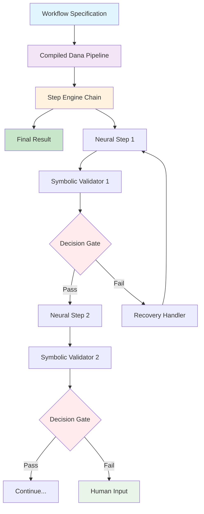
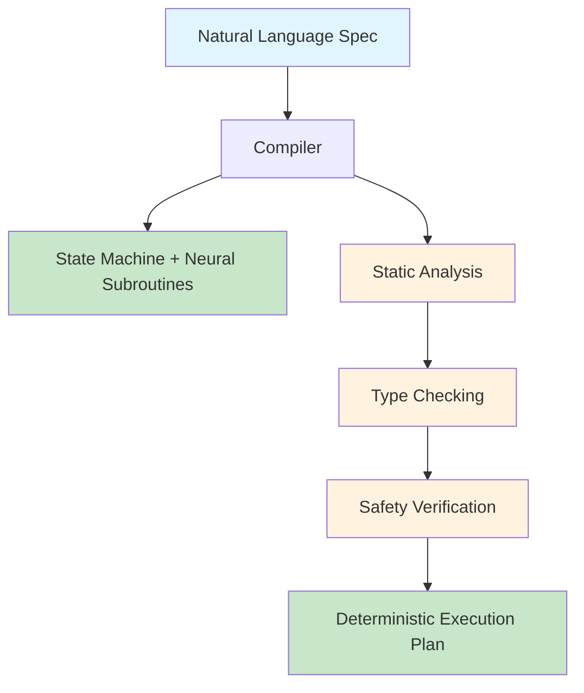
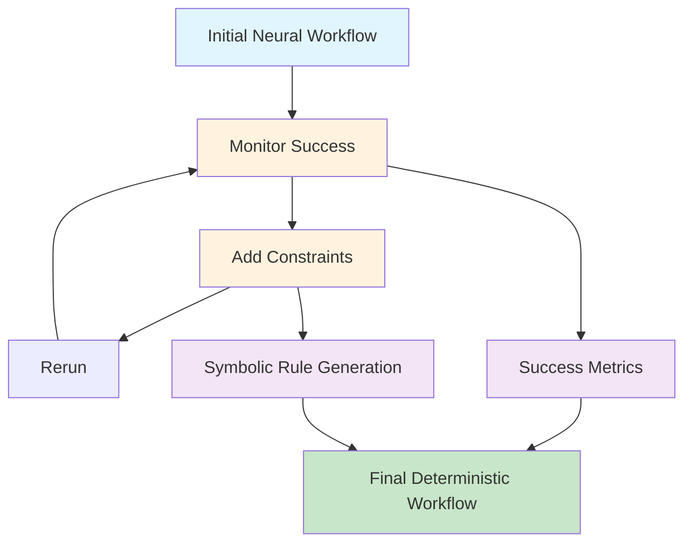

# Dana Workflows Design

```text
By: Christopher Nguyen
Date: July 16, 2025
```

## Problem Statement

Industrial, financial, and enterprise environments require agentic workflows that combine the robustness and flexibility of neural approaches with the reproducibility, explainability, and determinism demanded by regulated domains. Currently, AI engineers must choose between:

- **Neural-only approaches** that offer flexibility but lack transparency, reproducibility, and regulatory compliance
- **Symbolic-only approaches** that provide determinism but cannot handle edge cases or incomplete specifications
- **Manual orchestration** that places unsustainable cognitive load on engineers who understand domain processes but not AI/ML internals

The critical gap is the absence of a system that enables **domain experts** (process engineers, compliance officers, subject matter experts) to encode their well-defined, regulated workflows using **natural language specifications** while the **runtime guarantees** reproducibility, provides full explainability, and maintains deterministic control over all execution paths.

**How might we enable domain experts to specify enterprise-grade agentic workflows at the right level of abstraction—declarative enough for reliability and transparency, yet flexible enough for neural adaptability—while the runtime absorbs all complexity of neurosymbolic coordination, verification, and state management?**

## Goals

### Primary Goals

1. **Domain Expert Workflow Specification**
   - Enable subject matter experts to specify workflows using natural language descriptions of their business processes
   - No requirement for AI/ML knowledge, prompting expertise, or technical implementation details
   - Support for regulatory requirements, compliance checks, and domain-specific constraints

2. **Neural Flexibility with Symbolic Guarantees**
   - Leverage LLM robustness for handling edge cases, incomplete specifications, and creative problem-solving
   - Provide deterministic guarantees through symbolic validation at every workflow step
   - Ensure every neural decision is explainable and auditable for regulatory compliance

3. **Progressive Rigor Levels**
   - Allow users to specify determinism levels from 0% (pure neural flexibility) to 100% (pure symbolic rigor) per workflow step
   - Provide runtime control over neural-symbolic balance without changing workflow specification
   - Enable gradual tightening of constraints as domain understanding evolves

4. **Deterministic Reproducibility**
   - Same workflow specification with same inputs yields identical execution paths and outputs
   - Complete audit trail of every decision, verification, and state change
   - Versioned workflow specifications with clear migration paths

5. **Explainable Neural Decisions**
   - Every neural step produces structured explanations suitable for regulatory review
   - Clear documentation of reasoning, evidence used, and confidence levels
   - Domain-appropriate explanation formats for different stakeholder audiences

6. **Failure Recovery with Domain Expertise**
   - Intelligent recovery strategies when symbolic constraints fail or neural outputs deviate
   - Automatic escalation paths and remediation suggestions based on domain knowledge
   - Graceful degradation to human-in-the-loop when automated recovery is insufficient

### Secondary Goals

7. **Zero-Cognitive-Load Runtime**
   - All neurosymbolic coordination complexity absorbed by the runtime
   - Automatic handling of LLM rate limits, retries, context management, and error handling
   - Transparent resource management including tool access, database connections, and user interactions

8. **First-Class User Interaction**
   - User input treated as any other workflow resource with consistent access patterns
   - Natural integration of human clarification, approval, and decision points
   - Automatic context preservation across user interaction boundaries

## Solution Options

### Option 1: Neural-Symbolic Step Engine (Dana Pipeline-Based)

**Core Concept:** Leverage Dana's function composition system to create neurosymbolic step engines that combine neural execution with symbolic validation in deterministic pipelines.

**Architecture:**


**Dana Pipeline Implementation:**
```dana
# User specifies workflow declaratively
workflow = (
    analyze_invoice as step1 | 
    validate_compliance as step1_validation |
    extract_entities as step2 |
    verify_entities as step2_validation |
    generate_report as final_step
)

# Runtime compiles to neurosymbolic pipeline
compiled_workflow = (
    neural_execute(analyze_invoice) | symbolic_validate(compliance_rules) |
    neural_execute(extract_entities) | symbolic_validate(entity_schema) |
    neural_execute(generate_report) | symbolic_validate(report_format)
)

# Execution with automatic state capture
result = compiled_workflow(invoice_data) as audit_trail
```

**Key Features:**
- **Dana-native**: Leverages existing pipeline composition system
- **Explicit contracts**: Each step has clear neural objective + symbolic constraints
- **Automatic state capture**: `as result_name` captures intermediate states for audit trails
- **Deterministic execution**: Pipeline ensures consistent step ordering despite neural components
- **Failure recovery**: Failed validations trigger recovery handlers within pipeline structure
- **Progressive rigor**: Users can mark steps as `strict` or `flexible` within same pipeline

**Pros:** Built on proven Dana composition, natural for Dana users, automatic state management
**Cons:** Requires understanding of Dana pipeline syntax, performance overhead from validation gates

### Option 2: Declarative Workflow Compiler

**Core Concept:** Natural language workflow specification compiles to deterministic state machine with neural subroutines, ensuring enterprise-grade determinism while preserving neural capabilities.

**Architecture:**


**Key Features:**
- Compiler ensures all paths are deterministic and explainable
- Neural subroutines only in explicitly marked "flexible" steps
- Static analysis catches specification issues before runtime
- Generated code includes full audit trail for regulatory compliance
- Zero runtime surprises through compile-time verification

**Pros:** Maximum determinism, compile-time safety, optimal performance
**Cons:** Less runtime flexibility, complex compiler implementation

### Option 3: Progressive Rigor Pipeline

**Core Concept:** Start with neural flexibility, progressively add symbolic constraints based on observed behavior, enabling gradual transition from exploration to production-grade determinism.

**Architecture:**


**Key Features:**
- Begin with pure neural execution for maximum flexibility
- Runtime learns which constraints are needed for consistency
- User can "lock in" constraints at any point during development
- Gradual transition from flexible exploration to deterministic production
- Perfect for iterative refinement with domain experts

**Pros:** Natural development workflow, learns from actual usage patterns
**Cons:** Requires initial "training" phase, potential for specification drift

### Selection Criteria & Final Scoring

| Criteria | Step Engine (Pipeline) | Compiler | Progressive |
|----------|------------------------|----------|-------------|
| **Enterprise Readiness** | **9/10** | **9.5/10** | 7/10 |
| **Development Speed** | **9/10** | 6/10 | **9/10** |
| **Runtime Flexibility** | 7/10 | 4/10 | **9/10** |
| **Regulatory Compliance** | **9/10** | **10/10** | 8/10 |
| **Implementation Complexity** | **8/10** | 5/10 | 7/10 |
| **User Learning Curve** | **9/10** | 6/10 | 8/10 |
| **Dana Integration** | **10/10** | 6/10 | 8/10 |
| **Risk Level** | **9/10** | 6/10 | 5/10 |

**Enterprise Priority Score (Weighted):**
- **Step Engine (Pipeline): 8.5/10** ⭐ **RECOMMENDED**
- **Compiler: 7.8/10** (Future enhancement)
- **Progressive: 7.0/10** (Development tool)

**Enterprise Priority Weighting:**
- Regulatory Compliance: 30%
- Enterprise Readiness: 25% 
- Development Speed: 20%
- Dana Integration: 15%
- Risk Mitigation: 10%

## Non-Goals

### Explicit Non-Goals (v1.0)

1. **NOT: Multi-agent orchestration** - Single-agent workflows only, no distributed coordination
2. **NOT: Real-time stream processing** - Batch workflows with clear start and end boundaries
3. **NOT: Cross-domain workflow sharing** - Each workflow is domain-specific with no generic templates
4. **NOT: Visual workflow designer** - Text-based specification only, no drag-and-drop interfaces
5. **NOT: Workflow versioning and migration** - Simple replace-and-restart model for updates
6. **NOT: Performance optimization** - Correctness and compliance over execution speed
7. **NOT: Advanced LLM routing** - Single LLM provider and model per workflow instance
8. **NOT: Multi-tenant isolation** - Single organization, single workflow execution context
9. **NOT: Workflow marketplace** - No sharing, selling, or reusing workflows between organizations
10. **NOT: Dynamic workflow generation** - Workflows are pre-defined and validated before execution

### Deferred Goals (Post-v1.0)

- **Parallel execution** within workflows for performance optimization
- **Workflow templates** across similar domains or use cases
- **Visual debugging tools** for complex workflow analysis
- **Performance benchmarking** and optimization capabilities
- **Advanced caching strategies** for repeated workflow executions
- **A/B testing** of workflow variants for optimization
- **Cross-workflow state sharing** for complex business processes
- **Advanced human-in-the-loop patterns** beyond simple clarifications

### KISS/YAGNI Focus

**Build exclusively for:** "Single enterprise workflow, single domain expert, single runtime, single LLM, maximum correctness and compliance"

All features beyond this scope are explicitly deferred until demonstrated through real enterprise usage patterns and user feedback.

## Use Case Validation

### 1. Claude Code Tool
**Feasibility Score: 9/10 - Trivial**

**Workflow Specification:**
```dana
claude_workflow = (
    parse_user_intent | validate_command_safety |
    search_relevant_files | validate_search_scope |
    read_file_contents | validate_read_access |
    [propose_changes, ask_clarification, search_more] |
    validate_changes | apply_changes | validate_write_success |
    run_tests | validate_test_results |
    git_status | validate_clean_state |
    summarize_changes | validate_summary_accuracy
)
```

**Better than SoTA:**
- **Deterministic validation** vs current "hope it works" approach
- **Dynamic TODO generation** preserved as structured workflow
- **Graceful fallback** when planned actions fail or validation requirements change
- **Complete audit trail** of every decision and validation

### 2. RAG Document Agent
**Feasibility Score: 8.5/10 - Straightforward**

**Workflow Specification:**
```dana
rag_workflow = (
    load_documents | validate_format |
    chunk_documents | validate_chunk_quality |
    index_chunks | validate_index_completeness |
    answer_query | validate_answer_relevance |
    cite_sources | validate_citations |
    store_feedback | update_knowledge_base
)
```

**Better than SoTA:**
- **Guaranteed quality gates** vs current RAG failures
- **Systematic verification** of chunk quality, index completeness, citation accuracy
- **Recovery strategies** for failed validation (e.g., re-chunk, better sources)
- **Knowledge evolution** through validated synthetic knowledge generation

### 3. Deep Research Agent
**Feasibility Score: 9/10 - Perfect fit**

**Workflow Specification:**
```dana
research_workflow = (
    research_question | validate_question_scope |
    search_sources | validate_source_reliability |
    analyze_findings | validate_analysis_logic |
    synthesize_report | validate_report_completeness |
    fact_check | validate_accuracy |
    generate_summary | validate_summary_quality
)
```

**Better than SoTA:**
- **Methodical verification** of each research artifact
- **Systematic source validation** with reliability scoring
- **Fact-checking integration** with domain knowledge validation
- **Progressive refinement** based on validation feedback

### 4. FAE Circuit Design Copilot
**Feasibility Score: 8/10 - Domain-expert friendly**

**Workflow Specification:**
```dana
fae_workflow = (
    analyze_requirements | validate_specs_complete |
    retrieve_knowledge | validate_relevance |
    suggest_components | validate_compatibility |
    simulate_design | validate_performance |
    check_regulations | validate_compliance |
    generate_report | validate_technical_accuracy
)
```

**Better than SoTA:**
- **Domain-specific validation** rules for circuit compatibility
- **Regulatory compliance checking** at every design decision
- **Knowledge integration** with semiconductor domain expertise
- **Expert-level recovery** when simulations fail or requirements conflict

### 5. RIE Etcher Root-Cause Analyzer
**Feasibility Score: 9.5/10 - Enterprise-grade**

**Workflow Specification:**
```dana
rie_workflow = (
    analyze_sensor_data | validate_data_quality |
    detect_anomalies | validate_detection_logic |
    identify_root_cause | validate_cause_plausibility |
    recommend_fix | validate_fix_safety |
    predict_outcome | validate_prediction_confidence |
    generate_report | validate_report_completeness
)
```

**Better than SoTA:**
- **Consistent, explainable root-cause analysis** vs expert intuition
- **Domain knowledge integration** with semiconductor manufacturing rules
- **Safety validation** for all recommended fixes
- **Predictive validation** with confidence scoring
- **Complete audit trail** for regulatory compliance

### Common Benefits Across All Use Cases

1. **Enterprise Safety**: Every action validated before execution
2. **Domain Expertise**: Natural language specification by subject matter experts
3. **Deterministic Results**: Same inputs → same outputs, always
4. **Complete Auditability**: Full trace of every decision and validation
5. **Graceful Recovery**: Intelligent fallback when constraints fail
6. **Knowledge Evolution**: Continuous improvement through validated synthetic knowledge
7. **Regulatory Compliance**: Built-in compliance checking and reporting

## Context Engineering Architecture

### Definition
**Context Engineering = Knowledge Curation + Context Integration**
- **Knowledge Curation**: Systematic collection, validation, and organization of domain expertise
- **Context Integration**: Dynamic assembly of relevant knowledge into LLM working context

### Objective Specification Evolution

#### 1. POET-Inferred Objectives (v1.0)
```dana
# Runtime generates objectives from context
@poet
def analyze_invoice(invoice: InvoiceData) -> InvoiceAnalysis:
    # POET infers: "Extract financial data per domain rules"
    # Generates validation criteria automatically
    # Documents for user review/editing
    return neural_execute_with_context(
        context=curated_domain_knowledge,
        validation=auto_generated_rules
    )
```

#### 2. Efficiency-Driven Verification
```dana
# Symbolic-first optimization
efficient_workflow = (
    try_symbolic_only |
    [success, fallback_to_neural] |
    skip_verification_if_confidence_high |
    [continue, add_light_validation]
)

# Risk-based bypass
smart_validation = (
    assess_risk_level |
    [skip_verification, light_validation, full_validation] |
    adaptive_verification_based_on_context
)
```

#### 3. Combined P-E Optimization
```dana
# Combined validation + next planning
@poet
def combined_validator_planner(result_f1, context_f2):
    """
    Validate f1 completion AND determine f2 requirements
    Returns: (f1_success, f2_planning, required_context)
    """
    return reason(
        "Is f1 objective met? What context/tools needed for f2?",
        {"f1_result": result_f1, "f2_context": context_f2}
    )
```

### Specification Progression Model
- **Phase 1**: Explicit objectives for critical paths
- **Phase 2**: POET inference for common patterns
- **Phase 3**: Symbolic-first verification where sufficient
- **Phase 4**: Risk-based validation skipping

## Multi-Phase Implementation Plan

### Phase 1: Foundation (MVP - 4 weeks)
**Focus**: Basic neurosymbolic workflow with explicit objectives

**Core Components:**
- Basic Dana pipeline composition
- Explicit objective specification
- Symbolic validation gates
- Simple recovery mechanisms
- Basic audit trail

**Deliverables:**
- `workflow.py`: Core pipeline execution
- `validator.py`: Basic symbolic validation
- `objective.py`: Explicit objective specification
- `audit.py`: Basic audit logging

**Example:**
```dana
# Phase 1 workflow
basic_workflow = (
    parse_data | validate_format |
    analyze_data | validate_analysis |
    generate_report | validate_report
)
```

### Phase 2: POET Integration (3 weeks)
**Focus**: Runtime-inferred objectives and context engineering

**Core Components:**
- POET-generated objectives
- Basic context engineering
- Efficiency optimization layer
- Dynamic objective refinement

**Deliverables:**
- `poet_engine.py`: Objective inference engine
- `context_engine.py`: Basic context assembly
- `efficiency.py**: Optimization strategies

**Example:**
```dana
# Phase 2 workflow
poet_workflow = (
    load_context |
    poet_infer_objective |
    execute_with_context |
    poet_validate_completion
)
```

### Phase 3: Context Engineering (4 weeks)
**Focus**: Full Context Engineering with knowledge curation

**Core Components:**
- KNOWS integration
- Knowledge curation system
- Dynamic context assembly
- Context validation

**Deliverables:**
- `knowledge_curation.py`: Domain knowledge management
- `context_assembly.py**: Dynamic context building
- `context_validator.py**: Context quality assurance

### Phase 4: Efficiency Optimization (3 weeks)
**Focus**: Combined P-E optimization and bypass strategies

**Core Components:**
- Combined P-E calls
- Symbolic-first verification
- Risk-based validation skipping
- Performance optimization

**Deliverables:**
- `optimization_engine.py**: Efficiency layer
- `risk_assessor.py**: Validation bypass decisions
- `performance_monitor.py**: Performance tracking

### Phase 5: Enterprise Features (4 weeks)
**Focus**: Production-grade features and tooling

**Core Components:**
- Comprehensive audit trails
- Advanced recovery mechanisms
- Enterprise deployment tools
- Monitoring and alerting

**Deliverables:**
- `enterprise_audit.py**: Complete audit system
- `recovery_engine.py**: Advanced recovery
- `deployment_tools.py**: Enterprise deployment
- `monitoring.py**: Production monitoring

### Phase 6: Context Engineering Mastery (Ongoing)
**Focus**: Advanced Context Engineering capabilities

**Core Components:**
- Adaptive knowledge evolution
- Context optimization algorithms
- Cross-domain knowledge sharing
- Advanced efficiency techniques

## Implementation Timeline

| Phase | Duration | Key Milestone | Enterprise Ready |
|-------|----------|---------------|------------------|
| 1. Foundation | 4 weeks | Basic workflow execution | ✅ MVP |
| 2. POET Integration | 3 weeks | Runtime objectives | ✅ Enhanced |
| 3. Context Engineering | 4 weeks | KNOWS integration | ✅ Full |
| 4. Efficiency | 3 weeks | Performance optimization | ✅ Production |
| 5. Enterprise | 4 weeks | Production deployment | ✅ Enterprise |
| 6. Mastery | Ongoing | Advanced features | Future |

## Success Criteria by Phase

### Phase 1 Success
- Domain expert can specify basic workflow in natural language
- 100% deterministic execution for basic cases
- Complete audit trail for regulatory compliance
- Zero LLM knowledge required for specification

### Phase 2 Success
- POET generates appropriate objectives 80% of the time
- 50% reduction in explicit specification effort
- Maintained determinism and auditability

### Phase 3 Success
- Full KNOWS integration with seamless knowledge curation
- Context-driven validation with domain expertise
- Dynamic context assembly for complex scenarios

### Phase 4 Success
- 40% reduction in LLM calls through optimization
- Symbolic verification preferred where possible
- Risk-based bypass maintaining safety standards

### Phase 5 Success
- Production deployment with enterprise monitoring
- Advanced recovery mechanisms
- Comprehensive enterprise tooling