# Knowledge Curation as Backpropagation Design

*A backwards-reasoning approach to knowledge organization for agent task optimization*

---

## Core Design Philosophy

The knowledge curation pipeline operates like a backpropagation model, reasoning backwards from desired agent performance to optimal knowledge organization.

### The Analogy

```
Neural Networks:     Input → Forward Pass → Loss → Backprop → Weight Updates
Knowledge Pipeline:  Raw Data → Apply Pipeline → Results → Analysis → Curation Updates
```

### Key Insight

At curation time, we simulate the apply pipeline to predict what knowledge organization will yield the best agent results, then structure our knowledge base accordingly.

---

## System Flow Overview

```mermaid
graph TD
    %% Forward Pass (Curate -> Apply -> Result)
    Raw[Raw Knowledge] --> Curate[Curation Pipeline]
    Library[Library Knowledge] --> Curate
    Curate --> Knowledge[Structured Knowledge Base]
    Knowledge --> Apply[Apply Pipeline]
    Apply --> Context[Context Window]
    Context --> Execute[Agent Task Execution]
    Execute --> Result[Result Quality]
    
    %% Backward Pass (Result Analysis -> Curation Optimization)
    Result --> Analyze[Result Analysis]
    Analyze --> Evaluate[Context Window Evaluation]
    Evaluate --> Assess[Knowledge Base Structure Assessment]
    Assess --> Optimize[Curation Strategy Optimization]
    Optimize --> Curate
    
    %% Simulation/Reflection at Curation Time
    Task[Task/Query] --> SIM
    Domain[Domain Context] --> SIM
    Predict[Predict Apply Pipeline Needs]
    Predict --> SimContext[Simulate Context Window Assembly]
    SimContext --> Estimate[Estimate Result Quality]
    Estimate --> OptStruct[Optimize Knowledge Structure]
    OptStruct --> Curate
    
    %% Styling
    classDef curate fill:#e1f5fe
    classDef apply fill:#f3e5f5
    classDef result fill:#e8f5e8
    classDef backprop fill:#fff3e0
    
    class Raw,Library,Curate,Knowledge,Task,Domain curate
    class Apply,Context,Execute apply
    class Result result
    class Analyze,Evaluate,Assess,Optimize,Simulate,Predict,SimContext,Estimate,OptStruct backprop
    
    %% Labels
    subgraph CURATE ["🔄 Curate-time Operations"]
        Raw
        Library
        Curate
        Knowledge
        Task
        Domain
        
        subgraph SIM ["🧠 Apply Simulation Engine"]
            Predict
            SimContext
            Estimate
            OptStruct
        end
    end
    
    subgraph APPLY ["⚡ Apply-time Operations"]
        Apply
        Context
        Execute
    end
    
    subgraph FEEDBACK ["📊 Result & Feedback Loop"]
        Result
        Analyze
        Evaluate
        Assess
        Optimize
    end
```



---

## Phase 1: Forward Pass (Curate → Apply → Result)

### Curate Time
**Input**: Raw, heterogeneous knowledge assets
- Company verified data (Trust Tier T1)
- External knowledge packs from Aitomatic (Trust Tier T2)
- Domain specifications and constraints

**Process**: Curation Pipeline
- Structure and synthesize raw knowledge
- Organize into optimal storage configurations
- Create task-specific knowledge artifacts

**Output**: Structured Knowledge Base
- Multi-modal stores (Graph, Vector, RDBMS, KV)
- Trust-tiered and time-bounded knowledge
- Task-optimized indexes and access patterns

### Apply Time
**Input**: Agent task/query + Structured Knowledge Base

**Process**: Apply Pipeline
1. Task profiling and archetype detection
2. Context window assembly from knowledge base
3. Trust-weighted knowledge selection
4. Context optimization for token/latency constraints

**Output**: Optimized context window for agent execution

**Result**: Agent task execution quality (accuracy, efficiency, confidence)

---

## Phase 2: Backward Pass (Result → Curation Optimization)

### Result Analysis
**Metrics Collection**:
- Agent task success rates by domain/archetype
- Context window utilization efficiency
- Knowledge source contribution to successful outcomes
- Latency and computational cost analysis

### Context Window Evaluation
**Assessment Criteria**:
- **Sufficiency**: Did context contain necessary information?
- **Efficiency**: Was context over-provisioned (unused elements)?
- **Coherence**: Were there contradictions or gaps?
- **Trust Distribution**: Optimal T1/T2 ratio for task type?

### Knowledge Base Structure Assessment
**Optimization Opportunities**:
- Storage type effectiveness per task archetype
- Index performance and query pattern alignment
- Knowledge synthesis quality (canonical artifacts)
- Trust tier weighting accuracy

### Curation Strategy Optimization
**Feedback Integration**:
- Adjust storage allocation strategies
- Refine knowledge synthesis rules
- Update trust tier weighting algorithms
- Modify task-to-structure mapping tables

---

## Critical Component: Curation Time Simulation

The curation pipeline must include a **surrogate model** of the apply pipeline to predict optimal knowledge organization.

### Simulation Process

1. **Predict Apply Pipeline Needs**
   - Analyze expected task archetypes for domain
   - Estimate query patterns and context requirements
   - Model agent reasoning pathways

2. **Simulate Context Window Assembly**
   - Test different knowledge organization strategies
   - Predict context window composition for typical tasks
   - Estimate retrieval latency and resource usage

3. **Estimate Result Quality**
   - Score predicted context windows against success criteria
   - Model agent performance with different context configurations
   - Predict accuracy/efficiency trade-offs

4. **Optimize Knowledge Structure**
   - Select best-performing organization strategy
   - Allocate storage resources optimally
   - Configure indexes and access patterns

---

## Design Parameters

### Result Quality Metrics
Primary optimization targets:
- **Agent Accuracy**: Task success rate, confidence scores
- **Agent Efficiency**: Response latency, context utilization
- **System Efficiency**: Storage costs, query performance
- **Knowledge Quality**: Trust tier distribution, freshness

### Knowledge Structure Search Space
Optimization variables the curation pipeline can control:
- **Storage Type Selection**: Graph vs Vector vs RDBMS vs KV per task archetype
- **Indexing Strategies**: Which relationships/attributes to index
- **Knowledge Synthesis Rules**: How to create canonical artifacts
- **Trust Tier Weighting**: T1/T2 balance per domain/task
- **TTL Policies**: Knowledge freshness and decay strategies

### Feedback Loop Configuration
- **Frequency**: Continuous, periodic, or threshold-triggered optimization
- **Granularity**: Task-specific vs archetype-level learning
- **Adaptation Rate**: Conservative vs aggressive optimization updates

---

## Key Design Decisions

### 1. Simulation Fidelity
**Decision**: Balance between accurate apply pipeline simulation and curation computational cost.
**Options**: 
- High-fidelity: Detailed query simulation for specific tasks
- Medium-fidelity: Archetype-level pattern modeling
- Low-fidelity: Statistical pattern analysis

### 2. Optimization Scope
**Decision**: What aspects of knowledge organization to optimize.
**Current Scope**:
- Storage type allocation
- Index configuration
- Knowledge synthesis strategies
- Trust tier weighting

### 3. Feedback Integration Strategy
**Decision**: How to incorporate real-world results into curation optimization.
**Approach**:
- Batch processing of accumulated feedback
- Gradual weight updates similar to neural network training
- Rollback capability for failed optimizations

---

## Implementation Phases

### Phase 1: Foundation
- Build basic forward pass (Curate → Apply → Result)
- Implement static task-to-structure mapping
- Establish result quality metrics collection

### Phase 2: Simulation Engine
- Develop apply pipeline surrogate model
- Implement curation-time simulation capabilities
- Build knowledge structure optimization algorithms

### Phase 3: Backpropagation Loop
- Integrate real-world feedback collection
- Implement curation strategy adaptation
- Add performance monitoring and rollback capabilities

### Phase 4: Advanced Optimization
- Multi-objective optimization (accuracy vs efficiency vs cost)
- Cross-domain learning and knowledge transfer
- Automated hyperparameter tuning

---

## Success Metrics

### Curation Quality
- Improvement in agent task success rates after re-curation
- Reduction in context window waste (unused knowledge)
- Faster context assembly times
- Better trust tier accuracy (T1/T2 contributions validated)

### System Performance
- Query latency improvements
- Storage efficiency gains
- Reduced computational overhead
- Knowledge freshness maintenance

### Learning Effectiveness
- Rate of curation strategy improvement over time
- Accuracy of apply pipeline simulation
- Successful adaptation to new domains/tasks

---

## Open Questions & Future Work

1. **Cross-Domain Transfer**: Can curation optimizations learned in one domain (e.g., semiconductor) transfer to another (e.g., financial)?

2. **Dynamic Task Evolution**: How to handle when agent task patterns shift over time?

3. **Multi-Agent Optimization**: Optimizing knowledge organization for multiple different agent types simultaneously?

4. **Computational Budgets**: How to balance curation computational cost against apply-time performance gains?

5. **Human-in-the-Loop**: Integration of domain expert feedback into the optimization loop?

---

*This design treats knowledge curation as an optimization problem where we backwards-reason from desired agent performance to optimal knowledge organization, using a backpropagation-like approach to continuously improve the curation strategy based on real-world results.*