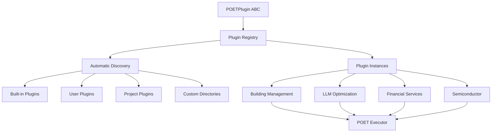

# POET Plugin Architecture Documentation

## Overview

The POET plugin system provides a robust, extensible architecture for adding domain-specific intelligence to the POET (Perceive → Operate → Enforce → Train) framework. Plugins enhance each stage of the POET pipeline with specialized knowledge and capabilities.

## Architecture Design

### Core Components



### Plugin Interface (Abstract Base Class)

All POET plugins must inherit from `POETPlugin` and implement the required interface:

```python
from abc import ABC, abstractmethod
from typing import Any, Dict, Tuple

class POETPlugin(ABC):
    """Base interface for all POET plugins"""
    
    @abstractmethod
    def get_plugin_name(self) -> str:
        """Return unique plugin identifier"""
        pass
    
    @abstractmethod
    def process_inputs(self, args: Tuple, kwargs: Dict) -> Dict[str, Any]:
        """Perceive stage: Process and optimize inputs"""
        pass
    
    @abstractmethod
    def validate_output(self, result: Any, context: Dict[str, Any]) -> Any:
        """Enforce stage: Validate and enhance outputs"""
        pass
    
    # Optional methods with default implementations
    def get_performance_optimizations(self) -> Dict[str, Any]:
        """Operate stage: Performance optimization hints"""
        return {}
    
    def get_learning_hints(self, execution_context: Dict[str, Any]) -> Dict[str, Any]:
        """Train stage: Learning guidance"""
        return {}
    
    def cleanup(self):
        """Resource cleanup"""
        pass
```

## Plugin Discovery System

### Automatic Scanning

The plugin system automatically scans multiple directories for plugin files:

1. **Built-in plugins**: `opendxa/dana/poet/plugins/`
2. **User plugins**: `~/.opendxa/poet/plugins/`
3. **Project plugins**: `./.poet/plugins/`
4. **Custom directories**: Via `POET_PLUGIN_DIRS` environment variable

### Plugin File Naming Convention

Plugin files must follow the naming pattern: `*_plugin.py`

Examples:
- `building_management_plugin.py`
- `llm_optimization_plugin.py`
- `custom_domain_plugin.py`

### Plugin Class Discovery

Within each plugin file, the system automatically discovers classes that:
- Inherit from `POETPlugin`
- Are not the base `POETPlugin` class itself
- Are defined in the plugin module (not imported)

## Plugin Implementation Guide

### Creating a New Plugin

#### Step 1: Create Plugin File

Create a file named `your_domain_plugin.py` in an appropriate plugin directory:

```python
"""
Your Domain Plugin for POET

Brief description of what this plugin does.

Author: Your Name
Version: 1.0.0
"""

from typing import Any, Dict, Tuple
from opendxa.dana.poet.plugins import POETPlugin

class YourDomainPlugin(POETPlugin):
    """Plugin for your specific domain."""
    
    __version__ = "1.0.0"
    __author__ = "Your Name"
    
    def __init__(self):
        # Initialize plugin-specific state
        self.domain_data = {}
        self.config = {}
    
    def get_plugin_name(self) -> str:
        """Return unique plugin identifier."""
        return "your_domain"
    
    def process_inputs(self, args: Tuple, kwargs: Dict) -> Dict[str, Any]:
        """Process inputs with domain-specific logic."""
        # Your perceive stage logic here
        processed_args = args  # Apply your transformations
        processed_kwargs = kwargs  # Apply your transformations
        
        return {
            "args": processed_args,
            "kwargs": processed_kwargs
        }
    
    def validate_output(self, result: Any, context: Dict[str, Any]) -> Any:
        """Validate output with domain-specific checks."""
        # Your enforce stage logic here
        if not self._is_valid_result(result):
            raise ValueError("Domain-specific validation failed")
        
        return self._enhance_result(result, context)
    
    # Optional: Performance optimizations
    def get_performance_optimizations(self) -> Dict[str, Any]:
        return {
            "timeout_multiplier": 1.5,
            "retry_strategy": "exponential",
            "cache_enabled": True,
        }
    
    # Optional: Learning guidance
    def get_learning_hints(self, execution_context: Dict[str, Any]) -> Dict[str, Any]:
        return {
            "parameter_bounds": {"timeout": (10.0, 120.0)},
            "learning_rate": 0.05,
            "convergence_threshold": 0.01,
        }
    
    # Helper methods
    def _is_valid_result(self, result: Any) -> bool:
        # Domain-specific validation logic
        return True
    
    def _enhance_result(self, result: Any, context: Dict[str, Any]) -> Any:
        # Domain-specific enhancement logic
        return result
```

#### Step 2: Plugin Usage

Once created, the plugin is automatically discovered and can be used:

```python
from opendxa.dana.poet import poet

# Use your plugin with the @poet decorator
@poet(domain="your_domain", enable_training=True)
def your_function(input_data):
    # Your business logic
    return process_data(input_data)
```

### Stage-Specific Implementation Details

#### Perceive Stage (`process_inputs`)

This method is called before function execution to apply domain-specific input processing:

```python
def process_inputs(self, args: Tuple, kwargs: Dict) -> Dict[str, Any]:
    """
    Transform inputs with domain intelligence.
    
    Common tasks:
    - Input validation and normalization
    - Default value application
    - Domain-specific preprocessing
    - Context enrichment
    
    Args:
        args: Original function positional arguments
        kwargs: Original function keyword arguments
    
    Returns:
        Dict with keys:
        - "args": Tuple of processed positional arguments
        - "kwargs": Dict of processed keyword arguments
    """
    # Example: Financial services input normalization
    if len(args) >= 4:
        credit_score, income, debt_ratio, employment = args[:4]
        
        # Normalize different credit score formats
        normalized_score = self._normalize_credit_score(credit_score)
        normalized_income = self._normalize_currency(income)
        
        return {
            "args": (normalized_score, normalized_income, debt_ratio, employment),
            "kwargs": kwargs
        }
    
    return {"args": args, "kwargs": kwargs}
```

#### Enforce Stage (`validate_output`)

This method is called after function execution to validate and enhance outputs:

```python
def validate_output(self, result: Any, context: Dict[str, Any]) -> Any:
    """
    Validate and enhance outputs with domain logic.
    
    Common tasks:
    - Output format validation
    - Range and constraint checking
    - Compliance verification
    - Post-processing enhancement
    
    Args:
        result: Original function result
        context: Execution context including inputs
    
    Returns:
        Validated and potentially enhanced result
    
    Raises:
        ValueError: If validation fails
    """
    # Example: HVAC safety validation
    if hasattr(result, 'heating_output') and hasattr(result, 'cooling_output'):
        # Safety check: prevent simultaneous heating and cooling
        if result.heating_output > 10 and result.cooling_output > 10:
            raise ValueError("Safety violation: Cannot heat and cool simultaneously")
    
    # Example: Financial compliance
    if hasattr(result, 'approved') and result.approved:
        if not hasattr(result, 'interest_rate') or result.interest_rate is None:
            raise ValueError("Compliance error: Approved loans must specify interest rate")
    
    return result
```

#### Optional: Operate Stage (`get_performance_optimizations`)

Provide hints for performance optimization:

```python
def get_performance_optimizations(self) -> Dict[str, Any]:
    """
    Provide domain-specific performance optimization hints.
    
    Returns:
        Dict with optimization suggestions:
        - timeout_multiplier: float (default: 1.0)
        - retry_strategy: "exponential", "linear", "custom"
        - cache_enabled: bool (default: False)
        - batch_size: int (for batch operations)
    """
    return {
        "timeout_multiplier": 2.0,  # LLM operations take longer
        "retry_strategy": "exponential",
        "cache_enabled": True,  # Cache prompt responses
        "batch_size": 1,  # Process individually
    }
```

#### Optional: Train Stage (`get_learning_hints`)

Provide guidance for parameter learning:

```python
def get_learning_hints(self, execution_context: Dict[str, Any]) -> Dict[str, Any]:
    """
    Provide domain-specific learning guidance.
    
    Args:
        execution_context: Context from execution including metrics
    
    Returns:
        Dict with learning hints:
        - parameter_bounds: Dict[str, Tuple[float, float]]
        - learning_rate: float
        - convergence_threshold: float
        - performance_weight: float
    """
    return {
        "parameter_bounds": {
            "timeout": (5.0, 300.0),  # Domain-appropriate timeout range
            "temperature_tolerance": (0.5, 5.0),  # HVAC-specific parameter
        },
        "learning_rate": 0.02,  # Conservative for safety-critical systems
        "convergence_threshold": 0.05,
        "performance_weight": 0.9,  # Prioritize safety over speed
    }
```

## Plugin Management

### Registry Operations

```python
from opendxa.dana.poet.plugins import PLUGIN_REGISTRY

# List all available plugins
plugins = PLUGIN_REGISTRY.list_plugins()
print(f"Available plugins: {plugins}")

# Get plugin instance
building_plugin = PLUGIN_REGISTRY.get_plugin("building_management")

# Get plugin information
info = PLUGIN_REGISTRY.get_plugin_info("building_management")
print(f"Plugin info: {info}")

# Add custom plugin directory
PLUGIN_REGISTRY.add_plugin_directory("/path/to/custom/plugins")

# Force re-discovery
count = PLUGIN_REGISTRY.discover_plugins()
print(f"Discovered {count} plugins")
```

### Manual Plugin Registration

```python
from opendxa.dana.poet.plugins import register_plugin

# Register a plugin class directly
success = register_plugin(MyCustomPlugin)
if success:
    print("Plugin registered successfully")
```

### Environment Configuration

Set the `POET_PLUGIN_DIRS` environment variable to specify additional plugin directories:

```bash
export POET_PLUGIN_DIRS="/opt/company/plugins:/home/user/my_plugins"
```

## Built-in Plugins

### Building Management Plugin (`building_management`)

**Domain**: HVAC and building management systems
**Capabilities**:
- Temperature validation and normalization
- Energy-saving setpoint optimization
- Equipment protection (prevents simultaneous heating/cooling)
- Occupancy-based energy optimization

**Usage**:
```python
@poet(domain="building_management")
def control_hvac_zone(current_temp, setpoint, occupancy, outdoor_temp):
    # Your HVAC control logic
    return HVACCommand(heating=30, cooling=0, fan=50, status="Heating")
```

### LLM Optimization Plugin (`llm_optimization`)

**Domain**: Large Language Model operations
**Capabilities**:
- Prompt optimization and enhancement
- Response validation and quality checks
- Timeout optimization for LLM calls

**Usage**:
```python
@poet(domain="llm_optimization")
def analyze_document(prompt):
    # Your LLM reasoning logic
    return llm_response
```

### Financial Services Plugin (`financial_services`)

**Domain**: Financial and credit analysis
**Capabilities**:
- Credit score normalization
- Currency and income formatting
- Compliance validation
- Audit trail generation

### Semiconductor Plugin (`semiconductor`)

**Domain**: Semiconductor manufacturing
**Capabilities**:
- Process parameter validation
- Equipment safety interlocks
- Root cause analysis enhancement

## Best Practices

### Plugin Development Guidelines

1. **Single Responsibility**: Each plugin should focus on one domain
2. **Error Handling**: Always provide graceful degradation
3. **Documentation**: Include comprehensive docstrings
4. **Versioning**: Use semantic versioning in `__version__`
5. **Testing**: Create unit tests for your plugin
6. **Resource Management**: Implement `cleanup()` for resources

### Performance Considerations

1. **Lazy Loading**: Plugins are instantiated only when needed
2. **Caching**: Use caching for expensive operations
3. **Validation Speed**: Keep validation logic efficient
4. **Memory Usage**: Clean up resources in `cleanup()`

### Security Considerations

1. **Input Validation**: Always validate inputs in `process_inputs`
2. **Output Sanitization**: Sanitize outputs in `validate_output`
3. **Resource Limits**: Implement appropriate bounds and limits
4. **Error Information**: Don't leak sensitive data in error messages

## Testing Plugins

### Unit Testing Example

```python
import pytest
from your_plugin import YourDomainPlugin

class TestYourDomainPlugin:
    def setup_method(self):
        self.plugin = YourDomainPlugin()
    
    def test_plugin_name(self):
        assert self.plugin.get_plugin_name() == "your_domain"
    
    def test_process_inputs(self):
        args = (1, 2, 3)
        kwargs = {"key": "value"}
        result = self.plugin.process_inputs(args, kwargs)
        
        assert "args" in result
        assert "kwargs" in result
        assert isinstance(result["args"], tuple)
        assert isinstance(result["kwargs"], dict)
    
    def test_validate_output_success(self):
        result = {"valid": True}
        context = {"execution_time": 1.0}
        validated = self.plugin.validate_output(result, context)
        assert validated == result
    
    def test_validate_output_failure(self):
        result = {"invalid": True}
        context = {"execution_time": 1.0}
        
        with pytest.raises(ValueError):
            self.plugin.validate_output(result, context)
    
    def teardown_method(self):
        self.plugin.cleanup()
```

### Integration Testing

```python
from opendxa.dana.poet import poet

def test_plugin_integration():
    @poet(domain="your_domain")
    def test_function(data):
        return {"processed": data}
    
    result = test_function("test_input")
    assert result["processed"] == "test_input"
```

## Troubleshooting

### Common Issues

1. **Plugin Not Found**
   - Check plugin file naming (`*_plugin.py`)
   - Verify plugin directory is in search path
   - Ensure plugin class inherits from `POETPlugin`

2. **Import Errors**
   - Check import statements in plugin file
   - Verify dependencies are installed
   - Check Python path configuration

3. **Plugin Registration Failures**
   - Ensure plugin implements required abstract methods
   - Check for syntax errors in plugin file
   - Verify plugin class naming conventions

### Debugging Plugin Discovery

```python
from opendxa.dana.poet.plugins import PLUGIN_REGISTRY

# Enable debug logging
import logging
logging.basicConfig(level=logging.DEBUG)

# Force discovery with detailed output
count = PLUGIN_REGISTRY.discover_plugins()

# Check discovered plugins
plugins = PLUGIN_REGISTRY.list_plugins()
print(f"Discovered {count} plugins: {plugins}")

# Check plugin directories
registry = PLUGIN_REGISTRY
print(f"Plugin directories: {registry._plugin_directories}")
```

## Migration from Legacy System

### Updating Existing Code

If you have existing domain plugins in the old `domains/` directory:

1. **Move files**: Rename from `domain_name.py` to `domain_name_plugin.py`
2. **Update imports**: Change from `domains` to `plugins`
3. **Add inheritance**: Make plugin class inherit from `POETPlugin`
4. **Implement interface**: Add required `get_plugin_name()` method
5. **Update method signatures**: Ensure compatibility with new interface

### Backward Compatibility

The new plugin system is designed to be backward compatible. Existing domain configurations will continue to work, but we recommend migrating to the new system for enhanced features and better maintainability.

## Advanced Features

### Custom Plugin Directories

```python
from opendxa.dana.poet.plugins import add_plugin_directory

# Add company-specific plugin directory
add_plugin_directory("/opt/company/poet/plugins")

# Add user-specific plugins
add_plugin_directory("~/my_poet_plugins")
```

### Plugin Information and Metadata

```python
from opendxa.dana.poet.plugins import get_plugin

plugin = get_plugin("building_management")
info = plugin.get_plugin_info()

print(f"Plugin: {info['name']}")
print(f"Version: {info['version']}")
print(f"Author: {info['author']}")
print(f"Capabilities: {info['capabilities']}")
```

### Plugin Lifecycle Management

```python
from opendxa.dana.poet.plugins import PLUGIN_REGISTRY

# Cleanup all plugins when shutting down
PLUGIN_REGISTRY.cleanup_all()
```

This documentation provides a comprehensive guide to the POET plugin architecture, enabling developers to create powerful, domain-specific enhancements to the POET framework. 