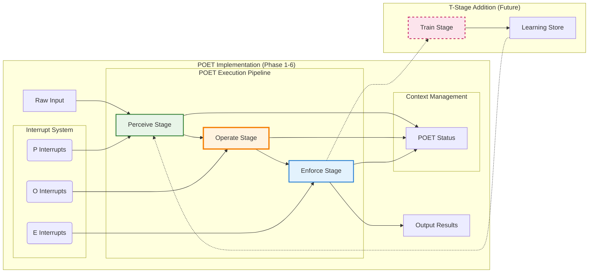

**Author:** Dana Language Team  
**Date:** 2023-12-01  
**Version:** 2.0.0  
**Status:** Deprecated

# POET Architecture Implementation Design

## Overview

This document outlines the implementation architecture for POET (Perceive → Operate → Enforce → Train) in opendxa. POET provides a structured execution framework that combines fault-tolerant processing with adaptive learning capabilities through **~80% generalizable intelligence** and **~20% domain-specific specialization**.

### Intelligence Architecture Philosophy

POET's effectiveness comes from this intelligent distribution:

- **80% Generalizable Core**: Error handling, retry logic, performance optimization, basic learning algorithms, and execution patterns that work across all domains and use cases
- **20% Domain-Specific Intelligence**: Industry compliance rules, domain validation patterns, specialized optimization strategies, and business logic templates
- **AI-Generated Extensions**: Custom plugins automatically generated for unique enterprise requirements that don't fit standard patterns

This architecture allows engineers to write minimal business logic while POET provides enterprise-grade capabilities through automated intelligence selection and application.

## Core Architecture

### POET Pipeline Flow



## POET-First Implementation Strategy

**Divide & Conquer Approach**: Implement POET (Perceive-Operate-Enforce) as a complete, production-ready system first, then add T (Train) as an enhancement.

### Why POE First?

1. **Immediate Value**: POET provides 80% of POET benefits with 50% of complexity
2. **KISS/YAGNI Compliance**: Simpler 3-stage pipeline vs 4-stage
3. **Production Focus**: Rule-based intelligence is more predictable than learning
4. **Foundation Building**: POET provides solid foundation for future T-stage addition

### POET Value Proposition

- **Reliability**: Automatic retry logic, error handling, timeout management
- **Intelligence**: Domain-specific input optimization and output validation  
- **Compliance**: Industry-specific validation rules and audit trails
- **Performance**: Sub-8ms overhead with <30MB memory footprint

## Implementation Components

### 1. POET Decorator System

#### Intelligence Selection and Application
The POET decorator automatically selects and applies the optimal combination of:
- **Generalizable intelligence** (core POET capabilities)
- **Domain-specific intelligence** (built-in or configured plugins)
- **AI-generated intelligence** (custom plugins for unique needs)

#### Core Decorator Interface
```python
# opendxa/common/mixins/poet_decorator.py
from typing import Optional, Callable, Any, Dict, Union
from dataclasses import dataclass
from enum import Enum

class LearningMode(Enum):
    OFF = "off"
    ONLINE = "on"
    BATCH = "batch"
    HYBRID = "hybrid"

class InterruptMode(Enum):
    OFF = "off"
    AUTO = "auto"
    ON = "on"
    ON_ERROR = "on_error"
    ON_CRITICAL = "on_critical"

@dataclass
class POETConfig:
    """Configuration for POET execution with intelligence distribution"""
    
    # Generalizable Intelligence (80% - core capabilities)
    retries: int = 3
    learning: LearningMode = LearningMode.ONLINE
    interrupts: InterruptMode = InterruptMode.AUTO
    timeout: Optional[float] = None
    priority: str = "normal"
    safety_critical: bool = False
    audit_trail: bool = False
    context_window: int = 4096
    
    # Domain-Specific Intelligence (20% - specialized capabilities)
    domain: Optional[str] = None              # Built-in domain plugin selection
    plugin_config: Optional[str] = None       # Custom plugin configuration
    plugins: Optional[list] = None            # Multiple plugin composition
    
    # AI-Generated Intelligence (unique customization)
    custom_plugin: Optional[Callable] = None  # AI-generated plugin
    perceive_handler: Optional[Callable] = None
    enforce_handler: Optional[Callable] = None
    train_handler: Optional[Callable] = None

def poet(
    # Generalizable Intelligence (80% - works everywhere)
    retries: int = 3,
    learning: Union[str, LearningMode] = "on",
    interrupts: Union[str, InterruptMode] = "auto",
    timeout: Optional[float] = None,
    priority: str = "normal",
    
    # Domain-Specific Intelligence (20% - industry specialization)
    domain: Optional[str] = None,
    plugin_config: Optional[str] = None,
    plugins: Optional[list] = None,
    
    # AI-Generated Intelligence (unique customization)
    custom_plugin: Optional[Callable] = None,
    perceive_handler: Optional[Callable] = None,
    enforce_handler: Optional[Callable] = None,
    train_handler: Optional[Callable] = None,
    
    **kwargs
) -> Callable:
    """
    POET decorator that wraps functions with intelligent execution pipeline
    
    Args:
        retries: Maximum retry attempts for failed executions
        learning: Learning mode - "on", "off", "batch", "hybrid"
        interrupts: Interrupt handling - "on", "off", "auto", "on_error"
        perceive_handler: Custom function for Perceive stage
        enforce_handler: Custom function for Enforce stage  
        train_handler: Custom function for Train stage
        timeout: Maximum execution time in seconds
        priority: Execution priority - "low", "normal", "high", "critical"
    
    Returns:
        Decorated function with POET execution capabilities
    """
    def decorator(func: Callable) -> Callable:
        config = POETConfig(
            retries=retries,
            learning=LearningMode(learning) if isinstance(learning, str) else learning,
            interrupts=InterruptMode(interrupts) if isinstance(interrupts, str) else interrupts,
            perceive_handler=perceive_handler,
            enforce_handler=enforce_handler,
            train_handler=train_handler,
            timeout=timeout,
            priority=priority,
            **kwargs
        )
        
        return POETExecutor(func, config)
    return decorator
```

### 2. POET Executor

#### Main Execution Engine
```python
# opendxa/common/poet/executor.py
import asyncio
import uuid
from datetime import datetime
from typing import Any, Dict, Optional

class POETStatus:
    """Runtime context for POET execution"""
    def __init__(self, config: POETConfig, function_name: str):
        self.execution_id = str(uuid.uuid4())
        self.function_name = function_name
        self.config = config
        self.attempt = 0
        self.max_retries = config.retries
        self.start_time = datetime.now()
        self.last_internal_failure = None
        self.is_internally_validated = False
        self.perceived_input = None
        self.raw_output = None
        self.validated_output = None
        self.expected_output_type = None
        self.learnings_applied = {}
        self.interrupt_signals = []

class POETExecutor:
    """Main POET execution engine"""
    
    def __init__(self, operate_function: Callable, config: POETConfig):
        self.operate_function = operate_function
        self.config = config
        self.learning_store = LearningStore()
        self.interrupt_manager = InterruptManager()
        
    def __call__(self, *args, **kwargs) -> Any:
        """Execute function with POET pipeline"""
        poet_status = POETStatus(self.config, self.operate_function.__name__)
        
        try:
            return self._execute_pipeline(args, kwargs, poet_status)
        except Exception as e:
            if self.config.audit_trail:
                self._log_execution_failure(poet_status, e)
            raise POETExecutionError(str(e), poet_status) from e
    
    def _execute_pipeline(self, args, kwargs, poet_status: POETStatus) -> Any:
        """Main POET pipeline execution"""
        
        # Perceive Stage
        perceived_input = self._perceive_stage(args, kwargs, poet_status)
        poet_status.perceived_input = perceived_input
        
        # Operate + Enforce loop (with retries)
        for attempt in range(self.config.retries + 1):
            poet_status.attempt = attempt + 1
            
            try:
                # Check for interrupts
                self._check_interrupts(poet_status, "operate")
                
                # Operate Stage
                raw_output = self._operate_stage(perceived_input, poet_status)
                poet_status.raw_output = raw_output
                
                # Check for interrupts
                self._check_interrupts(poet_status, "enforce")
                
                # Enforce Stage (includes validation)
                validated_output, is_valid = self._enforce_stage(raw_output, poet_status)
                
                if is_valid:
                    poet_status.is_internally_validated = True
                    poet_status.validated_output = validated_output
                    
                    # Train Stage (async)
                    if self.config.learning != LearningMode.OFF:
                        self._schedule_train_stage(poet_status)
                    
                    return validated_output
                    
            except InterruptSignal as interrupt:
                # Handle interrupt and potentially retry
                handled_output = self._handle_interrupt(interrupt, poet_status)
                if handled_output is not None:
                    return handled_output
                    
            except Exception as e:
                poet_status.last_internal_failure = str(e)
                if attempt == self.config.retries:
                    raise
                    
        # Max retries exceeded
        raise POETExecutionError(
            f"Max retries ({self.config.retries}) exceeded. Last failure: {poet_status.last_internal_failure}",
            poet_status
        )
```

### 3. Stage Implementations

#### Perceive Stage
```python
# opendxa/common/poet/stages/perceive.py
class PerceiveStage:
    """Perceive stage - fault-tolerant input processing"""
    
    def __init__(self, learning_store: LearningStore):
        self.learning_store = learning_store
        self.context_analyzer = CodeContextAnalyzer()
    
    def execute(self, args, kwargs, poet_status: POETStatus) -> Any:
        """Execute perceive stage with context enrichment"""
        
        # Custom perceive handler if provided
        if poet_status.config.perceive_handler:
            return self._execute_custom_handler(args, kwargs, poet_status)
        
        # Default perceive logic
        return self._default_perceive(args, kwargs, poet_status)
    
    def _default_perceive(self, args, kwargs, poet_status: POETStatus) -> Dict[str, Any]:
        """Default perceive implementation"""
        
        # Extract context from code analysis
        code_context = self.context_analyzer.analyze(
            function_name=poet_status.function_name,
            call_site_info=self._extract_call_site_info()
        )
        
        # Get relevant learnings from previous executions
        learnings = self.learning_store.get_relevant_learnings(
            function_name=poet_status.function_name,
            input_signature=self._create_input_signature(args, kwargs),
            context=code_context
        )
        
        # Apply learnings to input processing
        processed_input = self._apply_learnings(args, kwargs, learnings)
        
        # Store applied learnings for training feedback
        poet_status.learnings_applied = learnings
        
        # Infer expected output type from context
        poet_status.expected_output_type = code_context.get("expected_output_type")
        
        return {
            "original_args": args,
            "original_kwargs": kwargs,
            "processed_input": processed_input,
            "code_context": code_context,
            "applied_learnings": learnings
        }
```

#### Enforce Stage  
```python
# opendxa/common/poet/stages/enforce.py
class EnforceStage:
    """Enforce stage - validation and output formatting"""
    
    def execute(self, raw_output: Any, poet_status: POETStatus) -> tuple[Any, bool]:
        """Execute enforce stage with validation"""
        
        # Custom enforce handler if provided
        if poet_status.config.enforce_handler:
            return self._execute_custom_handler(raw_output, poet_status)
        
        # Default enforce logic
        return self._default_enforce(raw_output, poet_status)
    
    def _default_enforce(self, raw_output: Any, poet_status: POETStatus) -> tuple[Any, bool]:
        """Default enforce implementation with type validation"""
        
        # Type validation
        if poet_status.expected_output_type:
            is_type_valid = self._validate_output_type(
                raw_output, 
                poet_status.expected_output_type
            )
            if not is_type_valid:
                poet_status.last_internal_failure = f"Type validation failed: expected {poet_status.expected_output_type}, got {type(raw_output)}"
                return None, False
        
        # Content validation
        is_content_valid = self._validate_output_content(raw_output, poet_status)
        if not is_content_valid:
            return None, False
        
        # Format output
        formatted_output = self._format_output(raw_output, poet_status)
        
        return formatted_output, True
```

### 4. Interrupt System

#### Interrupt Management
```python
# opendxa/common/poet/interrupts.py
class InterruptManager:
    """Manages interrupt-driven feedback at all POET stages"""
    
    def __init__(self):
        self.interrupt_handlers = {}
        self.pending_interrupts = {}
    
    def register_interrupt_handler(self, stage: str, handler: Callable):
        """Register handler for specific stage interrupts"""
        self.interrupt_handlers[stage] = handler
    
    def check_for_interrupts(self, poet_status: POETStatus, stage: str) -> Optional[InterruptSignal]:
        """Check for pending interrupts at current stage"""
        
        if poet_status.config.interrupts == InterruptMode.OFF:
            return None
            
        execution_id = poet_status.execution_id
        
        # Check for user interrupts
        if execution_id in self.pending_interrupts:
            interrupt = self.pending_interrupts.pop(execution_id)
            if interrupt.target_stage == stage:
                return interrupt
        
        # Auto-interrupt conditions
        if poet_status.config.interrupts == InterruptMode.AUTO:
            return self._check_auto_interrupt_conditions(poet_status, stage)
        
        return None

class InterruptSignal:
    """Signal for interrupt-driven feedback"""
    def __init__(self, 
                 execution_id: str, 
                 target_stage: str, 
                 feedback_type: str, 
                 feedback_data: Dict[str, Any]):
        self.execution_id = execution_id
        self.target_stage = target_stage  # "perceive", "operate", "enforce"
        self.feedback_type = feedback_type  # "correction", "guidance", "override"
        self.feedback_data = feedback_data
        self.timestamp = datetime.now()
```

## Integration Points

### 1. Dana Language Integration
```python
# Integration with Dana's function system
# dana/sandbox/interpreter/functions/poet_function.py

class POETFunction(DanaFunction):
    """Dana function enhanced with POET capabilities"""
    
    def __init__(self, dana_function: DanaFunction, poet_config: POETConfig):
        super().__init__(dana_function.name, dana_function.args)
        self.dana_function = dana_function
        self.poet_executor = POETExecutor(dana_function.execute, poet_config)
    
    def execute(self, args, context):
        """Execute Dana function through POET pipeline"""
        return self.poet_executor(args, context)
```

### 2. Existing Resource Integration
```python
# Integration with LLM resources
# opendxa/common/resource/llm_resource.py (enhanced)

class LLMResource(BaseResource):
    @poet(
        learning="on",
        perceive_handler="llm_prompt_optimizer",
        enforce_handler="llm_output_validator",
        train_handler="llm_performance_learner"
    )
    def generate(self, prompt: str, **kwargs) -> str:
        """Generate text with POET-enhanced reliability and learning"""
        return self._call_llm_api(prompt, **kwargs)
```

## Configuration and Profiles

### Profile System
```python
# opendxa/common/poet/profiles.py
POET_PROFILES = {
    "development": POETConfig(
        retries=1,
        learning=LearningMode.OFF,
        interrupts=InterruptMode.ON,
        timeout=30.0
    ),
    "production": POETConfig(
        retries=3,
        learning=LearningMode.ONLINE,
        interrupts=InterruptMode.AUTO,
        audit_trail=True
    ),
    "research": POETConfig(
        retries=5,
        learning=LearningMode.HYBRID,
        interrupts=InterruptMode.ON,
        audit_trail=True,
        timeout=None  # No timeout for research
    ),
    "realtime": POETConfig(
        retries=1,
        learning=LearningMode.ONLINE,
        interrupts=InterruptMode.OFF,
        timeout=5.0
    )
}

@poet(profile="production")
def my_function():
    pass
```

## Error Handling and Observability

### Exception Types
```python
# opendxa/common/poet/exceptions.py
class POETException(Exception):
    """Base exception for POET-related errors"""
    def __init__(self, message: str, poet_status: Optional[POETStatus] = None):
        super().__init__(message)
        self.poet_status = poet_status

class POETExecutionError(POETException):
    """Error during POET execution pipeline"""
    pass

class POETValidationError(POETException):
    """Error during encode/validation stage"""
    pass

class POETInterruptError(POETException):
    """Error handling interrupt signal"""
    pass
```

### Logging and Monitoring
```python
# Integration with opendxa logging system
class POETLogger:
    """Specialized logging for POET operations"""
    
    def log_execution_start(self, poet_status: POETStatus):
        """Log start of POET execution"""
        pass
    
    def log_stage_completion(self, stage: str, poet_status: POETStatus, duration: float):
        """Log completion of individual stage"""
        pass
    
    def log_learning_update(self, function_name: str, parameter_updates: Dict):
        """Log parameter updates from learning"""
        pass
```

## Next Steps

1. **Learning System Implementation** - Detailed design in `02_poet_learning_systems.md`
2. **Integration Patterns** - Specific integration approaches in `03_poet_integration_patterns.md`
3. **Example Implementations** - Concrete examples in `examples/` directory
4. **Testing Framework** - Validation and testing strategies
5. **Performance Optimization** - Efficiency and scalability considerations

## Related Components

- **Learning Store**: Parameter storage and retrieval system
- **Context Analyzer**: Code analysis for enhanced perception
- **Interrupt System**: Human-in-the-loop feedback mechanism
- **Audit System**: Execution tracking for compliance and debugging

## Goals

### Primary Goals
- **Performance**: <10ms execution overhead per POET-enhanced function call
- **Memory Efficiency**: <50MB additional memory footprint for POET system
- **Scalability**: Support 1000+ concurrent POET-enhanced functions
- **Reliability**: 99.9% availability for POET pipeline execution
- **Modularity**: Clean separation between P-O-E-T stages for maintainability
- **Extensibility**: Architecture supports future enhancements without breaking changes

### Secondary Goals
- **Type Safety**: Full type hint coverage for all POET components
- **Testing**: >90% code coverage with comprehensive integration tests
- **Documentation**: All public APIs documented with examples
- **Monitoring**: Built-in metrics collection for performance analysis
- **Debugging**: Clear error messages and execution tracing capabilities

## Non-Goals

### Explicit Non-Goals
- **Not a Runtime Replacement**: POET enhances existing Python/Dana execution, doesn't replace it
- **Not a Database**: Parameter storage is optimized for retrieval, not complex queries
- **Not a Message Queue**: Inter-stage communication is synchronous within single execution
- **Not a Web Framework**: No HTTP endpoints or web-based configuration interfaces
- **Not a Distributed System**: Single-process architecture for MVP, no distributed coordination

### Scope Limitations
- **No Custom Execution Engines**: Uses standard Python execution model
- **No Cross-Process Communication**: All stages execute within same process
- **No Real-Time Guarantees**: Best-effort execution timing, not real-time system
- **No Multi-Language Support**: Python/Dana only, no FFI or language bridges