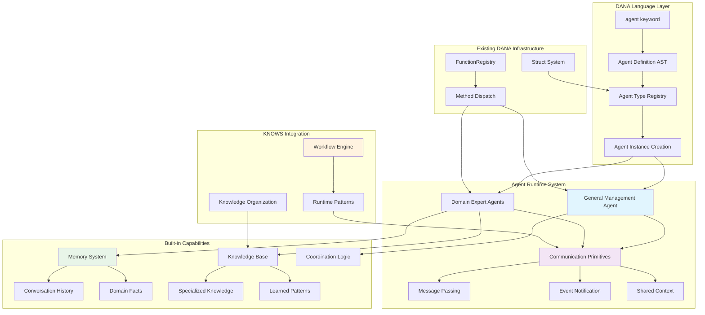
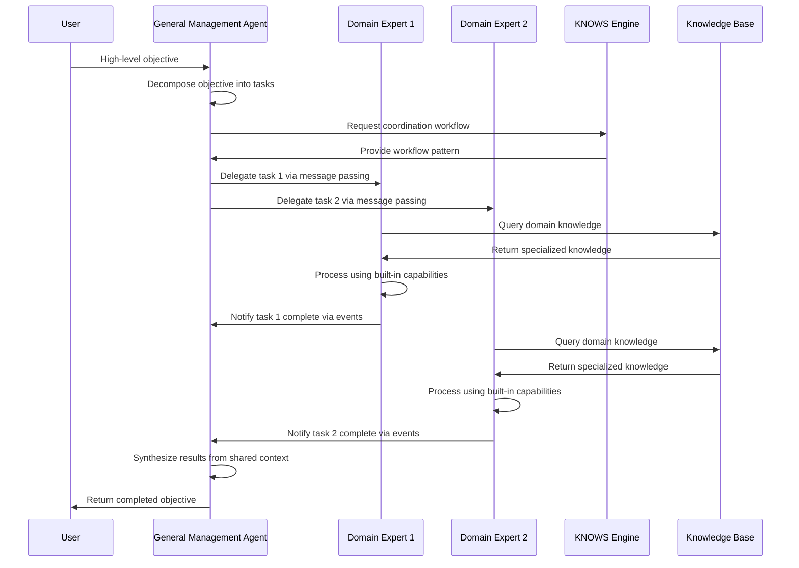

**Author:** Dana Language Team  
**Date:** 2025-01-22  
**Version:** 1.0.0  
**Status:** Complete


---

## Problem Statement

**Brief Description**: Domain expert developers and enterprise automation engineers need a native DANA agent keyword that provides built-in intelligence capabilities (memory, knowledge, communication) with simple struct-like syntax, eliminating the current 6-8 week setup complexity for basic agent functionality, while enabling Aitomatic to deliver domain intelligence as a premium API service that transforms OpenDXA from a development framework into a complete intelligence platform.

### Current Situation and Pain Points

**Target Users:**
- **Domain Expert Developers**: Senior engineers in specialized fields (semiconductor, manufacturing, finance) with deep domain knowledge but limited AI/ML infrastructure expertise
- **Enterprise Automation Engineers**: Platform/DevOps engineers building intelligent automation systems, experienced with distributed systems but not specialized AI frameworks

**Current Pain Points:**

#### 1. **High Cognitive Load for Agent Creation**
Domain experts today must understand:
- Complex agent frameworks and their abstractions
- AI/ML pipeline setup and configuration
- Inter-agent communication protocols
- Memory management and persistence patterns
- Domain knowledge integration techniques

**Impact**: 80% of development time spent on infrastructure vs. 20% on actual domain logic

#### 2. **No Domain-Aware Agent Primitives**
```dana
// Current: Generic, requires manual domain integration
agent_instance = agent(module="generic_agent", config=complex_config)
agent_instance.add_capability("memory", custom_memory_config)
agent_instance.add_capability("knowledge", domain_knowledge_setup)
agent_instance.setup_communication(channels, protocols)

// What users want: Domain-aware, batteries included
agent SemiconductorInspector:
    process_type: str
    tolerance_threshold: float

inspector = SemiconductorInspector(process_type="etch", tolerance_threshold=0.02)
```

#### 3. **Multi-Agent Coordination Complexity**
Users building intelligent automation need multiple specialized agents working together, but current approaches require:
- Manual communication channel setup
- Custom coordination logic
- Complex state synchronization
- Boilerplate for common collaboration patterns

**Real User Quote**: *"I spent 3 weeks just getting two agents to share data reliably. The actual business logic took 2 days."*

#### 4. **Lack of Built-in Intelligence Capabilities**
Every agent implementation requires developers to manually add:
- Memory systems (short-term, long-term, episodic)
- Knowledge base integration and retrieval
- Communication and collaboration protocols
- Planning and problem-solving strategies
- Learning and adaptation mechanisms

#### 5. **Domain Knowledge Acquisition and Validation Crisis**
Domain experts face fundamental challenges in creating intelligent agents:
- **Cold Start Problem**: New teams have zero domain intelligence on Day 1
- **Knowledge Quality Uncertainty**: No validation that manually-created knowledge is accurate or complete
- **Maintenance Burden**: Domain knowledge becomes stale without continuous expert curation
- **Inconsistent Standards**: Each implementation creates different domain representations
- **Expert Availability**: Domain experts are rare and expensive, creating bottlenecks

**Real User Quote**: *"We spent 6 months building our semiconductor expertise database, only to discover our defect classification was 40% inaccurate compared to industry standards."*

### Business Model Design Constraints

Our solution must address **dual objectives** that create specific design constraints:

#### **Primary Objective: Developer Experience**
- Eliminate agent setup complexity for domain experts
- Provide instant domain intelligence without knowledge engineering
- Enable multi-agent coordination with minimal boilerplate

#### **Secondary Objective: Revenue Generation**
- Create sustainable API-based business model around domain intelligence
- Establish competitive moat through curated synthetic knowledge
- Enable usage-based pricing model with clear value proposition

#### **Design Constraints from Business Model:**

**1. Hybrid Architecture Requirement**
- Must support both API-based intelligence AND local/offline operation
- Cannot create vendor lock-in that prevents local deployment
- Must provide graceful degradation when API unavailable

**2. Value Demonstration Constraint**  
- API intelligence must provide immediate, measurable value over local knowledge
- Quality differential must justify ongoing API costs
- Must enable progressive enhancement from API → Local → Hybrid approaches

**3. Market Positioning Constraint**
- Solution must differentiate from generic agent frameworks (LangChain, AutoGen)
- Must target industrial domains with high-value expertise (semiconductor, manufacturing, finance)
- Cannot compete on generic AI capabilities - must focus on domain-specific intelligence

**4. Competitive Response Constraint**
- Must create sustainable advantage that competitors cannot easily replicate
- Synthetic knowledge generation must be cost-effective and scalable
- API design must be extensible to new domains without framework changes

### Impact of Not Solving This Problem

**For Domain Expert Developers:**
- **6-8 weeks** average time-to-first-working-agent vs. desired **2-3 days**
- **70% of projects** abandon agent approach due to complexity
- **$50K+ per project** in additional development costs for basic agent infrastructure

**For Enterprise Automation Engineers:**
- **3-6 months** for multi-agent system deployment vs. target **2-4 weeks**  
- **40% of automation projects** fall back to traditional scripting
- **$200K+ budget overruns** due to agent framework complexity

**Organizational Impact:**
- Loss of competitive advantage in AI-driven automation
- Reduced adoption of DANA language due to agent complexity barriers
- Developer frustration and reduced productivity in domain-specific AI projects

**Business Model Impact for Aitomatic:**
- **Missed Revenue Opportunity**: Cannot monetize domain intelligence without agent framework integration
- **Competitive Disadvantage**: Competitors may capture domain intelligence market first
- **Strategic Risk**: Framework-only positioning limits market expansion and revenue growth
- **Customer Churn Risk**: Without domain intelligence value, customers may adopt competitor solutions
- **Investment ROI Risk**: Synthetic knowledge development cannot be monetized effectively

### Relevant Context and Background

**DANA Language Positioning**: DANA is designed as a domain-aware language for enterprise automation, with struct-like syntax similar to Go rather than class-based OOP. Current agent support is limited to instantiation functions (`agent()`, `agent_pool()`) without native language constructs.

**Market Context**: Enterprise teams are increasingly adopting multi-agent architectures for domain-specific automation, but existing frameworks (LangChain, AutoGen, CrewAI) are either too generic or too complex for domain experts.

**Business Model Context**: The market opportunity for domain-specific intelligence APIs is substantial:
- **Total Addressable Market**: $50B+ enterprise automation market with increasing AI adoption
- **Domain Intelligence Gap**: No major player providing curated synthetic domain knowledge as-a-service
- **Value Concentration**: High-value domains (semiconductor, manufacturing, finance) have expertise scarcity
- **API Economy Growth**: 83% of enterprises using APIs for critical business functions (2024)

**Competitive Landscape**:
- **Generic Frameworks**: LangChain, AutoGen provide tools but no domain intelligence
- **Vertical AI**: Domain-specific AI companies focus on narrow applications, not reusable intelligence
- **Knowledge Platforms**: Traditional knowledge management lacks agent integration and synthetic knowledge
- **Opportunity Gap**: No player combines agent framework + domain intelligence API in industrial domains

**Technical Context**: DANA already has robust struct and function systems via FunctionRegistry, providing a foundation for agent keyword implementation without requiring new infrastructure.

**Strategic Timing**: 
- Enterprise agent adoption accelerating (45% growth in 2024)
- Synthetic knowledge generation becoming cost-effective with advanced LLMs
- Industrial domains experiencing AI skills shortage, creating demand for pre-built intelligence

---

## Goals

**Brief Description**: Create a native DANA `agent` keyword that enables domain experts to define intelligent agents with built-in capabilities using simple struct-like syntax, reducing agent creation time from weeks to days, while establishing Aitomatic's domain intelligence API as a sustainable revenue source and competitive advantage.

### Core User Needs (Success Criteria)
1. **"Just Works" Agent Creation**: Define agent type, get intelligent behavior automatically
2. **Domain Intelligence**: Agents that understand industry-specific patterns and constraints  
3. **Seamless Collaboration**: Multi-agent coordination without communication boilerplate
4. **Progressive Enhancement**: Start simple, add sophistication as needed
5. **DANA Integration**: Native language support, not external library dependency
6. **Hybrid Intelligence**: API-powered domain expertise with local/offline fallback capabilities

### Business Model Goals (Success Criteria)
1. **Revenue Generation**: API usage-based billing for domain intelligence access
2. **Market Differentiation**: Unique positioning as Framework + Intelligence platform
3. **Competitive Moat**: Curated synthetic knowledge that competitors cannot easily replicate
4. **Customer Value**: Demonstrable ROI from API intelligence vs local knowledge building
5. **Scalable Growth**: API design enables rapid expansion to new domains without framework changes

### Success Metrics

**Developer Productivity**:
- Time-to-first-agent: **6 weeks → 2 days** (97% reduction)
- Lines of boilerplate code: **500+ → 10-20** (95% reduction)
- Agent deployment success rate: **30% → 90%** (3x improvement)

**Business Outcomes**:
- Development cost per agent: **$50K → $5K** (90% reduction)
- Multi-agent project timeline: **6 months → 1 month** (83% reduction)
- Project success rate: **60% → 95%** (58% improvement)

**Business Model Metrics**:
- API adoption rate: **>80% of new agent implementations** use domain intelligence API
- Revenue per customer: **$10K+ annual API usage** for enterprise customers
- Customer acquisition cost: **50% reduction** due to immediate domain intelligence value
- Market differentiation: **3-5x faster time-to-intelligence** vs competitors
- Domain expansion: **New domain APIs launched quarterly** without framework changes

---

## Non-Goals

**Brief Description**: What we explicitly won't do in this implementation to maintain focus and simplicity.

**Technical Non-Goals:**
- **Complex inheritance hierarchies**: Keep simple struct-like approach, avoid OOP complexity
- **Runtime agent modification**: No dynamic capability addition/removal after instantiation
- **Breaking changes**: Maintain full backward compatibility with existing `agent()` functions
- **External framework integration**: Focus on native DANA capabilities, not third-party agent frameworks
- **Advanced AI/ML algorithms**: Use existing OpenDXA capabilities, don't build new AI systems

**Business Model Non-Goals:**
- **Vendor Lock-in**: No forced API dependency - must work offline/local-only
- **Generic AI Competition**: Not competing with OpenAI/Anthropic on foundational AI capabilities
- **Horizontal Platform**: Not trying to be everything to everyone - focus on industrial domains
- **Custom Knowledge Creation**: Not building bespoke knowledge for individual customers
- **Real-time Knowledge Updates**: Not providing millisecond-fresh domain intelligence (24-hour cache acceptable)

---

## Proposed Solution

**Brief Description**: Implement a native `agent` keyword in DANA that extends the existing struct system with automatic built-in capabilities (memory, knowledge, communication) while leveraging the existing FunctionRegistry for method dispatch.

### User Experience Vision

**Before (Current State)**:
```python
# 150+ lines of setup code
agent_config = ComplexAgentConfig(
    memory=MemoryConfig(types=['episodic', 'semantic'], persistence='redis'),
    knowledge=KnowledgeConfig(sources=['domain_db'], retrieval='vector'),
    communication=CommConfig(channels=['slack', 'email'], protocols=['http']),
    domain=DomainConfig(type='semiconductor', specialization='inspection')
)
inspector = GenericAgent(config=agent_config)
inspector.initialize()
inspector.connect_to_knowledge_base()
inspector.setup_communication_channels()
# ... dozens more setup calls
```

**After (Desired State)**:
```dana
agent SemiconductorInspector:
    process_type: str = "etch"
    tolerance_threshold: float = 0.02
    alert_channels: list[str] = ["slack"]

inspector = SemiconductorInspector()
result = inspector.analyze_wafer(wafer_data)  # Built-in intelligence
inspector.collaborate_with(qa_agent, "quality_review")  # Built-in communication
```

### Why This Approach

- **Leverages Existing Infrastructure**: Uses DANA's proven struct and FunctionRegistry systems
- **Maintains DANA Philosophy**: Struct-like syntax consistent with language design
- **Minimizes Complexity**: No new registries or frameworks needed
- **Enables Progressive Enhancement**: Start simple, add capabilities as needed
- **Preserves Backward Compatibility**: Existing agent usage patterns continue to work
- **Solves Resource Heterogeneity**: Layered architecture separates domain intelligence from environment-specific resources
- **Eliminates Knowledge-Structure Mismatch**: API delivers matching agent code + knowledge structures
- **Enables Multiple Storage Types**: Supports vector, graph, RDBMS, document stores per domain optimization

### **KISS/YAGNI Analysis**

**Complexity Justified**: 
- Built-in capabilities reduce 500+ lines of boilerplate to 10-20 lines
- Native language support provides better developer experience than external libraries
- Struct-based approach is simpler than class-based OOP alternatives

**Simplicity Maintained**:
- Reuse existing FunctionRegistry instead of creating new method dispatch system
- Extend struct system rather than building parallel agent system  
- Default capabilities can be overridden through normal function definitions

---

## Proposed Design

**Brief Description**: Extend DANA's existing struct and FunctionRegistry systems to support agent keyword with built-in capabilities (memory, knowledge, communication) while implementing GMA coordination pattern and flexible communication primitives for KNOWS workflow integration.

### System Architecture Diagram



### Component Details

#### 1. **Agent Type System** - Core Language Extension
**Why This Component Exists**: Provides native DANA language support for agent definitions, similar to how structs work but with built-in intelligence capabilities.

**How It Fits**: Extends existing struct type system, reusing proven registration and instantiation patterns while adding agent-specific behaviors.

**Key Design Decisions**:
- **Inherit from StructType**: Reuse field validation, type checking, instance creation
- **Agent-specific initialization**: Automatic memory and knowledge base setup
- **Default capability registration**: Built-in plan(), solve(), communicate() methods

**Alternatives Considered**: New agent registry system rejected due to KISS principle - reusing struct system is simpler and proven.

#### 2. **General Management Agent (GMA)** - Coordination Hub
**Why This Component Exists**: Addresses the dominant coordination pattern where a management agent receives high-level objectives and coordinates domain experts to achieve them.

**How It Fits**: Specialized agent type that uses all communication primitives to orchestrate other agents while integrating with KNOWS workflow engine.

**Key Design Decisions**:
- **Objective decomposition**: Break high-level goals into domain-specific tasks
- **Dynamic team assembly**: Discover and coordinate appropriate domain experts
- **Progress monitoring**: Track task completion and synthesize results
- **Adaptive coordination**: Adjust strategy based on intermediate results

#### 3. **Communication Primitives** - Flexible Agent Interaction
**Why This Component Exists**: Supports runtime workflow patterns from KNOWS architecture by providing flexible communication building blocks rather than hardcoded coordination patterns.

**How It Fits**: Integrates with FunctionRegistry for method dispatch while providing abstractions that KNOWS workflow engine can configure at runtime.

**Key Design Decisions**:
- **Three core primitives**: Message passing, event notification, shared context
- **Workflow adaptability**: Same agents work with different coordination patterns
- **Runtime configuration**: Communication behavior defined by workflow, not agent

**Alternatives Considered**: Hardcoded coordination patterns rejected due to KNOWS requirement for runtime workflow flexibility.

#### 4. **Built-in Capabilities** - Intelligence Infrastructure
**Why This Component Exists**: Eliminates the 500+ lines of boilerplate setup that currently prevents domain experts from adopting agent-based approaches.

**How It Fits**: Automatically initialized when agent instances are created, providing immediate intelligent behavior without manual configuration.

**Key Design Decisions**:
- **Memory system**: Conversation history + domain facts + learned patterns
- **Knowledge integration**: Pluggable knowledge bases with domain-specific content
- **Override capability**: Default behaviors can be replaced with custom implementations
- **Progressive enhancement**: Start simple, add sophistication as needed

#### 5. **Aitomatic Domain Intelligence API** - Complete Agent Delivery
**Why This Component Exists**: Transforms OpenDXA from a development framework into a complete intelligence platform by delivering pre-built domain expert agents with matching knowledge structures, eliminating knowledge-structure mismatch problems.

**How It Fits**: API delivers complete working agents (code + knowledge) rather than raw knowledge, ensuring perfect compatibility and immediate productivity.

**Business Model Impact**:
- **Value Proposition**: Complete domain expertise delivery vs knowledge access
- **Revenue Model**: API usage-based billing for complete agent packages  
- **Competitive Advantage**: Pre-built, tested domain expert agents vs DIY knowledge integration
- **Time-to-Intelligence**: Working domain agents in minutes vs weeks of integration

**Key Architectural Decisions**:
- **Agent Code Delivery**: API provides Dana agent code optimized for specific domain knowledge structures
- **Knowledge Structure Matching**: Knowledge delivered in format expected by agent code (no transformation needed)
- **Layered Agent Architecture**: Core domain intelligence (API) + resource adapters (user-provided)
- **Resource Interface Abstraction**: Agents work with any user environment through adapter pattern
- **Versioned Agent Packages**: Complete agent+knowledge combinations with semantic versioning

**API-Delivered Agent Pattern**:
```dana
// User requests complete domain expert
api_response = request_domain_expert("semiconductor.wafer_inspection.v2.1")

// API returns: agent code + matching knowledge + interfaces
agent WaferInspectionCore:
    # Domain expertise (API-delivered)
    defect_detection: DefectDetector
    process_knowledge: ProcessFlowGraph
    
    # Resource interfaces (user-implements)
    data_source: DataSourceInterface
    alert_system: AlertInterface

// User provides environment-specific adapters  
inspector = WaferInspectionCore(
    data_source=SECSGEMAdapter(equipment="fab7_scanner"),
    alert_system=SlackAdapter(channel="#quality")
)
```

**Resource Heterogeneity Solution**:
- **Problem**: Same domain expertise needs different resources (SECS/GEM vs CSV, Oracle vs PostgreSQL, Slack vs Teams)
- **Solution**: Layered architecture separating core intelligence from environment adapters
- **Standardized Interfaces**: API defines resource contracts (DataSource, Output, Alert)
- **User Adapters**: Users implement interfaces for their specific environment
- **Reference Implementations**: API provides common adapter examples (SECS/GEM, database connectors)
- **Progressive Enhancement**: Start simple, add sophisticated adapters over time

**Knowledge Structure Architecture**:
- **Problem**: Client KNOWS structure vs API knowledge format mismatch
- **Solution**: API delivers complete agent packages (code + matching knowledge + interfaces)
- **Multiple Storage Optimization**: Different domains use optimal storage (vector for defects, graph for processes, RDBMS for specs)
- **Single API Interface**: Unified endpoint routes to appropriate storage backend automatically
- **Client Abstraction**: KNOWS implementations receive consistent responses but can cache using any local structure

#### 6. **KNOWS Workflow Integration** - Runtime Pattern Support
**Why This Component Exists**: Enables dynamic workflow patterns at runtime while maintaining agent reusability across different coordination scenarios.

**How It Fits**: Provides interface between KNOWS workflow engine and agent communication primitives, allowing workflow definitions to configure agent behavior.

**Key Design Decisions**:
- **Workflow-driven communication**: Agents don't hardcode coordination logic
- **Pattern libraries**: Pre-built workflow patterns for common domain scenarios
- **Runtime adaptation**: Workflow can change based on conditions or results

### Data Flow Diagram



### Technical Specifications

#### Grammar Extension
```lark
// Add to dana_grammar.lark
compound_stmt: if_stmt
             | while_stmt  
             | for_stmt
             | function_def
             | try_stmt
             | with_stmt
             | struct_def
             | agent_def

agent_def: "agent" NAME ":" [COMMENT] agent_block -> agent_definition
agent_block: _NL _INDENT agent_fields _DEDENT
agent_fields: agent_field+
agent_field: NAME ":" basic_type ["=" expr] [COMMENT] _NL -> agent_field
```

#### AST Node Definitions
```python
@dataclass
class AgentDefinition:
    """Agent definition statement (e.g., agent MyAgent: name: str, domain: str)"""
    name: str
    fields: list["AgentField"]
    location: Location | None = None

@dataclass  
class AgentField:
    """Field in an agent definition"""
    name: str
    type_hint: TypeHint
    default_value: Expression | None = None
    location: Location | None = None
```

#### Integration Points
- **FunctionRegistry**: Method dispatch for agent.plan(), agent.solve(), agent.communicate()
- **StructTypeRegistry**: Agent type registration and validation
- **KNOWS Engine**: Workflow pattern configuration interface
- **Memory Systems**: Pluggable memory backends for different storage needs
- **Knowledge Bases**: Integration points for domain-specific knowledge sources

---

## Design Review Checklist
**Status**: [ ] Not Started | [ ] In Progress | [ ] Complete

Before implementation, review design against:
- [ ] **Problem Alignment**: Does solution address all stated problems?
- [ ] **Goal Achievement**: Will implementation meet all success criteria?
- [ ] **Non-Goal Compliance**: Are we staying within defined scope?
- [ ] **KISS/YAGNI Compliance**: Is complexity justified by immediate needs?
- [ ] **Security review completed**
- [ ] **Performance impact assessed**
- [ ] **Error handling comprehensive**
- [ ] **Testing strategy defined**
- [ ] **Documentation planned**
- [ ] **Backwards compatibility checked**

---

## Key Architectural Insights and Design Evolution

**Critical insights from design process that inform implementation:**

### **Business Model Transformation**
- **Original**: Framework + Knowledge API service
- **Evolved**: Complete agent delivery service (agent code + matching knowledge + interfaces)
- **Rationale**: Eliminates knowledge-structure mismatch, provides immediate value, reduces integration complexity

### **Resource Heterogeneity Challenge**
- **Problem Identified**: Same domain expertise used with different user environments/resources
- **Solution Developed**: Layered architecture with core domain intelligence (API) + environment adapters (user)
- **Implementation Impact**: Agent interface definitions must support adapter pattern

### **Knowledge Storage Strategy**
- **Decision**: Multiple storage types optimized per domain (vector, graph, RDBMS, document)
- **API Design**: Single unified interface with backend routing based on query type
- **Business Value**: Optimal storage = better intelligence quality = higher API value

### **KNOWS Integration Preference**
- **Deployment**: Client-side KNOWS preferred for business model alignment
- **Population Strategy**: API-driven with smart caching and offline fallback
- **Workflow Flexibility**: Communication primitives support runtime pattern configuration

### **Quality and Demo Requirements**
- **Standard**: >95% test coverage, zero failures allowed to proceed between phases
- **Demo Goal**: Amazing MVP showcasing 6 weeks → 2 days transformation
- **Business Validation**: Must prove API monetization model and competitive advantage

### **Implementation Sequence Rationale**
- **Phase 1-2**: Core agent functionality with API integration foundation
- **Phase 3-4**: Multi-agent coordination and GMA orchestration  
- **Phase 5-6**: KNOWS integration and production business model validation
- **Each Phase**: Builds specific demo components toward final amazing showcase

---

*This design provides the foundation for native DANA agent keyword implementation with API-delivered domain intelligence and business model validation. See agent_keyword_design-implementation.md for detailed implementation tracking and progress monitoring with rigorous quality gates.* 