**Author:** Dana Language Team  
**Date:** 2023-12-01  
**Version:** 2.0.0  
**Status:** Deprecated


**POET (Perceive → Operate → Enforce → Train) Framework - Enhanced Training Evolution**  

## Architecture Enhancement Notice

🚀 **Enhanced POET** - The evolution of POET with transformative simulation and feedback capabilities **integrated into the Training stage**. The framework remains the familiar 4-stage POET architecture with dramatically enhanced learning capabilities. See **[09_poets_simulation_feedback_architecture.md](09_poets_simulation_feedback_architecture.md)** for complete implementation details.

## Document Navigation

This master document provides the complete 3D methodology design for POET/POETS. For detailed implementation specifics, see:

- **[01_poet_architecture.md](01_poet_architecture.md)** - Detailed architecture components and class designs
- **[02_poet_learning_systems.md](02_poet_learning_systems.md)** - Learning algorithms and parameter management
- **[03_poet_integration_patterns.md](03_poet_integration_patterns.md)** - Integration with existing opendxa systems
- **[04_poet_plugin_architecture.md](04_poet_plugin_architecture.md)** - Domain plugin system and extensibility
- **[05_poet_parameter_storage_and_sharing.md](05_poet_parameter_storage_and_sharing.md)** - Parameter persistence and sharing mechanisms
- **[06_poet_mvp_implementation_plan.md](06_poet_mvp_implementation_plan.md)** - Practical 8-week implementation roadmap
- **🆕 [09_poets_simulation_feedback_architecture.md](09_poets_simulation_feedback_architecture.md)** - **POETS simulation/feedback evolution**

---

## 1. PROBLEM STATEMENT & REQUIREMENTS

### 1.1 Problem Statement

Current AI-driven systems in enterprise environments suffer from four critical gaps:

1. **Reliability Gap**: AI functions fail unpredictably without proper error handling, retry mechanisms, or validation
2. **Intelligence Gap**: Engineers must manually implement domain-specific optimizations, compliance rules, and performance enhancements for each function
3. **Learning Gap**: Systems cannot automatically improve based on execution patterns, user feedback, or changing conditions
4. **🆕 Feedback Gap**: Learning is constrained by sparse real-world feedback, preventing safe testing and continuous improvement

This results in:
- **85% of AI functions** lacking proper error handling and reliability mechanisms
- **Hours of manual work** to add enterprise-grade capabilities to simple business logic
- **Inconsistent quality** across different teams and implementations
- **No systematic learning** from operational experience
- **🆕 60% slower time-to-production** due to limited development-phase learning
- **🆕 High deployment risk** from inability to safely test strategies before production

### 1.2 Business Goals

#### Primary Goals
- **Automatic Enhancement**: Transform "naive" business functions into enterprise-grade systems with minimal user code
- **Domain Intelligence**: Provide 80% generalizable + 20% domain-specific intelligence automatically
- **Reliability by Default**: Ensure 95%+ success rates through automatic retry, validation, and error handling
- **Learning Systems**: Continuously improve performance, accuracy, and efficiency through operational feedback

#### Secondary Goals
- **Developer Productivity**: Reduce time-to-production for AI functions by 60%+
- **Consistency**: Ensure uniform quality and capabilities across all enhanced functions
- **Observability**: Provide comprehensive monitoring and debugging capabilities
- **Extensibility**: Support custom domain plugins and AI-generated specializations

### 1.3 Success Criteria

#### Immediate Value Targets (MVP)
1. **Enhanced reason() function**: 25% faster, 20% cost reduction, 95% reliability
2. **Building management (Honeywell)**: 15% energy efficiency improvement, zero equipment damage
3. **Financial services**: 95% success with messy data (up from 70%), full audit compliance
4. **Semiconductor (RIE etching)**: 80% diagnosis accuracy (up from 60%), 50% faster troubleshooting

#### Long-term Success Metrics
- **Adoption**: 80% of new AI functions use POET within 6 months
- **Quality**: 95% user satisfaction with POET-enhanced functions
- **Performance**: <10ms overhead per function call, <50MB memory footprint
- **Learning**: Measurable improvements in function performance over time

#### 🆕 POETS Enhancement Targets
- **Development Acceleration**: 60% faster time-to-production through simulation-based learning
- **Risk Mitigation**: 90% reduction in deployment risk through safe testing
- **Learning Velocity**: 3x faster parameter convergence with hybrid feedback
- **Feedback Coverage**: 95% feedback availability vs. 30% real-world only

### 1.4 Non-Goals

#### Explicit Non-Goals
- **Not a replacement** for existing function logic - POET enhances, doesn't replace
- **Not a general ML platform** - focused specifically on function enhancement and reliability
- **Not a development framework** - works with existing opendxa architecture
- **Not a monitoring system** - provides hooks but doesn't replace comprehensive observability

#### Scope Limitations
- **No breaking changes** to existing Dana/opendxa interfaces
- **No complex ML training** - uses simple heuristic learning for MVP
- **No real-time streaming** - focuses on discrete function execution
- **No cross-language support** - Python/Dana only for initial implementation

---

## 2. DESIGN & ARCHITECTURE

### 2.1 Core Philosophy: 80/20 Intelligence Distribution

POET's revolutionary approach distributes intelligence across three layers:

```
┌─────────────────────────────────────────────────────────────┐
│                    AI-Generated Intelligence                │
│                    (Unique customizations)                  │
├─────────────────────────────────────────────────────────────┤
│              Domain-Specific Intelligence (20%)             │
│     • Financial compliance    • Building codes             │
│     • Manufacturing safety    • Medical regulations        │
│     • Industry best practices • Domain validation          │
├─────────────────────────────────────────────────────────────┤
│               Generalizable Intelligence (80%)              │
│     • Error handling & retries  • Performance optimization │
│     • Timeout management       • Parameter learning        │
│     • Input validation         • Output enforcement        │
│     • Execution monitoring     • Basic ML patterns         │
└─────────────────────────────────────────────────────────────┘
```

**Key Insight**: Most enterprise needs are common across domains, with specialized requirements forming a small but critical layer.

### 2.2 POET Execution Pipeline

> **📋 Detailed Architecture**: See [01_poet_architecture.md](01_poet_architecture.md) for complete technical architecture, class hierarchies, and detailed implementation specifications.

#### POET Four-Stage Pipeline with Enhanced Training

```mermaid
graph TD
    A["P: Perceive<br/>Input Processing"] --> B["O: Operate<br/>Function Execution"]
    B --> C["E: Enforce<br/>Output Validation"] 
    C --> D["T: Train (Enhanced)<br/>Adaptive Learning"]
    
    subgraph "Enhanced Training Stage"
        D --> E["FeedbackMode<br/>REAL_WORLD | SIMULATION<br/>HYBRID | SAFE_TESTING"]
        E --> F["Simulation Models<br/>Thermal • Energy<br/>Comfort • Equipment"]
        E --> G["Real World Feedback<br/>Sensors • User Satisfaction<br/>Performance Metrics"]
        F --> H["Statistical Learning<br/>Online Learning • EWMA<br/>Gradient Estimation"]
        G --> H
        H --> I["Performance Tracking<br/>Confidence Intervals<br/>Thompson Sampling"]
        I --> J["Unified Feedback Protocol<br/>Seamless Dev → Test → Production"]
    end
    
    J --> A
    
    style A fill:#e8f5e8
    style B fill:#fff3e0  
    style C fill:#e3f2fd
    style D fill:#f3e5f5
    style E fill:#e1f5fe
    style F fill:#fff3e0
    style G fill:#e8f5e8
    style H fill:#f3e5f5
    style I fill:#e3f2fd
    style J fill:#fce4ec
```


> **🎯 Enhanced Training**: The T (Training) stage now includes sophisticated feedback capabilities with simulation models, multi-modal feedback sources, and unified protocol for seamless development-to-production transitions. See [09_poets_simulation_feedback_architecture.md](09_poets_simulation_feedback_architecture.md) for complete implementation details.

#### Stage Definitions

**Perceive (P)**: Input optimization and context analysis
- Domain-specific input normalization
- Parameter validation and transformation
- Context-aware prompt optimization
- Historical pattern analysis

**Operate (O)**: Enhanced function execution
- Retry logic with exponential backoff
- Timeout management and monitoring
- Performance optimization
- Error handling and recovery

**Enforce (E)**: Output validation and compliance
- Domain-specific validation rules
- Compliance checking and audit trails
- Quality assurance and formatting
- Safety interlocks and constraints

**Train (T) - Enhanced**: Adaptive learning with multi-modal feedback
- Online parameter adjustment and statistical learning
- Success/failure pattern analysis with confidence intervals
- Performance metric tracking with domain-specific measurements
- Historical data aggregation and trend analysis
- **Multi-modal feedback**: Real-world sensors, simulation models, user satisfaction
- **Feedback modes**: REAL_WORLD, SIMULATION, HYBRID, SAFE_TESTING
- **Domain models**: Thermal dynamics, energy efficiency, comfort optimization
- **Unified protocol**: Seamless development-to-production feedback transitions

### 2.3 Intelligence Architecture

#### Generalizable Intelligence (80%)
```python
# Core capabilities available to all functions
class GeneralizableIntelligence:
    """80% of POET capabilities - works everywhere"""
    
    reliability_features = {
        "retry_logic": "Exponential backoff with jitter",
        "timeout_management": "Adaptive timeout based on history", 
        "error_handling": "Graceful degradation and recovery",
        "circuit_breakers": "Prevent cascade failures"
    }
    
    performance_features = {
        "caching": "Intelligent result caching",
        "batching": "Automatic request batching",
        "optimization": "Parameter tuning based on metrics",
        "monitoring": "Execution time and resource tracking"
    }
    
    learning_features = {
        "parameter_adjustment": "Simple heuristic learning",
        "pattern_recognition": "Success/failure analysis",
        "adaptation": "Environment-based optimization",
        "feedback_integration": "User correction incorporation"
    }
```

#### Domain-Specific Intelligence (20%)
```python
# Industry/domain-specific enhancements
class DomainIntelligence:
    """20% of POET capabilities - specialized by domain"""
    
    financial_services = {
        "data_normalization": "Credit scores, income, ratios",
        "compliance_validation": "Regulatory requirement checks",
        "audit_trails": "Complete decision logging",
        "risk_assessment": "Domain-specific calculations"
    }
    
    building_management = {
        "thermal_optimization": "HVAC efficiency algorithms", 
        "equipment_protection": "Safety interlocks and limits",
        "energy_management": "Occupancy-based optimization",
        "maintenance_scheduling": "Predictive maintenance alerts"
    }
    
    semiconductor = {
        "process_validation": "Equipment limit enforcement",
        "root_cause_analysis": "Expert system diagnostics",
        "safety_interlocks": "Dangerous parameter prevention",
        "yield_optimization": "Process parameter tuning"
    }
```

### 2.4 Plugin Architecture

#### Plugin Interface Design
```python
from abc import ABC, abstractmethod
from typing import Any, Dict, Tuple

class POETPlugin(ABC):
    """Base interface for domain-specific intelligence plugins"""
    
    @abstractmethod
    def get_domain_name(self) -> str:
        """Return the domain this plugin handles"""
        pass
    
    @abstractmethod 
    def process_inputs(self, args: Tuple, kwargs: Dict) -> Dict[str, Any]:
        """Perceive stage: process and optimize inputs"""
        pass
    
    @abstractmethod
    def validate_output(self, result: Any, context: Dict) -> Any:
        """Enforce stage: validate and enhance outputs"""
        pass
    
    def get_learning_hints(self, execution_context: Dict) -> Dict[str, Any]:
        """Train stage: provide domain-specific learning guidance"""
        return {}
    
    def get_performance_optimizations(self) -> Dict[str, Any]:
        """Operate stage: suggest domain-specific optimizations"""
        return {}
```

> **📋 Detailed Implementation**: See [04_poet_plugin_architecture.md](04_poet_plugin_architecture.md) for complete plugin system design, discovery mechanisms, and domain-specific implementations.

#### Plugin Discovery and Loading
```python
class PluginManager:
    """Manages domain plugin discovery and instantiation"""
    
    def __init__(self):
        self.plugins = {}
        self.plugin_cache = {}
    
    def discover_plugins(self):
        """Auto-discover plugins in standard locations"""
        # Built-in plugins
        self._load_builtin_plugins()
        
        # User-defined plugins
        self._load_user_plugins()
        
        # AI-generated plugins
        self._load_ai_generated_plugins()
    
    def get_plugin(self, domain: str) -> Optional[POETPlugin]:
        """Get plugin for specified domain"""
        return self.plugins.get(domain)
```

### 2.5 Learning and Parameter Management

#### Learning Store Architecture
```python
class LearningStore:
    """Centralized storage for learned parameters and patterns"""
    
    def __init__(self):
        self.parameter_store = {}  # Function-specific parameters
        self.pattern_store = {}    # Execution patterns and metrics
        self.feedback_store = {}   # User feedback and corrections
    
    def get_parameters(self, function_id: str, domain: str = None) -> Dict:
        """Retrieve learned parameters for function"""
        pass
    
    def update_parameters(self, function_id: str, new_params: Dict):
        """Update parameters based on execution results"""
        pass
    
    def analyze_patterns(self, function_id: str) -> Dict:
        """Analyze execution patterns for optimization"""
        pass
```

> **📋 Detailed Implementation**: See [02_poet_learning_systems.md](02_poet_learning_systems.md) for complete learning algorithms, online/batch/hybrid modes, and performance optimization strategies.

#### Parameter Sharing and Export
```python
class ParameterPackage:
    """Exportable package of learned intelligence"""
    
    def __init__(self, function_id: str, domain: str):
        self.function_id = function_id
        self.domain = domain
        self.parameters = {}
        self.metadata = {}
        self.version = "1.0"
    
    def export_to_file(self, filepath: str):
        """Export package for sharing/backup"""
        pass
    
    def import_from_file(self, filepath: str):
        """Import shared intelligence"""
        pass
    
    def validate_compatibility(self, target_environment: Dict) -> bool:
        """Check if package can be safely imported"""
        pass
```

> **📋 Detailed Implementation**: See [05_poet_parameter_storage_and_sharing.md](05_poet_parameter_storage_and_sharing.md) for complete parameter package design, export/import mechanisms, and security considerations.

### 2.6 Integration Architecture

#### Seamless Integration with Existing Systems
```python
# Minimal user interface - works with existing functions
@poet()  # Basic enhancement
def existing_function(param1, param2):
    # Existing business logic unchanged
    return business_calculation(param1, param2)

@poet(domain="financial_services")  # Domain specialization
def credit_assessment(score, income, debt_ratio):
    # Simple business logic - POET adds compliance & normalization
    return calculate_risk_score(score, income, debt_ratio)

@poet(learning="batch", interrupts="on_error")  # Advanced configuration
def complex_analysis(data):
    # Business logic with specialized POET behavior
    return analyze_complex_data(data)
```

#### Backward Compatibility Strategy
```python
class POETIntegration:
    """Ensures seamless integration with existing opendxa systems"""
    
    def preserve_function_interface(self, original_func):
        """Maintain exact same interface and behavior"""
        # Function signature unchanged
        # Return types preserved
        # Error handling enhanced but compatible
        pass
    
    def provide_fallback_mechanisms(self):
        """Graceful degradation if POET fails"""
        # Original function execution as fallback
        # Disable POET for specific functions if needed
        # Progressive rollout capabilities
        pass
    
    def integrate_with_existing_systems(self):
        """Hook into existing opendxa infrastructure"""
        # Dana interpreter integration
        # IPV system compatibility
        # Logging and monitoring integration
        pass
```

> **📋 Detailed Implementation**: See [03_poet_integration_patterns.md](03_poet_integration_patterns.md) for complete integration strategies, migration patterns, and compatibility frameworks.

## Design Review Checklist
**Status**: [ ] Not Started | [ ] In Progress | [ ] Complete

Before implementation, review design against:
- [ ] **Problem Alignment**: Does solution address all stated problems?
- [ ] **Goal Achievement**: Will implementation meet all success criteria?
- [ ] **Non-Goal Compliance**: Are we staying within defined scope?
- [ ] **KISS/YAGNI Compliance**: Is complexity justified by immediate needs?
- [ ] **Security review completed**
- [ ] **Performance impact assessed**
- [ ] **Error handling comprehensive**
- [ ] **Testing strategy defined**
- [ ] **Documentation planned**
- [ ] **Backwards compatibility checked**

---

## Implementation Progress

**Implementation Tracking**: See **[IMPLEMENTATION_TRACKER.md](IMPLEMENTATION_TRACKER.md)** for detailed phase tracking, current status, and completion checkboxes.

---

## 3. IMPLEMENTATION

### 3.1 Implementation Strategy - Activity Sequence

Following **3D Methodology (Design-Driven Development)** with strict quality gates and no time-based specifications.

> **📋 Complete Implementation Plan**: See [06_poet_mvp_implementation_plan.md](06_poet_mvp_implementation_plan.md) for detailed activity sequences with specific deliverables and success criteria.

#### Activity 1: Core Framework Foundation
**Prerequisites**: None
**Deliverables**:
- SimplePOETExecutor with P-O-E-T pipeline
- Basic retry logic and timeout management  
- JSON-based parameter storage
- Enhanced reason() function demonstration
**Quality Gate**: `uv run pytest tests/ -v` - ALL tests pass

**Key Components**:
```python
# opendxa/dana/poet/executor.py
class SimplePOETExecutor:
    """MVP implementation of POET framework"""
    
    def __init__(self, config):
        self.config = config
        self.domain_plugin = self._load_domain_plugin()
        self.parameters = self._load_parameters()
    
    def __call__(self, func):
        @wraps(func)
        def poet_wrapper(*args, **kwargs):
            # P: Perceive - input optimization
            processed_input = self._perceive(args, kwargs)
            
            # O: Operate - reliable execution 
            result = self._operate_with_retry(func, processed_input)
            
            # E: Enforce - output validation
            validated_result = self._enforce(result, processed_input)
            
            # T: Train - parameter learning
            self._train(processed_input, validated_result)
            
            return validated_result
        return poet_wrapper
```

#### Activity 2: Domain Plugin Architecture  
**Prerequisites**: Activity 1 complete
**Deliverables**:
- Plugin base interface and discovery system
- Domain plugin loading and instantiation
- Plugin configuration and validation
**Quality Gate**: `uv run pytest tests/ -v` - ALL tests pass

#### Activity 3: Target Domain Implementations
**Prerequisites**: Activity 2 complete  
**Deliverables**:
- Building management plugin for HVAC control
- Financial services plugin for credit processing
- Semiconductor plugin for RIE etching analysis
- Domain-specific validation and optimization
**Quality Gate**: `uv run pytest tests/ -v` - ALL tests pass

**Target Implementations**:
```python
# Building Management Example
@poet(domain="building_management")
def control_hvac_zone(current_temp, setpoint, occupancy, outdoor_temp):
    """6 lines of control logic → enterprise HVAC system"""
    temp_error = current_temp - setpoint
    if abs(temp_error) <= 1.0:
        return HVACCommand(0, 0, 20, "Maintaining")
    elif temp_error < -1.0:
        return HVACCommand(min(100, abs(temp_error) * 30), 0, 60, "Heating")
    else:
        return HVACCommand(0, min(100, temp_error * 30), 60, "Cooling")

# Financial Services Example  
@poet(domain="financial_services")
def assess_credit_risk(credit_score, annual_income, debt_to_income, employment_years):
    """8 lines of risk logic → compliant financial system"""
    risk_score = (
        (credit_score / 850) * 0.4 +
        (min(annual_income / 100000, 1)) * 0.3 +
        (max(0, 1 - debt_to_income / 0.4)) * 0.2 +
        (min(employment_years / 10, 1)) * 0.1
    )
    
    if risk_score >= 0.7:
        return CreditDecision(True, 3.5, "Prime candidate")
    elif risk_score >= 0.5:
        return CreditDecision(True, 5.2, "Standard rate")
    elif risk_score >= 0.3:
        return CreditDecision(True, 7.8, "Subprime rate")
    else:
        return CreditDecision(False, None, "High risk")
```

#### Activity 4: Integration and Validation
**Prerequisites**: Activity 3 complete
**Deliverables**:
- Complete integration with existing opendxa systems
- Performance optimization and benchmarking  
- Comprehensive testing and validation
- Documentation and usage guides
**Quality Gate**: `uv run pytest tests/ -v` - ALL tests pass

### 3.2 Technical Implementation Details

#### Module Layout within Existing opendxa Structure

**POET as Core Dana Framework** (following existing `dana/ipv/` pattern):
```
opendxa/
├── dana/                     # Existing - Dana language implementation
│   ├── ipv/                  # Existing - similar enhancement pattern
│   ├── poet/                 # New - core Dana enhancement framework
│   │   ├── __init__.py       # Main POET exports
│   │   ├── executor.py       # Core POET executor
│   │   ├── config.py         # Configuration classes
│   │   ├── learning.py       # Learning algorithms and storage
│   │   ├── integration.py    # IPV and Dana integration
│   │   └── domains/          # Domain-specific plugins
│   │       ├── __init__.py
│   │       ├── base.py       # Base plugin interface
│   │       ├── financial_services.py
│   │       ├── building_management.py
│   │       ├── semiconductor.py
│   │       └── llm_optimization.py
│   ├── sandbox/interpreter/functions/core/
│   │   └── poet_reason_function.py  # Already implemented
│   └── ...
├── common/                   # Existing - cross-cutting concerns
│   ├── mixins/               # Existing
│   │   └── poet_capable.py   # New: POETCapable mixin (imports from dana.poet)
│   └── ...
```

**Rationale for `opendxa/dana/poet/`**:
- **Core to Dana**: POET is fundamental to Dana's value proposition, not a general utility
- **Follows Existing Pattern**: Same structure as `opendxa/dana/ipv/` 
- **Logical Organization**: All Dana enhancement frameworks in one place
- **Clean Imports**: `from opendxa.dana.poet import poet` is intuitive
- **Integration**: Natural integration with existing Dana systems

#### Core POET Decorator
```python
# opendxa/common/mixins/poet_capable.py
from opendxa.dana.poet import SimplePOETExecutor, SimplePOETConfig

def poet(retries: int = 3, 
         timeout: float = 30.0,
         domain: Optional[str] = None,
         learning: bool = True) -> Callable:
    """
    POET decorator for automatic function enhancement
    
    Args:
        retries: Number of retry attempts (default: 3)
        timeout: Function timeout in seconds (default: 30.0)
        domain: Domain plugin to apply (optional)
        learning: Enable parameter learning (default: True)
    
    Returns:
        Enhanced function with POET capabilities
    """
    config = SimplePOETConfig(retries, timeout, domain, learning)
    executor = SimplePOETExecutor(config)
    return executor
```

#### Parameter Storage System
```python
# opendxa/dana/poet/learning.py
import json
from pathlib import Path
from typing import Dict, Any

class ParameterStorage:
    """JSON-based parameter storage for MVP"""
    
    def __init__(self, base_path: str = ".poet"):
        self.base_path = Path(base_path).resolve()
        self.base_path.mkdir(parents=True, exist_ok=True)
    
    def save_parameters(self, function_id: str, domain: str, params: Dict):
        """Save function parameters to JSON file"""
        filename = f"{function_id}_{domain}_params.json"
        filepath = self.base_path / filename
        
        with open(filepath, 'w') as f:
            json.dump({
                "function_id": function_id,
                "domain": domain,
                "parameters": params,
                "timestamp": time.time(),
                "version": "1.0"
            }, f, indent=2)
    
    def load_parameters(self, function_id: str, domain: str) -> Dict:
        """Load function parameters from JSON file"""
        filename = f"{function_id}_{domain}_params.json"
        filepath = self.base_path / filename
        
        if filepath.exists():
            with open(filepath, 'r') as f:
                data = json.load(f)
                return data.get("parameters", {})
        
        return self._get_default_parameters()
```

> **📋 Storage Implementation**: See [05_poet_parameter_storage_and_sharing.md](05_poet_parameter_storage_and_sharing.md) for complete storage architecture, including SQLite backend, parameter packaging, and security frameworks.

#### Domain Plugin Implementation
```python
# opendxa/dana/poet/domains/base.py
from abc import ABC, abstractmethod

class BaseDomainPlugin(ABC):
    """Base class for all domain plugins"""
    
    @abstractmethod
    def get_domain_name(self) -> str:
        pass
    
    @abstractmethod
    def process_inputs(self, args, kwargs) -> Dict[str, Any]:
        """Perceive stage implementation"""
        pass
    
    @abstractmethod 
    def validate_output(self, result, context) -> Any:
        """Enforce stage implementation"""
        pass
    
    def get_optimization_hints(self) -> Dict[str, Any]:
        """Optional optimization suggestions"""
        return {}
```

> **📋 Plugin Implementation**: See [04_poet_plugin_architecture.md](04_poet_plugin_architecture.md) for complete plugin system, including discovery mechanisms, built-in domain plugins, and AI-generated plugin capabilities.

### 3.3 Testing and Validation Strategy

#### Comprehensive Test Coverage
```python
# tests/poet/test_core_functionality.py
class TestPOETCore:
    """Test suite for core POET functionality"""
    
    def test_basic_enhancement(self):
        """Test basic function enhancement without domain"""
        @poet()
        def simple_func(x, y):
            return x + y
        
        result = simple_func(2, 3)
        assert result == 5
    
    def test_retry_mechanism(self):
        """Test retry logic with failures"""
        call_count = 0
        
        @poet(retries=3)
        def failing_func():
            nonlocal call_count
            call_count += 1
            if call_count < 3:
                raise RuntimeError("Temporary failure")
            return "success"
        
        result = failing_func()
        assert result == "success"
        assert call_count == 3
    
    def test_domain_plugin_integration(self):
        """Test domain plugin loading and execution"""
        @poet(domain="financial_services")
        def credit_func(score, income):
            return {"score": score, "income": income}
        
        # Test with messy input data
        result = credit_func("excellent", "$50,000")
        assert isinstance(result["score"], int)
        assert isinstance(result["income"], float)
```

#### Performance Benchmarking
```python
# tests/poet/test_performance.py
class TestPOETPerformance:
    """Performance validation for POET framework"""
    
    def test_overhead_measurement(self):
        """Measure POET overhead per function call"""
        # Target: <10ms overhead
        pass
    
    def test_memory_footprint(self):
        """Measure memory usage"""
        # Target: <50MB total footprint
        pass
    
    def test_parameter_storage_performance(self):
        """Test parameter load/save performance"""
        # Target: <5ms parameter operations
        pass
```

### 3.3 Python vs Dana Division of Labor

#### Strategic Division Principles

**Python Responsibilities** (Infrastructure & Framework):
- POET execution engine (P-O-E-T pipeline)
- Domain plugin system and discovery  
- Parameter learning and storage
- Integration with existing opendxa systems
- Performance monitoring and optimization
- Error handling and retry logic

**Dana Responsibilities** (Business Logic & User Interface):
- Business function definitions with @poet decorator
- Domain-specific logic and algorithms
- User-facing POET configuration and usage
- Integration with Dana's type system and context
- REPL and interactive POET usage

#### Concrete Implementation Division

**Python Side (Framework)**:
```python
# opendxa/dana/poet/executor.py
class SimplePOETExecutor:
    """Core POET execution engine - pure Python infrastructure"""
    
    def execute(self, func, args, kwargs, config):
        # P: Perceive stage
        processed_input = self.perceive_stage(args, kwargs, config)
        
        # O: Operate stage  
        result = self.operate_stage(func, processed_input, config)
        
        # E: Enforce stage
        validated_result = self.enforce_stage(result, config)
        
        # T: Train stage
        self.train_stage(processed_input, validated_result, config)
        
        return validated_result
```

**Dana Side (Business Logic)**:
```dana
# examples/dana/hvac_control.na
from opendxa.dana.poet import poet

# Business logic in Dana with POET enhancement
@poet(domain="building_management", learning=true)
def control_hvac_zone(current_temp: float, setpoint: float, 
                     occupancy: bool, outdoor_temp: float) -> HVACCommand {
    
    # Pure business logic - POET adds enterprise capabilities
    temp_error = current_temp - setpoint
    
    if abs(temp_error) <= 1.0 {
        return HVACCommand(0, 0, 20, "Maintaining temperature")
    } elif temp_error < -1.0 {
        heating_level = min(100, abs(temp_error) * 30)
        return HVACCommand(heating_level, 0, 60, "Heating")
    } else {
        cooling_level = min(100, temp_error * 30)
        return HVACCommand(0, cooling_level, 60, "Cooling")
    }
}
```

#### Integration Bridge
```python
# opendxa/dana/poet/integration.py
class DanaPOETBridge:
    """Bridge between Dana language and Python POET framework"""
    
    def __init__(self):
        from opendxa.dana.poet import SimplePOETExecutor
        self.poet_executor = SimplePOETExecutor()
    
    def enhance_dana_function(self, dana_func, poet_config):
        """Enhance a Dana function with POET capabilities"""
        python_config = self._convert_config(poet_config)
        
        def enhanced_wrapper(*args, **kwargs):
            return self.poet_executor.execute(
                dana_func, args, kwargs, python_config
            )
        
        return enhanced_wrapper
```

#### Dana Interpreter Integration
```python
# opendxa/dana/sandbox/interpreter/functions/core/reason_function.py
from opendxa.dana.poet import poet

# Enhanced reason function using POET
@poet(domain="llm_optimization", timeout=30.0)
def enhanced_reason_function(prompt, context, options=None, use_mock=None):
    """POET-enhanced reason function with automatic optimization"""
    
    # Minimal business logic - POET handles optimization
    if options is None:
        options = {}
    
    # Execute with original implementation as core operation
    return _reason_original_implementation(prompt, context, options, use_mock)
```

### 3.4 Integration Points

#### IPV System Compatibility
```python
# Integration with existing IPV (Infer-Process-Validate) system
class POETIPVBridge:
    """Bridge between POET and existing IPV system"""
    
    def __init__(self):
        self.ipv_available = self._check_ipv_availability()
    
    def enhance_with_ipv(self, prompt, context):
        """Use IPV for enhanced context analysis if available"""
        if self.ipv_available:
            from opendxa.dana.ipv import IPVReason
            return IPVReason().execute(prompt, context)
        else:
            return self._basic_enhancement(prompt, context)
```

### 3.5 Quality Gates and Success Criteria

Following **3D Methodology** quality gates with strict testing requirements:

#### Activity-Based Success Validation
- **Automated testing**: 100% test coverage for core functionality
- **Performance monitoring**: Real-time metrics for overhead and efficiency
- **User feedback**: Direct measurement of developer productivity gains
- **Business metrics**: Quantified improvements in target use cases

#### Quality Gate Requirements (Each Activity)
- **Testing**: `uv run pytest tests/ -v` - 100% pass rate, ZERO failures allowed
- **Linting**: `uv run ruff check . && uv run ruff format .` - no violations
- **Performance**: <10ms overhead per function call maintained
- **Integration**: No regressions in existing opendxa functionality
- **Documentation**: All public APIs documented with examples

#### Risk Mitigation
- **Fallback mechanisms**: Original function execution if POET fails
- **Activity-based deployment**: Complete each activity before proceeding
- **Performance monitoring**: Continuous measurement of overhead impact
- **User control**: Easy disable/enable for individual functions

---

## Summary

POET represents a paradigm shift in enterprise AI automation, providing:

- **Automatic Enhancement**: Transform simple business logic into enterprise-grade systems
- **Intelligent Distribution**: 80% generalizable + 20% domain-specific intelligence
- **Minimal User Code**: 6-8 lines of business logic → full enterprise capabilities
- **Continuous Learning**: Systems that improve automatically through operational experience

The 3D methodology ensures systematic development:
1. **Problem**: Clear definition of reliability, intelligence, and learning gaps
2. **Design**: Comprehensive architecture with 80/20 intelligence distribution
3. **Implementation**: Practical MVP delivering immediate value in target domains

This design serves as the definitive reference for POET development, ensuring consistent implementation across all teams and use cases.

## Document Hierarchy and Next Steps

This master design document establishes the strategic foundation. For implementation:

1. **Start Here**: Complete understanding of 3D methodology (this document)
2. **Architecture**: Review [01_poet_architecture.md](01_poet_architecture.md) for technical specifications
3. **Implementation**: Follow [06_poet_mvp_implementation_plan.md](06_poet_mvp_implementation_plan.md) for practical development
4. **Specialization**: Consult domain-specific documents ([02](02_poet_learning_systems.md), [03](03_poet_integration_patterns.md), [04](04_poet_plugin_architecture.md), [05](05_poet_parameter_storage_and_sharing.md)) as needed

The master design ensures strategic alignment while detailed documents provide tactical guidance for successful POET implementation.