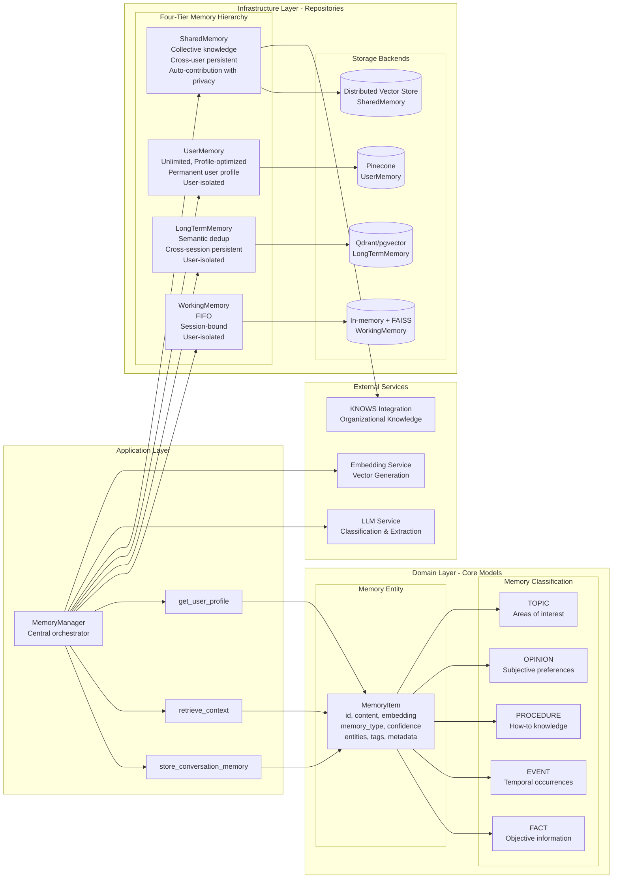
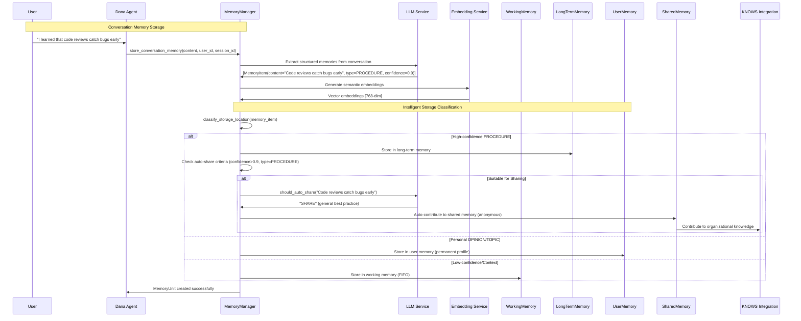
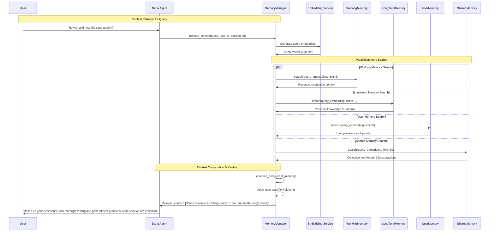
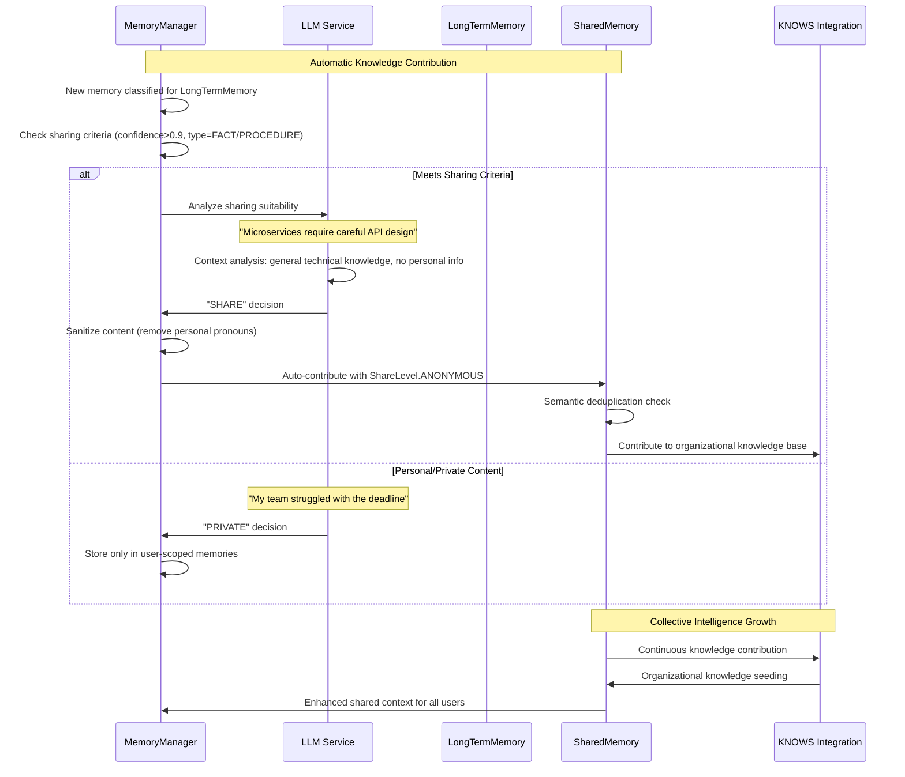
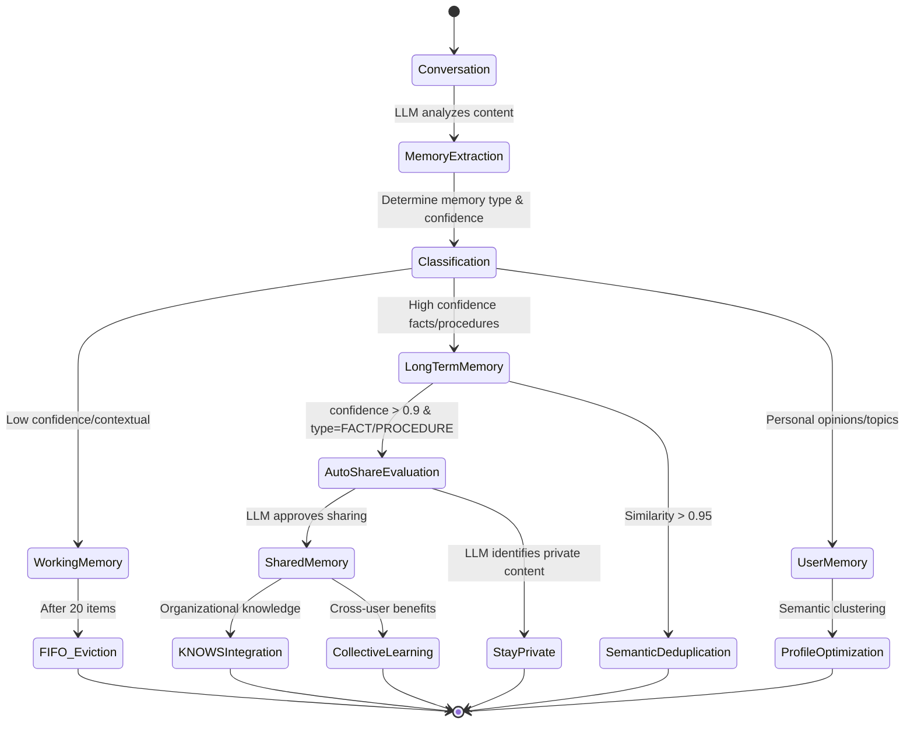

**Author:** Dana Language Team  
**Date:** 2024-07-04  
**Version:** 1.0.0  
**Status:** Deprecated


## Problem Statement
**Brief Description**: Users experience mounting frustration with AI agents that "forget" them instantly, forcing repetitive explanations and destroying trust, while organizations lose millions in productivity and fail to build intelligent systems that improve over time.

**Current Situation and Pain Points**:
- Users waste time re-explaining context, preferences, and background in every conversation
- Agents provide generic responses regardless of user expertise level or communication style
- Multi-agent systems fail to pass comprehensive context during the collaboration
- Agent learnings remain isolated and cannot benefit other agents or the organization
- AI Engineers spend most development time building external memory infrastructure instead of agent intelligence

**Impact of Not Solving This Problem**:
- Substantial annual losses due to repeated context reconstruction
- Significant reduction in AI adoption rates due to poor user experience
- Organizations cannot build "smarter" systems that improve with usage
- Teams abandon AI initiatives when agents cannot learn and adapt
- Development overhead kills productivity on memory-dependent projects

**What Users Actually Want:**
> "I want an agent that remembers me, learns from our interactions, gets better over time, understands my domain, and can share insights with other agents to create seamless, intelligent workflows that feel genuinely helpful rather than frustratingly repetitive."

**Relevant Context and Background**:
Current Dana agents rely on external objects for memory management. KNOWS provides organizational intelligence through CORRAL lifecycle, but no personal agent memory exists. Domain experts need agents that build expertise over time, conversational AI needs relationship memory, and agent teams need shared learning.

## Goals
**Brief Description**: Enable Dana agents to remember, learn, and adapt through first-class memory operations integrated directly into the language runtime.

**User Experience Goals**:
- Enable agents to remember user context, preferences, and conversation history across sessions
- Allow agents to build relationships and adapt to individual user communication styles over time
- Provide seamless collaboration between agents in multi-agent workflows
- Enable collective learning where agents can benefit from each other's successful experiences

**Developer Experience Goals**:
- Provide first-class memory operations directly in Dana language syntax
- Eliminate the need for external memory infrastructure and complex boilerplate code
- Enable memory persistence that survives agent restarts and lifecycle changes
- Standardize memory patterns across all agent development projects
- Reduce agent development time by abstracting away memory complexity

**System Architecture Goals**:
- Support multiple memory types (short-term, long-term, permanent) with appropriate decay mechanisms
- Enable intelligent memory management with automatic cleanup and optimization
- Provide high-performance memory operations that scale with agent usage
- Integrate memory seamlessly with existing Dana runtime and execution context

## Non-Goals
**Brief Description**: Focus on agent personal memory, not general-purpose database or analytics systems.

**Explicitly Out of Scope**:
- General-purpose database replacement or data warehousing solutions
- Real-time streaming data processing or complex analytics engines
- Cross-platform memory synchronization between different OpenDXA installations
- Advanced machine learning model training directly on memory data
- Custom embedding model development or fine-tuning capabilities
- Memory backup and disaster recovery mechanisms (Phase 1)
- Multi-tenant memory isolation for hosted services (Phase 1)
- **Activation Memory**: Dynamic neural network activations and attention mechanisms (deferred to later phases)
- **Parametric Memory**: Model weight updates and parameter fine-tuning based on experience (deferred to later phases)


## Proposed Solution
**Brief Description**: approach to explicit agent memory management with vector-first design, intelligent classification, and implicit knowledge sharing for Dana agents.

**High-Level Approach**:
- **Four-tier memory hierarchy**: Working (session context), Long-term (persistent patterns), User (permanent profile), Shared (collective knowledge)
- **Explicit memory as first-class resource**: Memory operations are transparent, traceable, and queryable rather than hidden in model weights
- **Vector-first design**: All memories stored as semantic embeddings enabling similarity search, automatic deduplication, and cross-modal matching
- **LLM-powered intelligent classification**: Automatic memory extraction and routing to appropriate storage tiers based on content analysis
- **Implicit knowledge sharing**: Automatic contribution to collective knowledge during normal operations with privacy-first LLM analysis
- **Clean Architecture separation**: Clear boundaries between application logic, domain models, and infrastructure repositories

**Why This Approach**:
- **Explicit memory management** provides transparency and control over memory operations, enabling fine-grained lifecycle management and debugging
- **Four-tier hierarchy** matches natural memory patterns while adding collective intelligence through shared knowledge
- **Vector-first design** enables semantic similarity search and automatic deduplication, preventing memory bloat
- **LLM-powered classification** ensures structured memory formation with rich metadata and appropriate storage routing
- **Implicit knowledge sharing** creates collective intelligence effects without user friction, while maintaining privacy through intelligent content analysis
- **Clean Architecture** ensures testable, maintainable code with clear separation of concerns and flexible infrastructure

**Main Trade-offs**:
- **Explicit vs. Implicit**: Chose explicit memory operations for transparency and control over hidden model parameters
- **Complexity vs. Control**: Clean Architecture adds initial complexity but enables long-term maintainability and testing
- **Privacy vs. Sharing**: LLM-powered privacy analysis balances collective learning with user privacy protection
- **Storage Flexibility vs. MVP Simplicity**: Repository pattern supports multiple storage backends (vector, graph, relational, time-series) but we choose vector databases for MVP to avoid premature optimization
- **Unified vs. Specialized Storage**: Vector-first approach provides consistent interface across memory tiers while sacrificing specialized optimizations that hybrid storage could offer

**KISS/YAGNI Analysis**: 
Starting with Clean Architecture and four-tier memory provides a solid foundation without over-engineering. Repository pattern enables simple in-memory implementations for MVP while supporting evolution to specialized storage backends (vector → graph → relational → time-series) based on actual usage patterns and performance requirements. LLM-powered classification and sharing can start with basic prompts and evolve to sophisticated analysis. Advanced features like cross-domain federation and meta-learning are deferred until proven necessary by real usage patterns.

**Storage Evolution Strategy**:
1. **MVP**: Vector databases for all memory tiers (unified, simple)
2. **Performance Optimization**: Hybrid storage based on usage patterns
3. **Production Scale**: Specialized storage per memory tier and use case
4. **Advanced Features**: Graph relationships, temporal analytics, complex queries

## Proposed Design
**Brief Description**: Clean Architecture approach to explicit agent memory management with vector-first design, intelligent classification, and implicit knowledge sharing.

### Architecture Overview

The Agent Memory System implements a **Clean Architecture** approach that treats memory as a **first-class resource** with explicit management, search, and optimization capabilities. Unlike traditional LLMs where memory is implicit in model parameters, this system makes memory **explicit, structured, and queryable**.

### Core Design Principles

#### 1. **Memory as Explicit State, Not Hidden Weights**
```
✅ Transparent: Every memory operation is traceable
✅ Controlled: Fine-grained memory management and lifecycle  
✅ Efficient: Targeted retrieval instead of full context processing
✅ Personalized: User-specific memory persistence across sessions
```

#### 2. **Separation of Concerns**
```
Domain Logic ≠ Storage Logic ≠ External Services
```
Each layer has a single responsibility, making the system testable and maintainable.

#### 3. **Vector-First Design**
All memories are stored as **semantic embeddings**, enabling:
- Similarity-based search and retrieval
- Automatic deduplication  
- Cross-modal memory matching

#### 4. **Intelligent Classification**
LLM-powered memory extraction and classification ensures:
- Structured memory formation
- Appropriate storage location
- Rich metadata generation

#### 5. **Implicit Knowledge Sharing**
Automatic contribution to collective knowledge during normal operations:
- No explicit user action required
- **LLM-powered sharing decisions** for nuanced context understanding
- Privacy-first sharing with intelligent content analysis

### System Architecture - Clean Architecture Layers



### Four-Tier Memory Hierarchy

#### **Working Memory** (Short-term)
```python
Capacity: 20 items (configurable)
Management: FIFO eviction
Scope: Session-bound + User-isolated
Use Case: Immediate conversation context
Storage: In-memory with FAISS
```

#### **Long-term Memory** (Persistent)
```python
Capacity: 10,000 items (configurable)
Management: Semantic deduplication
Scope: Cross-session persistence + User-isolated
Use Case: Factual knowledge, learned procedures
Storage: Qdrant with persistent storage
```

#### **User Memory** (Profile)
```python
Capacity: Unlimited
Management: User-scoped storage
Scope: Permanent user profile
Use Case: Preferences, personal facts, behavioral patterns
Storage: Pinecone with user-specific indexes
```

#### **Shared Memory** (Collective Knowledge)
```python
Capacity: 50,000 items (configurable)
Management: Collective knowledge with privacy filters
Scope: Cross-user persistent knowledge
Use Case: Implicitly shared experiences, common knowledge, best practices
Storage: Distributed vector store with KNOWS integration
Contribution: Automatic during normal memory operations
```


### Component Details - Clean Architecture Layers

#### **Application Layer: MemoryManager**
**Why this component exists**: Central orchestrator for all memory operations, implementing the core business logic for memory extraction, classification, storage, and retrieval.

**How it fits**: Primary interface between Dana agents and the memory system, coordinating between domain models and infrastructure repositories.

**Key design decisions**:
- **Central Orchestration**: Single entry point for all memory operations
- **Dependency Injection**: All services injected for testability and flexibility
- **Business Logic Coordination**: Orchestrates LLM extraction, classification, and storage routing
- **Context Assembly**: Retrieves and combines relevant memories from all four tiers
- **User Isolation**: Ensures memory operations are scoped to specific users

**Core Operations**:
```python
async def store_conversation_memory(content, user_id, session_id) -> MemoryUnit
async def retrieve_context(query, user_id, session_id) -> List[MemoryItem]
async def get_user_profile(user_id) -> UserProfile
```

#### **Domain Layer: Core Models**

##### **MemoryItem Entity**
**Why this component exists**: Represents the fundamental memory unit with all necessary metadata for intelligent classification and retrieval.

**How it fits**: Core domain model that encapsulates memory data and business rules, used across all memory tiers.

**Key design decisions**:
```python
@dataclass
class MemoryItem:
    id: str                    # Unique identifier
    content: str              # Human-readable memory text
    embedding: List[float]    # 768-dim semantic vector
    memory_type: MemoryType   # Classification (FACT, EVENT, PROCEDURE, OPINION, TOPIC)
    confidence: float         # Extraction confidence (0.0-1.0)
    entities: List[str]       # Named entities (persons, places, organizations)
    tags: List[str]          # Semantic tags for categorization
    metadata: Dict[str, Any] # Extensible properties (timestamps, context, etc.)
```

##### **Memory Classification Taxonomy**
**Why this component exists**: Provides structured memory type classification enabling appropriate storage routing and retrieval strategies.

**How it fits**: Domain-driven classification system that guides storage location decisions and enables semantic memory organization.

**Classification Types**:
```python
class MemoryType(Enum):
    FACT = "fact"           # Objective, verifiable information
    EVENT = "event"         # Temporal occurrences with specific timing  
    PROCEDURE = "procedure" # Step-by-step instructions or methods
    OPINION = "opinion"     # Subjective preferences or judgments
    TOPIC = "topic"         # Areas of interest or expertise
```

**Storage Classification Logic**:
```python
def classify_storage_location(memory: MemoryItem) -> str:
    """
    User Memory:
    - Opinions (preferences, likes/dislikes)
    - Topics (interests, expertise areas)
    - Personal facts (name, role, background)
    
    Long-term Memory:
    - High-confidence facts (>0.8 confidence)
    - Procedures (how-to knowledge)
    - Important events
    
    Working Memory:
    - Low-confidence information
    - Contextual conversation flow
    - Temporary processing data
    
    Shared Memory:
    - General knowledge automatically identified for sharing
    - Best practices and techniques (LLM-selected)
    - Privacy-filtered valuable insights
    """
```

#### **Infrastructure Layer: Memory Repositories**

##### **Repository Pattern Implementation**
**Why this component exists**: Provides consistent interface across memory types while enabling flexible storage backend implementation including vector, graph, relational, and time-series databases.

**How it fits**: Abstraction layer between domain logic and storage systems, enabling testability and backend swapping without changing business logic.

**Base Repository Interface**:
```python
class BaseMemoryRepository(ABC):
    @abstractmethod
    async def store(self, memory: MemoryItem) -> bool
    @abstractmethod  
    async def search(self, query_embedding: List[float], limit: int) -> List[MemoryItem]
    @abstractmethod
    async def retrieve(self, memory_id: str) -> Optional[MemoryItem]
    @abstractmethod
    async def delete(self, memory_id: str) -> bool
```

**Multi-Storage Backend Support**:
The Repository Pattern enables each memory tier to use the optimal storage backend:

```python
# Vector Databases (MVP Choice - Simplicity)
class VectorMemoryRepository(BaseMemoryRepository):
    # Optimized for: Semantic similarity search, embeddings
    # Examples: Qdrant, Pinecone, pgvector, FAISS
    # Use cases: All memory tiers for semantic retrieval

# Graph Databases (Future Enhancement)  
class GraphMemoryRepository(BaseMemoryRepository):
    # Optimized for: Relationship mapping, entity connections
    # Examples: Neo4j, Amazon Neptune, ArangoDB
    # Use cases: User memory for relationship tracking, knowledge graphs

# Relational Databases (Structured Data)
class RelationalMemoryRepository(BaseMemoryRepository):
    # Optimized for: Structured queries, transactions, consistency
    # Examples: PostgreSQL, MySQL, SQLite
    # Use cases: User profiles, metadata, memory lifecycle tracking

# Time-Series Databases (Temporal Patterns)
class TimeSeriesMemoryRepository(BaseMemoryRepository):
    # Optimized for: Temporal queries, trend analysis, decay modeling
    # Examples: TimescaleDB, InfluxDB, Apache Druid
    # Use cases: Memory importance decay, usage patterns, temporal context
```

**MVP Storage Strategy**:
We choose **vector databases for MVP simplicity** because:
- ✅ **Single interface** handles all memory types through semantic similarity
- ✅ **Unified search** across different memory tiers with consistent results  
- ✅ **Rapid development** without complex storage optimization decisions
- ✅ **Proven patterns** with established vector database solutions

**Future Storage Evolution**:
```python
# Hybrid storage approach for production optimization
class HybridMemoryManager:
    def __init__(self):
        self.working_memory = VectorMemoryRepository()      # Fast semantic search
        self.longterm_memory = GraphMemoryRepository()      # Relationship tracking  
        self.user_memory = RelationalMemoryRepository()     # Structured profiles
        self.shared_memory = TimeSeriesMemoryRepository()   # Temporal knowledge patterns
```

##### **WorkingMemory Repository**
**Implementation**: FIFO-managed session memory with strict user isolation
```python
class WorkingMemory(BaseMemoryRepository):
    # Capacity: 20 items (configurable)
    # Eviction: FIFO (oldest memories removed first)
    # Scope: Session-bound + User-isolated
    # Storage: In-memory with FAISS for vector search
```

##### **LongTermMemory Repository**  
**Implementation**: Persistent knowledge with semantic deduplication
```python
class LongTermMemory(BaseMemoryRepository):
    # Capacity: 10,000 items (configurable)
    # Deduplication: Similarity threshold 0.95 for duplicate detection
    # Scope: Cross-session persistent + User-isolated
    # Storage: Qdrant with persistent storage
```

##### **UserMemory Repository**
**Implementation**: Unlimited user profile storage with optimization
```python
class UserMemory(BaseMemoryRepository):
    # Capacity: Unlimited
    # Organization: Profile-optimized with semantic clustering
    # Scope: Permanent user profile
    # Storage: Pinecone with user-specific indexes
```

##### **SharedMemory Repository**
**Implementation**: Collective knowledge with automated privacy protection
```python
class SharedMemory(BaseMemoryRepository):
    # Capacity: 50,000 items (configurable)
    # Management: Collective knowledge with LLM-based privacy filters
    # Contribution: Automatic during normal memory operations
    # Storage: Distributed vector store with KNOWS integration
```

### Implicit Knowledge Sharing Mechanism

#### **Automatic Contribution Process**
**Why this component exists**: Enables seamless collective learning without user friction while maintaining privacy through intelligent content analysis.

**LLM-Based Content Analysis**:
```python
async def _should_auto_share(memory_item: MemoryItem) -> bool:
    """Use LLM to analyze sharing suitability with nuanced context understanding"""
    
    prompt = f"""
    Analyze: "{memory_item.content}"
    
    SHARE IF: General knowledge, best practices, techniques, objective insights
    DON'T SHARE IF: Personal info, private data, individual opinions, company-specific details
    
    Consider context and semantic meaning, not just keywords.
    Response: "SHARE" or "PRIVATE"
    """
    
    decision = await llm_service.generate(prompt)
    return decision.strip().upper() == "SHARE"
```

**Trigger Conditions**:
1. Memory classified for `LongTermMemory` storage  
2. High confidence level (>0.9)
3. Memory type is `FACT` or `PROCEDURE`
4. LLM analysis determines sharing suitability

**Privacy Protection Benefits**:
- **Contextual Understanding**: LLM analyzes full context, not just keywords
- **Nuanced Detection**: Identifies subtle personal information patterns  
- **Semantic Analysis**: Understands meaning beyond simple pattern matching
- **Conservative Fallback**: Defaults to "PRIVATE" if LLM call fails
- **Content Sanitization**: Personal pronouns replaced ("I" → "Someone")
- **Anonymous Sharing**: Default `ShareLevel.ANONYMOUS`

### Data Flow Architecture - Clean Architecture Flows

#### **Memory Storage Flow**


#### **Memory Retrieval Flow**


#### **Implicit Knowledge Sharing Flow**


#### **Four-Tier Memory Lifecycle**


## Proposed Implementation
**Brief Description**: Clean Architecture implementation with explicit memory management, four-tier hierarchy, and vector-first storage for Dana agents.

**Technical Specifications**:
- **MemoryManager Application Layer**: Central orchestrator implementing core business logic for memory operations
- **Repository Pattern Infrastructure**: Consistent interface across memory types with flexible storage backend implementation
- **Four-Tier Memory Hierarchy**: Working (session), Long-term (persistent), User (profile), Shared (collective) with specialized characteristics
- **Vector-First Storage**: Semantic embeddings for all memory types with evolution path to hybrid storage backends
- **LLM-Powered Classification**: Intelligent memory extraction and routing to appropriate storage tiers
- **Implicit Knowledge Sharing**: Automatic contribution to collective knowledge with privacy-first LLM analysis

**Core Implementation Components**:
```python
# Application Layer - Business Logic
class MemoryManager:
    async def store_conversation_memory(self, content: str, user_id: str, session_id: str) -> MemoryUnit
    async def retrieve_context(self, query: str, user_id: str, session_id: str) -> List[MemoryItem]
    async def get_user_profile(self, user_id: str) -> UserProfile

# Domain Layer - Core Models  
@dataclass
class MemoryItem:
    id: str
    content: str
    embedding: List[float]
    memory_type: MemoryType  # FACT, EVENT, PROCEDURE, OPINION, TOPIC
    confidence: float
    entities: List[str]
    tags: List[str]
    metadata: Dict[str, Any]

# Infrastructure Layer - Repository Pattern
class BaseMemoryRepository(ABC):
    async def store(self, memory: MemoryItem) -> bool
    async def search(self, query_embedding: List[float], limit: int) -> List[MemoryItem]
    async def retrieve(self, memory_id: str) -> Optional[MemoryItem]
```

**Example Agent Memory Usage**:
```python
# Agent uses explicit memory operations
memory_manager = MemoryManager(
    working_memory=VectorMemoryRepository(),
    longterm_memory=VectorMemoryRepository(), 
    user_memory=VectorMemoryRepository(),
    shared_memory=VectorMemoryRepository(),
    llm_service=LLMService(),
    embedding_service=EmbeddingService()
)

# Store conversation memory with automatic classification
memory_unit = await memory_manager.store_conversation_memory(
    content="I learned that code reviews catch bugs early",
    user_id="engineer_123",
    session_id="session_456"
)

# Retrieve relevant context for new query
context = await memory_manager.retrieve_context(
    query="How should I handle code quality?",
    user_id="engineer_123", 
    session_id="session_456"
)
```

**Key Algorithms**:
- **LLM Memory Extraction**: Structured memory extraction from conversations using LLM analysis
- **Vector Similarity Search**: Semantic retrieval using cosine similarity on embeddings
- **Intelligent Classification**: Memory type and storage tier determination via LLM reasoning
- **Automatic Sharing Analysis**: Privacy-preserving content analysis for collective knowledge contribution
- **Semantic Deduplication**: Similarity-based duplicate detection and consolidation

**Testing Strategy**:
- **Unit Tests**: Each repository implementation and memory classification logic
- **Integration Tests**: End-to-end memory flows across four-tier hierarchy
- **Performance Tests**: Vector search performance and storage scalability  
- **Privacy Tests**: LLM-based sharing decision accuracy and privacy protection

**Dependencies**:
- **Vector Database**: Qdrant, Pinecone, or pgvector for semantic storage
- **LLM Service**: Memory extraction and classification intelligence
- **Embedding Service**: Text-to-vector conversion for semantic search
- **KNOWS Integration**: Shared memory connection to organizational knowledge

**Monitoring Requirements**:
- **Memory Operation Metrics**: Storage, retrieval, and search performance
- **Classification Accuracy**: LLM-powered memory type and storage decisions
- **Privacy Protection**: Sharing decision accuracy and content sanitization
- **Storage Utilization**: Memory tier usage patterns and optimization opportunities

## Design Review Checklist
**Status**: [ ] Not Started | [x] In Progress | [ ] Complete

Before implementation, review design against:
- [x] **Problem Alignment**: Does solution address all stated problems?
- [x] **Goal Achievement**: Will implementation meet all success criteria?
- [x] **Non-Goal Compliance**: Are we staying within defined scope?
- [x] **KISS/YAGNI Compliance**: Is complexity justified by immediate needs?
- [x] **Clean Architecture Compliance**: Are domain, application, and infrastructure layers properly separated?
- [x] **Repository Pattern Implementation**: Does each memory tier have consistent interface with flexible backend support?
- [x] **Vector-First Design**: Are all memories stored as semantic embeddings with similarity search capability?
- [x] **Four-Tier Memory Hierarchy**: Are Working, Long-term, User, and Shared memory properly differentiated?
- [ ] **LLM Integration Security**: Are LLM calls for classification and sharing protected against prompt injection?
- [ ] **Privacy Protection Validation**: Does implicit knowledge sharing properly protect user privacy?
- [ ] **Storage Backend Flexibility**: Can infrastructure repositories be swapped without business logic changes?
- [ ] **Memory Operation Performance**: Are vector search and storage operations optimized for scale?
- [ ] **User Isolation Verification**: Are memory operations properly scoped to prevent cross-user data leakage?
- [ ] **Testing Strategy Comprehensive**: Are unit, integration, performance, and privacy tests defined?
- [ ] **Error handling comprehensive**
- [ ] **Documentation planned**
- [ ] **Backwards compatibility checked**


## Key Architectural Insights

### **Breakthrough Architectural Insights**

**Insight 1: Memory as Explicit State Enables Transparency and Control**
- **Discovery**: Making memory explicit and queryable provides superior debugging, testing, and optimization compared to hidden model parameters
- **Impact**: Led to Clean Architecture with transparent memory operations instead of implicit, black-box memory management
- **Design principle**: Explicit state management enables developer confidence and system maintainability

**Insight 2: Four-Tier Hierarchy Balances Personal and Collective Intelligence**
- **Discovery**: Memory needs span immediate context (Working), personal learning (Long-term), identity (User), and collective knowledge (Shared)
- **Impact**: Four specialized tiers with distinct characteristics: session-bound, persistent patterns, permanent profile, and cross-user knowledge
- **Design principle**: Match memory architecture to different knowledge persistence and sharing requirements

**Insight 3: Repository Pattern Enables Storage Evolution Without Business Logic Changes**
- **Discovery**: Clean separation between domain logic and storage infrastructure allows technology evolution without architectural disruption
- **Impact**: Start with vector databases for MVP simplicity, evolve to hybrid storage (graph, relational, time-series) based on usage patterns
- **Design principle**: Abstract storage concerns to enable flexible infrastructure without breaking business logic

**Insight 4: Vector-First Design Provides Unified Semantic Interface**
- **Discovery**: Semantic embeddings enable consistent similarity search across all memory types while supporting automatic deduplication
- **Impact**: Single interface for memory retrieval regardless of content type, with natural scaling to specialized storage backends
- **Design principle**: Start with unified approach for simplicity, specialize based on proven performance requirements

**Insight 5: LLM-Powered Intelligence Enables Sophisticated Memory Management**
- **Discovery**: LLM reasoning provides nuanced content analysis for classification, sharing decisions, and privacy protection beyond rule-based systems
- **Impact**: Intelligent memory extraction, appropriate storage routing, and privacy-preserving knowledge sharing without user intervention
- **Design principle**: Leverage LLM intelligence for complex decision-making while maintaining transparent, debuggable operations

**Insight 6: Implicit Knowledge Sharing Creates Collective Learning Without Friction**
- **Discovery**: Automatic contribution to shared knowledge during normal operations builds collective intelligence without requiring explicit user actions
- **Impact**: Zero-friction knowledge sharing with LLM-powered privacy protection enables organization-wide learning from individual agent interactions
- **Design principle**: Make beneficial behaviors automatic while maintaining user privacy and control

## Implementation Phases
**Overall Progress**: [x] 0% | [ ] 20% | [ ] 40% | [ ] 60% | [ ] 80% | [ ] 100%

*Note: Detailed implementation phases available in separate MVP development plan focusing on progressive delivery of value to domain expert AI Engineers in industrial, finance, and real-world applications.* 