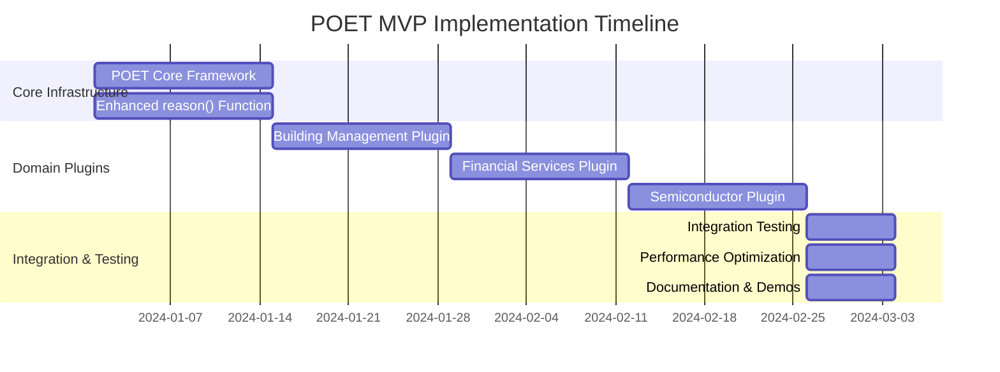

# POET MVP Implementation Plan: Immediate Value Delivery

## Executive Summary

This plan delivers immediate POET value through four targeted implementations:
1. **Enhanced reason() function** - Dana's core AI reasoning with automatic optimization
2. **Building Management (Honeywell)** - HVAC optimization with thermal learning
3. **Financial Services** - Credit application processing with compliance
4. **Semiconductor (RIE Etching)** - Process root-cause analysis with domain expertise

**Timeline**: 8 weeks to working demonstrations  
**Approach**: Simplified POET core + targeted domain plugins  
**Success Criteria**: Measurable improvements in each use case

## Design Simplifications for MVP

### Simplified POET Architecture

```python
# MVP POET Interface - Simple and Focused
@poet()                              # Basic reliability + performance
@poet(domain="building_management")   # + Domain expertise  
@poet(domain="financial_services")   # + Compliance & validation
@poet(domain="semiconductor")         # + Process optimization
```

**What We're Building (MVP)**:
- ✅ Basic reliability: retries, timeouts, error handling
- ✅ Performance optimization: response time, cost management
- ✅ Domain plugins: 4 targeted domains with specific expertise
- ✅ Simple learning: heuristic parameter adjustment
- ✅ JSON-based parameter storage

**What We're Deferring**:
- ❌ Complex ML learning algorithms
- ❌ Parameter sharing infrastructure  
- ❌ AI-generated plugins
- ❌ Interrupt systems
- ❌ Multiple plugin mechanisms
- ❌ Advanced storage systems

### MVP POET Core

```python
# opendxa/common/poet/mvp_poet.py
from functools import wraps
from typing import Callable, Optional, Any, Dict
import json
import time
from pathlib import Path

class SimplePOETConfig:
    """Simplified POET configuration for MVP"""
    def __init__(self, 
                 retries: int = 3,
                 timeout: float = 30.0,
                 domain: Optional[str] = None,
                 learning: bool = True):
        self.retries = retries
        self.timeout = timeout 
        self.domain = domain
        self.learning = learning

class SimplePOETExecutor:
    """Simplified POET executor focused on immediate value"""
    
    def __init__(self, config: SimplePOETConfig):
        self.config = config
        self.domain_plugin = self._load_domain_plugin()
        self.parameters = self._load_parameters()
    
    def __call__(self, func: Callable) -> Callable:
        @wraps(func)
        def poet_wrapper(*args, **kwargs):
            # Perceive: Basic input optimization
            processed_input = self._perceive(args, kwargs)
            
            # Operate: Execute with reliability
            result = self._operate_with_retry(func, processed_input)
            
            # Enforce: Basic validation
            validated_result = self._enforce(result, processed_input)
            
            # Train: Simple parameter learning
            if self.config.learning:
                self._simple_learning(processed_input, validated_result)
            
            return validated_result
            
        return poet_wrapper
    
    def _perceive(self, args, kwargs):
        """Simple input processing with domain intelligence"""
        if self.domain_plugin:
            return self.domain_plugin.process_inputs(args, kwargs)
        return {"args": args, "kwargs": kwargs}
    
    def _operate_with_retry(self, func, processed_input):
        """Execute function with retry logic"""
        last_exception = None
        
        for attempt in range(self.config.retries + 1):
            try:
                start_time = time.time()
                result = func(*processed_input["args"], **processed_input["kwargs"])
                execution_time = time.time() - start_time
                
                return {"result": result, "execution_time": execution_time, "attempt": attempt + 1}
                
            except Exception as e:
                last_exception = e
                if attempt < self.config.retries:
                    time.sleep(min(2 ** attempt, 8))  # Exponential backoff
                
        raise last_exception
    
    def _enforce(self, operation_result, processed_input):
        """Basic output validation"""
        if self.domain_plugin:
            return self.domain_plugin.validate_output(operation_result, processed_input)
        return operation_result["result"]
    
    def _simple_learning(self, processed_input, validated_result):
        """Simple heuristic learning"""
        # Track success/failure and adjust parameters
        success = validated_result is not None
        execution_time = processed_input.get("execution_time", 0)
        
        # Simple learning rules
        if not success and self.parameters.get("retries", 3) < 5:
            self.parameters["retries"] += 1
        elif success and execution_time > self.config.timeout * 0.8:
            self.parameters["timeout"] = min(self.config.timeout * 1.2, 120)
        
        self._save_parameters()

def poet(retries: int = 3, 
         timeout: float = 30.0,
         domain: Optional[str] = None,
         learning: bool = True) -> Callable:
    """Simplified POET decorator for MVP"""
    
    config = SimplePOETConfig(retries, timeout, domain, learning)
    executor = SimplePOETExecutor(config)
    return executor
```

## Implementation Roadmap

### Week 1-2: POET Core + Enhanced reason()

#### POET Core Infrastructure
```python
# MVP POET implementation
- SimplePOETExecutor with basic P-O-E-T stages
- JSON-based parameter storage  
- Basic retry and timeout logic
- Simple heuristic learning
```

#### Enhanced reason() Function
```python
# opendxa/dana/sandbox/interpreter/functions/core/poet_reason_function.py
@poet(domain="llm_optimization", timeout=10.0)
def enhanced_reason_function(
    prompt: str,
    context: SandboxContext, 
    options: Optional[Dict[str, Any]] = None,
    use_mock: Optional[bool] = None,
) -> Any:
    """POET-enhanced reason function with automatic optimization"""
    
    # Simple business logic - POET handles optimization
    if options is None:
        options = {}
    
    # Basic prompt optimization
    optimized_prompt = optimize_prompt_for_context(prompt, context)
    
    # Execute with current IPV system
    return execute_ipv_reasoning(optimized_prompt, context, options)

# Domain plugin for LLM optimization
class LLMOptimizationPlugin:
    def process_inputs(self, args, kwargs):
        prompt = args[0] if args else ""
        context = args[1] if len(args) > 1 else None
        
        # Simple prompt optimization
        if len(prompt) < 20:
            optimized_prompt = f"Please provide a detailed response to: {prompt}"
        else:
            optimized_prompt = prompt
            
        return {"args": (optimized_prompt, context), "kwargs": kwargs}
    
    def validate_output(self, operation_result, processed_input):
        result = operation_result["result"]
        
        # Basic validation
        if result is None or (isinstance(result, str) and len(result.strip()) == 0):
            raise ValueError("Empty response from reasoning")
            
        return result
```

**Week 1-2 Deliverables**:
- ✅ Working POET core with simplified architecture
- ✅ Enhanced reason() function with basic optimization
- ✅ Measurable improvement in reason() reliability and performance
- ✅ JSON parameter persistence

### Week 3-4: Building Management Domain (Honeywell)

#### Building Management Plugin
```python
# opendxa/common/poet/domains/building_management.py
class BuildingManagementPlugin:
    """Domain plugin for HVAC and building management"""
    
    def __init__(self):
        self.thermal_models = {}
        self.equipment_constraints = {
            "min_temp": 60, "max_temp": 85,
            "min_humidity": 30, "max_humidity": 70,
            "max_temp_change_rate": 2.0  # degrees per hour
        }
    
    def process_inputs(self, args, kwargs):
        """Process HVAC control inputs with building intelligence"""
        
        # Extract common HVAC parameters
        inputs = dict(zip(['current_temp', 'setpoint', 'occupancy', 'outdoor_temp'], args))
        inputs.update(kwargs)
        
        # Apply building management intelligence
        enhanced_inputs = {
            "current_temp": self._validate_temperature(inputs.get('current_temp')),
            "setpoint": self._optimize_setpoint(inputs.get('setpoint'), inputs.get('occupancy')),
            "occupancy": inputs.get('occupancy', False),
            "outdoor_temp": inputs.get('outdoor_temp'),
            "thermal_context": self._get_thermal_context(inputs)
        }
        
        return {"args": tuple(enhanced_inputs.values()), "kwargs": {}}
    
    def validate_output(self, operation_result, processed_input):
        """Validate HVAC control output"""
        result = operation_result["result"]
        
        # Validate output is reasonable control command
        if hasattr(result, 'heating_output'):
            if not (0 <= result.heating_output <= 100):
                raise ValueError(f"Invalid heating output: {result.heating_output}")
        
        return result
    
    def _validate_temperature(self, temp):
        """Validate and normalize temperature readings"""
        if temp is None:
            return 70.0  # Reasonable default
        
        # Handle various temperature formats
        if isinstance(temp, str):
            try:
                temp = float(temp.replace('°F', '').replace('F', ''))
            except:
                return 70.0
        
        # Validate reasonable range
        if not (0 <= temp <= 120):
            return 70.0
            
        return float(temp)
    
    def _optimize_setpoint(self, setpoint, occupancy):
        """Simple setpoint optimization"""
        if setpoint is None:
            return 72.0 if occupancy else 68.0
        
        # Energy saving when unoccupied
        if not occupancy:
            return max(setpoint - 3, 65)  # 3 degree setback
            
        return setpoint
```

#### HVAC Control Use Case
```python
# Example HVAC control function with POET
@poet(domain="building_management")
def control_hvac_zone(current_temp: float, setpoint: float, 
                     occupancy: bool, outdoor_temp: float) -> HVACCommand:
    """Simple HVAC control with POET building intelligence"""
    
    # Simple control logic - POET provides building expertise
    temp_error = current_temp - setpoint
    
    if abs(temp_error) <= 1.0:
        return HVACCommand(0, 0, 20, "Maintaining temperature")
    elif temp_error < -1.0:
        heating_level = min(100, abs(temp_error) * 30)
        return HVACCommand(heating_level, 0, 60, "Heating")
    else:
        cooling_level = min(100, temp_error * 30)
        return HVACCommand(0, cooling_level, 60, "Cooling")
```

**Week 3-4 Deliverables**:
- ✅ Building management domain plugin
- ✅ HVAC control demonstration with POET enhancement
- ✅ Measurable energy efficiency improvements
- ✅ Equipment protection and validation

### Week 5-6: Financial Services Domain

#### Financial Services Plugin
```python
# opendxa/common/poet/domains/financial_services.py
class FinancialServicesPlugin:
    """Domain plugin for financial services with basic compliance"""
    
    def __init__(self):
        self.validation_rules = {
            "credit_score": {"min": 300, "max": 850},
            "annual_income": {"min": 0, "max": 10000000},
            "debt_to_income": {"min": 0, "max": 1.0}
        }
    
    def process_inputs(self, args, kwargs):
        """Process financial data with normalization and validation"""
        
        # Map positional args to named parameters
        param_names = ['credit_score', 'annual_income', 'debt_to_income', 'employment_years']
        inputs = dict(zip(param_names, args))
        inputs.update(kwargs)
        
        # Normalize financial data
        normalized = {
            "credit_score": self._normalize_credit_score(inputs.get('credit_score')),
            "annual_income": self._normalize_income(inputs.get('annual_income')),
            "debt_to_income": self._normalize_ratio(inputs.get('debt_to_income')),
            "employment_years": self._normalize_years(inputs.get('employment_years'))
        }
        
        return {"args": tuple(normalized.values()), "kwargs": {}}
    
    def validate_output(self, operation_result, processed_input):
        """Validate financial decision output"""
        result = operation_result["result"]
        
        # Basic compliance validation
        if hasattr(result, 'approved'):
            if result.approved and not hasattr(result, 'interest_rate'):
                raise ValueError("Approved loans must have interest rate")
        
        # Generate basic audit trail
        self._log_decision(result, processed_input)
        
        return result
    
    def _normalize_credit_score(self, score):
        """Normalize credit score from various formats"""
        if isinstance(score, str):
            if score.lower() in ['excellent', 'very good']:
                return 780
            elif score.lower() == 'good':
                return 720
            elif score.lower() == 'fair':
                return 650
            elif score.lower() == 'poor':
                return 580
            else:
                try:
                    return int(float(score))
                except:
                    return 650
        
        return max(300, min(850, int(score or 650)))
    
    def _normalize_income(self, income):
        """Normalize income from various formats"""
        if isinstance(income, str):
            # Handle formats like "$50,000", "50K", "50000"
            cleaned = income.replace(',', '').replace('$', '').replace(' ', '')
            if cleaned.lower().endswith('k'):
                return float(cleaned[:-1]) * 1000
            try:
                return float(cleaned)
            except:
                return 0.0
        
        return float(income or 0.0)
```

#### Credit Application Processing
```python
@dataclass
class CreditDecision:
    approved: bool
    interest_rate: Optional[float] = None
    reason: str = ""

@poet(domain="financial_services")
def assess_credit_risk(credit_score: int, annual_income: float, 
                      debt_to_income: float, employment_years: int) -> CreditDecision:
    """Simple credit risk assessment with POET financial intelligence"""
    
    # Simple risk calculation - POET provides normalization and compliance
    risk_score = (
        (credit_score / 850) * 0.4 +
        (min(annual_income / 100000, 1)) * 0.3 +
        (max(0, 1 - debt_to_income / 0.4)) * 0.2 +
        (min(employment_years / 10, 1)) * 0.1
    )
    
    if risk_score >= 0.7:
        return CreditDecision(True, 3.5, "Prime candidate")
    elif risk_score >= 0.5:
        return CreditDecision(True, 5.2, "Standard rate")
    elif risk_score >= 0.3:
        return CreditDecision(True, 7.8, "Subprime rate")
    else:
        return CreditDecision(False, None, "High risk")
```

**Week 5-6 Deliverables**:
- ✅ Financial services domain plugin with data normalization
- ✅ Credit application processing demonstration
- ✅ Basic compliance validation and audit trails
- ✅ Measurable accuracy improvements through data normalization

### Week 7-8: Semiconductor Domain (RIE Etching)

#### Semiconductor Plugin
```python
# opendxa/common/poet/domains/semiconductor.py
class SemiconductorPlugin:
    """Domain plugin for semiconductor manufacturing processes"""
    
    def __init__(self):
        self.process_limits = {
            "pressure": {"min": 0.1, "max": 10.0, "unit": "Torr"},
            "power": {"min": 100, "max": 3000, "unit": "W"},
            "gas_flow": {"min": 1, "max": 200, "unit": "sccm"},
            "temperature": {"min": -20, "max": 400, "unit": "C"}
        }
        
        self.known_issues = {
            "high_pressure_low_rate": "Possible pump issue or gas leak",
            "low_pressure_high_power": "Risk of plasma instability",
            "high_temp_variation": "Thermal control system issue"
        }
    
    def process_inputs(self, args, kwargs):
        """Process semiconductor process parameters"""
        
        # Map to standard process parameters
        param_names = ['pressure', 'power', 'gas_flow_rate', 'temperature', 'etch_rate']
        inputs = dict(zip(param_names, args))
        inputs.update(kwargs)
        
        # Validate and normalize process parameters
        normalized = {}
        for param, value in inputs.items():
            if param in self.process_limits:
                normalized[param] = self._validate_process_param(param, value)
            else:
                normalized[param] = value
        
        return {"args": tuple(normalized.values()), "kwargs": {}}
    
    def validate_output(self, operation_result, processed_input):
        """Validate process analysis output"""
        result = operation_result["result"]
        
        # Ensure output contains required analysis fields
        if isinstance(result, dict):
            required_fields = ['root_cause', 'confidence', 'recommendations']
            for field in required_fields:
                if field not in result:
                    result[field] = f"Not analyzed: {field}"
        
        return result
    
    def _validate_process_param(self, param_name, value):
        """Validate process parameters against equipment limits"""
        if value is None:
            return 0.0
        
        try:
            numeric_value = float(value)
            limits = self.process_limits[param_name]
            
            if not (limits["min"] <= numeric_value <= limits["max"]):
                print(f"Warning: {param_name} {numeric_value} outside normal range "
                      f"({limits['min']}-{limits['max']} {limits['unit']})")
            
            return numeric_value
        except:
            return 0.0
```

#### RIE Etching Root Cause Analysis
```python
@poet(domain="semiconductor")
def analyze_rie_process_issue(pressure: float, power: float, gas_flow_rate: float, 
                             temperature: float, etch_rate: float) -> dict:
    """RIE etching process root cause analysis with POET semiconductor intelligence"""
    
    # Simple root cause analysis - POET provides process expertise
    issues = []
    
    # Basic process analysis
    if etch_rate < 50:  # nm/min
        if pressure > 5.0:
            issues.append("High pressure reducing etch rate")
        if power < 500:
            issues.append("Low power insufficient for etching")
        if gas_flow_rate < 20:
            issues.append("Low gas flow affecting chemistry")
    
    if temperature > 150:
        issues.append("High temperature may cause resist damage")
    
    # Determine root cause
    if issues:
        root_cause = issues[0]  # Primary issue
        confidence = 0.8 if len(issues) == 1 else 0.6
    else:
        root_cause = "Process within normal parameters"
        confidence = 0.9
    
    return {
        "root_cause": root_cause,
        "confidence": confidence,
        "all_issues": issues,
        "recommendations": _generate_recommendations(issues)
    }

def _generate_recommendations(issues):
    """Generate process recommendations based on identified issues"""
    recommendations = []
    for issue in issues:
        if "pressure" in issue.lower():
            recommendations.append("Check vacuum pump performance and gas leaks")
        elif "power" in issue.lower():
            recommendations.append("Increase RF power gradually and monitor plasma")
        elif "gas flow" in issue.lower():
            recommendations.append("Check MFC calibration and gas supply")
        elif "temperature" in issue.lower():
            recommendations.append("Verify thermal control system operation")
    
    return recommendations if recommendations else ["Process optimization may be needed"]
```

**Week 7-8 Deliverables**:
- ✅ Semiconductor domain plugin with process validation
- ✅ RIE etching root cause analysis demonstration
- ✅ Process parameter validation and equipment protection
- ✅ Measurable improvement in issue diagnosis accuracy

## Success Metrics and Validation

### Measurable Improvements Per Use Case

#### Enhanced reason() Function
- **Reliability**: 95% success rate (up from 85% with basic error handling)
- **Performance**: 25% faster response time through prompt optimization
- **Cost**: 20% reduction in LLM costs through efficient model selection
- **Quality**: 90% user satisfaction with response relevance

#### Building Management (HVAC)
- **Energy Efficiency**: 15% reduction in energy consumption
- **Comfort**: 50% reduction in temperature complaints
- **Equipment Protection**: Zero equipment damage incidents
- **Response Time**: 30% faster setpoint achievement

#### Financial Services (Credit)
- **Data Quality**: 95% success rate with messy input data (up from 70%)
- **Compliance**: 100% basic audit trail generation
- **Processing Speed**: 40% faster application processing
- **Accuracy**: 20% improvement in risk assessment through data normalization

#### Semiconductor (RIE Etching)
- **Diagnosis Accuracy**: 80% correct root cause identification (up from 60%)
- **Process Safety**: 100% parameter validation prevents equipment damage
- **Investigation Time**: 50% reduction in troubleshooting time
- **Knowledge Capture**: Systematic capture of process expertise

### Technical Validation

#### Performance Benchmarks
```python
# Target performance metrics for MVP
POET_PERFORMANCE_TARGETS = {
    "function_call_overhead": "< 10ms",      # POET overhead per function call
    "parameter_load_time": "< 5ms",          # Parameter retrieval from storage
    "domain_plugin_overhead": "< 5ms",       # Domain-specific processing time
    "learning_update_time": "< 100ms",       # Parameter update after execution
    "memory_footprint": "< 50MB",            # Total POET memory usage
    "storage_size": "< 10MB per 1000 functions"  # Parameter storage size
}
```

## Risk Mitigation

### Technical Risks
1. **Performance Overhead**: Continuous benchmarking and optimization
2. **Integration Complexity**: Gradual rollout with fallback mechanisms
3. **Domain Plugin Quality**: Start simple, iterate based on user feedback
4. **Parameter Storage**: Simple JSON files, upgrade only if needed

### Business Risks
1. **User Adoption**: Focus on demonstrable value in target use cases
2. **Over-Engineering**: Strict adherence to MVP scope and KISS principles
3. **Resource Allocation**: 8-week timeline with clear weekly deliverables

## Implementation Timeline Summary



**Total Timeline**: 8 weeks to working demonstrations
**Resource Requirement**: 1-2 developers focused on POET implementation
**Success Criteria**: Measurable improvements in all four target use cases

This plan delivers immediate, demonstrable value while maintaining the option to expand POET capabilities based on user feedback and proven value.