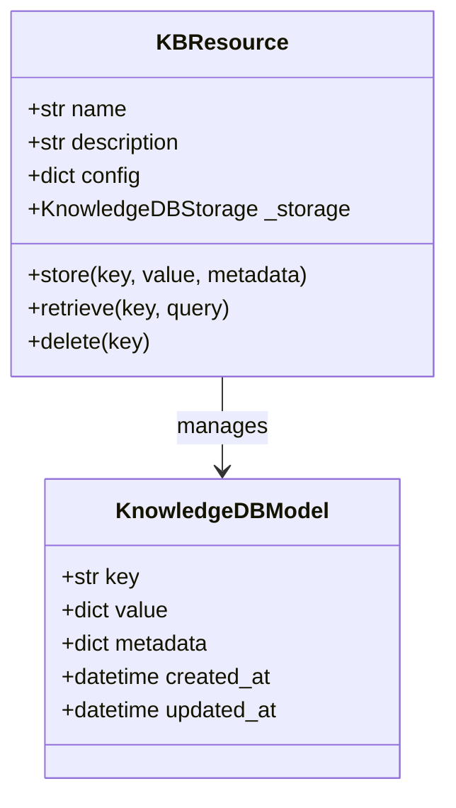
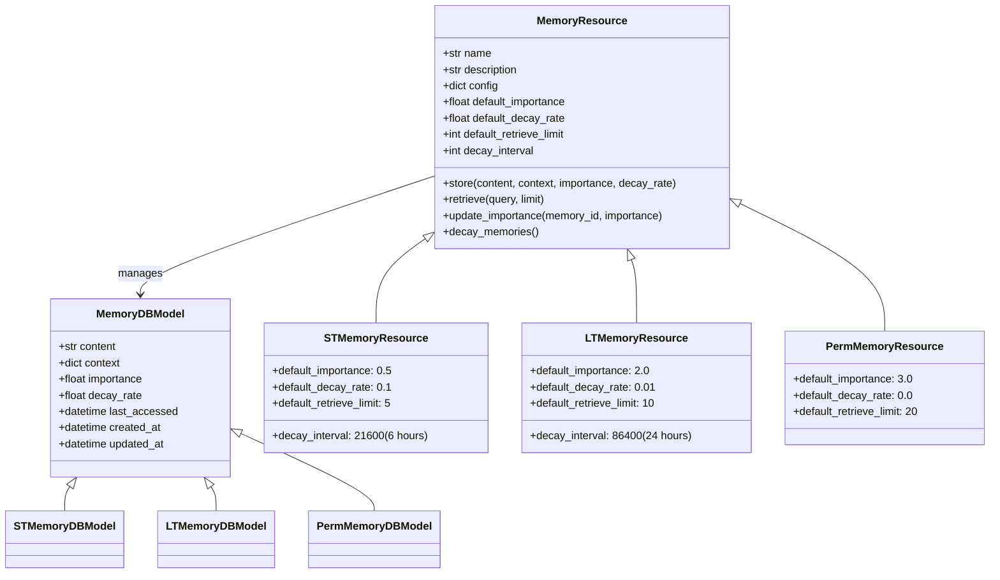
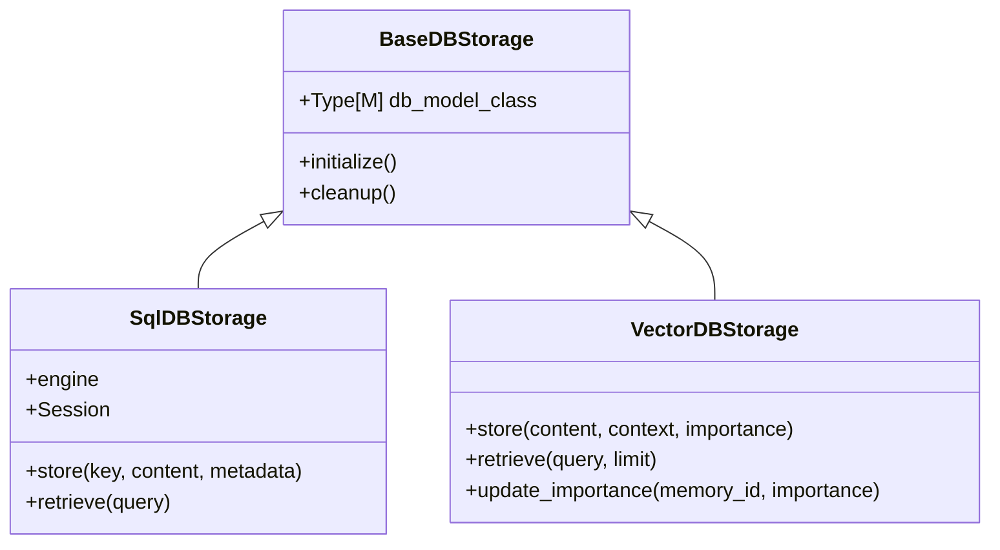
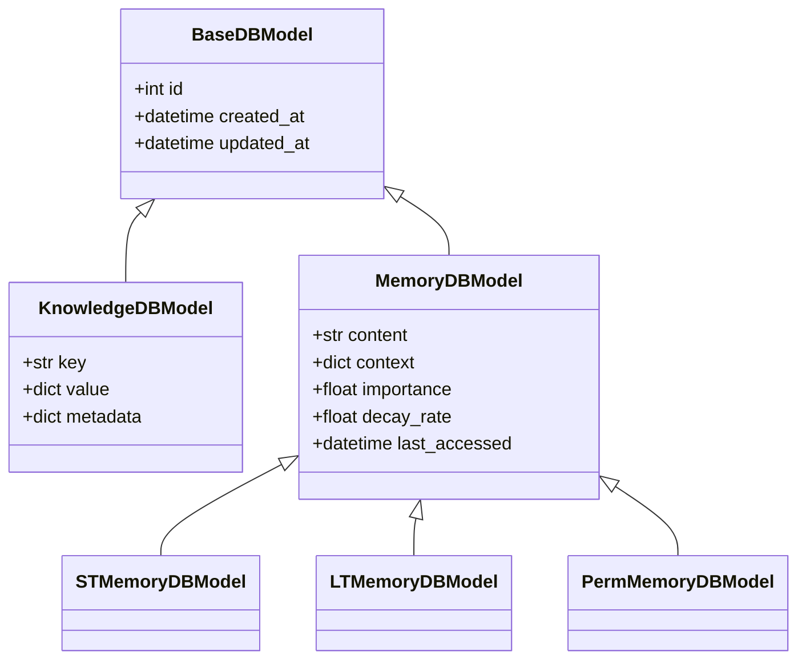

**Author:** Dana Language Team  
**Date:** 2025-01-22  
**Version:** 1.0.0  
**Status:** Implementation

<p align="center">
  
</p>

# Knowledge Base and Memory Management

## Overview

Dana provides a comprehensive system for managing both knowledge and memory through specialized resources. These resources are designed to work together while maintaining clear separation of concerns.

## Logical Architecture

### Knowledge Base


### Memory System


## Physical Architecture

### Storage Layer


### Data Models


## Storage Implementation

### Knowledge Base Storage
- Uses SQL-based storage (PostgreSQL, SQLite)
- Optimized for structured data and exact matches
- Provides strong consistency and transactional guarantees
- Ideal for:
  - Structured knowledge with clear relationships
  - Exact key-value lookups
  - Complex queries with multiple conditions
  - Data that requires strong consistency

### Memory System Storage
- Uses vector databases (PostgreSQL + pgvector, SQLite + sqlite-vss)
- Optimized for similarity search and semantic matching
- Provides efficient nearest-neighbor search
- Ideal for:
  - Semantic similarity search
  - Context-aware memory retrieval
  - Flexible pattern matching
  - Memory decay and importance-based retrieval

## Memory Decay Mechanism

The memory decay system implements a time-based exponential decay model:

1. **Decay Rate and Interval**
   - `decay_rate`: The percentage by which a memory's importance decreases per decay interval
   - `decay_interval`: The time period (in seconds) between decay checks
   - These parameters work together to create a forgetting curve

2. **Decay Calculation**
   - Decay is calculated based on wall clock time, not fixed intervals
   - When a memory operation occurs, we check how much time has passed
   - The decay factor is calculated as: `(1 - decay_rate) ^ (time_passed / decay_interval)`
   - This ensures memories decay at the correct rate regardless of when checks happen

3. **Decay Triggers**
   - Decay is checked on every memory operation (store, retrieve, update)
   - If enough time has passed since last decay, decay is applied
   - Decay runs in a separate thread to avoid blocking operations

4. **Memory Removal**
   - Memories with importance below 0.01 are automatically removed
   - This threshold prevents storing effectively forgotten memories

5. **Half-Life**
   - The system calculates and reports the half-life of memories
   - Half-life = `-ln(2) / ln(1 - decay_rate) * decay_interval`
   - This helps users understand how quickly memories decay

## Usage Examples

### Knowledge Base
```python
# Initialize knowledge base
kb = KBResource(
    name="medical_kb",
    storage=KnowledgeDBStorage("sqlite:///medical.db")
)

# Store knowledge
await kb.store(
    key="aspirin_dosage",
    value="325mg every 4-6 hours",
    metadata={"category": "medication"}
)

# Retrieve knowledge
result = await kb.retrieve(key="aspirin_dosage")
```

### Memory
```python
# Initialize memory resources
stm = STMemoryResource(
    name="conversation_memory",
    storage=MemoryDBStorage("sqlite:///memories.db")
)

ltm = LTMemoryResource(
    name="user_preferences",
    storage=MemoryDBStorage("sqlite:///memories.db")
)

# Store memories
await stm.store(
    content="User prefers dark mode",
    context={"type": "preference"},
    importance=0.8
)

await ltm.store(
    content="User's medical history",
    context={"type": "medical"},
    importance=0.95
)
```

## Best Practices

1. **Knowledge Management**
   - Use meaningful keys
   - Include relevant metadata
   - Keep knowledge entries focused
   - Regular validation

2. **Memory Management**
   - Choose appropriate memory type
   - Set meaningful importance values
   - Monitor memory decay
   - Regular cleanup

3. **Storage**
   - Use appropriate database
   - Regular backups
   - Monitor performance
   - Index optimization

---

<p align="center">
Copyright © 2025 Aitomatic, Inc. Licensed under the MIT License.
</p>

<p align="center">
<a href="https://aitomatic.com">https://aitomatic.com</a>
</p>
