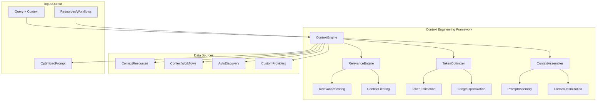
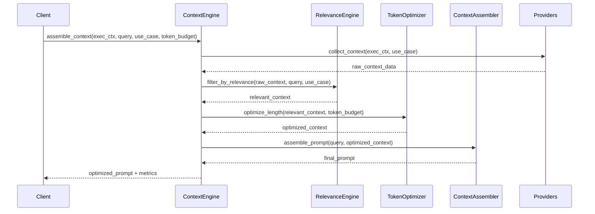
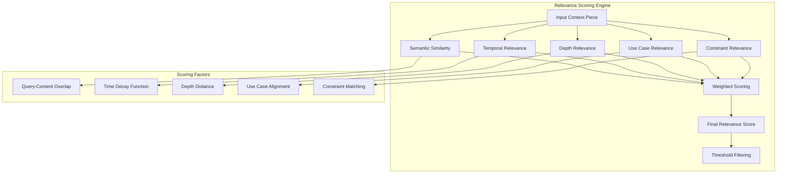
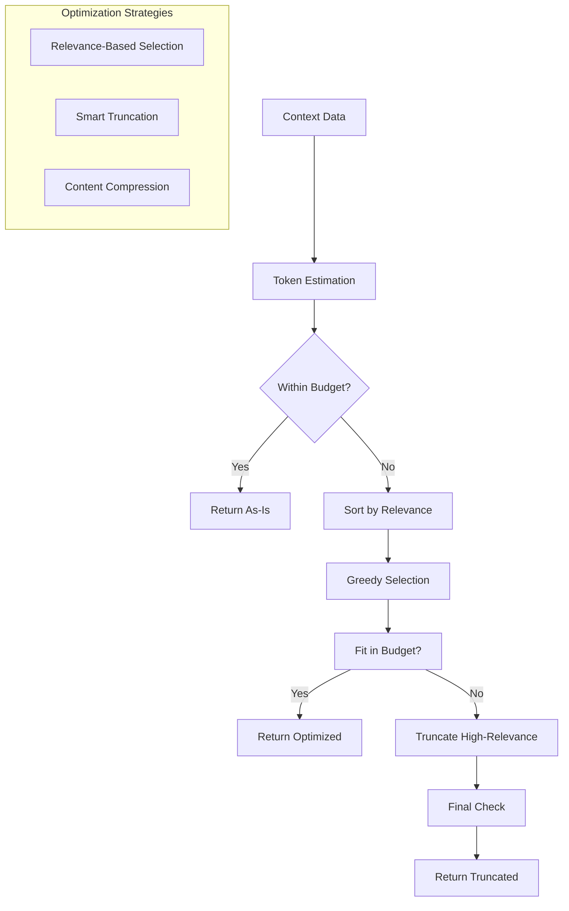

# Context Engineering Framework

## Overview

The Context Engineering Framework (`dana.frameworks.ctxeng`) provides intelligent context assembly for LLM interactions, maximizing relevance while minimizing token usage. The framework extracts proven patterns from `agent.solve()` and provides a general-purpose solution for context engineering across the Dana ecosystem.

## Core Architectural Principle

**"Decide First, Then Engineer Context"**

The CTXENG framework follows a fundamental principle: **make your high-level decisions first, then engage context engineering at the last moment when you have clarity about what you need.**

### **The Principle in Practice:**

1. **Make Strategy Selection First**: Choose your problem-solving approach, agent type, or workflow strategy based on the raw problem
2. **Make Other Significant Choices**: Determine your execution path, resource requirements, and high-level approach
3. **Then Engage Context Engineering**: At the last moment, when you have higher-level clarity, use CTXENG to:
   - **Select the appropriate context-aware prompt template** based on your strategy and requirements
   - **Weave together your context-aware prompt** using the selected template and available resources

### **Why This Matters:**

- **Better Strategy Selection**: Raw problems lead to better strategy choices than pre-processed ones
- **Context-Aware Templates**: Strategy-specific templates provide more relevant context assembly
- **Eliminates Waste**: No context engineering for strategies that don't need it
- **Cleaner Architecture**: Clear separation between decision-making and context assembly
- **Flexible Integration**: Strategies can choose their own context engineering approach

## Core Principles

- **Decide First, Then Engineer Context**: Make high-level decisions before engaging context engineering
- **Relevance-First Design**: Every piece of context must justify its token cost
- **Token Optimization**: Automatic length optimization to fit token budgets
- **Strategy-Driven Templates**: Context assembly based on strategy requirements, not pre-emptive processing
- **Adaptive Learning**: Agents learn from repeated problem-solving experiences to optimize future selections
- **User Profile Intelligence**: Personalized experiences based on user preferences and learned patterns
- **KISS + YAGNI**: Simple, focused interfaces with minimal configuration
- **Performance Conscious**: Efficient algorithms with intelligent caching

## Key Components

- **ContextEngine**: Main orchestrator for context engineering operations
- **RelevanceEngine**: Intelligence core for scoring and filtering context
- **TokenOptimizer**: Length management with relevance preservation
- **ContextAssembler**: Smart prompt assembly with optimization
- **TemplateManager**: Manages prompt templates for different use cases
- **Context Keys Reference**: Comprehensive documentation of expected context data
- **UserProfileManager**: Manages user preferences and learning patterns
- **PatternLearningEngine**: Learns from problem-solving experiences
- **AdaptiveSelectionEngine**: Dynamically selects strategies and context based on learned patterns

## Use Cases

- **Strategy-Driven Problem Solving**: Rich context assembled based on strategy requirements
- **Conversation**: Optimized conversation history and context
- **Analysis**: Data-driven context assembly for analytical tasks
- **Workflow Orchestration**: Context engineering for complex workflow execution
- **Personalized Problem Solving**: User-specific strategies and context based on learned preferences
- **Adaptive Learning**: Continuous improvement through pattern recognition and learning
- **Repetitive Task Optimization**: Automatic optimization of frequently performed tasks
- **Multi-Domain Intelligence**: Domain-specific optimization based on user expertise and patterns

## Quick Start

### **Simple User Interface**

The framework provides a simple interface while maintaining full capability under the hood:

```python
# Basic usage - everything is inferred automatically
result = agent.solve("Calculate 2 + 2")

# With simple overrides
result = agent.solve("Calculate 2 + 2", urgency="quick", domain="technical")

# Advanced usage (for power users)
result = agent.solve(
    "Analyze Q4 sales data and create executive summary",
    urgency="thorough",
    domain="business",
    preferences={
        "detail_level": "executive",
        "output_format": "structured"
    }
)
```

### **Developer Interface**

For developers and strategies, the full CTXENG capability is available:

```python
from dana.frameworks.ctxeng import ContextEngine

# Create context engine with auto-discovery
ctx = ContextEngine.from_agent(agent)

# Use it in strategies - that's it!
prompt = ctx.assemble("Plan a trip to Mexico", template="problem_solving")

# With additional context
context = {"budget": "$3000", "duration": "7 days"}
prompt = ctx.assemble("Plan a trip to Mexico", context, template="problem_solving")

# With options
prompt = ctx.assemble("Plan a trip to Mexico", context, max_tokens=2000, focus="safety")
```

**Note**: CTXENG follows the "Decide First, Then Engineer Context" principle. The correct flow is:
1. **Strategy selection** based on raw problem
2. **High-level decisions** about execution approach and requirements
3. **Then engage CTXENG** with appropriate template when strategy clarity is achieved
4. **Use assembled prompt** for LLM interaction

**Context Keys**: See [CONTEXT_KEYS_REFERENCE.md](CONTEXT_KEYS_REFERENCE.md) for detailed documentation of what context data each template expects.

**User Profiles & Pattern Learning**: See [user_profiles_and_patterns.md](user_profiles_and_patterns.md) for comprehensive documentation of the adaptive learning system.

## Enhanced Architecture with Adaptive Learning

### **Agent Mind Management**

The framework uses an `AgentMind` mixin to manage user profiles, strategy patterns, and context patterns under separate storage directories:

```python
# ~/.models/users/default.json
{
    "expertise_level": "intermediate",
    "domain_preferences": ["general", "technical"],
    "urgency_patterns": {"quick": 0.6, "standard": 0.3, "thorough": 0.1},
    "template_preferences": {
        "problem_solving": "problem_solving",
        "conversation": "conversation",
        "analysis": "analysis"
    },
    "context_depth_preferences": {
        "general": "standard",
        "technical": "comprehensive",
        "business": "detailed"
    }
}
```

### **Pattern Learning & Storage**

The AgentMind mixin manages pattern storage across three specialized directories:

```python
# ~/.models/strategies/default.json
{
    "arithmetic_calculation_simple": {
        "strategy_type": "RecursiveStrategy",
        "success_rate": 0.95,
        "execution_time": 0.8,
        "user_satisfaction": 0.9,
        "usage_count": 47,
        "last_used": "2024-01-15T10:30:00Z",
        "context_requirements": ["minimal", "no_history"],
        "fallback_strategies": ["DirectExecutionStrategy"]
    }
}

# ~/.models/contexts/default.json
{
    "arithmetic_calculation_simple": {
        "template": "problem_solving",
        "scope": "minimal",
        "priority": "relevant",
        "token_efficiency": 0.85,
        "llm_performance": 0.92,
        "usage_count": 47,
        "last_used": "2024-01-15T10:30:00Z",
        "context_keys_used": ["query", "objective"]
    }
}
```

### **Adaptive Selection Process**

The system automatically selects optimal strategies and context configurations based on learned patterns:

```python
def _select_strategy(self, problem: str, user_profile: UserProfile) -> Strategy:
    # 1. Create problem signature
    problem_signature = self._create_problem_signature(problem)
    
    # 2. Look for existing patterns
    strategy_pattern = self._find_strategy_pattern(problem_signature)
    
    if strategy_pattern and strategy_pattern.success_rate > 0.8:
        # Use learned pattern if it's reliable
        strategy_type = strategy_pattern.strategy_type
        self._log_pattern_usage(strategy_pattern, "strategy")
    else:
        # Fall back to user preferences or defaults
        strategy_type = self._get_fallback_strategy(problem, user_profile)
    
    return self._create_strategy(strategy_type)
```

### **AgentMind Mixin Design**

The `AgentMind` mixin handles the complete lifecycle of user profiles, strategy patterns, and context patterns:

```python
class AgentMind:
    """Mixin for managing agent intelligence, learning, and memory."""
    
    def __init__(self):
        self.user_profile: UserProfile = None
        self.strategy_patterns: Dict[str, StrategyPattern] = {}
        self.context_patterns: Dict[str, ContextPattern] = {}
        self.world_model: WorldModel = None  # Future: shared knowledge
        
        # Storage paths
        self.models_dir = Path("~/.models").expanduser()
        self.users_dir = self.models_dir / "users"
        self.strategies_dir = self.models_dir / "strategies"
        self.contexts_dir = self.models_dir / "contexts"
        self.world_dir = self.models_dir / "world"
    
    def initialize_mind(self, user_id: str = "default"):
        """Initialize the agent's mind with user profile and patterns."""
        # Load user profile
        self.user_profile = self._load_user_profile(user_id)
        
        # Load strategy patterns
        self.strategy_patterns = self._load_strategy_patterns(user_id)
        
        # Load context patterns
        self.context_patterns = self._load_context_patterns(user_id)
        
        # Future: Load world model
        # self.world_model = self._load_world_model()
    
    def _load_user_profile(self, user_id: str) -> UserProfile:
        """Load user profile from ~/.users/{user_id}.json"""
        profile_file = self.users_dir / f"{user_id}.json"
        if profile_file.exists():
            with open(profile_file, 'r') as f:
                data = json.load(f)
                return UserProfile(**data)
        else:
            return self._create_default_profile(user_id)
    
    def _load_strategy_patterns(self, user_id: str) -> Dict[str, StrategyPattern]:
        """Load strategy patterns from ~/.strategies/{user_id}.json"""
        patterns_file = self.strategies_dir / f"{user_id}.json"
        if patterns_file.exists():
            with open(patterns_file, 'r') as f:
                data = json.load(f)
                return {k: StrategyPattern(**v) for k, v in data.items()}
        else:
            return {}
    
    def _load_context_patterns(self, user_id: str) -> Dict[str, ContextPattern]:
        """Load context patterns from ~/.contexts/{user_id}.json"""
        patterns_file = self.contexts_dir / f"{user_id}.json"
        if patterns_file.exists():
            with open(patterns_file, 'r') as f:
                data = json.load(f)
                return {k: ContextPattern(**v) for k, v in data.items()}
        else:
            return {}
    
    def update_user_preference(self, key: str, value: Any):
        """Update a user preference and persist to storage."""
        if hasattr(self.user_profile, key):
            setattr(self.user_profile, key, value)
            self._save_user_profile()
    
    def learn_from_execution(self, problem: str, strategy: Strategy, context_config: ContextConfig, result: Result):
        """Learn from execution results and update patterns."""
        problem_signature = self._create_problem_signature(problem)
        
        # Update strategy patterns
        self._update_strategy_pattern(problem_signature, strategy, result)
        
        # Update context patterns
        self._update_context_pattern(problem_signature, context_config, result)
        
        # Persist updated patterns
        self._save_patterns()
    
    def _save_user_profile(self):
        """Save user profile to ~/.users/{user_id}.json"""
        os.makedirs(self.users_dir, exist_ok=True)
        profile_file = self.users_dir / f"{self.user_profile.user_id}.json"
        with open(profile_file, 'w') as f:
            json.dump(self.user_profile.dict(), f, indent=2)
    
    def _save_patterns(self):
        """Save strategy and context patterns to storage."""
        # Save strategy patterns
        os.makedirs(self.strategies_dir, exist_ok=True)
        strategy_file = self.strategies_dir / f"{self.user_profile.user_id}.json"
        with open(strategy_file, 'w') as f:
            json.dump(self.strategy_patterns, f, indent=2, default=str)
        
        # Save context patterns
        os.makedirs(self.contexts_dir, exist_ok=True)
        context_file = self.contexts_dir / f"{self.user_profile.user_id}.json"
        with open(context_file, 'w') as f:
            json.dump(self.context_patterns, f, indent=2, default=str)
    
    def cleanup_expired_patterns(self):
        """Remove expired patterns based on TTL and usage."""
        current_time = datetime.now()
        
        # Cleanup strategy patterns
        expired_strategies = [
            k for k, v in self.strategy_patterns.items()
            if self._is_pattern_expired(v, current_time)
        ]
        for k in expired_strategies:
            del self.strategy_patterns[k]
        
        # Cleanup context patterns
        expired_contexts = [
            k for k, v in self.context_patterns.items()
            if self._is_pattern_expired(v, current_time)
        ]
        for k in expired_contexts:
            del self.context_patterns[k]
    
    def _is_pattern_expired(self, pattern: BasePattern, current_time: datetime) -> bool:
        """Check if a pattern has expired based on TTL and usage."""
        days_since_use = (current_time - pattern.last_used).days
        return (
            pattern.usage_count < self.user_profile.learning_preferences.min_pattern_usage and
            days_since_use > self.user_profile.learning_preferences.pattern_ttl_days
        )
```

### **Learning from Execution Results**

After each problem-solving session, the system learns and updates patterns:

```python
def _learn_from_execution(self, problem: str, strategy: Strategy, context_config: ContextConfig, result: Result):
    problem_signature = self._create_problem_signature(problem)
    
    # Update strategy pattern
    strategy_pattern = self._get_or_create_strategy_pattern(problem_signature)
    strategy_pattern.success_rate = self._update_success_rate(
        strategy_pattern.success_rate, 
        self._assess_success(result), 
        strategy_pattern.usage_count
    )
    
    # Update context pattern
    context_pattern = self._get_or_create_context_pattern(problem_signature)
    context_pattern.llm_performance = self._update_performance(
        context_pattern.llm_performance,
        self._assess_llm_performance(result),
        context_pattern.usage_count
    )
```

## Integration

The framework integrates seamlessly with:
- **Agent solving system** (`agent.solve()`) - Strategy-driven integration with adaptive learning
- **KNOWS framework** for knowledge management - Auto-discovered resources
- **POET framework** for objective inference - Context-aware assembly
- **Memory framework** for conversation history - Built-in providers
- **Workflow framework** for execution context - Pattern recognition and learning

### Integration Philosophy

**"Decide First, Then Engineer Context"**

- **Strategy Selection First**: Raw problems used for strategy selection
- **High-Level Decisions First**: Execution path, resource requirements, and approach determined early
- **Context Engineering Last**: Applied only when strategy clarity is achieved
- **Strategy-Specific Templates**: Different strategies can use different CTXENG templates
- **Clean Separation**: `agent.solve()` doesn't know about context engineering details
- **Flexible Integration**: Strategies can choose to use CTXENG or not

## Performance Targets

- Context assembly: < 100ms for typical use cases
- Relevance scoring: < 50ms per context piece
- Token optimization: < 200ms for complex optimization
- Token usage reduction: > 30% compared to naive assembly
- Pattern learning: < 50ms per execution result
- Adaptive selection: < 20ms for strategy and context selection
- User profile loading: < 10ms for profile and pattern access

## Design Principles

### 1. **Relevance-First Design**
- Every piece of context must justify its token cost
- Multi-factor relevance scoring with configurable thresholds
- Intelligent filtering based on query, use case, and execution context

### 2. **Adaptive Learning Design**
- Learn from every problem-solving experience
- Continuously optimize strategy and context selection
- Balance learned patterns with user preferences
- Evolve patterns based on changing performance

### 3. **User-Centric Design**
- Simple interface for users, full capability for developers
- Personalized experiences based on user profiles
- Intelligent defaults that improve over time
- Progressive disclosure of advanced features

### 4. **Token Optimization**
- Automatic length optimization to fit token budgets
- Smart truncation of high-relevance content
- Token-aware assembly with relevance preservation

### 5. **KISS + YAGNI**
- Simple, focused interfaces
- Minimal configuration for common use cases
- Extensible for advanced customization

### 6. **Performance Conscious**
- Efficient relevance scoring algorithms
- Lazy evaluation of context providers
- Caching of relevance scores where appropriate

## Architecture Components

### 1. **ContextEngine (Main Orchestrator)**

**Purpose**: Central coordinator with simple, explicit API

**Responsibilities**:
- Manage context resources and workflows
- Orchestrate relevance scoring and token optimization
- Provide unified interface for context assembly
- Auto-discover common resources when possible

**Key Methods**:
- `assemble(query, context=None, **options) -> str`
- `add_resource(name, resource) -> None`
- `add_workflow(name, workflow) -> None`
- `discover_resources(obj) -> None`
- `from_agent(agent) -> ContextEngine` (class method)
- `from_workflow(workflow) -> ContextEngine` (class method)

### 2. **ContextResource (Resource Interface)**

**Purpose**: Minimal interface for resources that provide context

**Responsibilities**:
- Provide context data relevant to queries
- Implement simple context extraction methods
- Handle resource-specific data formatting

**Key Methods**:
- `get_context_for(query, **options) -> dict`

**Example Resources**:
- Event history and conversation memory
- Problem context and execution state
- Knowledge bases and domain expertise
- Agent resources and capabilities

### 3. **ContextWorkflow (Workflow Interface)**

**Purpose**: Minimal interface for workflows that provide context

**Responsibilities**:
- Provide current workflow execution state
- Share workflow pattern information
- Handle workflow-specific context extraction

**Key Methods**:
- `get_execution_context() -> dict`
- `get_pattern_info() -> dict`

**Example Workflows**:
- Travel planning workflows
- Safety assessment workflows
- Analysis and reporting workflows
- Problem decomposition workflows

### 4. **RelevanceEngine (Intelligence Core)**

**Purpose**: Score and filter context based on relevance to current query

**Responsibilities**:
- Calculate multi-factor relevance scores
- Apply relevance thresholds and filtering
- Maintain relevance scoring models
- Provide relevance debugging information

**Relevance Factors**:
1. **Semantic Similarity**: Query-content overlap and semantic matching
2. **Temporal Relevance**: Time-based decay (newer = more relevant)
3. **Depth Relevance**: Recursion depth alignment
4. **Use Case Relevance**: Alignment with specific use case requirements
5. **Constraint Relevance**: Match with execution constraints

**Scoring Algorithm**:
```
Final Score = Σ(Factor_Score × Factor_Weight)
where weights are configurable per use case
```

### 5. **TokenOptimizer (Length Management)**

**Purpose**: Optimize context length while maintaining relevance

**Responsibilities**:
- Estimate token usage for context pieces
- Apply length optimization strategies
- Smart truncation of high-relevance content
- Maintain minimum relevance thresholds

**Optimization Strategies**:
1. **Relevance-Based Selection**: Prioritize highest relevance pieces
2. **Smart Truncation**: Truncate content while preserving meaning
3. **Content Compression**: Remove redundant or low-value information
4. **Adaptive Budgeting**: Adjust based on use case requirements

### 6. **ContextAssembler (Prompt Assembly)**

**Purpose**: Assemble optimized context into final prompts

**Responsibilities**:
- Format context according to use case templates
- Apply final length and relevance checks
- Generate assembly metadata and metrics
- Support multiple output formats (XML, text)

### 7. **TemplateManager (Template Management)**

**Purpose**: Centralized management of prompt templates

**Responsibilities**:
- Load and manage templates for different use cases
- Support multiple output formats (XML, text)
- Provide template selection and auto-detection
- Maintain template consistency across the framework

**Key Methods**:
- `get_template(template_name, format_type) -> BaseTemplate`
- `list_templates(format_type) -> list[str]`
- `load_templates() -> None`

## Data Models

### 1. **ExecutionContext**

**Purpose**: Persistent execution state that flows through context engineering

**Key Fields**:
- `execution_id`: Unique identifier for execution session
- `conversation_turn`: Current conversation iteration
- `current_depth`: Current recursion depth
- `max_depth`: Maximum allowed recursion depth
- `problem_statement`: Current problem being solved
- `objective`: Current objective
- `constraints`: Execution constraints
- `assumptions`: Current assumptions
- `event_history`: Execution event timeline
- `workflow_stack`: Current workflow chain
- `performance_metrics`: Execution performance data

### 2. **ContextPiece**

**Purpose**: Individual piece of context with metadata

**Key Fields**:
- `content`: The actual context data
- `type`: Content type (text, structured, list, etc.)
- `relevance_score`: Calculated relevance score
- `source`: Source provider identifier
- `metadata`: Additional context-specific data
- `estimated_tokens`: Token usage estimate

### 3. **AssemblyResult**

**Purpose**: Result of context assembly operation

**Key Fields**:
- `optimized_prompt`: Final assembled prompt
- `relevance_metrics`: Relevance scoring details
- `token_usage`: Token consumption statistics
- `filtering_summary`: What was included/excluded
- `optimization_details`: Length optimization details

## Use Case Support

### 1. **Strategy-Driven Problem Solving**

**Context Requirements**:
- Problem statement and objective
- Execution constraints and assumptions
- Recent execution history
- Successful patterns and constraint violations
- Performance metrics and learning insights

**Assembly Rules**:
- High priority for problem-specific context
- Include execution timeline for debugging
- Maintain constraint and assumption context
- Prioritize recent successful patterns

**Integration Pattern**:
- Strategy selection happens first based on raw problem
- Strategy decides what context engineering is needed
- Strategy calls CTXENG with appropriate template
- Strategy uses assembled prompt for LLM interaction

### 2. **Conversation**

**Context Requirements**:
- Recent conversation history
- User preferences and session context
- Previous interaction patterns

**Assembly Rules**:
- Focus on recent conversation turns
- Include user preference context
- Maintain conversation flow continuity

### 3. **Analysis**

**Context Requirements**:
- Data context and analysis goals
- Previous analysis results
- Domain knowledge and constraints

**Assembly Rules**:
- Prioritize data and goal context
- Include relevant previous analyses
- Maintain domain knowledge context

## Simplified API Design

### 1. **Core API Philosophy**

**"Make the common case trivial, the uncommon case possible"**

- **Common case**: `ctx.assemble("query")` - just works
- **Uncommon case**: `ctx.assemble("query", context, max_tokens=5000, focus="safety")` - still simple
- **Integration**: One line change in existing code
- **Debugging**: One method to trace and understand
- **Templates**: Centralized management with client selection

### 2. **Single Method Interface**

```python
class ContextEngine:
    def assemble(self, 
                query: str,
                context: dict = None,
                template: str = None,
                **options) -> str:
        """
        Assemble optimized context for the query.
        
        Args:
            query: What the user is asking
            context: Optional additional context
            template: Template name (e.g., "problem_solving", "conversation")
            **options: Simple configuration options
            
        Returns:
            Optimized prompt string (XML or text format)
        """
        pass

# Usage patterns
ctx = ContextEngine()                    # Create once
prompt = ctx.assemble(query)             # Basic usage
prompt = ctx.assemble(query, context)    # With context
prompt = ctx.assemble(query, context, template="problem_solving")  # With template
prompt = ctx.assemble(query, context, max_tokens=2000)  # With options
```

### 4. **Resource and Workflow Registration**

```python
# Manual registration (explicit)
ctx = ContextEngine()
ctx.add_resource("event_history", agent._global_event_history)
ctx.add_resource("knowledge_base", knows_client)
ctx.add_workflow("travel_planning", travel_workflow)

# Auto-discovery (convenient)
ctx = ContextEngine()
ctx.discover_resources(agent)  # One line discovers everything

# Factory method (most convenient)
ctx = ContextEngine.from_agent(agent)  # Creates and configures automatically
```

### 4. **Integration Examples**

```python
# In Agent System (Enhanced with AgentMind)
class AgentInstance:
    def __init__(self, struct_type: AgentType, values: dict[str, Any]):
        # ... existing code ...
        # Initialize agent mind for learning and personalization
        self._mind = AgentMind()
        self._mind.initialize_mind(user_id=values.get("user_id", "default"))
        
        # Context engine available for strategies to use
        self._context_engine = ContextEngine.from_agent(self)
    
    def solve(self, problem_or_workflow: str | WorkflowInstance, **kwargs) -> Any:
        # ... existing code ...
        
        # Apply user overrides to mind
        if kwargs:
            self._mind.apply_user_overrides(**kwargs)
        
        # Pass raw problem to plan() - let strategy decide on context engineering
        workflow = self.plan(problem_or_workflow, **kwargs)
        
        # Execute and learn from results
        result = workflow.execute(sandbox_context or self._create_sandbox_context(), **kwargs)
        
        # Learn from execution
        self._mind.learn_from_execution(problem_or_workflow, workflow.strategy, workflow.context_config, result)
        
        return result

# In Strategy (Enhanced with AgentMind)
class RecursiveStrategy:
    def create_workflow(self, problem: str, context: ProblemContext, agent_instance, sandbox_context=None):
        # Strategy can access agent mind for personalized decisions
        if hasattr(agent_instance, '_mind'):
            # Get user preferences and learned patterns
            user_profile = agent_instance._mind.user_profile
            strategy_patterns = agent_instance._mind.strategy_patterns
            
            # Use learned patterns to optimize strategy selection
            optimal_template = self._select_optimal_template(problem, user_profile, strategy_patterns)
            optimal_scope = self._select_optimal_scope(problem, user_profile, strategy_patterns)
        else:
            # Fall back to defaults
            optimal_template = "problem_solving"
            optimal_scope = "standard"
        
        # Strategy decides what context engineering is needed
        if hasattr(agent_instance, '_context_engine'):
            # Use CTXENG for rich context assembly with learned optimizations
            rich_prompt = agent_instance._context_engine.assemble(
                problem, 
                template=optimal_template,
                context=context.to_dict(),
                scope=optimal_scope
            )
        else:
            # Fall back to basic prompt
            rich_prompt = self._build_basic_prompt(problem, context)
        
        # Use rich prompt for LLM interaction
        dana_code = self._get_llm_response(rich_prompt, agent_instance, sandbox_context)
        
        # Continue with workflow creation...
```

## Output Formats and Templates

### 1. **XML Format (Default)**

The framework generates structured XML prompts that provide:
- **Clear hierarchy**: Structured context information
- **Parseable format**: Better LLM understanding and parsing
- **Human readable**: Easy debugging and development
- **Extensible**: Easy to add new context types

**Example XML Output**:
```xml
<context>
<query>Plan a trip to Mexico with safety focus</query>
<problem_context>
<objective>Create detailed travel plan with safety considerations</objective>
<constraints>
<constraint type="budget">$3000</constraint>
<constraint type="duration">7 days</constraint>
</constraints>
</problem_context>
<workflow_context>
<current_workflow>mexico_trip_planning_001</current_workflow>
<current_step>safety_planning</current_step>
<progress>33%</progress>
</workflow_context>
<domain_knowledge>
<category name="travel_safety">
<fact>Safety zones: Cancun, Puerto Vallarta, Mexico City Centro</fact>
<fact>Avoid traveling at night in certain areas</fact>
</category>
</domain_knowledge>
</context>
```

### 2. **Text Format (Alternative)**

Traditional text-based prompts for compatibility with existing systems.

### 3. **Template Management**

**Centralized Template System**:
- **Location**: All templates managed within the ctxeng framework
- **Organization**: By format (XML, text) and use case
- **Selection**: Client specifies template or auto-detection

**Template Organization**:
```
dana/frameworks/ctxeng/templates/
├── xml/                    # XML format templates
│   ├── problem_solving.xml
│   ├── conversation.xml
│   ├── analysis.xml
│   └── general.xml
└── text/                   # Text format templates
    ├── problem_solving.txt
    ├── conversation.txt
    ├── analysis.txt
    └── general.txt
```

**Available Templates**:
- **problem_solving**: Rich context for complex problem solving
- **conversation**: Optimized for conversational interactions  
- **analysis**: Data-driven analysis and reporting
- **general**: Default template for unspecified use cases

**Template Details**: Each template expects specific context dictionary keys. See [CONTEXT_KEYS_REFERENCE.md](CONTEXT_KEYS_REFERENCE.md) for comprehensive documentation of:
- Required vs. optional context keys
- Example context data structures
- Output XML/text formats
- When to use each template

**Template Selection**:
```python
# Explicit template selection
prompt = ctx.assemble("query", template="problem_solving")

# Auto-detection (recommended)
prompt = ctx.assemble("query")  # Framework chooses best template

# Template override
prompt = ctx.assemble("query", template="conversation")

# Format selection
ctx = ContextEngine(format_type="xml")  # XML output
ctx = ContextEngine(format_type="text") # Text output
```

## Configuration and Customization

### 1. **AgentMind Storage Management**

**Storage Structure**:
```
~/.models/                     # All agent models and learning data
├── users/                     # User profiles and preferences
│   ├── default.json           # Default user profile
│   ├── ctn.json               # Specific user profile
│   └── shared.json            # Shared user preferences
├── strategies/                 # Strategy patterns and learning
│   ├── default.json           # Default strategy patterns
│   ├── ctn.json               # User-specific strategy patterns
│   └── global.json            # Global strategy patterns
├── contexts/                   # Context patterns and learning
│   ├── default.json           # Default context patterns
│   ├── ctn.json               # User-specific context patterns
│   └── global.json            # Global context patterns
└── world/                     # Future: World model and shared knowledge
    ├── domain_knowledge.json  # Domain-specific knowledge
    ├── shared_patterns.json   # Cross-user patterns
    └── system_intelligence.json # System-level learning
```

**AgentMind Configuration Interface**:
```python
from dana.builtin_types.agent.mind import AgentMind

class AgentMind:
    def __init__(self):
        # Storage paths
        self.models_dir = Path("~/.models").expanduser()
        self.users_dir = self.models_dir / "users"
        self.strategies_dir = self.models_dir / "strategies"
        self.contexts_dir = self.models_dir / "contexts"
        self.world_dir = self.models_dir / "world"
    
    def initialize_mind(self, user_id: str = "default"):
        """Initialize agent mind with user profile and patterns"""
    
    def update_user_preference(self, key: str, value: Any):
        """Update user preference and persist to storage"""
    
    def learn_from_execution(self, problem: str, strategy: Strategy, context_config: ContextConfig, result: Result):
        """Learn from execution results and update patterns"""
    
    def cleanup_expired_patterns(self):
        """Remove expired patterns based on TTL and usage"""
```

### 2. **Pattern Learning Configuration**

**Learning Parameters**:
```python
class LearningConfig:
    min_pattern_usage: int = 3          # Minimum uses before pattern is considered reliable
    success_rate_threshold: float = 0.8 # Minimum success rate for pattern usage
    pattern_ttl_days: int = 30          # Days before unused patterns are cleaned up
    learning_rate: float = 0.1          # How quickly patterns adapt to new data
    cross_user_learning: bool = False   # Whether to learn from other users' patterns
```

### 3. **Lifecycle Management**

**Initialization**:
- **Agent Creation**: Load user profile and patterns from storage
- **First Use**: Create default profiles if none exist
- **User Switch**: Load different user profile and patterns

**Runtime Updates**:
- **User Preferences**: Update when user explicitly changes preferences
- **Pattern Learning**: Update after each problem-solving execution
- **Performance Metrics**: Track success rates, execution times, user satisfaction

**Maintenance**:
- **Pattern Cleanup**: Remove expired patterns based on TTL and usage
- **Storage Optimization**: Compress old patterns, archive unused data
- **Cross-User Learning**: Share successful patterns across similar users

**Future Extensions**:
- **World Model**: Load shared knowledge and domain expertise
- **Collaborative Learning**: Learn from team and organization patterns
- **System Intelligence**: Aggregate learning across all agents

### 4. **Resource and Workflow Registration**

**Default Resources** (auto-discovered):
- Event history and conversation memory
- Problem context and execution state
- Agent resources and capabilities
- User profile and learning patterns

**Custom Resource Interface**:
```python
class ContextResource:
    def get_context_for(self, query: str, **options) -> dict
```

**Custom Workflow Interface**:
```python
class ContextWorkflow:
    def get_execution_context(self) -> dict
    def get_pattern_info(self) -> dict
```

### 2. **Use Case Rules**

**Configurable Parameters**:
- Required context types
- Optional context types
- Assembly order preferences
- Token budget allocations
- Relevance thresholds

### 3. **Template Customization**

**Default Templates**:
- Problem solving template
- Conversation template
- Analysis template

**Custom Template Interface**:
```python
class ContextTemplate:
    def format_context(self, query, context_data, use_case) -> str
```

## Performance Characteristics

### 1. **Scalability**

**Context Size Limits**:
- Maximum context pieces: 20
- Maximum total tokens: 10,000
- Maximum individual piece: 2,000 tokens

**Performance Targets**:
- Context assembly: < 100ms for typical use cases
- Relevance scoring: < 50ms per context piece
- Token optimization: < 200ms for complex optimization

### 2. **Memory Management**

**Caching Strategy**:
- Relevance scores cached for session duration
- Context piece metadata cached
- Assembly results cached with TTL

**Memory Limits**:
- Maximum cached context: 100 pieces
- Maximum cache size: 50MB
- Cache TTL: 1 hour

## Integration Points

### 1. **agent.solve() Integration**

**Integration Points**:
- Execution context creation
- Context assembly during problem solving
- Recursive context propagation
- Learning pattern extraction

**Data Flow**:
```
agent.solve() → ExecutionContext → ContextEngine → OptimizedPrompt → LLM
```

### 2. **Framework Integration**

**Supported Frameworks**:
- KNOWS framework
- POET framework
- Memory framework
- Workflow framework

### 3. **External Systems**

**Integration Capabilities**:
- Custom context providers
- External knowledge bases
- Real-time data sources
- User preference systems

## Quality Assurance

### 1. **Relevance Validation**

**Metrics**:
- Relevance score distribution
- Context piece inclusion/exclusion rates
- Query-context alignment scores

**Validation Methods**:
- Automated relevance testing
- Human evaluation of context quality
- A/B testing of different assembly strategies

### 2. **Token Efficiency**

**Metrics**:
- Token usage per context piece
- Compression ratios
- Relevance-to-token ratios

**Optimization Targets**:
- Minimum 0.7 relevance score for included pieces
- Maximum 20% token overhead
- Efficient use of available token budget

## Future Extensions

### 1. **Advanced Relevance Models**

**Planned Features**:
- Embedding-based semantic similarity
- Learning-based relevance scoring
- Context-aware relevance adaptation

### 2. **Enhanced Optimization**

**Planned Features**:
- ML-based content compression
- Dynamic token budget allocation
- Context piece synthesis

### 3. **Integration Enhancements**

**Planned Features**:
- Real-time context streaming
- Multi-modal context support
- Collaborative context engineering

## API Benefits

### 1. **Simplicity**
- **Single method**: `assemble()` is the only method clients need to know
- **Zero configuration**: Works out of the box with sensible defaults
- **Clear interface**: Input query, optional context, optional options

### 2. **Expressiveness**
- **Flexible context**: Accepts any dictionary as additional context
- **Extensible options**: `**options` handles any configuration needs
- **Rich integration**: Auto-discovery handles common cases automatically

### 3. **Integration Friendly**
- **Zero friction**: Drop into existing code with one line
- **No interface changes**: Works with existing data structures
- **Gradual adoption**: Can start simple and add complexity as needed

## Success Criteria

### 1. **Relevance Metrics**
- Average relevance score > 0.8
- Context piece inclusion rate > 70%
- Query-context alignment > 0.75

### 2. **Efficiency Metrics**
- Token usage reduction > 30%
- Assembly time < 100ms
- Memory usage < 50MB

### 3. **Integration Metrics**
- Seamless agent.solve() integration
- Support for 3+ use cases
- Custom provider success rate > 90%

### 4. **API Usability Metrics**
- **Time to first use**: < 5 minutes for basic integration
- **Lines of code**: < 3 lines for typical usage
- **Configuration overhead**: < 10 lines for advanced setup
- **Learning curve**: < 15 minutes for full API understanding

### 5. **Output Format Benefits**
- **XML Format**: Structured, parseable prompts for better LLM performance
- **Template System**: Centralized management with client selection
- **Format Flexibility**: Support for XML (default) and text formats
- **Consistency**: Standardized prompt structure across all use cases

## Architecture Diagrams

### High-Level Architecture



### Data Flow Architecture

```mermaid
flowchart LR
    subgraph "Input Layer"
        A[Query]
        B[Context Dict]
        C[Options]
        D[Resources/Workflows]
    end
    
    subgraph "Processing Pipeline"
        E[Resource Discovery]
        F[Relevance Scoring]
        G[Token Optimization]
        H[Smart Assembly]
    end
    
    subgraph "Output Layer"
        I[Optimized Prompt]
        J[Metadata (Optional)]
        K[Debug Info (Optional)]
    end
    
    A --> E
    B --> E
    C --> E
    D --> E
    
    E --> F
    F --> G
    G --> H
    
    H --> I
    H --> J
    H --> K
```

### Component Interaction



### Relevance Scoring Architecture



### Token Optimization Flow



## Future Enhancements

### **Advanced Learning Features**
- **Multi-modal learning**: Learn from different types of user interactions
- **Collaborative learning**: Share patterns across similar users
- **Predictive selection**: Predict optimal strategies before execution
- **A/B testing**: Test different approaches to optimize learning

### **World Model Integration**
- **Domain Knowledge**: Shared expertise across problem domains
- **Cross-User Intelligence**: Aggregate learning from similar users
- **System-Level Patterns**: Identify global optimization opportunities
- **Knowledge Evolution**: Continuous improvement of shared knowledge

### **Enterprise Features**
- **Team learning**: Learn from team problem-solving patterns
- **Compliance-aware learning**: Ensure patterns meet compliance requirements
- **Audit trails**: Track pattern usage and learning decisions
- **Performance analytics**: Detailed analysis of learning effectiveness

## Conclusion

The enhanced CTXENG framework provides a comprehensive solution for context engineering that integrates seamlessly with the Dana agent system through the **"Decide First, Then Engineer Context"** principle, now enhanced with adaptive learning and user profile intelligence.

### **Key Architectural Principles**

1. **Decide First**: Make strategy selection and high-level decisions based on raw problems
2. **Then Engineer Context**: Engage CTXENG only when strategy clarity is achieved
3. **Strategy-Specific Templates**: Different strategies can use different CTXENG templates for optimal context assembly
4. **Adaptive Learning**: Continuously improve performance through pattern recognition and learning
5. **User Profile Intelligence**: Personalized experiences based on user preferences and learned patterns
6. **Clean Separation**: `agent.solve()` doesn't know about context engineering details
7. **Flexible Integration**: Strategies can choose to use CTXENG or fall back to basic prompts

### **Benefits of the Enhanced Architecture**

- **Cleaner Separation of Concerns**: Strategy selection and context engineering are properly separated
- **Better Strategy Flexibility**: Each strategy can optimize its own context engineering approach
- **Intelligent Automation**: Agents automatically select optimal strategies and context configurations
- **Personalized Experience**: User preferences and learned patterns create tailored approaches
- **Continuous Improvement**: System performance improves over time through pattern learning
- **Simple Interface**: Users get powerful capabilities without complex configuration
- **Improved Testing**: Raw problems can be tested without CTXENG complexity
- **Easier Debugging**: Clear flow from problem to solution
- **Extensible Design**: New strategies can define their own context engineering needs

### **Enhanced Integration Summary**

The framework integrates seamlessly with:
- **Agent solving system** - Strategy-driven integration with adaptive learning
- **KNOWS framework** - Auto-discovered knowledge resources
- **POET framework** - Context-aware objective inference
- **Memory framework** - Built-in conversation history providers
- **Workflow framework** - Execution context pattern recognition and learning
- **User Profile System** - Persistent user preferences and learning patterns
- **Pattern Learning Engine** - Continuous improvement through experience

### **Real-World Impact**

- **Individual Users**: Get personalized, intelligent problem-solving that improves over time
- **Developers**: Have access to enterprise-grade context engineering capabilities
- **Enterprises**: Can deploy intelligent agents that learn and adapt to their specific needs
- **System Administrators**: Benefit from self-improving systems that require minimal maintenance

This specification provides a comprehensive framework for context engineering that balances relevance maximization with token minimization, while maintaining the simplicity and extensibility needed for the Dana ecosystem. The enhanced architecture transforms CTXENG from a static configuration-driven system to a dynamic, learning system that gets smarter with each interaction.
