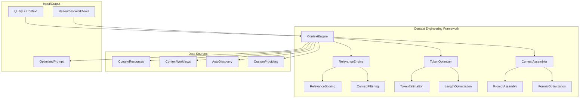
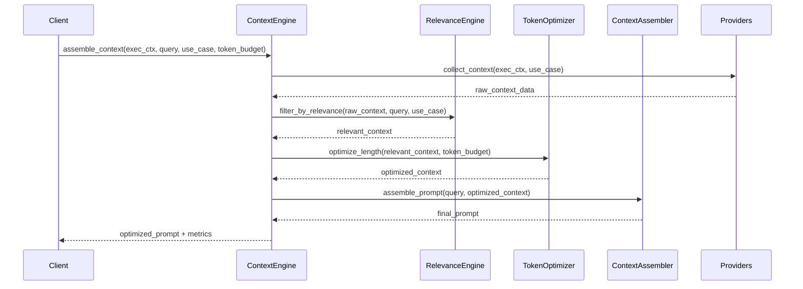
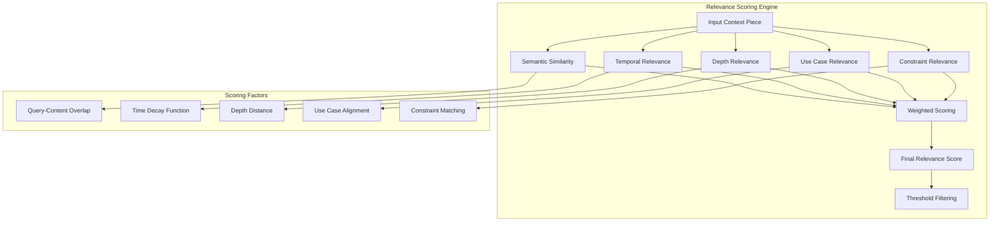
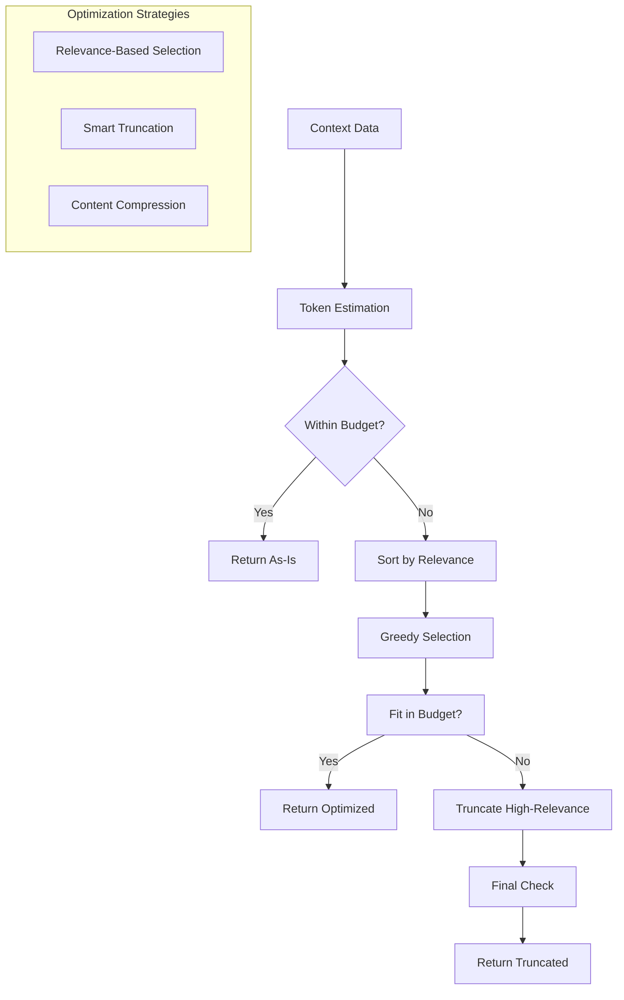

# Context Engineering Framework

## Overview

The Context Engineering Framework (`dana.frameworks.ctxeng`) provides intelligent context assembly for LLM interactions, maximizing relevance while minimizing token usage. The framework extracts proven patterns from `agent.solve()` and provides a general-purpose solution for context engineering across the Dana ecosystem.

## Core Principles

- **Relevance-First Design**: Every piece of context must justify its token cost
- **Token Optimization**: Automatic length optimization to fit token budgets
- **KISS + YAGNI**: Simple, focused interfaces with minimal configuration
- **Performance Conscious**: Efficient algorithms with intelligent caching

## Key Components

- **ContextEngine**: Main orchestrator for context engineering operations
- **RelevanceEngine**: Intelligence core for scoring and filtering context
- **TokenOptimizer**: Length management with relevance preservation
- **ContextAssembler**: Smart prompt assembly with optimization

## Use Cases

- **Problem Solving**: Rich context for agent.solve() operations
- **Conversation**: Optimized conversation history and context
- **Analysis**: Data-driven context assembly for analytical tasks

## Quick Start

```python
from dana.frameworks.ctxeng import ContextEngine

# Create context engine with auto-discovery
ctx = ContextEngine.from_agent(agent)

# Use it - that's it!
prompt = ctx.assemble("Plan a trip to Mexico")

# With additional context
context = {"budget": "$3000", "duration": "7 days"}
prompt = ctx.assemble("Plan a trip to Mexico", context)

# With options
prompt = ctx.assemble("Plan a trip to Mexico", context, max_tokens=2000, focus="safety")
```

## Integration

The framework integrates seamlessly with:
- **Agent solving system** (`agent.solve()`) - One line integration
- **KNOWS framework** for knowledge management - Auto-discovered resources
- **POET framework** for objective inference - Context-aware assembly
- **Memory framework** for conversation history - Built-in providers
- **Workflow framework** for execution context - Pattern recognition

### Integration Philosophy

**"Explicit where it matters, automatic where it's safe"**

- **Resources**: Explicitly provided (no magic)
- **Discovery**: Automatic for common patterns (convenient)
- **Usage**: Single method (simple)
- **Configuration**: Optional with sensible defaults (flexible)

## Performance Targets

- Context assembly: < 100ms for typical use cases
- Relevance scoring: < 50ms per context piece
- Token optimization: < 200ms for complex optimization
- Token usage reduction: > 30% compared to naive assembly

## Design Principles

### 1. **Relevance-First Design**
- Every piece of context must justify its token cost
- Multi-factor relevance scoring with configurable thresholds
- Intelligent filtering based on query, use case, and execution context

### 2. **Token Optimization**
- Automatic length optimization to fit token budgets
- Smart truncation of high-relevance content
- Token-aware assembly with relevance preservation

### 3. **KISS + YAGNI**
- Simple, focused interfaces
- Minimal configuration for common use cases
- Extensible for advanced customization

### 4. **Performance Conscious**
- Efficient relevance scoring algorithms
- Lazy evaluation of context providers
- Caching of relevance scores where appropriate

## Architecture Components

### 1. **ContextEngine (Main Orchestrator)**

**Purpose**: Central coordinator with simple, explicit API

**Responsibilities**:
- Manage context resources and workflows
- Orchestrate relevance scoring and token optimization
- Provide unified interface for context assembly
- Auto-discover common resources when possible

**Key Methods**:
- `assemble(query, context=None, **options) -> str`
- `add_resource(name, resource) -> None`
- `add_workflow(name, workflow) -> None`
- `discover_resources(obj) -> None`
- `from_agent(agent) -> ContextEngine` (class method)
- `from_workflow(workflow) -> ContextEngine` (class method)

### 2. **ContextResource (Resource Interface)**

**Purpose**: Minimal interface for resources that provide context

**Responsibilities**:
- Provide context data relevant to queries
- Implement simple context extraction methods
- Handle resource-specific data formatting

**Key Methods**:
- `get_context_for(query, **options) -> dict`

**Example Resources**:
- Event history and conversation memory
- Problem context and execution state
- Knowledge bases and domain expertise
- Agent resources and capabilities

### 3. **ContextWorkflow (Workflow Interface)**

**Purpose**: Minimal interface for workflows that provide context

**Responsibilities**:
- Provide current workflow execution state
- Share workflow pattern information
- Handle workflow-specific context extraction

**Key Methods**:
- `get_execution_context() -> dict`
- `get_pattern_info() -> dict`

**Example Workflows**:
- Travel planning workflows
- Safety assessment workflows
- Analysis and reporting workflows
- Problem decomposition workflows

### 4. **RelevanceEngine (Intelligence Core)**

**Purpose**: Score and filter context based on relevance to current query

**Responsibilities**:
- Calculate multi-factor relevance scores
- Apply relevance thresholds and filtering
- Maintain relevance scoring models
- Provide relevance debugging information

**Relevance Factors**:
1. **Semantic Similarity**: Query-content overlap and semantic matching
2. **Temporal Relevance**: Time-based decay (newer = more relevant)
3. **Depth Relevance**: Recursion depth alignment
4. **Use Case Relevance**: Alignment with specific use case requirements
5. **Constraint Relevance**: Match with execution constraints

**Scoring Algorithm**:
```
Final Score = Σ(Factor_Score × Factor_Weight)
where weights are configurable per use case
```

### 5. **TokenOptimizer (Length Management)**

**Purpose**: Optimize context length while maintaining relevance

**Responsibilities**:
- Estimate token usage for context pieces
- Apply length optimization strategies
- Smart truncation of high-relevance content
- Maintain minimum relevance thresholds

**Optimization Strategies**:
1. **Relevance-Based Selection**: Prioritize highest relevance pieces
2. **Smart Truncation**: Truncate content while preserving meaning
3. **Content Compression**: Remove redundant or low-value information
4. **Adaptive Budgeting**: Adjust based on use case requirements

### 6. **ContextAssembler (Prompt Assembly)**

**Purpose**: Assemble optimized context into final prompts

**Responsibilities**:
- Format context according to use case templates
- Apply final length and relevance checks
- Generate assembly metadata and metrics
- Support multiple output formats (XML, text)

### 7. **TemplateManager (Template Management)**

**Purpose**: Centralized management of prompt templates

**Responsibilities**:
- Load and manage templates for different use cases
- Support multiple output formats (XML, text)
- Provide template selection and auto-detection
- Maintain template consistency across the framework

**Key Methods**:
- `get_template(template_name, format_type) -> BaseTemplate`
- `list_templates(format_type) -> list[str]`
- `load_templates() -> None`

## Data Models

### 1. **ExecutionContext**

**Purpose**: Persistent execution state that flows through context engineering

**Key Fields**:
- `execution_id`: Unique identifier for execution session
- `conversation_turn`: Current conversation iteration
- `current_depth`: Current recursion depth
- `max_depth`: Maximum allowed recursion depth
- `problem_statement`: Current problem being solved
- `objective`: Current objective
- `constraints`: Execution constraints
- `assumptions`: Current assumptions
- `event_history`: Execution event timeline
- `workflow_stack`: Current workflow chain
- `performance_metrics`: Execution performance data

### 2. **ContextPiece**

**Purpose**: Individual piece of context with metadata

**Key Fields**:
- `content`: The actual context data
- `type`: Content type (text, structured, list, etc.)
- `relevance_score`: Calculated relevance score
- `source`: Source provider identifier
- `metadata`: Additional context-specific data
- `estimated_tokens`: Token usage estimate

### 3. **AssemblyResult**

**Purpose**: Result of context assembly operation

**Key Fields**:
- `optimized_prompt`: Final assembled prompt
- `relevance_metrics`: Relevance scoring details
- `token_usage`: Token consumption statistics
- `filtering_summary`: What was included/excluded
- `optimization_details`: Length optimization details

## Use Case Support

### 1. **Problem Solving (agent.solve())**

**Context Requirements**:
- Problem statement and objective
- Execution constraints and assumptions
- Recent execution history
- Successful patterns and constraint violations
- Performance metrics and learning insights

**Assembly Rules**:
- High priority for problem-specific context
- Include execution timeline for debugging
- Maintain constraint and assumption context
- Prioritize recent successful patterns

### 2. **Conversation**

**Context Requirements**:
- Recent conversation history
- User preferences and session context
- Previous interaction patterns

**Assembly Rules**:
- Focus on recent conversation turns
- Include user preference context
- Maintain conversation flow continuity

### 3. **Analysis**

**Context Requirements**:
- Data context and analysis goals
- Previous analysis results
- Domain knowledge and constraints

**Assembly Rules**:
- Prioritize data and goal context
- Include relevant previous analyses
- Maintain domain knowledge context

## Simplified API Design

### 1. **Core API Philosophy**

**"Make the common case trivial, the uncommon case possible"**

- **Common case**: `ctx.assemble("query")` - just works
- **Uncommon case**: `ctx.assemble("query", context, max_tokens=5000, focus="safety")` - still simple
- **Integration**: One line change in existing code
- **Debugging**: One method to trace and understand
- **Templates**: Centralized management with client selection

### 2. **Single Method Interface**

```python
class ContextEngine:
    def assemble(self, 
                query: str,
                context: dict = None,
                template: str = None,
                **options) -> str:
        """
        Assemble optimized context for the query.
        
        Args:
            query: What the user is asking
            context: Optional additional context
            template: Template name (e.g., "problem_solving", "conversation")
            **options: Simple configuration options
            
        Returns:
            Optimized prompt string (XML or text format)
        """
        pass

# Usage patterns
ctx = ContextEngine()                    # Create once
prompt = ctx.assemble(query)             # Basic usage
prompt = ctx.assemble(query, context)    # With context
prompt = ctx.assemble(query, context, template="problem_solving")  # With template
prompt = ctx.assemble(query, context, max_tokens=2000)  # With options
```

### 3. **Resource and Workflow Registration**

```python
# Manual registration (explicit)
ctx = ContextEngine()
ctx.add_resource("event_history", agent._global_event_history)
ctx.add_resource("knowledge_base", knows_client)
ctx.add_workflow("travel_planning", travel_workflow)

# Auto-discovery (convenient)
ctx = ContextEngine()
ctx.discover_resources(agent)  # One line discovers everything

# Factory method (most convenient)
ctx = ContextEngine.from_agent(agent)  # Creates and configures automatically
```

### 4. **Integration Examples**

```python
# In Agent System (Zero Changes)
class AgentInstance:
    def __init__(self, struct_type: AgentType, values: dict[str, Any]):
        # ... existing code ...
        self._context_engine = ContextEngine.from_agent(self)  # Just create it
    
    def solve(self, problem_or_workflow: str | WorkflowInstance, **kwargs) -> Any:
        # ... existing code ...
        
        # Add one line for rich context (XML format by default)
        rich_prompt = self._context_engine.assemble(
            problem_or_workflow if isinstance(problem_or_workflow, str) else "workflow execution"
        )
        
        # rich_prompt now contains structured XML like:
        # <context><query>Plan a trip to Mexico</query><problem_context>...</problem_context></context>
        
        # Use rich prompt instead of basic problem
        workflow = self.plan(rich_prompt, **kwargs)
        return workflow.execute(sandbox_context or self._create_sandbox_context(), **kwargs)
```

## Output Formats and Templates

### 1. **XML Format (Default)**

The framework generates structured XML prompts that provide:
- **Clear hierarchy**: Structured context information
- **Parseable format**: Better LLM understanding and parsing
- **Human readable**: Easy debugging and development
- **Extensible**: Easy to add new context types

**Example XML Output**:
```xml
<context>
<query>Plan a trip to Mexico with safety focus</query>
<problem_context>
<objective>Create detailed travel plan with safety considerations</objective>
<constraints>
<constraint type="budget">$3000</constraint>
<constraint type="duration">7 days</constraint>
</constraints>
</problem_context>
<workflow_context>
<current_workflow>mexico_trip_planning_001</current_workflow>
<current_step>safety_planning</current_step>
<progress>33%</progress>
</workflow_context>
<domain_knowledge>
<category name="travel_safety">
<fact>Safety zones: Cancun, Puerto Vallarta, Mexico City Centro</fact>
<fact>Avoid traveling at night in certain areas</fact>
</category>
</domain_knowledge>
</context>
```

### 2. **Text Format (Alternative)**

Traditional text-based prompts for compatibility with existing systems.

### 3. **Template Management**

**Centralized Template System**:
- **Location**: All templates managed within the ctxeng framework
- **Organization**: By format (XML, text) and use case
- **Selection**: Client specifies template or auto-detection

**Template Organization**:
```
dana/frameworks/ctxeng/templates/
├── xml/                    # XML format templates
│   ├── problem_solving.xml
│   ├── conversation.xml
│   ├── analysis.xml
│   └── general.xml
└── text/                   # Text format templates
    ├── problem_solving.txt
    ├── conversation.txt
    ├── analysis.txt
    └── general.txt
```

**Available Templates**:
- **problem_solving**: Rich context for complex problem solving
- **conversation**: Optimized for conversational interactions  
- **analysis**: Data-driven analysis and reporting
- **general**: Default template for unspecified use cases

**Template Selection**:
```python
# Explicit template selection
prompt = ctx.assemble("query", template="problem_solving")

# Auto-detection (recommended)
prompt = ctx.assemble("query")  # Framework chooses best template

# Template override
prompt = ctx.assemble("query", template="conversation")

# Format selection
ctx = ContextEngine(format_type="xml")  # XML output
ctx = ContextEngine(format_type="text") # Text output
```

## Configuration and Customization

### 1. **Resource and Workflow Registration**

**Default Resources** (auto-discovered):
- Event history and conversation memory
- Problem context and execution state
- Agent resources and capabilities

**Custom Resource Interface**:
```python
class ContextResource:
    def get_context_for(self, query: str, **options) -> dict
```

**Custom Workflow Interface**:
```python
class ContextWorkflow:
    def get_execution_context(self) -> dict
    def get_pattern_info(self) -> dict
```

### 2. **Use Case Rules**

**Configurable Parameters**:
- Required context types
- Optional context types
- Assembly order preferences
- Token budget allocations
- Relevance thresholds

### 3. **Template Customization**

**Default Templates**:
- Problem solving template
- Conversation template
- Analysis template

**Custom Template Interface**:
```python
class ContextTemplate:
    def format_context(self, query, context_data, use_case) -> str
```

## Performance Characteristics

### 1. **Scalability**

**Context Size Limits**:
- Maximum context pieces: 20
- Maximum total tokens: 10,000
- Maximum individual piece: 2,000 tokens

**Performance Targets**:
- Context assembly: < 100ms for typical use cases
- Relevance scoring: < 50ms per context piece
- Token optimization: < 200ms for complex optimization

### 2. **Memory Management**

**Caching Strategy**:
- Relevance scores cached for session duration
- Context piece metadata cached
- Assembly results cached with TTL

**Memory Limits**:
- Maximum cached context: 100 pieces
- Maximum cache size: 50MB
- Cache TTL: 1 hour

## Integration Points

### 1. **agent.solve() Integration**

**Integration Points**:
- Execution context creation
- Context assembly during problem solving
- Recursive context propagation
- Learning pattern extraction

**Data Flow**:
```
agent.solve() → ExecutionContext → ContextEngine → OptimizedPrompt → LLM
```

### 2. **Framework Integration**

**Supported Frameworks**:
- KNOWS framework
- POET framework
- Memory framework
- Workflow framework

### 3. **External Systems**

**Integration Capabilities**:
- Custom context providers
- External knowledge bases
- Real-time data sources
- User preference systems

## Quality Assurance

### 1. **Relevance Validation**

**Metrics**:
- Relevance score distribution
- Context piece inclusion/exclusion rates
- Query-context alignment scores

**Validation Methods**:
- Automated relevance testing
- Human evaluation of context quality
- A/B testing of different assembly strategies

### 2. **Token Efficiency**

**Metrics**:
- Token usage per context piece
- Compression ratios
- Relevance-to-token ratios

**Optimization Targets**:
- Minimum 0.7 relevance score for included pieces
- Maximum 20% token overhead
- Efficient use of available token budget

## Future Extensions

### 1. **Advanced Relevance Models**

**Planned Features**:
- Embedding-based semantic similarity
- Learning-based relevance scoring
- Context-aware relevance adaptation

### 2. **Enhanced Optimization**

**Planned Features**:
- ML-based content compression
- Dynamic token budget allocation
- Context piece synthesis

### 3. **Integration Enhancements**

**Planned Features**:
- Real-time context streaming
- Multi-modal context support
- Collaborative context engineering

## API Benefits

### 1. **Simplicity**
- **Single method**: `assemble()` is the only method clients need to know
- **Zero configuration**: Works out of the box with sensible defaults
- **Clear interface**: Input query, optional context, optional options

### 2. **Expressiveness**
- **Flexible context**: Accepts any dictionary as additional context
- **Extensible options**: `**options` handles any configuration needs
- **Rich integration**: Auto-discovery handles common cases automatically

### 3. **Integration Friendly**
- **Zero friction**: Drop into existing code with one line
- **No interface changes**: Works with existing data structures
- **Gradual adoption**: Can start simple and add complexity as needed

## Success Criteria

### 1. **Relevance Metrics**
- Average relevance score > 0.8
- Context piece inclusion rate > 70%
- Query-context alignment > 0.75

### 2. **Efficiency Metrics**
- Token usage reduction > 30%
- Assembly time < 100ms
- Memory usage < 50MB

### 3. **Integration Metrics**
- Seamless agent.solve() integration
- Support for 3+ use cases
- Custom provider success rate > 90%

### 4. **API Usability Metrics**
- **Time to first use**: < 5 minutes for basic integration
- **Lines of code**: < 3 lines for typical usage
- **Configuration overhead**: < 10 lines for advanced setup
- **Learning curve**: < 15 minutes for full API understanding

### 5. **Output Format Benefits**
- **XML Format**: Structured, parseable prompts for better LLM performance
- **Template System**: Centralized management with client selection
- **Format Flexibility**: Support for XML (default) and text formats
- **Consistency**: Standardized prompt structure across all use cases

## Architecture Diagrams

### High-Level Architecture



### Data Flow Architecture

```mermaid
flowchart LR
    subgraph "Input Layer"
        A[Query]
        B[Context Dict]
        C[Options]
        D[Resources/Workflows]
    end
    
    subgraph "Processing Pipeline"
        E[Resource Discovery]
        F[Relevance Scoring]
        G[Token Optimization]
        H[Smart Assembly]
    end
    
    subgraph "Output Layer"
        I[Optimized Prompt]
        J[Metadata (Optional)]
        K[Debug Info (Optional)]
    end
    
    A --> E
    B --> E
    C --> E
    D --> E
    
    E --> F
    F --> G
    G --> H
    
    H --> I
    H --> J
    H --> K
```

### Component Interaction



### Relevance Scoring Architecture



### Token Optimization Flow



This specification provides a comprehensive framework for context engineering that balances relevance maximization with token minimization, while maintaining the simplicity and extensibility needed for the Dana ecosystem.
