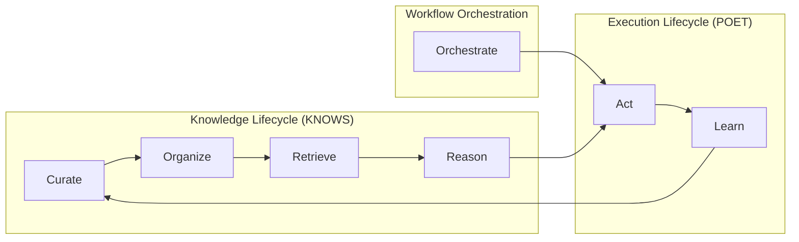

| [← POET](./poet_design.md) | [KNOWS →](./knows_proposal.md) |
|---|---|

# CORRAL Agentic Knowledge Lifecycle

**Author:** Dana Language Team  
**Date:** 2025-01-22  
**Version:** 1.0.0  
**Status:** Implementation

The Dana frameworks implement a complete **agentic knowledge lifecycle** called CORRAL that transforms raw information into intelligent action and learning.

## What is CORRAL?

CORRAL represents the six phases of intelligent agent behavior:

- **C**urate (knowledge)
- **O**rganize (knowledge) 
- **R**etrieve (knowledge)
- **R**eason (with knowledge)
- **A**ct (through workflows)
- **L**earn (from feedback)

## How CORRAL Works in Dana

### **Phase 1: Curate**
**Extract and curate knowledge from documents and sources**

```dana
# Knowledge is provided as consistent, pre-built resources
contextual_knowledge = use("rag", sources=["./knows"])
knowledge = use("rag", sources=["./docs"])
```

**Module**: `knows/curation/` - Knowledge extraction and curation

### **Phase 2: Organize** 
**Structure and categorize knowledge for efficient retrieval**

```dana
# Knowledge is automatically organized into categories
# and relationships for optimal retrieval
# No additional code needed - happens automatically
```

**Module**: `knows/core/` - Knowledge organization and categorization

### **Phase 3: Retrieve**
**Assemble perfect context for specific queries and domains**

```dana
# Context is automatically assembled from curated knowledge
context = use("context", domain="financial", query="assess_credit")
```

**Module**: `knows/context/` - Context assembly and retrieval

### **Phase 4: Reason**
**Use curated context to make intelligent decisions**

```dana
@poet(domain="financial_services")
def assess_credit(score: int, income: float) -> str:
    # Context provides domain knowledge for intelligent reasoning
    return reason(f"Assess credit for score {score}, income {income}")
```

**Module**: `knows/context/` - Reasoning with curated context

### **Phase 5: Act**
**Execute workflows with intelligent processing**

```dana
# Individual intelligent functions
@poet(domain="data_processing")
def load_data(source): return load(source)

@poet(domain="analysis")
def analyze_data(data): return analyze(data)

# Workflow orchestrates the action
data_pipeline = load_data | analyze_data
result = data_pipeline(data_source)
```

**Modules**: 
- `knows/workflow/` - Workflow orchestration
- `poet/{perceive,operate,enforce}` - Intelligent processing

### **Phase 6: Learn**
**Improve from feedback and execution patterns**

```dana
# POET automatically learns from execution patterns
@poet(domain="enterprise_pipeline", enable_training=true)
def enhanced_pipeline = load_data | analyze_data

# Learning happens automatically:
# - Optimize retry parameters
# - Improve context selection
# - Enhance domain knowledge
```

**Modules**:
- `knows/curation/` - Feedback integration
- `poet/train` - Parameter learning

## The Complete Agentic Flow



## Key Benefits

### **For Developers**
- **Complete lifecycle**: From knowledge to action to learning
- **Intelligent processing**: Automatic context injection and fault tolerance
- **Progressive enhancement**: Start simple, add intelligence as needed

### **For Domain Experts**
- **Natural workflow**: Write business logic, get intelligent processing
- **Domain awareness**: Automatic context curation for your domain
- **Continuous improvement**: System learns and improves over time

### **For Operations**
- **Reliable execution**: Automatic retries, timeouts, and error handling
- **Audit trails**: Complete visibility into knowledge and execution flow
- **Scalable architecture**: Handle complex workflows with minimal overhead

## Quick Start

```dana
# 1. Curate knowledge
contextual_knowledge = use("rag", sources=["./knows"])
domain_knowledge = use("rag", sources=["./docs"])

# 2. Organize knowledge (happens automatically)
# 3. Retrieve context (happens automatically)
# 4. Reason with context (happens automatically)

# 5. Act with intelligent processing
@poet(domain="your_domain")
def your_function(input: str) -> str:
    return reason(f"Process: {input}")

# 6. Learn from feedback (happens automatically)
result = your_function("test input")
```

## Architecture Overview

- **KNOWS Framework**: Handles Curate-Organize-Retrieve-Reason phases
- **POET Framework**: Handles Act-Learn phases with intelligent processing
- **Workflow System**: Orchestrates the Act phase with composition

**Result**: A complete agentic system where knowledge flows seamlessly into intelligent action and continuous learning.