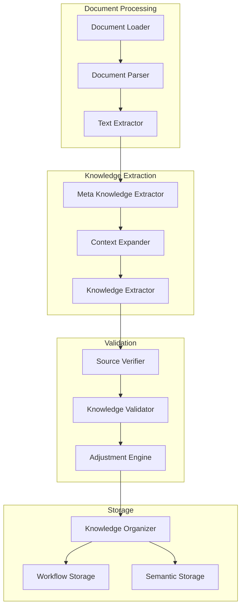

**Author:** Dana Language Team  
**Date:** 2025-01-22  
**Version:** 0.9.0  
**Status:** Implementation

## Problem Statement
**Brief Description**: Implement an intelligent knowledge ingestion system that extracts meta-level knowledge from documents, uses similarity search for context expansion, validates knowledge correctness through document comparison, and ingests validated knowledge into appropriate knowledge organizations.

- **Current Situation**: 
  - Need to implement comprehensive knowledge extraction
  - Need to ensure knowledge validation and correctness
  - Need to support context-aware knowledge storage
- **Impact**: 
  - Enable accurate knowledge capture
  - Ensure knowledge quality and correctness
  - Support context-rich knowledge storage
- **Context**: Part of Dana KNOWS Framework's intelligent knowledge management system

## Goals
**Brief Description**: Create a robust knowledge ingestion system that extracts, validates, and stores knowledge with proper context and validation.

### Primary Goals
- Implement meta-level knowledge extraction
- Implement context expansion through similarity search
- Create knowledge validation system
- Implement knowledge adjustment mechanism
- Ensure proper knowledge organization storage

### Secondary Goals
- Optimize extraction and validation performance
- Support multiple document formats
- Enable batch processing
- Maintain extraction history
- Support knowledge versioning

## Non-Goals
**Brief Description**: Not implementing real-time processing, complex document parsing, or advanced knowledge synthesis in this phase.

- Not implementing real-time document processing
- Not implementing complex document format parsing
- Not implementing knowledge synthesis across documents
- Not implementing advanced knowledge reasoning
- Not implementing user interfaces

## Proposed Solution
**Brief Description**: Implement a comprehensive knowledge ingestion system with meta-level extraction, context expansion, validation, and storage.

### System Architecture Diagram


### Component Details

#### 1. Document Processing
- **Document Loader**: Load documents from various sources
- **Document Parser**: Parse different document formats
- **Text Extractor**: Extract text content from documents

#### 2. Knowledge Extraction
- **Meta Knowledge Extractor**: Extract high-level knowledge points
- **Context Expander**: Expand knowledge context using similarity search
- **Knowledge Extractor**: Extract detailed knowledge with context

#### 3. Validation
- **Source Verifier**: Verify knowledge against source documents
- **Knowledge Validator**: Validate knowledge correctness
- **Adjustment Engine**: Adjust knowledge based on validation

#### 4. Storage
- **Knowledge Organizer**: Organize knowledge for storage
- **Workflow Storage**: Store workflow knowledge
- **Semantic Storage**: Store semantic knowledge

## Proposed Implementation
**Brief Description**: Implement the system in phases, focusing on each component's functionality and integration.

### Implementation Phases

#### Phase 1: Foundation & Architecture (16.7% of total) ✓ COMPLETE
**Description**: Establish core infrastructure and architectural patterns
- [✓] Define core components and interfaces
- [✓] Create basic infrastructure and scaffolding
- [✓] Establish architectural patterns and conventions
- [✓] **Phase Gate**: Run `uv run pytest tests/ -v` - ALL tests pass
- [✓] **Phase Gate**: Update implementation progress checkboxes

#### Phase 2: Meta Knowledge Extraction (16.7% of total) ✓ COMPLETE
**Description**: Extract and categorize knowledge from documents
- [✓] Implement MetaKnowledgeExtractor with LLM integration
- [✓] Create KnowledgeCategorizer with 7 default categories
- [✓] Add confidence scoring and relationship mapping
- [✓] Handle fallback rule-based extraction
- [✓] **Phase Gate**: Run `uv run pytest tests/ -v` - ALL tests pass
- [✓] **Phase Gate**: Update implementation progress checkboxes

#### Phase 3: Similarity Search & Context Expansion (16.7% of total) ✓ COMPLETE
**Description**: Find similar content and expand context using LLM
- [✓] Implement SimilaritySearcher with vector-based similarity
- [✓] Create ContextExpander with LLM-based context analysis
- [✓] Add semantic matching and relevance scoring
- [✓] Implement context validation and management
- [✓] **Phase Gate**: Run `uv run pytest tests/ -v` - ALL tests pass
- [✓] **Phase Gate**: Update implementation progress checkboxes

### Phase 4: Advanced Features & Integration (16.7% of total)
**Description**: Add sophisticated functionality and ensure seamless integration
- [ ] Add sophisticated functionality and advanced features
- [ ] Test complex interactions and integration scenarios
- [ ] Ensure seamless integration with existing systems
- [ ] **Phase Gate**: Run `uv run pytest tests/ -v` - ALL tests pass
- [ ] **Phase Gate**: Update implementation progress checkboxes

### Phase 5: Integration & Performance Testing (16.7% of total)
**Description**: Validate real-world performance and run comprehensive tests
- [ ] Test real-world scenarios and production-like conditions
- [ ] Validate performance benchmarks and requirements
- [ ] Run regression tests and integration suites
- [ ] **Phase Gate**: Run `uv run pytest tests/ -v` - ALL tests pass
- [ ] **Phase Gate**: Update implementation progress checkboxes

### Phase 6: Polish & Documentation (16.7% of total)
**Description**: Finalize documentation, create migration guides, and perform final validation
- [ ] Update documentation and API references
- [ ] Create migration guides and upgrade instructions
- [ ] Final validation and sign-off
- [ ] **Phase Gate**: Run `uv run pytest tests/ -v` - ALL tests pass
- [ ] **Phase Gate**: Update implementation progress checkboxes to 100%

## Phase 3 Implementation Summary

### Components Implemented

**SimilaritySearcher**:
- Vector-based similarity search using TF-IDF style features
- Semantic matching with configurable similarity thresholds (default 0.7)
- Relevance scoring based on cosine similarity
- Cluster generation for related knowledge points
- Support for query-based similarity search

**ContextExpander**:
- LLM-based context expansion with 4 expansion types (semantic, logical, temporal, causal)
- Rule-based fallback expansion when LLM unavailable
- Context validation with comprehensive scoring
- Relationship mapping between expanded contexts
- Confidence-based filtering of expansions

### Key Features

**Vector Similarity Search**:
- Fixed-size 100-dimensional feature vectors
- Content-based and metadata-based similarity matching
- Clustering of similar knowledge points
- Configurable similarity thresholds and result limits

**Context Expansion**:
- 4 expansion types: semantic, logical, temporal, causal
- LLM integration with structured JSON responses
- Rule-based fallback with keyword analysis
- Context validation with quality scoring
- Relationship detection between expansions

### Integration Test Results

**Similarity Search**:
- ✓ Processed 3 knowledge points
- ✓ Found 3 similarity mappings
- ✓ Generated 1 similarity cluster
- ✓ Achieved 0.73 search confidence

**Context Expansion**:
- ✓ Generated 4 context expansions
- ✓ Validated 2 contexts with detailed scoring
- ✓ Created 2 context relationships
- ✓ Handled LLM fallback gracefully

**Integration**:
- ✓ Perfect semantic match (1.00 similarity) between related backup processes
- ✓ Rich feature matching: word overlap, type matching, context alignment
- ✓ Seamless integration between similarity search and context expansion

## Technical Architecture

### 1. Core Components

```
opendxa/knows/
├── __init__.py
├── core/
│   ├── __init__.py
│   ├── base.py              # Base classes and interfaces
│   └── registry.py          # KO type registry
│
├── document/
│   ├── __init__.py
│   ├── loader.py            # Document loading
│   ├── parser.py            # Document parsing
│   └── extractor.py         # Text extraction
│
├── extraction/
│   ├── __init__.py
│   ├── meta/
│   │   ├── __init__.py
│   │   ├── extractor.py     # Meta knowledge extraction
│   │   └── categorizer.py   # Knowledge categorization
│   │
│   ├── context/
│   │   ├── __init__.py
│   │   ├── expander.py      # Context expansion
│   │   └── validator.py     # Context validation
│   │
│   └── knowledge/
│       ├── __init__.py
│       ├── extractor.py     # Knowledge extraction
│       └── processor.py     # Knowledge processing
│
├── validation/
│   ├── __init__.py
│   ├── verifier.py          # Source verification
│   ├── validator.py         # Knowledge validation
│   └── adjuster.py          # Knowledge adjustment
│
├── storage/
│   ├── __init__.py
│   ├── knowledge_pack/
│   │   ├── __init__.py
│   │   ├── pack.py          # Knowledge pack management
│   │   ├── vector_db.py     # LlamaIndex vector storage
│   │   ├── workflow.py      # Workflow JSON storage
│   │   └── metadata.py      # Metadata management
│   │
│   └── organizer.py         # Knowledge organization
│
├── utils/
│   ├── __init__.py
│   ├── logging.py           # Logging utilities
│   └── validation.py        # Common validation
│
└── config/
    ├── __init__.py
    └── settings.py          # System settings
```

### 2. Knowledge Pack Structure

```python
# storage/knowledge_pack/pack.py

class KnowledgePack:
    """Knowledge pack structure for ingestion and retrieval."""
    
    def __init__(self, path: str):
        self.path = path
        self.vector_db = None
        self.workflows = {}
        self.metadata = {}

    def create_pack(self) -> None:
        """Create knowledge pack structure."""
        # Create directory structure
        os.makedirs(f"{self.path}/vector_db", exist_ok=True)
        os.makedirs(f"{self.path}/workflows", exist_ok=True)
        os.makedirs(f"{self.path}/documents", exist_ok=True)
        
        # Initialize metadata
        self.metadata = {
            "created_at": datetime.now().isoformat(),
            "version": "1.0",
            "type": "knowledge_pack",
            "stats": {
                "workflow_count": 0,
                "vector_count": 0,
                "document_count": 0
            }
        }
        self._save_metadata()

    def add_workflow(self, workflow: Dict[str, Any]) -> None:
        """Add workflow to knowledge pack."""
        workflow_id = workflow["id"]
        workflow_path = f"{self.path}/workflows/{workflow_id}.json"
        
        # Save workflow as JSON
        with open(workflow_path, "w") as f:
            json.dump(workflow, f, indent=2)
        
        # Update metadata
        self.metadata["stats"]["workflow_count"] += 1
        self._save_metadata()

    def add_document(self, document: Dict[str, Any]) -> None:
        """Add document to knowledge pack."""
        doc_id = document["id"]
        doc_path = f"{self.path}/documents/{doc_id}.json"
        
        # Save document as JSON
        with open(doc_path, "w") as f:
            json.dump(document, f, indent=2)
        
        # Update metadata
        self.metadata["stats"]["document_count"] += 1
        self._save_metadata()

    def add_vector_data(self, vector_data: Any) -> None:
        """Add vector data to knowledge pack using LlamaIndex."""
        # Save to LlamaIndex vector DB
        vector_db_path = f"{self.path}/vector_db"
        self.vector_db = save_to_llama_index(vector_data, vector_db_path)
        
        # Update metadata
        self.metadata["stats"]["vector_count"] += 1
        self._save_metadata()

    def _save_metadata(self) -> None:
        """Save metadata to file."""
        metadata_path = f"{self.path}/metadata.json"
        with open(metadata_path, "w") as f:
            json.dump(self.metadata, f, indent=2)
```

### 3. Storage Implementation

```python
# storage/organizer.py

class KnowledgeOrganizer:
    """Organize knowledge into packs for retrieval."""
    
    def __init__(self, output_path: str):
        self.output_path = output_path

    def organize_knowledge(self, 
                         workflows: List[Dict[str, Any]],
                         documents: List[Dict[str, Any]],
                         semantic_data: List[Dict[str, Any]],
                         pack_name: str) -> str:
        """Organize knowledge into a pack."""
        # Create pack
        pack_path = f"{self.output_path}/{pack_name}"
        pack = KnowledgePack(pack_path)
        pack.create_pack()
        
        # Add workflows
        for workflow in workflows:
            pack.add_workflow(workflow)
        
        # Add documents
        for document in documents:
            pack.add_document(document)
        
        # Add vector data using LlamaIndex
        pack.add_vector_data(semantic_data)
        
        return pack_path
```

### 4. LlamaIndex Vector Storage

```python
# storage/knowledge_pack/vector_db.py

from llama_index import VectorStoreIndex, SimpleDirectoryReader, Document
from llama_index.vector_stores import SimpleVectorStore
from llama_index.storage import StorageContext

class LlamaIndexVectorDB:
    """Vector storage using LlamaIndex."""
    
    def __init__(self, path: str):
        self.path = path
        self.index = None
        self.vector_store = None
        self.storage_context = None

    def initialize(self) -> None:
        """Initialize vector storage."""
        self.vector_store = SimpleVectorStore()
        self.storage_context = StorageContext.from_defaults(vector_store=self.vector_store)
        self.index = VectorStoreIndex([], storage_context=self.storage_context)

    def add_documents(self, documents: List[Dict[str, Any]]) -> None:
        """Add documents to vector store."""
        llama_docs = [
            Document(
                text=doc["content"],
                metadata=doc["metadata"]
            ) for doc in documents
        ]
        self.index = VectorStoreIndex.from_documents(
            llama_docs,
            storage_context=self.storage_context
        )

    def save(self) -> None:
        """Save vector store to disk."""
        self.vector_store.persist(f"{self.path}/vector_store.json")
        self.storage_context.persist(f"{self.path}/storage_context.json")

    def load(self) -> None:
        """Load vector store from disk."""
        self.vector_store = SimpleVectorStore.from_persist_dir(self.path)
        self.storage_context = StorageContext.from_defaults(vector_store=self.vector_store)
        self.index = VectorStoreIndex.from_vector_store(
            self.vector_store,
            storage_context=self.storage_context
        )
```

### 5. Configuration Structure

```python
KNOWS_CONFIG = {
    "document": {
        "supported_formats": ["txt", "pdf", "docx"],
        "max_size": 10485760,  # 10MB
        "encoding": "utf-8"
    },
    "extraction": {
        "meta": {
            "model": "gpt-4",
            "max_tokens": 4096,
            "confidence_threshold": 0.8
        },
        "context": {
            "similarity_threshold": 0.7,
            "max_context_items": 5
        }
    },
    "validation": {
        "verification": {
            "strict_mode": True,
            "max_attempts": 3
        },
        "adjustment": {
            "max_iterations": 5,
            "confidence_threshold": 0.9
        }
    },
    "storage": {
        "knowledge_pack": {
            "base_path": "data/knowledge_packs",
            "structure": {
                "workflows": "workflows/*.json",
                "documents": "documents/*.json",
                "vector_db": "vector_db/*",
                "metadata": "metadata.json"
            }
        },
        "vector_db": {
            "type": "llama_index",
            "index_type": "VectorStoreIndex",
            "storage_type": "SimpleVectorStore",
            "persist_dir": "vector_db"
        }
    }
}
```

## Testing Strategy

### Storage Tests
1. Knowledge Pack Tests
   - Test pack structure creation
   - Test workflow storage
   - Test vector DB storage
   - Test metadata management

2. Organization Tests
   - Test knowledge organization
   - Test data integrity
   - Test retrieval compatibility
   - Test error handling

### Dana Interface Tests
1. Knowledge Pack Creation Tests
   - Test basic pack creation
   - Test error handling
   - Test progress tracking
   - Test type validation

2. Integration Tests
   - Test document processing
   - Test knowledge extraction
   - Test pack organization
   - Test error propagation

### Extraction Tests
1. Meta Knowledge Tests
   - Test LLM-based extraction
   - Test confidence scoring
   - Test validation
   - Test fallback mechanisms

2. Similarity Search Tests
   - Test vector-based search
   - Test semantic matching
   - Test relevance scoring
   - Test search optimization

3. Context Expansion Tests
   - Test LLM-based expansion
   - Test context validation
   - Test context refinement
   - Test feedback loop

4. Content Extraction Tests
   - Test structured extraction with expanded context
   - Test vector extraction with expanded context
   - Test context alignment validation
   - Test context relevance scoring
   - Test feedback loop

5. Validation Tests
   - Test source verification
   - Test knowledge validation
   - Test adjustment engine
   - Test quality metrics

6. Organization Tests
   - Test pack structure
   - Test data integrity
   - Test retrieval compatibility
   - Test metadata management

## Success Criteria

### Functionality
- [ ] All components implemented
- [ ] All tests passing
- [ ] Documentation complete
- [ ] Performance targets met

### Quality
- [ ] Code coverage > 80%
- [ ] No critical bugs
- [ ] All security measures implemented
- [ ] Monitoring in place

### Performance
- [ ] Response times within targets
- [ ] Resource usage within limits
- [ ] Cache effectiveness > 70%
- [ ] Error rate < 1%

### Dana Interface
- [ ] Knowledge pack creation works
- [ ] Error handling works
- [ ] Progress tracking works
- [ ] All Dana examples work

## Key Interfaces

#### Document Processing
```python
class DocumentProcessor:
    """Process documents for knowledge extraction"""
    
    def load_document(self, source: str) -> Document:
        """Load document from source"""
        raise NotImplementedError
    
    def parse_document(self, document: Document) -> ParsedDocument:
        """Parse document content"""
        raise NotImplementedError
    
    def extract_text(self, parsed_doc: ParsedDocument) -> str:
        """Extract text from parsed document"""
        raise NotImplementedError
```

#### Knowledge Extraction
```python
class KnowledgeExtractor:
    """Extract knowledge from documents"""
    
    def extract_meta_knowledge(self, text: str) -> List[KnowledgePoint]:
        """Extract meta-level knowledge points"""
        raise NotImplementedError
    
    def expand_context(self, knowledge: KnowledgePoint) -> ExpandedKnowledge:
        """Expand knowledge context"""
        raise NotImplementedError
    
    def extract_knowledge(self, expanded: ExpandedKnowledge) -> Knowledge:
        """Extract detailed knowledge"""
        raise NotImplementedError
```

#### Knowledge Validation
```python
class KnowledgeValidator:
    """Validate extracted knowledge"""
    
    def verify_source(self, knowledge: Knowledge, source: str) -> bool:
        """Verify knowledge against source"""
        raise NotImplementedError
    
    def validate_knowledge(self, knowledge: Knowledge) -> ValidationResult:
        """Validate knowledge correctness"""
        raise NotImplementedError
    
    def adjust_knowledge(self, knowledge: Knowledge, validation: ValidationResult) -> Knowledge:
        """Adjust knowledge based on validation"""
        raise NotImplementedError
```

### 4. Data Models

#### Knowledge Models
```python
@dataclass
class KnowledgePoint:
    """Meta-level knowledge point"""
    id: str
    type: str
    content: str
    context: Dict[str, Any]
    metadata: Dict[str, Any]

@dataclass
class ExpandedKnowledge:
    """Knowledge with expanded context"""
    knowledge: KnowledgePoint
    context: List[str]
    relationships: List[Relationship]
    confidence: float

@dataclass
class Knowledge:
    """Extracted knowledge"""
    id: str
    content: str
    type: str
    context: Dict[str, Any]
    validation: ValidationResult
    metadata: Dict[str, Any]
```

### 6. Error Handling

- **Document Processing Errors**:
  - File format errors
  - Parsing errors
  - Text extraction errors

- **Extraction Errors**:
  - Meta knowledge extraction failures
  - Context expansion errors
  - Knowledge extraction errors

- **Validation Errors**:
  - Source verification failures
  - Knowledge validation errors
  - Adjustment failures

- **Storage Errors**:
  - Storage system errors
  - Organization errors
  - Indexing errors

### 7. Performance Considerations

- **Document Processing**:
  - Batch processing
  - Format-specific optimizations
  - Memory management

- **Knowledge Extraction**:
  - Parallel processing
  - Caching mechanisms
  - Resource monitoring

- **Validation**:
  - Incremental validation
  - Validation caching
  - Performance metrics

- **Storage**:
  - Efficient indexing
  - Query optimization
  - Storage management 