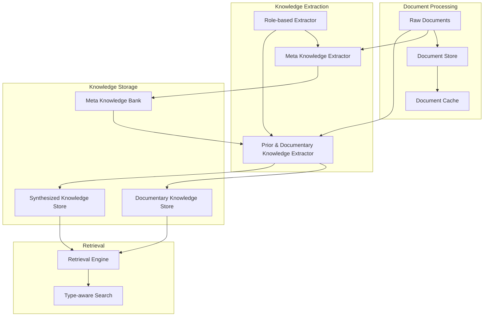
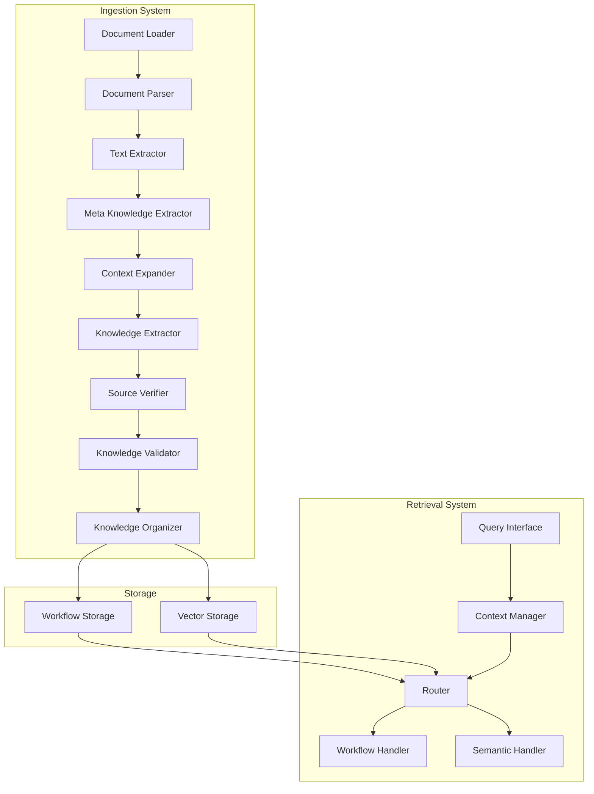
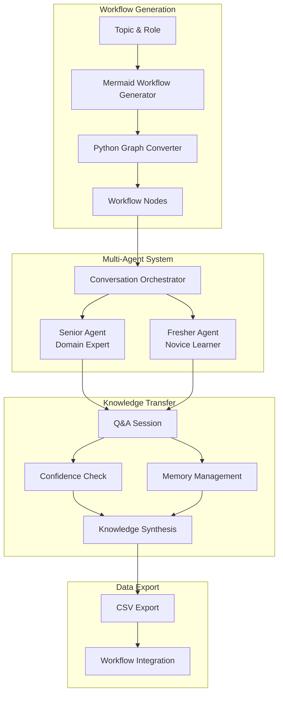
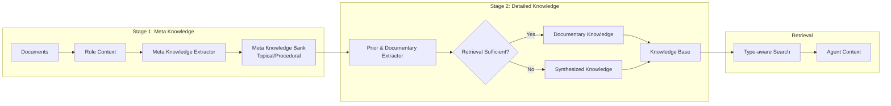
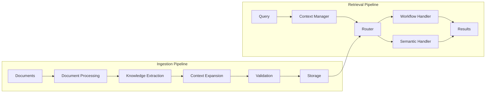

**Author:** Dana Language Team  
**Date:** 2025-01-22  
**Version:** 0.9.0  
**Status:** Design

# KNOWS Design Proposals: Direct Comparison & Contrast

## Overview

This document provides a direct comparison and contrast of three design proposals for the Dana KNOWS (Knowledge Organization and Workflow System) framework:

1. **WN Proposal**: Document-based KNOWS System with comprehensive knowledge extraction and role-based processing
2. **LN Proposal**: Implementation-focused approach with modular ingestion and retrieval systems
3. **SD Proposal**: Conversational knowledge transfer system with senior-fresher agent interaction

## High-Level Architecture Comparison

### WN Proposal: Document-Based Knowledge Extraction


### LN Proposal: Modular Ingestion & Retrieval


### SD Proposal: Conversational Knowledge Transfer


## Knowledge Flow Comparison

### WN Proposal: Two-Stage Extraction Flow


### LN Proposal: Modular Processing Flow


### SD Proposal: Conversational Learning Flow

```mermaid
flowchart LR
    subgraph "Workflow Creation"
        A[Topic & Role] --> B[Workflow Generation]
        B --> C[Node Processing]
    end
    
    subgraph "Knowledge Transfer"
        C --> D[Senior Agent<br/>Expert Knowledge]
        C --> E[Fresher Agent<br/>Learning Mode]
        D --> F[Q&A Session]
        E --> F
        F --> G{Confidence ≥ 85%?}
        G -->|No| F
        G -->|Yes| H[Knowledge Synthesis]
    end
    
    subgraph "Output"
        H --> I[CSV Export]
        I --> J[Workflow Integration]
    end
```


## WN Proposal: Document-Based KNOWS System

### Core Philosophy
- **Problem Focus**: Addresses agents' inability to effectively search for correct knowledge using fixed-size text chunks
- **Approach**: Two-stage knowledge extraction (meta-knowledge → detailed knowledge) with role-based processing
- **Goal**: Transform unstructured technical documentation into AI-optimized, role-specific knowledge

### Key Architecture Components

#### 1. Knowledge Types
- **Topical Knowledge (WHAT)**: Subject matter, concepts, facts, and information
- **Procedural Knowledge (HOW)**: Processes, workflows, and step-by-step procedures

#### 2. Core Components
- **Document Store**: Multi-format document processing with caching
- **Meta Knowledge Extractor**: Role-aware LLM-powered knowledge extraction and classification
- **Prior and Documentary Knowledge Extractor**: Converts meta-knowledge into detailed, actionable knowledge
- **Role-based Extractor**: Manages user-specified roles and coordinates extraction
- **Knowledge Base**: Type-based knowledge organization and storage
- **Retrieval Engine**: Type-aware semantic search with LLM-powered reranking

#### 3. Data Flow
```
Raw Documents → Document Store → Meta Knowledge Extractor → Meta Knowledge Bank
                                                           ↓
User Role → Role-based Extractor → Prior/Documentary Knowledge Extractor → Knowledge Base → Retrieval Engine
```

### Key Features
- **Role-based Processing**: Same documents serve multiple agent roles with different knowledge requirements
- **Dual Knowledge Creation**: Documentary knowledge (from documents) + Synthesized knowledge (when retrieval insufficient)
- **Type-aware Storage**: Separate organization for topical vs procedural knowledge
- **Meta-knowledge Search**: Efficient search using meta-knowledge field, detailed content for agent context
- **Comprehensive Validation**: Quality gates and experimental validation framework

### Technology Stack
- **LLM Service**: OpenAI GPT-4.1 via AISuites
- **Storage**: JSON files for knowledge storage
- **Processing**: ThreadPoolExecutor with parallel processing
- **Language**: Python 3.x

### Implementation Roadmap
- **Phase 1-2**: Core Foundation & Meta Knowledge Extraction
- **Phase 3-4**: Advanced Extraction & Role-based Processing
- **Phase 5-6**: Retrieval Enhancement & Production Readiness

## LN Proposal: Implementation-Focused KNOWS System

### Core Philosophy
- **Problem Focus**: Implement intelligent knowledge ingestion and retrieval with clean Dana interfaces
- **Approach**: Modular implementation with clear separation between ingestion and retrieval systems
- **Goal**: Provide robust, scalable knowledge management with simple Dana language interfaces

### Key Architecture Components

#### 1. Ingestion System
- **Document Processing**: Loader, Parser, Text Extractor
- **Knowledge Extraction**: Meta Knowledge Extractor, Context Expander, Knowledge Extractor
- **Validation**: Source Verifier, Knowledge Validator, Adjustment Engine
- **Storage**: Knowledge Organizer, Workflow Storage, Semantic Storage

#### 2. Retrieval System
- **Interface Layer**: Query processing, response formatting, custom exceptions
- **Context Management**: Context manager, extractor, enhancer, storage
- **Router**: Query analysis and result aggregation
- **Handlers**: Workflow and semantic handlers
- **Storage**: Workflow and vector storage

#### 3. Dana Interface Layer
- **Knowledge Pack Interface**: Simple loading and management
- **Context Manager**: User and system context tracking
- **Query Interface**: Natural language query processing

### Key Features
- **Modular Design**: Clear separation between ingestion and retrieval
- **Context Awareness**: Comprehensive context management (user, system, historical, query)
- **Dual Storage**: Workflow storage for structured data, vector storage for semantic search
- **Simple Dana Interface**: One-line knowledge pack loading and querying
- **Error Handling**: Graceful fallbacks and comprehensive error management

### Technology Stack
- **Vector Database**: LlamaIndex for semantic search
- **Storage**: Hybrid approach (workflow + vector storage)
- **Processing**: Async/await patterns for scalability
- **Interface**: Clean Dana language integration

### Implementation Phases
- **Phase 1-3**: Foundation, Meta Knowledge Extraction, Similarity Search (✓ Complete)
- **Phase 4-6**: Advanced Features, Integration Testing, Polish & Documentation

## SD Proposal: Conversational Knowledge Transfer System

### Core Philosophy
- **Problem Focus**: Generate high-quality synthetic knowledge through conversational learning between senior and fresher agents
- **Approach**: Multi-agent conversation system with workflow-driven knowledge extraction
- **Goal**: Create comprehensive domain knowledge through iterative Q&A between expert and novice agents

### Key Architecture Components

#### 1. Workflow Generation System
- **Mermaid Workflow Generator**: Creates domain-specific workflows using LLM reasoning
- **Python Graph Converter**: Converts Mermaid diagrams to structured Python dictionaries
- **Node-based Processing**: Processes each workflow node for knowledge extraction

#### 2. Multi-Agent Conversation System
- **Senior Agent**: Domain expert with specialized knowledge base (RAG integration)
- **Fresher Agent**: Novice learner with memory management capabilities
- **Conversation Orchestrator**: Manages iterative Q&A sessions between agents

#### 3. Knowledge Transfer Process
- **Confidence-based Learning**: Fresher agent asks questions until confidence reaches 85%
- **Memory Management**: Prevents redundant questions through memory checking
- **Knowledge Synthesis**: Summarizes accumulated knowledge for each workflow node

#### 4. Data Export System
- **CSV Export**: Structured output of Q&A sessions with metadata
- **Workflow Integration**: Links knowledge to specific workflow nodes
- **Batch Processing**: Handles multiple workflow nodes systematically

### Key Features
- **Workflow-driven Knowledge**: Knowledge extraction follows domain-specific workflows
- **Confidence-based Stopping**: Learning continues until confidence threshold is met
- **Redundancy Prevention**: Memory system prevents duplicate questions
- **Structured Output**: CSV format with comprehensive metadata
- **Domain Flexibility**: Adaptable to any domain with role specification

### Technology Stack
- **LLM Service**: OpenAI GPT-4.1 via AISuites
- **RAG Integration**: Specialized knowledge base for senior agent
- **Memory System**: Persistent memory for fresher agent
- **Data Processing**: Pandas for CSV generation and management
- **Language**: Dana language with Python integration

### Implementation Status
- **Current State**: Working implementation with data generation capabilities
- **Working Code**: Complete conversational system with CSV export
- **Validation**: Real-world data generation for medical domain
- **Documentation**: Implementation-focused with working examples

## Architectural Approach Summary

| Aspect | WN Proposal | LN Proposal | SD Proposal |
|--------|-------------|-------------|-------------|
| **Primary Focus** | 📄 Document Processing | 🔧 System Implementation | 💬 Agent Conversation |
| **Knowledge Source** | 📚 Existing Documents | 📚 Existing Documents | 🧠 Expert Knowledge |
| **Processing Method** | 🔄 Two-stage Extraction | ⚙️ Modular Pipeline | 🎯 Workflow-driven Q&A |
| **Output Format** | 📋 Structured JSON | 🗄️ Hybrid Storage | 📊 CSV with Metadata |
| **Validation Approach** | ✅ Experimental Framework | ✅ Integration Testing | ✅ Confidence Threshold |
| **Scalability Model** | 📈 Role-based Scaling | 📈 Modular Scaling | 📈 Workflow-based Scaling |

## Direct Comparison & Contrast

### Core Problem Approach

| Aspect | WN Proposal | LN Proposal | SD Proposal |
|--------|-------------|-------------|-------------|
| **Problem Focus** | Agents can't search effectively using fixed-size text chunks | Need intelligent knowledge ingestion and retrieval | Need high-quality synthetic knowledge generation |
| **Root Cause** | Chunk boundaries limit complete knowledge capture | Lack of structured knowledge management | Manual knowledge creation is slow and error-prone |
| **Solution Strategy** | Two-stage extraction with role-aware processing | Modular ingestion/retrieval with context management | Multi-agent conversational learning |

### Architecture Philosophy

| Aspect | WN Proposal | LN Proposal | SD Proposal |
|--------|-------------|-------------|-------------|
| **Design Approach** | Comprehensive document-based system | Modular implementation with clear separation | Multi-agent conversational system |
| **Knowledge Flow** | Meta-knowledge → Detailed knowledge | Direct extraction → Context expansion | Workflow → Q&A → Knowledge synthesis |
| **Processing Model** | Role-aware extraction across all stages | Context-aware processing with handlers | Confidence-based iterative learning |
| **Storage Philosophy** | Type-based organization (topical/procedural) | Hybrid storage (workflow + vector) | CSV-based structured output |

### Knowledge Classification

| Aspect | WN Proposal | LN Proposal | SD Proposal |
|--------|-------------|-------------|-------------|
| **Primary Types** | Topical (WHAT) vs Procedural (HOW) | 7 default categories (flexible) | Workflow node-based organization |
| **Classification Method** | LLM-powered with role context | LLM-powered with similarity search | Conversation-driven extraction |
| **Storage Organization** | Separate stores by type and role | Unified storage with metadata | CSV with workflow node metadata |
| **Search Strategy** | Meta-knowledge field for search, knowledge field for context | Vector similarity + workflow matching | Q&A session-based retrieval |

### Role & Context Management

| Aspect | WN Proposal | LN Proposal | SD Proposal |
|--------|-------------|-------------|-------------|
| **Role Definition** | User-specified roles (string/object/template) | Context-based roles (user/system/historical) | Senior/Fresher agent roles |
| **Role Application** | Centralized role coordination across extractors | Context manager with dynamic updates | Conversation-based role interaction |
| **Context Types** | Role context only | User, System, Historical, Query contexts | Workflow node context |
| **Context Flow** | Role flows through extraction pipeline | Context enhances query processing | Context flows through Q&A sessions |

### Implementation Status

| Aspect | WN Proposal | LN Proposal | SD Proposal |
|--------|-------------|-------------|-------------|
| **Current State** | Comprehensive design document | 50% implementation complete | Working implementation |
| **Working Code** | None (design only) | Phases 1-3 complete | Complete conversational system |
| **Validation** | Experimental framework designed | Integration tests passing | Real-world data generation |
| **Documentation** | Detailed architecture with ADRs | Implementation-focused docs | Working examples and code |

### Technology Choices

| Aspect | WN Proposal | LN Proposal | SD Proposal |
|--------|-------------|-------------|-------------|
| **Storage** | JSON files with type distinction | Hybrid: workflow + vector storage | CSV with Pandas |
| **Vector DB** | LlamaIndex for retrieval only | LlamaIndex for similarity search | RAG for senior agent |
| **Processing** | ThreadPoolExecutor (parallel) | Async/await patterns | Sequential Q&A processing |
| **LLM Integration** | GPT-4.1 via AISuites | LLM service with fallbacks | GPT-4.1 via AISuites |

### Dana Language Interface

| Aspect | WN Proposal | LN Proposal | SD Proposal |
|--------|-------------|-------------|-------------|
| **Ingestion Interface** | `create_knowledge_pack(docs_path, output_path)` | Modular components with Dana wrappers | `create_expert_workflow(topic, role)` |
| **Retrieval Interface** | Role-based querying | `query_knowledge(query, context)` | `conversational_knowledge_transfer(senior, fresher, node)` |
| **Context Management** | Role specification at creation | `create_context_manager()` with updates | Memory-based context tracking |
| **Error Handling** | Try-catch with specific exceptions | Comprehensive error handling with fallbacks | Confidence-based error handling |

### Quality Assurance

| Aspect | WN Proposal | LN Proposal | SD Proposal |
|--------|-------------|-------------|-------------|
| **Validation Framework** | Comprehensive experimental validation | Integration testing with quality gates | Confidence-based validation |
| **Success Metrics** | Business metrics (accuracy, satisfaction) | Technical metrics (performance, reliability) | Knowledge completeness metrics |
| **Testing Strategy** | A/B testing, deterministic validation | Unit, integration, performance testing | Real-world data generation testing |
| **Quality Gates** | 4-phase quality gates with stakeholder approval | Phase-based gates with test validation | Confidence threshold (85%) |

### Scalability Considerations

| Aspect | WN Proposal | LN Proposal | SD Proposal |
|--------|-------------|-------------|-------------|
| **Document Processing** | Incremental with caching | Batch processing with parallel execution | Workflow node processing |
| **Knowledge Extraction** | Parallel with worker limits | Async processing with rate limiting | Sequential Q&A sessions |
| **Storage Scalability** | File-based (limited) | Hybrid approach (more scalable) | CSV-based (limited) |
| **API Dependencies** | LLM API with retry mechanisms | LLM service with fallback processing | LLM API with conversation management |

### Business Alignment

| Aspect | WN Proposal | LN Proposal | SD Proposal |
|--------|-------------|-------------|-------------|
| **Business Problem** | Strong alignment with agent knowledge retrieval | Focus on implementation and usability | Focus on synthetic knowledge generation |
| **Success Metrics** | 90% improvement in knowledge retrieval accuracy | System reliability and performance | Knowledge completeness and quality |
| **User Outcomes** | Clear traceability to business value | Developer and user experience focus | Domain expert knowledge transfer |
| **Risk Mitigation** | Comprehensive risk assessment | Implementation-focused risk management | Confidence-based risk mitigation |

## Key Contrasts Summary

### WN Proposal: Comprehensive Design vs LM Proposal: Implementation Focus

**WN Strengths:**
- **Business Alignment**: Strong focus on solving the specific agent knowledge retrieval problem
- **Role-based Architecture**: Sophisticated role-aware processing across all extraction stages
- **Knowledge Type Distinction**: Clear topical vs procedural classification with separate storage
- **Experimental Validation**: Comprehensive validation framework with A/B testing
- **Quality Assurance**: Detailed quality gates and success metrics

**LM Strengths:**
- **Implementation Progress**: 50% complete with working code and passing tests
- **Modular Architecture**: Clean separation between ingestion and retrieval systems
- **Context Management**: Sophisticated multi-context system (user/system/historical/query)
- **Dana Integration**: Simple, intuitive Dana language interfaces
- **Error Handling**: Robust error management with graceful fallbacks

### Fundamental Differences

**1. Problem Scope:**
- **WN**: Addresses the specific business problem of agent knowledge retrieval accuracy
- **LM**: Focuses on general knowledge management implementation

**2. Architecture Philosophy:**
- **WN**: Comprehensive document-based system with role-aware processing
- **LM**: Modular implementation with clear ingestion/retrieval separation

**3. Knowledge Organization:**
- **WN**: Type-based (topical/procedural) with role-specific organization
- **LM**: Category-based (7 default categories) with unified storage

**4. Context Management:**
- **WN**: Role context flows through extraction pipeline
- **LM**: Multi-context system enhances query processing

**5. Implementation Approach:**
- **WN**: Design-first with comprehensive validation framework
- **LM**: Implementation-first with incremental development

## Recommendations

### For Implementation Priority
1. **Start with LM Proposal**: Leverage the 50% completed implementation as foundation
2. **Incorporate WN Insights**: Integrate role-based processing and knowledge type distinction
3. **Hybrid Approach**: Combine LM's modular design with WN's comprehensive validation

### For Architecture Decisions
1. **Knowledge Types**: Adopt WN's topical vs procedural distinction
2. **Role Management**: Implement WN's role-based extraction approach
3. **Storage Strategy**: Use LM's hybrid workflow + vector approach
4. **Interface Design**: Follow LM's simple Dana language patterns

### For Development Strategy
1. **Phase 1**: Complete LM's remaining phases (4-6)
2. **Phase 2**: Integrate WN's role-based processing
3. **Phase 3**: Implement WN's comprehensive validation framework
4. **Phase 4**: Add experimental validation and quality gates

## Conclusion

Both proposals offer valuable insights for the KNOWS system:

- **WN Proposal** provides comprehensive architectural thinking with strong business alignment and experimental validation
- **LM Proposal** offers concrete implementation progress with clean modular design and Dana integration

The optimal approach would be to combine the strengths of both:
- Use LM's implementation foundation and modular design
- Incorporate WN's role-based processing and knowledge type distinction
- Implement WN's comprehensive validation framework
- Maintain LM's simple Dana language interfaces

This hybrid approach would deliver a robust, scalable KNOWS system that addresses the core business problem while providing excellent developer and user experience. 