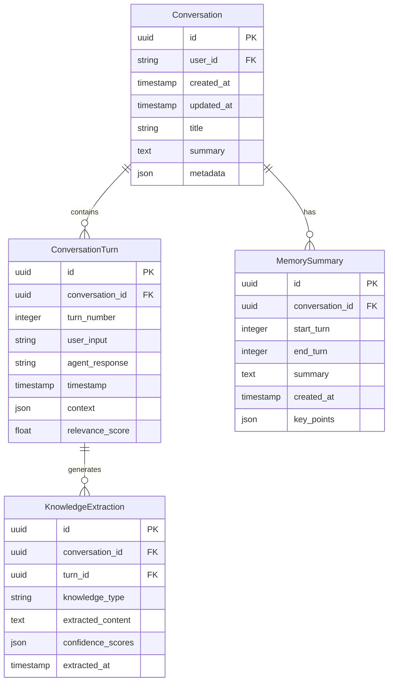
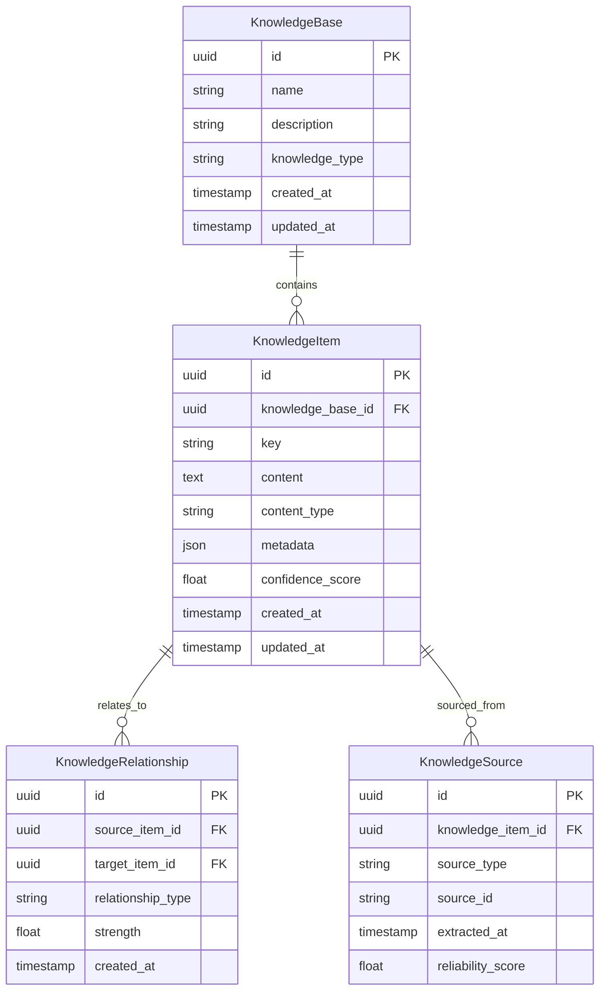
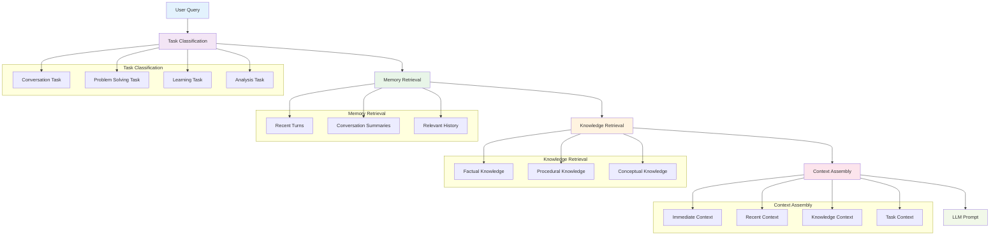

# Memory and Knowledge Implementation Specification

## Overview

This document provides detailed technical specifications for implementing the memory and knowledge systems described in the main design document.

## 1. Core Data Models

### **Memory Data Model**



### **Knowledge Data Model**



## 2. API Specifications

### **Memory System API**

```python
class MemorySystem:
    """Core memory system interface."""
    
    def add_conversation_turn(
        self, 
        conversation_id: str, 
        user_input: str, 
        agent_response: str,
        context: Optional[Dict] = None
    ) -> ConversationTurn:
        """Add a new turn to conversation memory."""
        pass
    
    def get_conversation_context(
        self, 
        conversation_id: str, 
        max_turns: int = 5
    ) -> List[ConversationTurn]:
        """Get recent conversation context."""
        pass
    
    def create_summary(
        self, 
        conversation_id: str, 
        start_turn: int, 
        end_turn: int
    ) -> MemorySummary:
        """Create summary of conversation segment."""
        pass
    
    def extract_knowledge(
        self, 
        conversation_id: str, 
        turn_id: str
    ) -> List[KnowledgeExtraction]:
        """Extract knowledge from conversation turn."""
        pass
    
    def build_llm_context(
        self, 
        conversation_id: str, 
        current_query: str,
        task_type: Optional[str] = None
    ) -> str:
        """Build context string for LLM prompt."""
        pass
```

### **Knowledge System API**

```python
class KnowledgeSystem:
    """Core knowledge system interface."""
    
    def add_knowledge(
        self,
        knowledge_base: str,
        key: str,
        content: str,
        content_type: str,
        metadata: Optional[Dict] = None
    ) -> KnowledgeItem:
        """Add knowledge item to specified base."""
        pass
    
    def query_knowledge(
        self,
        knowledge_base: str,
        query: str,
        max_results: int = 10
    ) -> List[KnowledgeItem]:
        """Query knowledge base for relevant items."""
        pass
    
    def get_knowledge_by_key(
        self,
        knowledge_base: str,
        key: str
    ) -> Optional[KnowledgeItem]:
        """Get knowledge item by exact key."""
        pass
    
    def update_knowledge(
        self,
        item_id: str,
        content: str,
        metadata: Optional[Dict] = None
    ) -> KnowledgeItem:
        """Update existing knowledge item."""
        pass
    
    def create_relationship(
        self,
        source_id: str,
        target_id: str,
        relationship_type: str,
        strength: float = 1.0
    ) -> KnowledgeRelationship:
        """Create relationship between knowledge items."""
        pass
```

## 3. Storage Layer Specifications

### **Database Schema**

```sql
-- Conversation Memory Tables
CREATE TABLE conversations (
    id UUID PRIMARY KEY,
    user_id VARCHAR(255) NOT NULL,
    created_at TIMESTAMP DEFAULT CURRENT_TIMESTAMP,
    updated_at TIMESTAMP DEFAULT CURRENT_TIMESTAMP,
    title VARCHAR(500),
    summary TEXT,
    metadata JSONB
);

CREATE TABLE conversation_turns (
    id UUID PRIMARY KEY,
    conversation_id UUID REFERENCES conversations(id),
    turn_number INTEGER NOT NULL,
    user_input TEXT NOT NULL,
    agent_response TEXT NOT NULL,
    timestamp TIMESTAMP DEFAULT CURRENT_TIMESTAMP,
    context JSONB,
    relevance_score FLOAT DEFAULT 1.0
);

CREATE TABLE memory_summaries (
    id UUID PRIMARY KEY,
    conversation_id UUID REFERENCES conversations(id),
    start_turn INTEGER NOT NULL,
    end_turn INTEGER NOT NULL,
    summary TEXT NOT NULL,
    created_at TIMESTAMP DEFAULT CURRENT_TIMESTAMP,
    key_points JSONB
);

-- Knowledge Base Tables
CREATE TABLE knowledge_bases (
    id UUID PRIMARY KEY,
    name VARCHAR(255) NOT NULL UNIQUE,
    description TEXT,
    knowledge_type VARCHAR(100) NOT NULL,
    created_at TIMESTAMP DEFAULT CURRENT_TIMESTAMP,
    updated_at TIMESTAMP DEFAULT CURRENT_TIMESTAMP
);

CREATE TABLE knowledge_items (
    id UUID PRIMARY KEY,
    knowledge_base_id UUID REFERENCES knowledge_bases(id),
    key VARCHAR(500) NOT NULL,
    content TEXT NOT NULL,
    content_type VARCHAR(100) NOT NULL,
    metadata JSONB,
    confidence_score FLOAT DEFAULT 1.0,
    created_at TIMESTAMP DEFAULT CURRENT_TIMESTAMP,
    updated_at TIMESTAMP DEFAULT CURRENT_TIMESTAMP,
    UNIQUE(knowledge_base_id, key)
);

CREATE TABLE knowledge_relationships (
    id UUID PRIMARY KEY,
    source_item_id UUID REFERENCES knowledge_items(id),
    target_item_id UUID REFERENCES knowledge_items(id),
    relationship_type VARCHAR(100) NOT NULL,
    strength FLOAT DEFAULT 1.0,
    created_at TIMESTAMP DEFAULT CURRENT_TIMESTAMP
);

-- Indexes for Performance
CREATE INDEX idx_conversation_turns_conversation_id ON conversation_turns(conversation_id);
CREATE INDEX idx_conversation_turns_timestamp ON conversation_turns(timestamp);
CREATE INDEX idx_knowledge_items_base_key ON knowledge_items(knowledge_base_id, key);
CREATE INDEX idx_knowledge_items_content_type ON knowledge_items(content_type);
CREATE INDEX idx_knowledge_relationships_source ON knowledge_relationships(source_item_id);
CREATE INDEX idx_knowledge_relationships_target ON knowledge_relationships(target_item_id);
```

### **Vector Storage Schema**

```python
# FAISS Vector Storage Configuration
class VectorStorageConfig:
    """Configuration for vector storage."""
    
    # Vector dimensions for different content types
    DIMENSIONS = {
        'conversation_turn': 768,  # BERT embeddings
        'knowledge_item': 768,     # BERT embeddings
        'summary': 512,           # Sentence embeddings
        'query': 768              # BERT embeddings
    }
    
    # Index types for different use cases
    INDEX_TYPES = {
        'conversation_search': 'IVFFlat',  # Fast approximate search
        'knowledge_search': 'HNSW',        # High accuracy search
        'summary_search': 'Flat'           # Exact search for summaries
    }
    
    # Search parameters
    SEARCH_PARAMS = {
        'conversation_search': {'nprobe': 10},
        'knowledge_search': {'ef': 100},
        'summary_search': {}
    }
```

## 4. Context Engineering Implementation

### **Context Assembly Pipeline**



### **Context Assembly Algorithm**

```python
class ContextAssembler:
    """Assembles context for LLM interactions."""
    
    def assemble_context(
        self,
        conversation_id: str,
        current_query: str,
        task_type: Optional[str] = None
    ) -> str:
        """Assemble comprehensive context for LLM."""
        
        # 1. Classify task if not provided
        if not task_type:
            task_type = self.classify_task(current_query)
        
        # 2. Retrieve memory context
        memory_context = self._get_memory_context(conversation_id, task_type)
        
        # 3. Retrieve knowledge context
        knowledge_context = self._get_knowledge_context(current_query, task_type)
        
        # 4. Assemble final context
        context_parts = []
        
        # Immediate context (last 5 turns)
        if memory_context.immediate:
            context_parts.append("Recent conversation:")
            for turn in memory_context.immediate:
                context_parts.append(f"User: {turn.user_input}")
                context_parts.append(f"Agent: {turn.agent_response}")
        
        # Recent context (summaries)
        if memory_context.recent:
            context_parts.append("Conversation summary:")
            context_parts.append(memory_context.recent)
        
        # Knowledge context
        if knowledge_context:
            context_parts.append("Relevant knowledge:")
            for item in knowledge_context:
                context_parts.append(f"- {item.content}")
        
        # Task context
        if task_type:
            context_parts.append(f"Task type: {task_type}")
        
        # Current query
        context_parts.append(f"Current query: {current_query}")
        
        return "\n\n".join(context_parts)
    
    def _get_memory_context(
        self, 
        conversation_id: str, 
        task_type: str
    ) -> MemoryContext:
        """Get memory context based on task type."""
        
        if task_type == "conversation":
            return self._get_conversation_context(conversation_id)
        elif task_type == "problem_solving":
            return self._get_problem_solving_context(conversation_id)
        elif task_type == "learning":
            return self._get_learning_context(conversation_id)
        elif task_type == "analysis":
            return self._get_analysis_context(conversation_id)
        else:
            return self._get_general_context(conversation_id)
    
    def _get_knowledge_context(
        self, 
        query: str, 
        task_type: str
    ) -> List[KnowledgeItem]:
        """Get relevant knowledge for query and task type."""
        
        # Query different knowledge bases based on task type
        knowledge_items = []
        
        if task_type == "problem_solving":
            # Get procedural knowledge
            knowledge_items.extend(
                self.knowledge_system.query_knowledge("procedural", query)
            )
        
        # Get factual knowledge for all tasks
        knowledge_items.extend(
            self.knowledge_system.query_knowledge("factual", query)
        )
        
        # Get conceptual knowledge for learning and analysis
        if task_type in ["learning", "analysis"]:
            knowledge_items.extend(
                self.knowledge_system.query_knowledge("conceptual", query)
            )
        
        return knowledge_items[:5]  # Limit to top 5 most relevant
```

## 5. Integration Specifications

### **KNOWS Integration**

```python
class KNOWSIntegration:
    """Integration with KNOWS knowledge system."""
    
    def extract_knowledge_from_memory(
        self, 
        conversation_turn: ConversationTurn
    ) -> List[KnowledgeItem]:
        """Extract knowledge from conversation turn."""
        
        # Use KNOWS document processing pipeline
        document = self._convert_turn_to_document(conversation_turn)
        
        # Process through KNOWS categorization
        categorized_content = self.knows_system.categorize(document)
        
        # Extract knowledge items
        knowledge_items = []
        for category, content in categorized_content.items():
            if self._is_knowledge_candidate(content):
                knowledge_item = KnowledgeItem(
                    knowledge_base=category,
                    key=self._generate_key(content),
                    content=content,
                    content_type="extracted",
                    metadata={
                        "source": "conversation_memory",
                        "conversation_id": conversation_turn.conversation_id,
                        "turn_id": conversation_turn.id,
                        "confidence": self._calculate_confidence(content)
                    }
                )
                knowledge_items.append(knowledge_item)
        
        return knowledge_items
    
    def enhance_context_with_knowledge(
        self, 
        context: str, 
        query: str
    ) -> str:
        """Enhance context with KNOWS knowledge."""
        
        # Use KNOWS context assembly
        enhanced_context = self.knows_system.assemble_context(
            domain="conversation",
            query=query,
            base_context=context
        )
        
        return enhanced_context
```

### **CORRAL Integration**

```python
class CORRALIntegration:
    """Integration with CORRAL learning system."""
    
    def provide_experiential_data(
        self, 
        conversation_id: str
    ) -> Dict:
        """Provide experiential data to CORRAL."""
        
        # Get conversation data
        conversation = self.memory_system.get_conversation(conversation_id)
        turns = self.memory_system.get_conversation_turns(conversation_id)
        
        # Structure data for CORRAL
        experiential_data = {
            "conversation_id": conversation_id,
            "turns": [
                {
                    "user_input": turn.user_input,
                    "agent_response": turn.agent_response,
                    "context": turn.context,
                    "timestamp": turn.timestamp.isoformat()
                }
                for turn in turns
            ],
            "summary": conversation.summary,
            "metadata": conversation.metadata
        }
        
        return experiential_data
    
    def apply_learned_patterns(
        self, 
        conversation_id: str, 
        patterns: List[Dict]
    ) -> None:
        """Apply patterns learned by CORRAL to memory."""
        
        for pattern in patterns:
            # Apply pattern to conversation memory
            self.memory_system.apply_pattern(conversation_id, pattern)
            
            # Update knowledge base with learned patterns
            if pattern.get("knowledge_implications"):
                self.knowledge_system.add_knowledge(
                    knowledge_base="learned_patterns",
                    key=pattern["pattern_id"],
                    content=pattern["description"],
                    content_type="pattern",
                    metadata={
                        "confidence": pattern["confidence"],
                        "source": "corral_learning",
                        "applied_to": conversation_id
                    }
                )
```

## 6. Performance Specifications

### **Response Time Requirements**

```python
class PerformanceRequirements:
    """Performance requirements for memory and knowledge systems."""
    
    # Response time targets
    RESPONSE_TIMES = {
        "memory_retrieval": 50,      # ms
        "knowledge_query": 100,      # ms
        "context_assembly": 200,     # ms
        "knowledge_extraction": 500, # ms
        "summary_generation": 1000,  # ms
    }
    
    # Throughput requirements
    THROUGHPUT = {
        "conversation_turns_per_second": 100,
        "knowledge_queries_per_second": 50,
        "context_assemblies_per_second": 25,
    }
    
    # Storage requirements
    STORAGE = {
        "conversation_turn_size": 1024,    # bytes
        "knowledge_item_size": 2048,       # bytes
        "summary_size": 512,               # bytes
        "max_conversation_turns": 10000,   # per conversation
        "max_knowledge_items": 1000000,    # per knowledge base
    }
```

### **Caching Strategy**

```python
class CachingStrategy:
    """Caching strategy for performance optimization."""
    
    # Cache layers
    CACHE_LAYERS = {
        "L1": {
            "type": "in_memory",
            "size": "100MB",
            "ttl": 300,  # 5 minutes
            "items": ["recent_conversation_turns", "frequent_knowledge_items"]
        },
        "L2": {
            "type": "redis",
            "size": "1GB",
            "ttl": 3600,  # 1 hour
            "items": ["conversation_summaries", "knowledge_relationships"]
        },
        "L3": {
            "type": "database",
            "size": "unlimited",
            "ttl": "persistent",
            "items": ["all_data"]
        }
    }
    
    # Cache invalidation rules
    INVALIDATION_RULES = {
        "conversation_turn_added": ["recent_conversation_turns"],
        "knowledge_item_updated": ["frequent_knowledge_items"],
        "summary_created": ["conversation_summaries"],
        "relationship_created": ["knowledge_relationships"]
    }
```

## 7. Testing Specifications

### **Unit Test Coverage**

```python
class TestCoverage:
    """Test coverage requirements."""
    
    # Unit test coverage targets
    COVERAGE_TARGETS = {
        "memory_system": 90,
        "knowledge_system": 85,
        "context_assembler": 95,
        "integration_layer": 80,
    }
    
    # Test categories
    TEST_CATEGORIES = {
        "unit_tests": [
            "memory_operations",
            "knowledge_operations",
            "context_assembly",
            "data_models"
        ],
        "integration_tests": [
            "memory_knowledge_integration",
            "knows_integration",
            "corral_integration",
            "storage_integration"
        ],
        "performance_tests": [
            "response_time",
            "throughput",
            "memory_usage",
            "storage_efficiency"
        ],
        "end_to_end_tests": [
            "conversation_flow",
            "knowledge_extraction",
            "context_engineering",
            "learning_cycle"
        ]
    }
```

### **Test Data Requirements**

```python
class TestDataRequirements:
    """Test data requirements for comprehensive testing."""
    
    # Test conversation data
    CONVERSATION_DATA = {
        "short_conversations": 100,    # 5-10 turns
        "medium_conversations": 50,    # 20-50 turns
        "long_conversations": 10,      # 100+ turns
        "multi_topic_conversations": 25,
        "technical_conversations": 25,
        "casual_conversations": 25,
    }
    
    # Test knowledge data
    KNOWLEDGE_DATA = {
        "factual_items": 1000,
        "procedural_items": 500,
        "conceptual_items": 300,
        "contextual_items": 200,
        "experiential_items": 100,
    }
    
    # Test scenarios
    TEST_SCENARIOS = {
        "conversation_memory": [
            "add_turn",
            "retrieve_context",
            "create_summary",
            "extract_knowledge"
        ],
        "knowledge_management": [
            "add_knowledge",
            "query_knowledge",
            "update_knowledge",
            "create_relationships"
        ],
        "context_engineering": [
            "task_classification",
            "context_assembly",
            "knowledge_integration",
            "llm_prompt_generation"
        ],
        "integration": [
            "memory_to_knowledge",
            "knowledge_to_memory",
            "knows_integration",
            "corral_integration"
        ]
    }
```

## 8. Deployment Specifications

### **Environment Configuration**

```yaml
# docker-compose.yml for memory and knowledge services
version: '3.8'

services:
  memory-service:
    image: dana/memory-service:latest
    ports:
      - "8001:8001"
    environment:
      - DATABASE_URL=postgresql://user:pass@db:5432/memory
      - REDIS_URL=redis://redis:6379
      - VECTOR_STORAGE_PATH=/data/vectors
    volumes:
      - memory_data:/data
    depends_on:
      - db
      - redis

  knowledge-service:
    image: dana/knowledge-service:latest
    ports:
      - "8002:8002"
    environment:
      - DATABASE_URL=postgresql://user:pass@db:5432/knowledge
      - REDIS_URL=redis://redis:6379
      - KNOWS_SERVICE_URL=http://knows-service:8003
    depends_on:
      - db
      - redis
      - knows-service

  context-service:
    image: dana/context-service:latest
    ports:
      - "8003:8003"
    environment:
      - MEMORY_SERVICE_URL=http://memory-service:8001
      - KNOWLEDGE_SERVICE_URL=http://knowledge-service:8002
      - CORRAL_SERVICE_URL=http://corral-service:8004
    depends_on:
      - memory-service
      - knowledge-service
      - corral-service

  db:
    image: postgres:15
    environment:
      - POSTGRES_DB=memory_knowledge
      - POSTGRES_USER=user
      - POSTGRES_PASSWORD=pass
    volumes:
      - postgres_data:/var/lib/postgresql/data

  redis:
    image: redis:7-alpine
    volumes:
      - redis_data:/data

volumes:
  memory_data:
  postgres_data:
  redis_data:
```

### **Monitoring and Observability**

```python
class MonitoringSpecifications:
    """Monitoring and observability specifications."""
    
    # Metrics to track
    METRICS = {
        "memory_metrics": [
            "conversation_turns_added",
            "memory_retrieval_time",
            "summary_generation_time",
            "memory_storage_usage"
        ],
        "knowledge_metrics": [
            "knowledge_items_added",
            "knowledge_query_time",
            "knowledge_accuracy",
            "knowledge_coverage"
        ],
        "integration_metrics": [
            "context_assembly_time",
            "knowledge_extraction_rate",
            "cross_system_learning_rate",
            "system_coherence_score"
        ],
        "performance_metrics": [
            "response_time_p95",
            "throughput_rps",
            "error_rate",
            "resource_usage"
        ]
    }
    
    # Alerting thresholds
    ALERTS = {
        "response_time_p95": 500,  # ms
        "error_rate": 0.01,        # 1%
        "memory_usage": 0.8,       # 80%
        "storage_usage": 0.9,      # 90%
    }
    
    # Logging requirements
    LOGGING = {
        "log_level": "INFO",
        "structured_logging": True,
        "log_retention": "30 days",
        "log_aggregation": "centralized"
    }
``` 