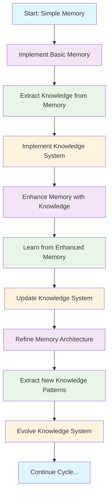
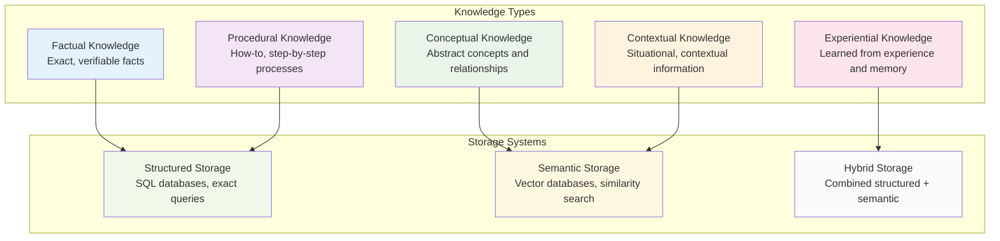
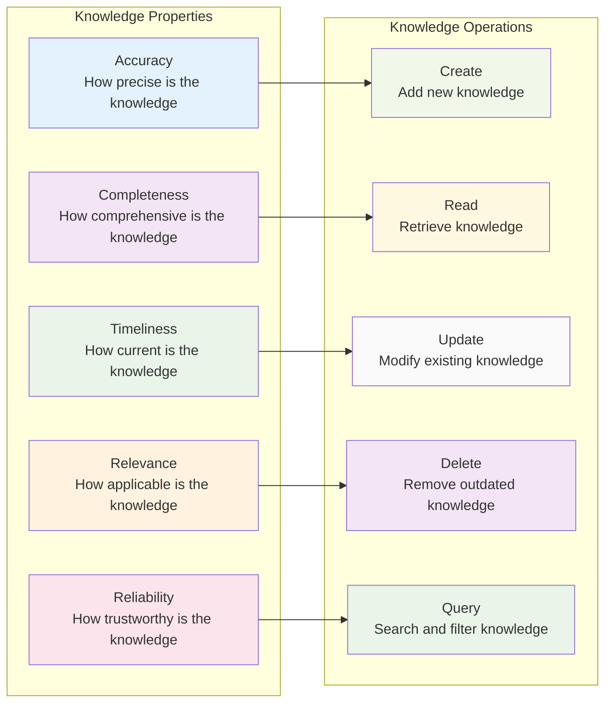
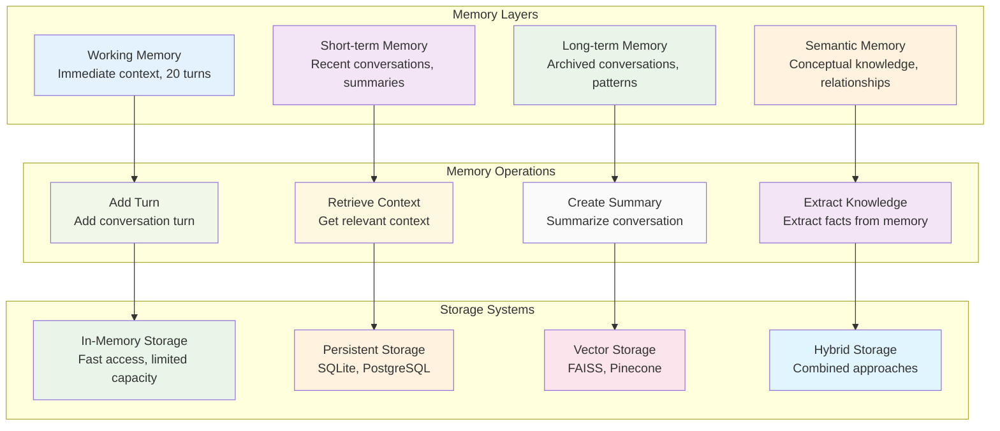
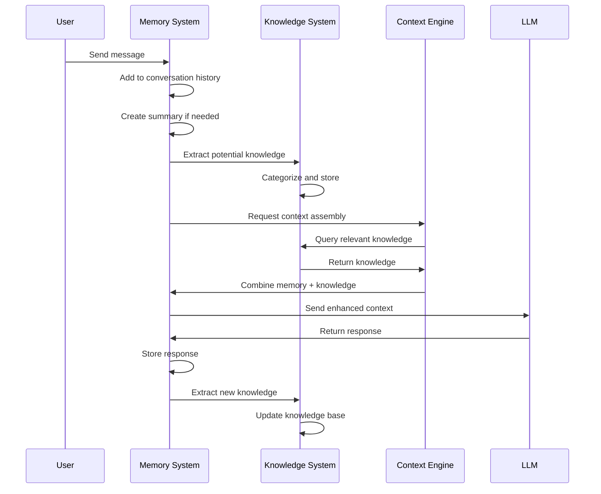

# Memory and Knowledge Design

## Overview

This document describes the co-evolutionary design of memory and knowledge systems in Dana, following an iterative approach where memory and knowledge inform each other in a continuous cycle of improvement.

## 1. Iterative Design Methodology

### **The Memory-Knowledge Co-Evolution Cycle**

### **Phase 1: Memory-First Approach**

**Rationale**: Start with simple, observable memory systems to understand patterns before building complex knowledge structures.

**Implementation Strategy**:
1. **Conversation Memory** - Linear history with summaries
2. **Context Engineering** - Task-specific context assembly
3. **Memory Patterns** - Identify recurring patterns and structures
4. **Knowledge Extraction** - Extract factual knowledge from memory

### **Phase 2: Knowledge Integration**

**Rationale**: Use extracted knowledge to enhance memory systems and provide structured information.

**Implementation Strategy**:
1. **Knowledge Base Integration** - Connect memory to KNOWS/CORRAL
2. **Memory Enhancement** - Use knowledge to improve context assembly
3. **Pattern Recognition** - Identify knowledge patterns in memory
4. **Feedback Loop** - Memory informs knowledge, knowledge enhances memory

### **Phase 3: Co-Evolution**

**Rationale**: Memory and knowledge systems evolve together, each improving the other.

**Implementation Strategy**:
1. **Adaptive Memory** - Memory systems that learn from knowledge
2. **Dynamic Knowledge** - Knowledge systems that learn from memory
3. **Unified Architecture** - Shared interfaces and data structures
4. **Continuous Learning** - Ongoing improvement through interaction

## 2. Knowledge Types and Nomenclature

### **Selected Nomenclature: Functional Categories**

We have chosen a **functional categorization** approach that groups knowledge by its primary purpose and usage pattern.

### **Knowledge Type Taxonomy**

### **Nomenclature Mapping**

| **Our System** | **Academic Terms** | **Industry Terms** | **Description** |
|----------------|-------------------|-------------------|-----------------|
| **Factual Knowledge** | Declarative Knowledge | Reference Data | Exact facts, measurements, specifications |
| **Procedural Knowledge** | Procedural Knowledge | Process Knowledge | Step-by-step procedures, algorithms |
| **Conceptual Knowledge** | Conceptual Knowledge | Domain Knowledge | Abstract concepts, relationships, taxonomies |
| **Contextual Knowledge** | Situational Knowledge | Context Knowledge | Situation-specific information, preferences |
| **Experiential Knowledge** | Tacit Knowledge | Learned Knowledge | Knowledge gained through experience |

### **Knowledge Characteristics**

## 3. Technical Architecture

### **Memory System Architecture**

### **Integration with KNOWS and CORRAL**

```mermaid
graph TB
    subgraph "Memory System"
        A[Conversation Memory]
        B[Context Engineering]
        C[Memory Patterns]
    end
    
    subgraph "KNOWS System"
        D[Knowledge Categorization]
        E[Document Processing]
        F[Context Assembly]
    end
    
    subgraph "CORRAL System"
        G[Curate]
        H[Organize]
        I[Retrieve]
        J[Reason]
        K[Act]
        L[Learn]
    end
    
    subgraph "Integration Points"
        M[Memory → Knowledge<br/>Extract facts from conversations]
        N[Knowledge → Memory<br/>Enhance context with knowledge]
        O[Memory → CORRAL<br/>Provide experiential data]
        P[CORRAL → Memory<br/>Apply learned patterns]
    end
    
    A --> M
    B --> N
    C --> O
    
    D --> N
    E --> M
    F --> N
    
    G --> P
    H --> P
    I --> N
    J --> N
    K --> O
    L --> P
    
    style A fill:#e3f2fd
    style B fill:#f3e5f5
    style C fill:#e8f5e8
    style D fill:#fff3e0
    style E fill:#fce4ec
    style F fill:#f1f8e9
    style G fill:#fff8e1
    style H fill:#fafafa
    style I fill:#f3e5f5
    style J fill:#e8f5e8
    style K fill:#fff3e0
    style L fill:#fce4ec
    style M fill:#e1f5fe
    style N fill:#e8f5e8
    style O fill:#fff3e0
    style P fill:#f3e5f5
```

### **Memory-Knowledge Data Flow**

## 4. Implementation Plan

### **Phase 1: Foundation (Weeks 1-4)**

**Goal**: Implement basic memory system with conversation history.

**Deliverables**:
- [ ] `ConversationMemory` class with linear history
- [ ] Basic context assembly for LLM interactions
- [ ] Memory persistence (SQLite)
- [ ] Simple summarization (rule-based)

**Success Criteria**:
- Can maintain conversation history up to 20 turns
- Can assemble basic context for LLM prompts
- Memory persists across sessions
- Basic summaries are generated every 10 turns

### **Phase 2: Knowledge Integration (Weeks 5-8)**

**Goal**: Integrate memory with existing knowledge systems.

**Deliverables**:
- [ ] Memory-to-knowledge extraction pipeline
- [ ] Knowledge-enhanced context assembly
- [ ] Integration with KNOWS document processing
- [ ] Basic knowledge categorization from memory

**Success Criteria**:
- Can extract factual knowledge from conversations
- Context assembly includes relevant knowledge
- Memory and knowledge systems communicate
- Knowledge base grows from conversation data

### **Phase 3: Advanced Features (Weeks 9-12)**

**Goal**: Implement advanced memory and knowledge features.

**Deliverables**:
- [ ] Semantic memory with vector storage
- [ ] Advanced context engineering with task classification
- [ ] Memory-knowledge feedback loops
- [ ] Integration with CORRAL learning system

**Success Criteria**:
- Semantic search across memory and knowledge
- Task-specific context assembly
- Memory and knowledge co-evolve
- CORRAL learns from memory patterns

### **Phase 4: Optimization (Weeks 13-16)**

**Goal**: Optimize performance and user experience.

**Deliverables**:
- [ ] Performance optimization for large memory sets
- [ ] Advanced summarization with LLM assistance
- [ ] Memory compression and archiving
- [ ] User interface for memory management

**Success Criteria**:
- Memory system handles 10,000+ conversation turns
- Summaries are high-quality and relevant
- Memory compression reduces storage by 80%
- Users can manage and query their memory

## 5. Technical Recommendations

### **Storage Architecture**

**Recommendation**: Hybrid storage approach
- **Working Memory**: In-memory with Redis for speed
- **Short-term Memory**: SQLite for persistence
- **Long-term Memory**: PostgreSQL for complex queries
- **Semantic Memory**: Vector database (FAISS/Pinecone) for similarity search

### **Context Engineering**

**Recommendation**: Multi-layered context assembly
1. **Immediate Context**: Last 5 conversation turns
2. **Recent Context**: Summaries of last 20 turns
3. **Knowledge Context**: Relevant facts and procedures
4. **Task Context**: Task-specific information and goals

### **Memory-Knowledge Interface**

**Recommendation**: Event-driven architecture
- Memory events trigger knowledge extraction
- Knowledge updates trigger memory enhancement
- Asynchronous processing for performance
- Event sourcing for audit trail

### **Scalability Considerations**

**Recommendation**: Microservices architecture
- Separate memory and knowledge services
- Message queues for async processing
- Horizontal scaling for high load
- Caching layers for performance

## 6. Success Metrics

### **Memory System Metrics**
- **Context Relevance**: How relevant is assembled context to user queries
- **Memory Efficiency**: Storage usage vs. information value
- **Response Time**: Time to assemble context and respond
- **User Satisfaction**: User feedback on memory quality

### **Knowledge System Metrics**
- **Knowledge Accuracy**: How accurate is extracted knowledge
- **Knowledge Coverage**: How comprehensive is knowledge base
- **Knowledge Freshness**: How current is knowledge
- **Knowledge Usage**: How often is knowledge accessed

### **Integration Metrics**
- **Cross-System Learning**: How much do systems improve each other
- **Data Flow Efficiency**: How efficiently data moves between systems
- **System Coherence**: How consistent are memory and knowledge
- **Overall Performance**: End-to-end system performance

## 7. Future Directions

### **Advanced Memory Features**
- **Multi-modal Memory**: Support for images, documents, and other media
- **Emotional Memory**: Track emotional context and user sentiment
- **Temporal Memory**: Time-aware memory with decay functions
- **Collaborative Memory**: Shared memory across multiple users

### **Advanced Knowledge Features**
- **Knowledge Graphs**: Graph-based knowledge representation
- **Causal Knowledge**: Understanding cause-and-effect relationships
- **Meta-knowledge**: Knowledge about knowledge
- **Knowledge Synthesis**: Combining knowledge from multiple sources

### **Integration Opportunities**
- **External Knowledge Sources**: Wikipedia, databases, APIs
- **Machine Learning Integration**: ML models for pattern recognition
- **Real-time Learning**: Continuous learning from user interactions
- **Personalization**: User-specific memory and knowledge systems 