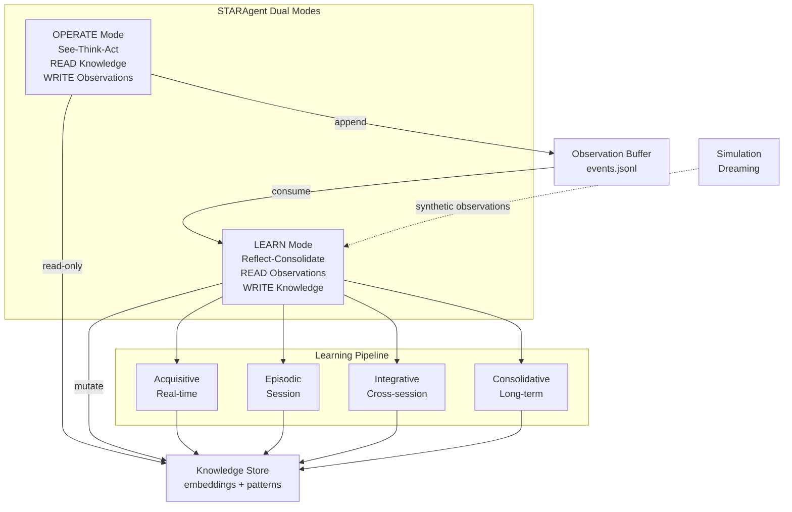
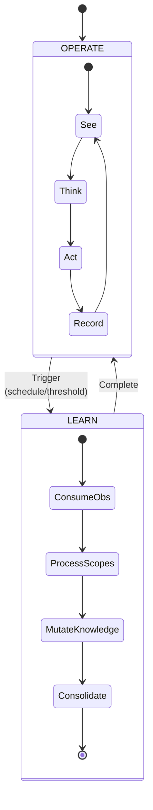
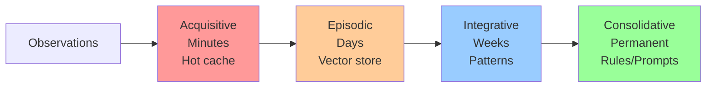
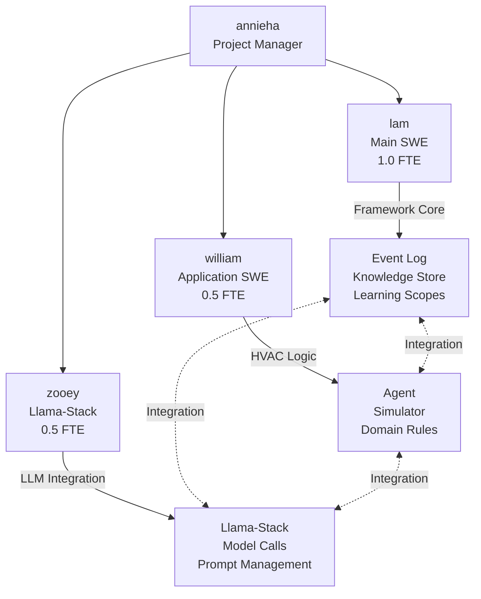

# Dana Reflection Framework: Design Document

## Executive Summary

The Reflection Framework enables Dana STARAgents to learn from experience through a dual-mode architecture: **OPERATE** mode for real-time execution and **LEARN** mode for asynchronous knowledge mutation. This document outlines the architecture for the HVAC autonomous agent use case with a 10-day implementation plan.

## Architecture Overview



## Core Concepts

### Agent Operating Modes



**OPERATE Mode:**
- Synchronous, latency-sensitive
- Read-only knowledge access
- Append observations to buffer
- Never blocks on learning

**LEARN Mode:**
- Asynchronous, can be slow
- Processes observation backlog
- Mutates knowledge store
- Runs simulation campaigns (dreaming)

### Event Sourcing Pattern

All observations and feedback stored as typed events in append-only log:

```json
{"type": "hvac_observation", "timestamp": "2024-10-31T10:00:00", "zone": "floor_2_west", "temp": 72.5, "setpoint": 72, "occupancy": 12}
{"type": "action_taken", "timestamp": "2024-10-31T10:00:05", "zone": "floor_2_west", "action": "increase_cooling", "magnitude": 0.5}
{"type": "feedback", "timestamp": "2024-10-31T10:15:00", "ref_event_id": "action_123", "outcome": "comfort_complaint", "source": "occupant"}
```

## Directory Structure

```
dana_data/
├── events/
│   ├── production/
│   │   └── events.jsonl                    # Append-only event log
│   └── simulation/
│       └── dream_campaign_001.jsonl        # Simulated experiences
│
├── knowledge/
│   ├── acquisitive/
│   │   └── working_memory.json             # Hot cache (TTL: 1 hour)
│   │
│   ├── episodic/
│   │   ├── embeddings.npy                  # Vector embeddings
│   │   ├── metadata.jsonl                  # Per-observation metadata
│   │   └── stats.json                      # Count, last_consolidation
│   │
│   ├── integrative/
│   │   ├── patterns.json                   # Extracted patterns
│   │   ├── clusters.npy                    # Cluster centroids
│   │   ├── cluster_metadata.json           # Cluster semantics
│   │   └── consolidation_log.jsonl         # Audit trail
│   │
│   └── consolidative/
│       ├── rules/
│       │   └── validated_rules.json        # High-confidence rules
│       ├── prompts/
│       │   └── system_prompt_v2.txt        # Learned prompt refinements
│       └── baselines/
│           └── performance_metrics.json    # Expected performance
│
└── meta/
    └── agent_state.json                    # Mode, last_learn_time, etc.
```

## Learning Scopes



| Scope | Timeframe | Storage | Purpose | Demo Status |
|-------|-----------|---------|---------|-------------|
| **Acquisitive** | Minutes-Hours | In-memory JSON | Immediate adaptation | Stubbed |
| **Episodic** | Days-Weeks | NumPy vectors | Similarity-based retrieval | **Full Implementation** |
| **Integrative** | Weeks-Months | Clusters + Patterns | Synthesized rules | **Prototype** |
| **Consolidative** | Permanent | Validated rules | Production knowledge | Stubbed |

## HVAC Use Case Specifics

### Learning Opportunities

**1. Zone-Specific Thermal Characteristics**
- Learning: Each zone's thermal mass, airflow patterns, sun exposure
- Source: Temperature sensor data, HVAC response times
- Destination: Episodic → Integrative patterns

**2. Occupancy Pattern Prediction**
- Learning: When zones are occupied, density patterns
- Source: Occupancy sensors, calendar data, historical patterns
- Destination: Integrative patterns → Predictive models

**3. Comfort vs Efficiency Tradeoffs**
- Learning: Acceptable temperature ranges per zone/time
- Source: Comfort complaints, energy consumption, occupant feedback
- Destination: Consolidative rules

**4. Anomaly Detection Improvement**
- Learning: What's normal for THIS building
- Source: Equipment sensor data, maintenance logs
- Destination: Episodic → Integrative baselines

### Demo Scenario

**Before Learning:**
```
Zone overheating → Generic response → Energy waste + discomfort
Anomaly detected → 10 possible causes → Slow diagnosis
```

**After Learning (Session 1-10):**
```
Zone overheating → Retrieve similar episodes → Optimized response
Anomaly detected → "Similar to episode #47" → Fast root cause
```

**Metrics:**
- Energy consumption reduction: 15-25%
- Comfort complaint reduction: 40%
- Anomaly diagnosis time: 60% faster

## Core Interfaces

```python
# Agent mode enumeration
class AgentMode(Enum):
    OPERATE = "operate"
    LEARN = "learn"

# Event types
@dataclass
class Event:
    type: str
    timestamp: datetime
    agent_id: str
    data: dict
    metadata: dict

# Knowledge with provenance
@dataclass  
class Knowledge:
    content: Any
    scope: Scope
    confidence: float
    provenance: dict
    created: datetime
    ttl: Optional[timedelta]

# Agent with dual modes
class STARAgent:
    def operate(self, environment) -> Action
    def learn(self, duration: Optional[timedelta] = None)
    def dream(self, simulator: SimulationEnvironment, n_episodes: int)

# Storage interfaces
class EventLog:
    def append(self, event: Event)
    def read_since(self, checkpoint: int) -> Iterator[Event]

class KnowledgeStore:
    def retrieve(self, query, scope: Scope, k: int) -> List[Knowledge]
    def write(self, knowledge: Knowledge, scope: Scope)
```

## Implementation Phases

### Phase 1: Skeletal Architecture (Days 1-3)
**Goal:** Framework interfaces + one proven learning path

**Deliverables:**
- Core abstractions (Event, Knowledge, Agent modes)
- Filesystem storage layer
- Episodic learning implementation
- Basic HVAC simulator
- Demo notebook showing learning works

**Success Criteria:**
- Agent learns from 50 simulated HVAC episodes
- Retrieval shows similar past cases
- Metrics improve (energy/comfort)

### Phase 2: Product Prototype (Days 4-7)
**Goal:** HVAC-specific application + integration

**Deliverables:**
- HVAC agent with domain logic
- Real building data ingestion (or realistic simulation)
- Integrative consolidation (pattern extraction)
- Llama-Stack integration for LLM calls
- Demo UI showing learning accumulation

**Success Criteria:**
- End-to-end HVAC scenario runs
- Pattern consolidation visible
- Llama-Stack models power decision-making

### Phase 3: Polish & Demo Prep (Days 8-10)
**Goal:** Production-ready demo

**Deliverables:**
- Robust error handling
- Performance metrics dashboard
- Documentation for extension
- Rehearsed demo narrative
- Handoff materials

**Success Criteria:**
- Demo runs reliably
- Clear path to production deployment
- Extensibility proven (documentation)

## Team Structure & Coordination



**Coordination Strategy:**
- Daily 15-min standups (9:00 AM)
- Sync integration sessions (Wed, Fri afternoons)
- Async: Slack for quick questions, PRs for code review
- AI coding: Each dev uses AI pair programming to 2x velocity

## 10-Day Implementation Plan

### Day 1 (Monday) - Foundation

**@annieha (PM):**
- Kickoff meeting (30 min): Review design doc, assign tasks
- Set up project tracking (Jira/Linear)
- Define success metrics with team

**@lam (Main SWE) - 8 hours:**
- [ ] 9:00-10:00: Setup project structure (use AI to generate boilerplate)
- [ ] 10:00-12:00: Implement Event Log (append-only JSONL)
- [ ] 1:00-3:00: Implement KnowledgeStore interfaces + filesystem backend
- [ ] 3:00-5:00: Basic episodic storage (NumPy embeddings)
- **Deliverable:** Event log + knowledge store stubbed out

**@william (Application) - 4 hours:**
- [ ] 9:00-10:30: Research HVAC control basics + data formats
- [ ] 10:30-12:30: Start HVAC simulator design (zone model, thermal dynamics)
- [ ] 1:00-3:00: Generate simulator skeleton with AI coding assistant
- **Deliverable:** HVAC simulator stub with basic zone dynamics

**@zooey (Integration) - 4 hours:**
- [ ] 9:00-11:00: Set up Llama-Stack dev environment
- [ ] 11:00-1:00: Create LLM client wrapper
- **Deliverable:** Llama-Stack connection tested

**Sync:** 4:30 PM check-in (15 min) - Blockers? Tomorrow's priorities?

---

### Day 2 (Tuesday) - Core Learning Loop

**@lam - 8 hours:**
- [ ] 9:00-11:00: Implement EpisodicLearning scope (process events → embeddings)
- [ ] 11:00-1:00: Implement retrieval (cosine similarity search)
- [ ] 2:00-4:00: STARAgent skeleton (operate/learn modes)
- [ ] 4:00-5:00: Integration test: write events, learn, retrieve
- **Deliverable:** Working episodic learning pipeline

**@william - 4 hours:**
- [ ] 9:00-12:00: Complete HVAC simulator (temperature dynamics, setpoint control)
- [ ] 1:00-3:00: Generate test scenarios (overheating, occupancy changes)
- **Deliverable:** Runnable HVAC simulator with realistic behavior

**@zooey - 4 hours:**
- [ ] 9:00-11:00: Implement prompt management system
- [ ] 11:00-1:00: Create HVAC decision prompt templates
- **Deliverable:** Prompt system integrated with Llama-Stack

**Sync:** 4:30 PM - Integration planning for Day 3

---

### Day 3 (Wednesday) - First Integration

**@lam - 8 hours:**
- [ ] 9:00-11:00: Simulation learning loop (agent runs episodes, learns)
- [ ] 11:00-1:00: **Integration session with @william** (agent + simulator)
- [ ] 2:00-4:00: Demo notebook: show learning curve
- [ ] 4:00-5:00: Test end-to-end: 20 episodes, show improvement
- **Deliverable:** Proven learning works (notebook with metrics)

**@william - 4 hours:**
- [ ] 9:00-11:00: Add observability to simulator (logging, metrics)
- [ ] 11:00-1:00: **Integration session with @lam**
- [ ] 2:00-4:00: Create demo scenarios (before/after learning)
- **Deliverable:** Integration complete, demo scenarios ready

**@zooey - 4 hours:**
- [ ] 9:00-12:00: Integrate LLM calls into agent decision logic
- [ ] 1:00-3:00: Test: agent uses Llama-Stack for HVAC decisions
- **Deliverable:** Agent making LLM-powered decisions

**Sync:** 4:00 PM - Full team integration test
**@annieha:** Review progress, adjust plan if needed

---

### Day 4 (Thursday) - HVAC Domain Logic

**@lam - 8 hours:**
- [ ] 9:00-11:00: Implement Integrative scope (clustering, pattern extraction)
- [ ] 11:00-1:00: Consolidation trigger logic
- [ ] 2:00-4:00: Refactor for production patterns (error handling)
- [ ] 4:00-5:00: Documentation: architecture + extension guide
- **Deliverable:** Integrative learning working, framework documented

**@william - 4 hours:**
- [ ] 9:00-12:00: Implement HVAC agent domain logic (zone control strategies)
- [ ] 1:00-3:00: Add comfort vs efficiency optimization logic
- **Deliverable:** HVAC-specific agent intelligence

**@zooey - 4 hours:**
- [ ] 9:00-11:00: Implement knowledge retrieval in prompts (RAG pattern)
- [ ] 11:00-1:00: Optimize prompt for HVAC domain
- **Deliverable:** Context-aware prompts with retrieved knowledge

**Sync:** 4:30 PM - Demo dry run #1

---

### Day 5 (Friday) - End-to-End Polish

**@lam - 8 hours:**
- [ ] 9:00-11:00: Performance optimization (retrieval speed)
- [ ] 11:00-1:00: Add metrics collection (energy, comfort, accuracy)
- [ ] 2:00-5:00: **Full integration day** - work with team on connections
- **Deliverable:** Polished core framework

**@william - 4 hours:**
- [ ] 9:00-12:00: Real building data ingestion (or enhance simulator realism)
- [ ] 1:00-3:00: **Integration session** - connect all pieces
- **Deliverable:** Realistic HVAC data flowing through system

**@zooey - 4 hours:**
- [ ] 9:00-11:00: Llama-Stack observability (log LLM calls, costs)
- [ ] 11:00-1:00: **Integration session**
- **Deliverable:** Full LLM integration with monitoring

**Sync:** 3:00 PM - Full team integration
**@annieha:** Week 1 review, plan Week 2

---

### Day 6 (Monday) - Visualization & UX

**@lam - 8 hours:**
- [ ] 9:00-12:00: Knowledge inspection tools (view episodic memory, patterns)
- [ ] 1:00-3:00: Add consolidation visualization
- [ ] 3:00-5:00: Stub Consolidative scope (interfaces + examples)
- **Deliverable:** Framework feature-complete

**@william - 4 hours:**
- [ ] 9:00-12:00: Build demo UI (Streamlit or notebook widgets)
- [ ] 1:00-3:00: Add real-time learning visualization
- **Deliverable:** Interactive demo interface

**@zooey - 4 hours:**
- [ ] 9:00-11:00: Prompt versioning system
- [ ] 11:00-1:00: A/B test framework for prompts (optional but valuable)
- **Deliverable:** Production-ready prompt management

**Sync:** 4:30 PM - Demo dry run #2

---

### Day 7 (Tuesday) - Robustness

**@lam - 8 hours:**
- [ ] 9:00-12:00: Error handling, edge cases
- [ ] 1:00-3:00: Add recovery mechanisms (corrupt file handling)
- [ ] 3:00-5:00: Performance testing (1000 observations, retrieval latency)
- **Deliverable:** Production-grade robustness

**@william - 4 hours:**
- [ ] 9:00-11:00: HVAC simulator edge cases (equipment failure, extreme weather)
- [ ] 11:00-1:00: Add anomaly detection scenarios
- **Deliverable:** Comprehensive test scenarios

**@zooey - 4 hours:**
- [ ] 9:00-11:00: LLM fallback strategies (rate limits, errors)
- [ ] 11:00-1:00: Cost optimization (caching, prompt compression)
- **Deliverable:** Reliable LLM integration

**Sync:** 4:00 PM - Integration testing

---

### Day 8 (Wednesday) - Demo Preparation

**@lam - 8 hours:**
- [ ] 9:00-12:00: Documentation polish (README, API docs, extension guide)
- [ ] 1:00-3:00: Create architecture diagrams for presentation
- [ ] 3:00-5:00: Code cleanup, add comments
- **Deliverable:** Production-ready codebase

**@william - 4 hours:**
- [ ] 9:00-12:00: Demo script writing (narrative, timing)
- [ ] 1:00-3:00: Practice demo run
- **Deliverable:** Rehearsed demo narrative

**@zooey - 4 hours:**
- [ ] 9:00-11:00: Create deployment guide
- [ ] 11:00-1:00: Performance benchmarks document
- **Deliverable:** Deployment documentation

**@annieha:** 
- Review all deliverables
- Prepare demo environment
- Coordinate final rehearsal

**Sync:** 4:00 PM - Full demo rehearsal (entire team)

---

### Day 9 (Thursday) - Final Polish

**@lam - 8 hours:**
- [ ] 9:00-12:00: Fix issues from rehearsal
- [ ] 1:00-3:00: Create extension examples (other use cases)
- [ ] 3:00-5:00: Final testing, backup plans
- **Deliverable:** Demo-ready system

**@william - 4 hours:**
- [ ] 9:00-11:00: Demo environment setup (laptop, backups)
- [ ] 11:00-1:00: Create one-pager handout
- **Deliverable:** Demo materials ready

**@zooey - 4 hours:**
- [ ] 9:00-11:00: Prepare Q&A responses (technical questions)
- [ ] 11:00-1:00: Final Llama-Stack integration check
- **Deliverable:** Q&A prep

**Sync:** 3:00 PM - Final demo rehearsal
**@annieha:** Finalize presentation flow

---

### Day 10 (Friday) - Buffer & Handoff

**All team - 4 hours each:**
- [ ] 9:00-11:00: Emergency fixes only
- [ ] 11:00-1:00: Team handoff meeting (what we built, how to extend)
- [ ] 1:00-3:00: Create handoff document for future teams
- **Deliverable:** Complete handoff package

**@annieha:**
- Project retrospective
- Document lessons learned
- Archive project materials

**Demo Day:** Ready for presentation!

---

## Success Metrics

### Technical Metrics
- **Learning works:** Agent improves over 20+ episodes
- **Retrieval speed:** <10ms for episodic queries
- **Consolidation:** Patterns extracted from 100+ observations
- **Integration:** All components work together end-to-end

### Product Metrics (HVAC Demo)
- **Energy efficiency:** 15-25% improvement after learning
- **Comfort:** 40% fewer complaints
- **Anomaly diagnosis:** 60% faster root cause identification
- **Adaptation:** Agent learns building-specific patterns

### Team Velocity
- **AI coding boost:** 2x faster implementation vs manual
- **Integration overhead:** 20% of time (acceptable for team size)
- **Demo readiness:** Day 8 (2-day buffer)

## Risk Mitigation

| Risk | Mitigation | Owner |
|------|------------|-------|
| Integration complexity | Daily sync sessions, clear interfaces | @annieha |
| HVAC simulator realism | Start simple, iterate based on feedback | @william |
| LLM reliability | Implement fallbacks, caching | @zooey |
| Learning doesn't work | Tune parameters early (Day 3 checkpoint) | @lam |
| Demo failure | Pre-record backup, save notebook outputs | @annieha |

## Extension Roadmap (Post-Demo)

**Phase 4: Multi-Agent (Weeks 3-4)**
- Distributed agents per building zone
- Knowledge consolidation across agents
- Centralized orchestration

**Phase 5: Production Deployment (Weeks 5-8)**
- Replace filesystem with vector DB
- Add monitoring/alerting
- Deploy to real building pilot

**Phase 6: Other Use Cases (Weeks 9-12)**
- Semiconductor RCA
- Financial fraud detection
- Framework generalization

---

**Document Version:** 1.0  
**Last Updated:** 2024-10-31  
**Owners:** @annieha (PM), @lam (Tech Lead)