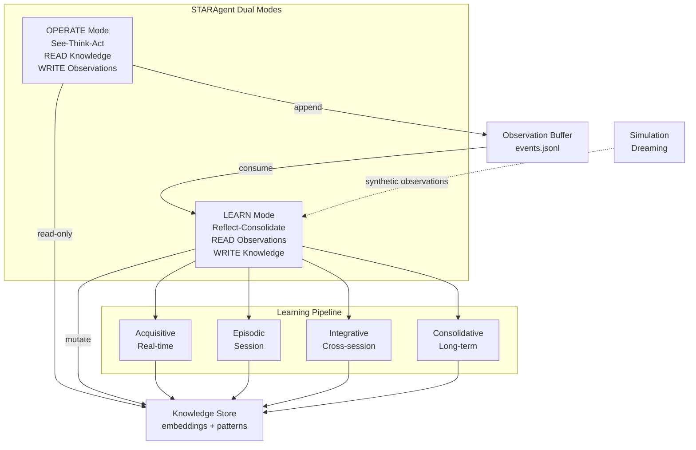
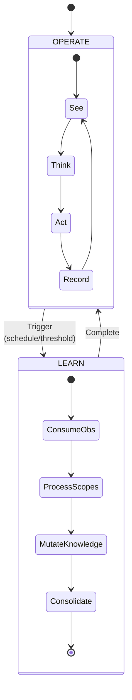
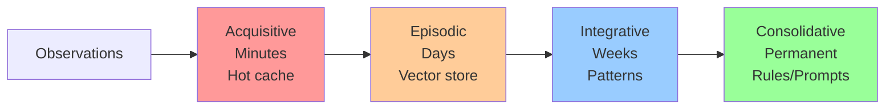
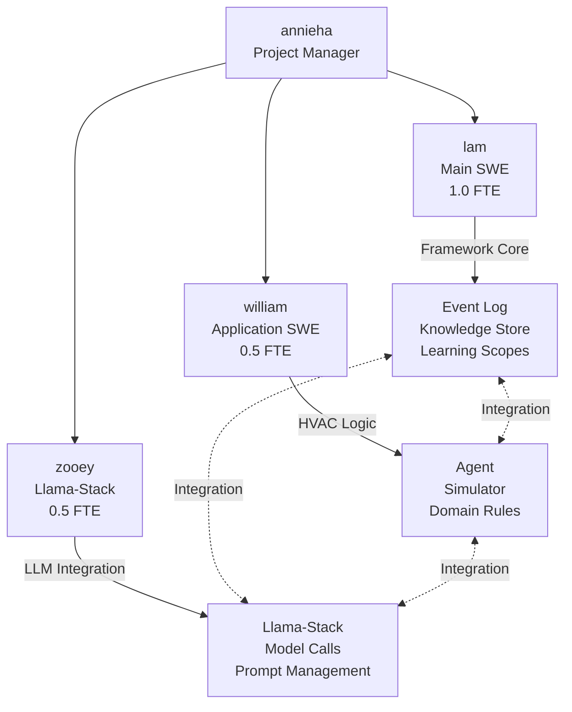
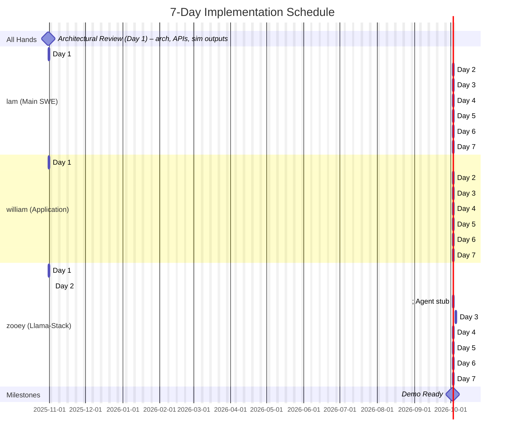

# Dana Reflection Framework: Design Document

## Executive Summary

The Reflection Framework enables Dana STARAgents to learn from experience through a dual-mode architecture: **OPERATE** mode for real-time execution and **LEARN** mode for asynchronous knowledge mutation. This document outlines the architecture for the HVAC autonomous agent use case with a 7-day implementation plan.

## Architecture Overview



## Core Concepts

### Agent Operating Modes



**OPERATE Mode:**
- Synchronous, latency-sensitive
- Read-only knowledge access
- Append observations to buffer
- Never blocks on learning

**LEARN Mode:**
- Asynchronous, can be slow
- Processes observation backlog
- Mutates knowledge store
- Runs simulation campaigns (dreaming)

### Event Sourcing Pattern

All observations and feedback stored as typed events in append-only log:

```json
{"type": "hvac_observation", "timestamp": "2024-10-31T10:00:00", "zone": "floor_2_west", "temp": 72.5, "setpoint": 72, "occupancy": 12}
{"type": "action_taken", "timestamp": "2024-10-31T10:00:05", "zone": "floor_2_west", "action": "increase_cooling", "magnitude": 0.5}
{"type": "feedback", "timestamp": "2024-10-31T10:15:00", "ref_event_id": "action_123", "outcome": "comfort_complaint", "source": "occupant"}
```

### Sessions and Learning Scopes (KISS Mapping)

- Session = episodic unit (1:1). All events in a session carry `session_id`.
- Per-STAR loop: micro-acquisitions (system prompt timeline updates) in hot cache.
- Per-query (may span multiple STAR loops): acquisitive artifact in working memory.
- Integrative: runs across sessions (e.g., daily) to extract cross-session patterns.
- Consolidative: promotes stable knowledge (e.g., weekly), session-agnostic but with provenance.

Prompt Learning:
- Prompt versions are persisted under `knowledge/prompts` with provenance and metrics.
- Prompt learning for resources and workflows is explicitly deferred to the next sprint.

Triggers:
- On STAR loop end → update acquisitive hot cache.
- On query completion → write/roll up acquisitive artifact.
- On session end → write episodic summary (embedding + metadata + provenance).
- Daily → run integrative consolidation across recent sessions.
- Weekly → run consolidative promotion of validated rules/prompts.

## Directory Structure

```
dana_data/
├── events/
│   ├── production/
│   │   └── events.jsonl                    # Append-only event log
│   └── simulation/
│       └── dream_campaign_001.jsonl        # Simulated experiences
│
├── knowledge/
│   ├── acquisitive/
│   │   └── working_memory.json             # Hot cache (TTL: 1 hour), keyed by query_id/session_id
│   │
│   ├── episodic/
│   │   ├── embeddings.npy                  # Session-level summary embeddings (1:1 with session_id)
│   │   ├── metadata.jsonl                  # Per-session metadata (provenance, counts, timebounds)
│   │   └── stats.json                      # Count, last_consolidation
│   │
│   ├── integrative/
│   │   ├── patterns.json                   # Extracted patterns
│   │   ├── clusters.npy                    # Cluster centroids
│   │   ├── cluster_metadata.json           # Cluster semantics
│   │   └── consolidation_log.jsonl         # Audit trail
│   │
│   ├── prompts/                            # Prompt learning (this sprint)
│   │   ├── versions/
│   │   │   ├── v0001.txt
│   │   │   └── v0002.txt
│   │   ├── changelog.jsonl                 # Prompt diffs, provenance, metrics
│   │   ├── active.json                     # Pointer to active version
│   │   └── NOTE.txt                        # Resource/Workflow prompt learning deferred to next sprint
│   │
│   └── consolidative/
│       ├── rules/
│       │   └── validated_rules.json        # High-confidence rules
│       ├── prompts/
│       │   └── system_prompt_v2.txt        # Global prompt refinements (deprecated by prompts store)
│       └── baselines/
│           └── performance_metrics.json    # Expected performance
│
└── meta/
    └── agent_state.json                    # Mode, last_learn_time, etc.
```

## Learning Scopes



| Scope | Timeframe | Storage | Purpose | Demo Status |
|-------|-----------|---------|---------|-------------|
| **Acquisitive** | Minutes-Hours | In-memory JSON | Immediate adaptation | Stubbed |
| **Episodic** | Days-Weeks | NumPy vectors | Similarity-based retrieval | **Full Implementation** |
| **Integrative** | Weeks-Months | Clusters + Patterns | Synthesized rules | **Prototype** |
| **Consolidative** | Permanent | Validated rules | Production knowledge | Stubbed |

## HVAC Use Case Specifics

### Learning Opportunities

**1. Zone-Specific Thermal Characteristics**
- Learning: Each zone's thermal mass, airflow patterns, sun exposure
- Source: Temperature sensor data, HVAC response times
- Destination: Episodic → Integrative patterns

**2. Occupancy Pattern Prediction**
- Learning: When zones are occupied, density patterns
- Source: Occupancy sensors, calendar data, historical patterns
- Destination: Integrative patterns → Predictive models

**3. Comfort vs Efficiency Tradeoffs**
- Learning: Acceptable temperature ranges per zone/time
- Source: Comfort complaints, energy consumption, occupant feedback
- Destination: Consolidative rules

**4. Anomaly Detection Improvement**
- Learning: What's normal for THIS building
- Source: Equipment sensor data, maintenance logs
- Destination: Episodic → Integrative baselines

### Demo Scenario

**Before Learning:**
```
Zone overheating → Generic response → Energy waste + discomfort
Anomaly detected → 10 possible causes → Slow diagnosis
```

**After Learning (Session 1-10):**
```
Zone overheating → Retrieve similar episodes → Optimized response
Anomaly detected → "Similar to episode #47" → Fast root cause
```

**Metrics:**
- Energy consumption reduction: 15-25%
- Comfort complaint reduction: 40%
- Anomaly diagnosis time: 60% faster

## Core Interfaces

```python
# Agent mode enumeration
class AgentMode(Enum):
    OPERATE = "operate"
    LEARN = "learn"

# Event types
@dataclass
class Event:
    type: str
    timestamp: datetime
    agent_id: str
    data: dict
    metadata: dict

# Knowledge with provenance
@dataclass  
class Knowledge:
    content: Any
    scope: Scope
    confidence: float
    provenance: dict
    created: datetime
    ttl: Optional[timedelta]

# Agent with dual modes
class STARAgent:
    def operate(self, environment) -> Action
    def learn(self, duration: Optional[timedelta] = None)
    def dream(self, simulator: SimulationEnvironment, n_episodes: int)

# Storage interfaces
class EventLog:
    def append(self, event: Event)
    def read_since(self, checkpoint: int) -> Iterator[Event]

class KnowledgeStore:
    def retrieve(self, query, scope: Scope, k: int) -> List[Knowledge]
    def write(self, knowledge: Knowledge, scope: Scope)

# Prompt persistence and APIs
@dataclass
class PromptVersion:
    version: str
    content: str
    created: datetime
    provenance: dict
    metrics: dict

class LocalPromptStore:  # directory-based persistence under knowledge/prompts
    def get_active(self) -> PromptVersion
    def list_versions(self) -> List[PromptVersion]
    def set_active(self, version: str)
    def create_version(self, content: str, provenance: dict) -> PromptVersion

class PromptsAPI:
    def render(self, template_name: str, context: dict) -> str
    def learn(self, signal: dict) -> PromptVersion  # creates new version when warranted
```

## Team Structure & Coordination

## Team Structure & Coordination



**Coordination Strategy:**
- Daily 15-min standups (9:00 AM)
- Sync integration sessions (Wed, Fri afternoons)
- Async: Slack for quick questions, PRs for code review
- AI coding: Each dev uses AI pair programming to 2x velocity

## 7-Day Implementation Plan

### Day 1 - Foundation & Setup

**@annieha (PM):**
- Kickoff (30 min): review design, assign roles, define success metrics
- Set up tracking (Jira/Linear) and demo milestones

**All-hands (Architectural Review - 60 min):**
- Review architecture and interfaces (`EventLog`, `KnowledgeStore`, `STARAgent`)
- Confirm Llama-Stack integration points: `Inference API`, `Agent API`, `Storage API`, `Conversation API` (Prompts is local filesystem-based)
- Align on simulator requirements: expose environment state outputs/telemetry, not just accept inputs

**@lam (Main SWE) - 8 hours:**
- [ ] Project structure and tooling
- [ ] Implement `EventLog` (append-only JSONL)
- [ ] Implement `KnowledgeStore` interfaces + filesystem backend
- [ ] Initialize directory-based prompts store; scaffold `LocalPromptStore` and `PromptsAPI`
- **Deliverable:** Event log + knowledge store scaffolding

**@william (Application) - 4 hours:**
- [ ] HVAC simulator design (zones, thermal dynamics, environment state outputs/telemetry)
- [ ] Simulator skeleton generated with AI assistant
- **Deliverable:** Simulator stub with basic zone dynamics and observable environment state

**@zooey (Integration) - 4 hours:**
 - [ ] Llama-Stack dev environment ready
 - [ ] LLM client wrapper created and tested
 - [ ] Define and sequence API contracts: `Inference`, `Agent`, `Storage`, `Conversation` (Finetuning deferred)
 - **Deliverable:** Baseline connectivity + API contract plan

**Sync:** 4:30 PM - Blockers and priorities

Deliverables by role:
- @annieha: Success metrics, tracking/milestones defined
- All-hands: Architecture reviewed, integration points agreed
- @lam: Event log + knowledge store scaffolding; prompts directory scaffolded
- @william: Simulator stub with observable environment state
- @zooey: Llama-Stack connectivity + API contract plan

---

### Day 2 - Core Learning Loop

**@lam - 8 hours:**
- [ ] Implement Episodic scope (events → embeddings)
- [ ] Retrieval via cosine similarity
- [ ] `STARAgent` skeleton (operate/learn modes)
- [ ] Implement end-of-session write trigger (episodic summary on session close)
- [ ] Local prompts service (filesystem): render + learn (MVP prompt learning)
- **Deliverable:** Working episodic learning pipeline

**@william - 4 hours:**
- [ ] Complete simulator (temperature dynamics, setpoint control, environment outputs)
- [ ] Create test scenarios (overheating, occupancy changes)
- **Deliverable:** Runnable simulator with realistic behavior and exported state/telemetry

**@zooey - 4 hours:**
 - [ ] Implement `Inference API` integration (model selection, health check)
 - [ ] Stub `Agent API` (decision call surface)
 - **Deliverable:** `Inference API` live; `Agent` stub

**Sync:** 4:30 PM - Plan first integration

Deliverables by role:
 - @lam: Episodic pipeline functional with end-of-session write trigger
 - @william: Runnable simulator with exported state/telemetry
- @zooey: Inference API live; Agent stub

---

### Day 3 - First Integration & Proof

**@lam - 8 hours:**
- [ ] Simulation learning loop (run episodes, learn)
- [ ] Demo notebook showing learning curve
- [ ] End-to-end test (≥20 episodes) shows improvement
- [ ] Implement per-query acquisitive artifact write on query completion
- **Deliverable:** Proven learning with metrics

**@william - 4 hours:**
- [ ] Add simulator observability (logging, metrics)
- [ ] Create before/after demo scenarios
- **Deliverable:** Integration complete, scenarios ready

**@zooey - 4 hours:**
 - [ ] Wire `Agent API` to decision loop; connect to `Inference API`
 - **Deliverable:** Agent decisions using `Inference`

**Sync:** 4:00 PM - Full team integration test

Deliverables by role:
- @lam: Learning loop + notebook with improvement over ≥20 episodes; per-query acquisitive write
- @william: Observability added; before/after scenarios ready
- @zooey: Agent wired to Inference; decisions flowing

---

### Day 4 - HVAC Domain Logic & Integrative Prototype

**@lam - 8 hours:**
- [ ] Implement Integrative scope (clustering, pattern extraction)
- [ ] Consolidation trigger logic
- [ ] Production hardening (error handling)
- **Deliverable:** Integrative learning working

**@william - 4 hours:**
- [ ] HVAC domain strategies (zone control)
- [ ] Comfort vs efficiency optimization logic
- **Deliverable:** HVAC-specific agent intelligence

**@zooey - 4 hours:**
- [ ] RAG: retrieval wiring into `Prompts API` (context injection)
- [ ] Introduce `Conversation API` for multi-turn decision traces
- **Deliverable:** Context-aware prompts + conversational scaffolding

Operational cadence notes:
- Integrative runs daily across sessions (batch job).

**Sync:** 4:30 PM - Demo dry run #1

Deliverables by role:
- @lam: Integrative scope working + consolidation trigger logic
- @william: HVAC domain strategies and optimization logic implemented
- @zooey: RAG context in Prompts; Conversation API scaffolding

---

### Day 5 - End-to-End Polish & Observability

**@lam - 8 hours:**
- [ ] Performance optimization (retrieval speed)
- [ ] Metrics collection (energy, comfort, accuracy)
- [ ] Integration sweep across components
- **Deliverable:** Polished core framework

**@william - 4 hours:**
- [ ] Improve simulator realism or ingest sample building data
- [ ] Wire realistic data through pipeline
- **Deliverable:** Realistic HVAC data flowing end-to-end

**@zooey - 4 hours:**
- [ ] Implement `Storage API` for logs/telemetry of LLM calls
- [ ] Observability (log calls, costs) across `Inference`/`Agent`/`Conversation`
- **Deliverable:** Storage-backed LLM monitoring

**Sync:** 3:00 PM - Full team integration

Deliverables by role:
- @lam: Optimized retrieval + metrics collection integrated
- @william: Realistic data flowing end-to-end
- @zooey: Storage-backed LLM observability

---

### Day 6 - Visualization, UX, and Consolidation Stubs

**@lam - 8 hours:**
- [ ] Knowledge inspection tools (episodic memory, patterns)
- [ ] Consolidation visualization
- [ ] Stub Consolidative scope (interfaces + examples)
- **Deliverable:** Framework feature-complete

**@william - 4 hours:**
- [ ] Demo UI (Streamlit or notebook widgets)
- [ ] Real-time learning visualization
- **Deliverable:** Interactive demo interface

**@lam - 2 hours:**
 - [ ] Local prompts versioning + rollout controls (filesystem)
 - **Deliverable:** Versioned prompts (filesystem)

**@zooey - 2 hours:**
 - [ ] Enhance `Conversation API` (session metadata, transcript export)
 - **Deliverable:** Richer conversations

Operational cadence notes:
- Consolidative runs weekly to promote stable rules/prompts (versioned, with rollback plan).

**Sync:** 4:30 PM - Demo dry run #2

Deliverables by role:
- @lam: Inspection tools + consolidation visualization + consolidative stubs + versioned prompts
- @william: Demo UI with real-time learning visualization
- @zooey: Enhanced conversations

---

### Day 7 - Robustness, Demo Prep, and Handoff

**@lam - 8 hours:**
- [ ] Error handling, edge cases, recovery (corrupt files)
- [ ] Performance tests (≥1000 observations latency)
- [ ] Documentation polish (README, API docs, diagrams)
- **Deliverable:** Production-grade codebase ready for demo

**@william - 4 hours:**
- [ ] Demo script (narrative, timing) and environment setup
- [ ] Final practice run; create one-pager handout
- **Deliverable:** Demo materials ready

**@zooey - 4 hours:**
- [ ] Deployment guide and performance benchmarks
- [ ] Final checks across `Inference`/`Agent`/`Storage`/`Conversation`/`Prompts`
- **Deliverable:** Deployment docs and Q&A readiness

**Note:** Finetuning API is explicitly deferred to the next sprint.

**All team (2 hours):**
- [ ] Final rehearsal and handoff meeting (how to extend)
- **Deliverable:** Complete handoff package

**Demo Day:** Ready for presentation!

Deliverables by role:
- @lam: Production-grade codebase, docs/diagrams
- @william: Demo script, environment setup, handout
- @zooey: Deployment guide, benchmarks, final API checks
- All team: Final rehearsal + handoff package

---

## Success Metrics

### Technical Metrics
- **Learning works:** Agent improves over 20+ episodes
- **Retrieval speed:** <10ms for episodic queries
- **Consolidation:** Patterns extracted from 100+ observations
- **Integration:** All components work together end-to-end
- **Prompt learning:** New prompt versions correlate with improved decision metrics (win rate/latency)

### Product Metrics (HVAC Demo)
- **Energy efficiency:** 15-25% improvement after learning
- **Comfort:** 40% fewer complaints
- **Anomaly diagnosis:** 60% faster root cause identification
- **Adaptation:** Agent learns building-specific patterns

### Team Velocity
- **AI coding boost:** 2x faster implementation vs manual
- **Integration overhead:** 20% of time (acceptable for team size)
- **Demo readiness:** Day 7

## Risk Mitigation

| Risk | Mitigation | Owner |
|------|------------|-------|
| Integration complexity | Daily sync sessions, clear interfaces | @annieha |
| HVAC simulator realism | Start simple, iterate based on feedback | @william |
| LLM reliability | Implement fallbacks, caching | @zooey |
| Learning doesn't work | Tune parameters early (Day 3 checkpoint) | @lam |
| Demo failure | Pre-record backup, save notebook outputs | @annieha |

## Extension Roadmap (Post-Demo)

**Phase 4: Multi-Agent (Weeks 3-4)**
- Distributed agents per building zone
- Knowledge consolidation across agents
- Centralized orchestration

**Phase 5: Production Deployment (Weeks 5-8)**
- Replace filesystem with vector DB
- Add monitoring/alerting
- Deploy to real building pilot

**Phase 6: Other Use Cases (Weeks 9-12)**
- Semiconductor RCA
- Financial fraud detection
- Framework generalization

---

**Document Version:** 1.0  
**Last Updated:** 2024-10-31  
**Owners:** @annieha (PM), @lam (Tech Lead)

## Gantt: 7-Day Schedule

