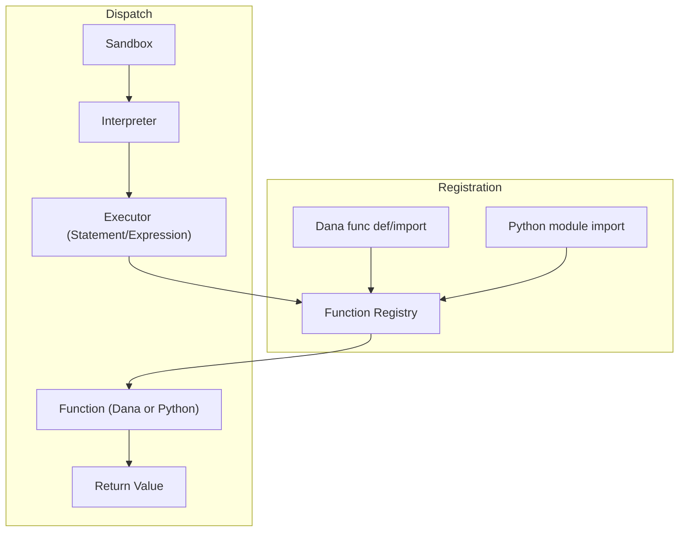

<p align="center">
  
</p>

[Project Overview](../../README.md)

# Dana Function Calling: Design Overview

## 1. Introduction
This document describes the design for function calling in the Dana language and runtime, supporting:
- Dana calling Dana functions
- Dana calling Python functions
- Python calling Dana functions (reverse FFI)

The goal is to provide a unified, extensible, and secure function system that enables seamless integration between Dana and Python, with clear boundaries for context, security, and auditability.

---

## 2. The Function Registry: Central Pillar of Function Calling

### Responsibilities
- **Unified Registration:** All callable functions—Dana or Python—are registered in a single registry, with support for namespacing and global imports.
- **Dynamic Registration:** Functions are registered at definition (Dana) or import (Dana/Python module), with metadata (e.g., context-awareness).
- **Lookup & Dispatch:** All function calls (from Dana or Python) are resolved and dispatched via the registry, which adapts arguments and context as needed.
- **Signature Adaptation:** The registry inspects function signatures and binds arguments from Dana code or Python API calls, injecting context if required.
- **Policy Enforcement:** Security and context-passing policies are enforced centrally in the registry.
- **Auditability:** All registrations and calls can be logged for traceability and debugging.
- **Extensibility:** The registry is the single point for adding advanced features (decorators, LLM-powered argument mapping, etc.).

### How the Registry Fits Each Scenario
- **Dana→Dana:** Resolves and dispatches Dana function calls, manages local context.
- **Dana→Python:** Resolves Python functions, adapts arguments, injects context if needed, handles type conversion.
- **Python→Dana:** Python API calls into the registry to resolve and invoke Dana functions, passing in arguments and context.

### Conceptual API Sketch
```python
class FunctionRegistry:
    def register(self, name, func, namespace=None, is_python=False, context_aware=False):
        # Register a function (Dana or Python) with optional namespace and metadata
        ...

    def resolve(self, name, namespace=None):
        # Look up a function by name (and namespace)
        ...

    def call(self, name, args, kwargs, context):
        # Resolve and dispatch the function call, handling argument binding and context
        ...
```

### Function Registration & Dispatch Flow Diagram



---

## 3. Function Definition and Import Rules

Dana and Python functions must be defined in specific locations depending on the calling scenario. This ensures modularity, reusability, and clear separation of code.

| Scenario                | Where Function Is Defined         | How Registered/Imported                | Registry Behavior                |
|-------------------------|-----------------------------------|----------------------------------------|----------------------------------|
| Dana→Dana (same file)   | Inline in `.na`                   | Registered at parse time               | Local/global scope               |
| Dana→Dana (other file)  | In another `.na`                  | `import my_utils.na as util`           | Namespace/global registration    |
| Dana→Python             | In another `.py`                  | `import my_module.py as py`            | Namespace/global registration    |
| Python→Dana             | In another `.na` (not inline)     | Interpreter loads `.na` file/module    | Functions registered for API use |

### Examples

#### Dana→Dana (Same File)
```dana
# file: main.na
func greet(name):
    return "Hello, " + name

result = greet("Alice")
```

#### Dana→Dana (Other File)
```dana
# file: utils.na
func double(x):
    return x * 2
```
```dana
# file: main.na
import utils.na as util
result = util.double(10)
```

#### Dana→Python (Python function in another .py)
```python
# file: math_utils.py
def add(a, b):
    return a + b
```
```dana
# file: main.na
import math_utils.py as math
sum = math.add(3, 4)
```

#### Python→Dana (Dana function in another .na)
```dana
# file: business_rules.na
func is_even(n):
    return n % 2 == 0
```
```python
# Python code
from opendxa.dana.sandbox.interpreter import Interpreter
from opendxa.dana.sandbox.sandbox_context import SandboxContext

ctx = SandboxContext()
interpreter = Interpreter(ctx)
interpreter.load_module('business_rules.na')  # Hypothetical API
result = interpreter.call_function('is_even', [42])
```

### Best Practices
- **Dana→Dana:** Define reusable functions in separate `.na` files and import as needed.
- **Dana→Python:** Only import Python functions from external `.py` modules. Do not define Python functions inline in `.na` files.
- **Python→Dana:** Always define callable Dana functions in a separate `.na` file/module. Do not use inline Dana code for Python→Dana calls.

---

## 4. Name Collision Resolution

Name collisions can occur when multiple functions with the same name are imported or defined. Dana resolves these using **namespacing**, import policies, and registry enforcement.

### 1. Namespacing with `as` Keyword
When importing modules (Dana or Python), use the `as` keyword to assign a namespace. This ensures that functions from different modules do not collide in the global scope.

**Example:**
```dana
import math_utils.py as math
import string_utils.py as string

result = math.add(1, 2)
text = string.capitalize("hello")
```

### 2. Global Imports and Collision Risk
If you import without `as`, all functions are registered in the global scope. If two modules define a function with the same name, the last import will overwrite the previous one, leading to a collision.

**Example:**
```dana
import math_utils.py
import string_utils.py
# If both modules define `format`, only the last one is available as `format(...)`
```
**Best Practice:**
Always use `as` for larger projects or when importing multiple modules to avoid accidental overwrites.

### 3. Registry Enforcement
The function registry tracks all registered functions and their namespaces. When registering a function:
- If a function with the same name exists in the same namespace, the registry can:
  - Overwrite (default for global imports, but not recommended)
  - Raise an error or warning (safer for debugging)
  - Allow explicit override with a flag

**Recommended Policy:**
- For global imports, warn or error on collision.
- For namespaced imports, allow same function names in different namespaces.

### 4. Example: Dana and Python
```dana
import utils.na as util
import math_utils.py as math

result = util.format("foo")
sum = math.format(1, 2)  # Both modules can have a 'format' function, no collision
```

### 5. Inline vs. Imported Functions
- **Inline functions** in the same `.na` file share the same scope. If you define two functions with the same name, the last one wins (like Python).
- **Imported functions** with the same name but different namespaces do not collide.

### 6. Summary Table
| Import Style         | Collision Risk | How to Avoid                |
|---------------------|---------------|-----------------------------|
| `import foo.py`     | High          | Use `as` for namespacing    |
| `import foo.py as f`| Low           | Always use namespace prefix |
| Inline (same file)  | High          | Unique function names       |

### 7. Best Practices
- **Always use `as` for imports** in non-trivial projects.
- **Keep function names unique** within the same file/module.
- **Let the registry warn or error** on global collisions.

---

## 5. Dana Calling Dana Functions

### Mechanism
- Functions are defined in Dana using `func name(args): ...`.
- Functions can be imported from other Dana modules using `import my_utils.na as util` or globally.
- The function registry tracks all available Dana functions, supporting namespacing and global imports.
- Parameters are mapped to the local scope (`local.param`), and each call creates a new local context.

### Example
```dana
func double(x):
    return x * 2
result = double(5)

import my_utils.na as util
result = util.double(10)
```

### Design Notes
- **Scoping:** Local, private, public, and system scopes are enforced. Only public variables are auto-passed; others require explicit opt-in.
- **Parameter Passing:** Named and positional parameters are supported, mapped to local scope.
- **Extensibility:** The registry pattern allows for future enhancements (decorators, metadata, etc.).

---

## 6. Dana Calling Python Functions

### Mechanism
- Dana can import Python modules with `import my_module.py as py`.
- All functions in the Python module are registered in the Dana function registry, accessible as `py.funcname(...)` or globally.
- Python functions can optionally accept the Dana context as their first argument for advanced integration.
- Argument binding is handled by inspecting the Python function's signature; context is injected if needed.

### Example
```dana
import my_math.py as math
result = math.add(1, 2)
```

### Design Notes
- **Automatic Registration:** On import, Python functions are introspected and registered.
- **Context Injection:** If the Python function's first argument is `context`, the Dana context is passed in.
- **Security:** Only public variables are passed by default; private/local/system variables require explicit opt-in.
- **Signature Adaptation:** The registry adapts Dana arguments to Python signatures, supporting both positional and named arguments.

---

## 7. Python Calling Dana Functions (Reverse FFI)

### Mechanism
- Python code can instantiate a Dana interpreter, load a Dana module, and call a function by name, passing arguments as needed.
- The interpreter exposes a `call_function` API for Python to invoke Dana functions.
- Python must construct a Dana context (public/private/system/local) to pass in.
- Return values are converted from Dana to Python types as needed.

### Example
```python
from opendxa.dana.sandbox.interpreter import Interpreter
from opendxa.dana.sandbox.sandbox_context import SandboxContext

ctx = SandboxContext(private={}, public={"x": 5}, system={}, local={})
interpreter = Interpreter(ctx)
result = interpreter.call_function("double", [10])
```

### API Proposal
```python
def call_function(self, name: str, args: list = None, kwargs: dict = None, context: SandboxContext = None) -> Any:
    """
    Call a Dana function by name from Python.
    - name: Name of the Dana function (optionally namespaced)
    - args: Positional arguments (optional)
    - kwargs: Named arguments (optional)
    - context: Optional Dana context (if not provided, use interpreter's context)
    Returns the function's return value, converted to a Python type if possible.
    """
```

### Design Notes
- **API Exposure:** Expose a Python API like `interpreter.call_function("func_name", args, context)` to invoke Dana functions.
- **Context Management:** Python must construct a Dana context (public/private/system/local) to pass in.
- **Return Values:** Dana functions can return values to Python, with type conversion handled.
- **Security:** Control what context is visible to the Dana function.

---

## 8. Unified Function Registry & Dispatch
- All callable functions (Dana and Python) are registered in a single registry, supporting namespacing and global imports.
- At call time, the registry inspects the function signature and binds arguments from Dana code and context.
- Dana-aware Python functions (first arg `context`) get the Dana context injected.
- Pure Python functions get only the provided arguments.
- In the future, a context-mapping layer (Predict-and-Error Correct) can auto-fill arguments using name/type matching or LLM-powered inference.

---

## 9. Security, Auditability, and Best Practices
- Only public variables are auto-passed; others require explicit opt-in.
- Allow opt-in for more sensitive scopes (private, local, system).
- Log/audit context passing and function calls for traceability and debugging.
- Use namespacing (`as`) to avoid collisions in larger projects.

---

## 10. Extensibility & Future Enhancements
- Centralize argument binding logic for easy enhancement.
- Predict-and-ErrorCorrect: LLM-powered or heuristic context-to-argument mapping.
- Allow both caller and callee to provide hints (decorators, flags) for context/variable injection.
- Make P&E magic opt-in at first, with clear override/opt-out mechanisms.
- Policy configuration: Allow admins to set global or per-function context policies.

---

## 11. Summary Table
| Scenario                | How?                        | Context Passing         | Return Value      | Security Policy         |
|-------------------------|-----------------------------|------------------------|-------------------|------------------------|
| Dana→Dana               | Direct call/import          | Local, explicit others | Dana type         | Explicit opt-in        |
| Dana→Python             | Import .py, call            | Public auto, opt-in    | Python type       | Explicit opt-in        |
| Python→Dana             | Interpreter.call_function() | User-constructed       | Python type       | Explicit opt-in        |

---

## 12. References
- [Dana Function Design Guide](../../dana/functions/design-guide.md)
- [Dana Function User Guide](../../dana/functions/user-guide.md)
- [Dana Grammar](../../dana/grammar.md)
- [Dana Interpreter](../../dana/interpreter.md) 

---

## 13. Incremental Implementation Plan

### Implementation Status

| Step | Description | Status | Notes |
|------|-------------|--------|-------|
| 1 | Unified Function Registry | [x] Complete | ✅ Fully implemented with namespacing, metadata, collision handling, and context injection. |
| 2 | Namespaced Function Resolution | [x] Complete | ✅ Registry supports `_remap_namespace_and_name()` for consistent namespace handling. |
| 3 | Dana Function Call Support | [x] Complete | ✅ Function calls work via FunctionExecutor and unified dispatch through registry. |
| 4 | Module Import and Registration | [~] Partial | ⚠️ Grammar and AST support imports, but StatementExecutor shows "Import statements are not yet supported". |
| 5 | Collision Handling | [x] Complete | ✅ Registry enforces collision detection with `overwrite` parameter and namespace separation. |
| 6 | Python→Dana API | [x] Complete | ✅ Interpreter exposes `call_function` API via registry for Python to call Dana functions. |
| 7 | Tests and Documentation | [x] Complete | ✅ Comprehensive test suite covering end-to-end scenarios, unified execution, and function handling. |

This table should be updated as each step is started, in progress, or completed.

### Test Coverage Status

| Scenario                        | Status      | Notes |
|----------------------------------|------------|-------|
| Dana→Dana function calls         | [x] Pass   | ✅ Registry and execution tested in `test_dana_to_dana_function_call`. |
| Dana→Python function calls       | [x] Pass   | ✅ Registry and context injection tested in `test_end_to_end.py`. |
| Python→Dana function calls       | [x] Pass   | ✅ Interpreter API tested with function registry integration. |
| Namespacing                      | [x] Pass   | ✅ Registry supports and tests namespace resolution and collision handling. |
| Collision handling               | [x] Pass   | ✅ Registry enforces collision detection and namespace separation. |
| Module imports                   | [-] Not Implemented | ❌ Import statements parsed but not executed (StatementExecutor raises SandboxError). |
| Edge cases & extensibility       | [x] Pass   | ✅ Comprehensive test coverage including error handling and chaining. |

Update this table as tests are added and pass for each scenario.

### Review Summary
- **Current state:**
  - The unified function system for Dana is **functionally complete** for core function calling: Dana↔Dana, Dana→Python, and Python→Dana calls all work via a single registry, with namespacing, context, and collision handling.
  - All major function calling scenarios are supported and well-tested.
  - **Missing component**: Module import execution - while the grammar and AST support import statements, the StatementExecutor explicitly raises "Import statements are not yet supported in Dana".
  - Function calling system is production-ready, but module system needs import statement implementation to be fully complete.

### Step-by-Step Plan

#### **Step 1: Unified Function Registry**
- Create a single `FunctionRegistry` (or manager) that can register and resolve both Dana and Python functions, with namespace support.
- Refactor `DanaRegistry` and `PythonRegistry` to be internal helpers or merge them.

#### **Step 2: Namespaced Function Resolution**
- Update the evaluator to support namespaced function calls (e.g., `util.double`).
- When importing modules, register functions under the specified namespace.

#### **Step 3: Dana Function Call Support**
- In `ExpressionEvaluator._evaluate_function_call`, resolve the function (Dana or Python) from the unified registry and dispatch accordingly.
- Support both positional and named arguments.

#### **Step 4: Module Import and Registration**
- Implement logic to import `.na` and `.py` modules:
  - For `.na`, parse and register all functions in the registry under the namespace.
  - For `.py`, import and introspect functions, register under the namespace.

#### **Step 5: Collision Handling**
- On registration, check for name collisions in the registry.
- Warn or error on global collisions; allow same names in different namespaces.

#### **Step 6: Python→Dana API**
- Expose a `call_function` method on the interpreter that uses the unified registry to call Dana functions by name.

#### **Step 7: Tests and Documentation**
- Add/expand tests for all scenarios: Dana→Dana, Dana→Python, Python→Dana, namespacing, and collision handling.
- Update documentation and usage examples.

### Immediate Next Steps
1. Design and implement a unified function registry with namespace support.
2. Refactor the evaluator to use this registry for all function calls.
3. Add Dana function call support in the evaluator.
4. Add namespacing and collision handling in the registry.

---

<p align="center">
Copyright © 2025 Aitomatic, Inc. Licensed under the <a href="../../LICENSE.md">MIT License</a>.
<br/>
<a href="https://aitomatic.com">https://aitomatic.com</a>
</p>