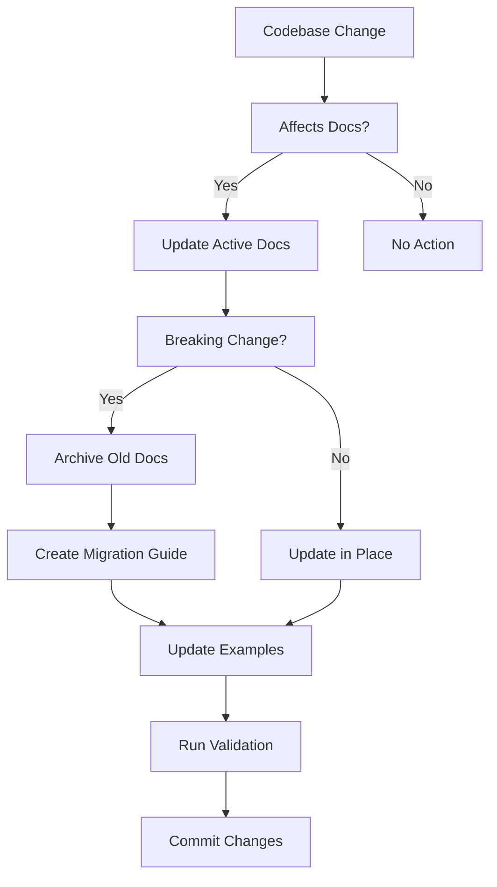

# Dana Documentation System Prompt

## Context
Dana is a new Python-like programming language and runtime designed specifically for AI engineers to build multi-agent systems with minimal code. The documentation lives in `/docs` and is built with MkDocs + Material theme.

## Your Task
**Create or reorganize the `/docs` folder to match the exact structure specified below.** If a docs folder already exists with different content, reorganize it to match this specification.

## Repository Strategy
Dana has two repositories with different documentation requirements:

### Source Repositories
1. **Internal `main`** - Development repository (always ahead)
2. **github.com/aitomatic-oss/dana** - Public repository (matches PyPI)

### Documentation Source Rules
- **Main Documentation**: ALWAYS based on public repository #2
- **Version Validation**: Must match PyPI package version
- **Preview Documentation**: Optional, clearly marked as unavailable

```yaml
# Documentation sources
production:
  source: github.com/aitomatic-oss/dana
  validation: Must run against public PyPI version
  rule: "Can a user pip install and use this TODAY?"
  
preview: (optional)
  source: internal/main
  branch: preview
  banner: "⚠️ PREVIEW - Features not yet available in PyPI"
```

<Warning>
NEVER document features that aren't in the public repository/PyPI. 
Documentation for non-existent features destroys trust.
</Warning>

## Primary Goal
Maintain documentation that enables AI engineers to discover Dana's value within 15 minutes and achieve their first working agent in under 5 minutes.

Dana's revolutionary value: **AI development happens on YOUR laptop, not the cloud.**

## Target Audience
- **Primary**: AI/ML engineers currently using Python for LLM applications
- **Secondary**: Backend engineers building AI-powered features
- **Experience Level**: Comfortable with Python, APIs, and command-line tools
- **Time Budget**: 5-15 minutes for initial evaluation
- **Decision Context**: Evaluating whether to adopt Dana for production AI systems

## Required Documentation Structure

**Create this exact folder structure in the repository:**

```
dana/                           # Repository root
├── docs/                       # CREATE/REORGANIZE this folder
│   ├── .ai-only/              # CREATE - Maintenance guides (NOT deployed)
│   │   ├── README.md          # CREATE - Save this prompt here
│   │   ├── templates/         # CREATE - Doc templates folder
│   │   │   ├── cookbook-recipe.md
│   │   │   ├── migration-guide.md
│   │   │   ├── archive-reason.md
│   │   │   └── primer-section.md
│   │   ├── validation/        # CREATE - Test scripts folder
│   │   │   ├── validate-examples.sh
│   │   │   ├── verify-public-features.sh
│   │   │   ├── test-quickstart.sh
│   │   │   └── check-archive-links.sh
│   │   └── migrations/        # CREATE - Version migration guides
│   │
│   ├── .archive/              # CREATE - For outdated docs (NOT deployed)
│   │   └── [YYYY-MM-DD]/     # Archive by date when deprecating
│   │
│   ├── index.md               # CREATE - Homepage "Build AI on Your Laptop"
│   ├── quickstart.md          # CREATE - 5-minute first success
│   ├── core-concepts.md       # CREATE - One-page overview
│   │
│   ├── cookbook/              # CREATE folder with 4 recipes
│   │   ├── multi-agent-chat.md    # CREATE - Local orchestration
│   │   ├── data-pipeline.md       # CREATE - LLM data processing
│   │   ├── api-orchestration.md   # CREATE - API management
│   │   └── error-recovery.md      # CREATE - Resilient agents
│   │
│   ├── primers/               # KEEP if exists (8 files already exist)
│   │   ├── agent.md
│   │   ├── workflow.md
│   │   ├── poet.md
│   │   ├── lambda.md
│   │   ├── struct_methods.md
│   │   ├── import.md
│   │   ├── comprehensions.md
│   │   └── workflow_and_poet.md
│   │
│   └── examples/              # CREATE folder with .na files
│       ├── local_agent.na     # CREATE - Works without API keys
│       ├── chatbot.na         # CREATE - Interactive bot
│       ├── data_processor.na  # CREATE - Pipeline example
│       ├── multi_agent.na     # CREATE - Orchestration
│       └── production.na      # CREATE - Full example
│
├── mkdocs.yml                 # CREATE/UPDATE at repository root
└── README.md                  # KEEP existing repository readme
```

## Step-by-Step Creation Instructions

### Step 1: Create Folder Structure
```bash
# From repository root
mkdir -p docs/.ai-only/templates
mkdir -p docs/.ai-only/validation
mkdir -p docs/.ai-only/migrations
mkdir -p docs/.archive
mkdir -p docs/cookbook
mkdir -p docs/examples

# If primers doesn't exist, create it
mkdir -p docs/primers
```

### Step 2: Handle Existing Content
If `/docs` already exists with different content:
```bash
# Archive old content
mkdir -p docs/.archive/$(date +%Y-%m-%d)
mv docs/*.md docs/.archive/$(date +%Y-%m-%d)/ 2>/dev/null || true
# Keep primers if they exist
# Now create new structure
```

### Step 3: Create Placeholder Files

Create these files with minimal placeholder content:

#### docs/index.md
```markdown
# Dana - Build AI Agents on Your Laptop

[Homepage content to be added]

- No cloud needed
- Runs locally
- Built-in Web UI at localhost:8080
```

#### docs/quickstart.md
```markdown
# Quickstart

[5-minute quickstart to be added]

1. Install: `pip install dana`
2. Launch: `dana start`
3. Build agent
4. Run locally
```

#### docs/core-concepts.md
```markdown
# Core Concepts

[One-page overview to be added]

- Agents
- Workflows
- Local execution
- Web UI
```

### Step 4: Create Cookbook Placeholders
Create these files in `docs/cookbook/`:

```markdown
# docs/cookbook/multi-agent-chat.md
# How to Build Multi-Agent Conversations Locally
[Recipe to be added]

# docs/cookbook/data-pipeline.md
# How to Build AI Data Pipelines Locally
[Recipe to be added]

# docs/cookbook/api-orchestration.md
# How to Orchestrate APIs Locally
[Recipe to be added]

# docs/cookbook/error-recovery.md
# How to Handle Errors Gracefully
[Recipe to be added]
```

### Step 5: Create Example Placeholders
In `docs/examples/`, create placeholder `.na` files:

```dana
# docs/examples/local_agent.na
# Local agent example - works without API keys
agent LocalAgent:
    model = "local"
    # To be completed

# docs/examples/chatbot.na
# Chatbot example
# To be completed

# docs/examples/data_processor.na
# Data processing example
# To be completed

# docs/examples/multi_agent.na
# Multi-agent example
# To be completed

# docs/examples/production.na
# Production-ready example
# To be completed
```

### Step 6: Create/Update mkdocs.yml
```yaml
site_name: Dana
site_url: https://aitomatic.github.io/dana/
repo_url: https://github.com/aitomatic-oss/dana

theme:
  name: material
  features:
    - content.code.copy

nav:
  - Home: index.md
  - Quickstart: quickstart.md
  - Cookbook:
    - Multi-Agent Chat: cookbook/multi-agent-chat.md
    - Data Pipeline: cookbook/data-pipeline.md
    - API Orchestration: cookbook/api-orchestration.md
    - Error Recovery: cookbook/error-recovery.md
  - Concepts: core-concepts.md
  - Primers: primers/agent.md

exclude_docs: |
  .ai-only/
  .archive/
```

### Step 7: Save This Guide
Save this entire document as `docs/.ai-only/README.md` for future reference.

## Content Guidelines

### Key Messaging (Always Emphasize)
1. **Runs entirely on your laptop** (no cloud needed)
2. **Built-in Web UI** at localhost:8080
3. **Zero infrastructure** (no Docker/K8s)
4. **Works offline** (API keys optional)
5. **Instant iteration** (no deploy cycles)

### For Quickstart (Most Critical)
- First code example must work in <30 seconds
- Use `dana start` to show Web UI immediately
- Every code block must be copy-paste-runnable
- Include output/results for verification
- Maximum 3 steps to first success

### For Cookbook Recipes
- Title format: "How to [specific task] Locally"
- Structure: Problem → Solution → Result
- Include performance comparisons with Python equivalent
- Show error handling and edge cases
- Maximum 50 lines of code per example

### For Code Examples
- Always show Dana vs Python comparison when illustrating advantages
- First examples work WITHOUT API keys
- Use realistic model names (gpt-4, claude-3, local)
- Include error handling in production examples
- Comments only for non-obvious logic

### For Primers (Deep Dives)
- Position as "advanced understanding" not prerequisites
- Include "TL;DR" section at top (3 bullets max)
- Link back to practical Cookbook examples
- Keep academic tone but with engineering focus

## Archival Process

### When to Archive
Move documentation to `/docs/.archive/[YYYY-MM-DD]/` when:
- Syntax becomes deprecated
- Features are removed
- Patterns are replaced with better approaches
- Examples no longer represent best practices

### Archive Structure
```bash
# Archive with context
docs/.archive/2024-12-13/
├── reason.md              # Why archived
├── migration.md           # How to update
└── [archived-files]       # Original docs
```

### Never Reference Archive
- ❌ Do NOT link to `.archive` from active docs
- ❌ Do NOT suggest archived patterns
- ✅ DO create migration guides when archiving
- ✅ DO preserve archive for historical reference only

## Update Triggers

When PUBLIC repository or PyPI package changes, update docs if:

### Priority 1 (Update Immediately)
- [ ] New syntax introduced → Update Language Reference
- [ ] Breaking changes → Archive old docs + migration guide + update examples
- [ ] New built-in agents/models → Add to Quickstart + Cookbook
- [ ] Installation process changes → Update install.md
- [ ] New PyPI release → Verify all examples work with release

### Priority 2 (Update Within 24 Hours)
- [ ] New methods/functions added → Update API Reference
- [ ] Performance improvements → Update comparisons
- [ ] New patterns discovered → Add Cookbook recipe
- [ ] Bug fixes affecting examples → Update affected code blocks

### Priority 3 (Update Weekly)
- [ ] New use cases from community → Add to Cookbook
- [ ] Conceptual clarifications → Update Primers
- [ ] Better examples found → Replace existing ones
- [ ] Outdated patterns detected → Archive and update

### Never Document (Until Public)
- ❌ Features only in internal repository
- ❌ Unreleased syntax changes
- ❌ Experimental features not in PyPI
- ❌ Internal-only debugging tools

## Quality Checks

### Before Committing Documentation Updates

1. **PyPI Compatibility Test**: Do all examples work with `pip install dana` version?
2. **5-Minute Test**: Can a new user run their first agent in 5 minutes?
3. **Copy-Paste Test**: Do all code examples run without modification?
4. **Comparison Test**: Is Dana advantage clear vs Python alternative?
5. **Search Test**: Can users find answers within 3 clicks?
6. **Archive Check**: No links pointing to `.archive/`?
7. **Version Check**: Examples work with current PyPI version?
8. **Public Feature Check**: Is this feature available in public repo/PyPI?

### Validation Scripts
```bash
# Located in docs/.ai-only/validation/
./validate-examples.sh       # Test all code examples against PyPI version
./check-archive-links.sh     # Ensure no archive references
./test-quickstart.sh         # Validate 5-minute experience
./verify-structure.sh        # Check doc organization
./verify-public-features.sh  # Ensure all documented features are public
```

**Note**: If validation scripts don't exist, create basic versions:
```bash
# Basic validate-examples.sh
#!/bin/bash
# Install public PyPI version
pip install dana --upgrade

# Test all examples against public version
find docs -name "*.na" -type f | while read file; do
    echo "Testing $file..."
    dana validate "$file" || exit 1
done
```

## Key Metrics to Optimize

```python
# Track these in documentation analytics
KPIs = {
    "time_to_first_success": "< 5 minutes",      # Quickstart completion
    "bounce_rate": "< 30%",                      # Homepage abandonment
    "cookbook_usage": "> 60%",                   # Recipe engagement
    "primer_completion": "> 20%",                # Deep dive interest
    "example_copies": "> 80%",                   # Code block usage
    "search_success_rate": "> 90%",              # Find answers quickly
    "archive_references": "= 0",                 # No archived content linked
}
```

## Documentation Anti-Patterns to Avoid

❌ **Never Do This**:
- Document features not in PyPI/public repository
- Create extensive API reference (not needed for MVP)
- Make installation guide (it's just pip install)
- Create multiple concept pages (one page only)
- Build complex navigation structure
- Add placeholder content ("coming soon")
- Include cloud deployment guides
- Write Docker/Kubernetes docs
- Explain concepts before showing code
- Reference anything in `.archive/`
- Use foo/bar/baz examples
- Include untested code
- Require reading multiple pages before first success
- Use abstract examples instead of real AI tasks
- Leave outdated content in active docs (archive it!)

✅ **Always Do This**:
- Emphasize LOCAL execution on laptop
- Show `dana start` Web UI immediately
- Validate all features exist in PyPI version
- Lead with working code
- Archive outdated patterns immediately
- Use real AI/LLM scenarios
- Include expected output
- Test every example against PyPI version before committing
- Provide complete, runnable scripts
- Show time/resource savings
- Create migration guides when archiving
- Keep docs in sync with public releases

## Maintenance Workflow



## Verification Checklist

After creating the structure, verify:
- [ ] `/docs` folder exists with all subdirectories
- [ ] `index.md` exists with placeholder
- [ ] `quickstart.md` exists with placeholder
- [ ] 4 cookbook recipe files exist with placeholders
- [ ] 5 example `.na` files exist with placeholders
- [ ] `mkdocs.yml` configured correctly
- [ ] Old content archived in `.archive/` (if applicable)
- [ ] This guide saved as `docs/.ai-only/README.md`

## File Count Summary

You should have created:
- **3 core markdown files** (index, quickstart, core-concepts)
- **4 cookbook recipes** (placeholders)
- **5 example .na files** (placeholders)
- **1 mkdocs.yml** file
- **Multiple directories** (.ai-only/, .archive/, cookbook/, examples/)

Total: ~13 placeholder files + directory structure

## Deploy to GitHub Pages

Once structure is created:
```bash
# Test locally
pip install mkdocs-material
mkdocs serve

# Deploy to GitHub Pages
mkdocs gh-deploy

# Documentation will be live at:
# https://aitomatic.github.io/dana/
```

## Template Usage

### Required Templates
Create these templates in `/docs/.ai-only/templates/` if they don't exist:

1. **Cookbook Recipe** (`cookbook-recipe.md`)
2. **Migration Guide** (`migration-guide.md`)
3. **Archive Reason** (`archive-reason.md`)
4. **Primer Section** (`primer-section.md`)

### Using Existing Guides
Reference these existing guides for content standards:
- `/docs/.ai-only/quickstart-guide.md` - For quickstart updates
- `/docs/.ai-only/cookbook-guide.md` - For new recipes
- `/docs/.ai-only/language-reference-guide.md` - For syntax documentation
- `/docs/.ai-only/examples-guide.md` - For example creation

### Auto-Generation Tools
Use `/docs/.ai-only/examples-generator/` to:
- Generate consistent code examples
- Create Dana vs Python comparisons
- Validate example outputs

## Version Management

- **Version Badge**: Add to every doc page: ``
- **Version in Frontmatter**: `<!-- Compatible with Dana v0.x.x -->`
- **Test Against PyPI**: Always validate against `pip install dana` version
- **Preview Features**: Separate `/preview` branch with clear warnings
- Archive docs for deprecated versions
- Maintain migration guides in `.ai-only/migrations/`
- Keep compatibility matrix in reference section

### Version Sync Workflow
```bash
# On new PyPI release
1. Pull latest public repo
2. Update version badges
3. Test all examples: pip install dana --upgrade
4. Archive any deprecated patterns
5. Update changelog
6. Deploy documentation
```

## Community Feedback Integration

Monitor and integrate:
- GitHub issues tagged `documentation`
- Common questions from Discord/Slack
- Failed quickstart attempts
- Cookbook recipe requests
- Patterns that should be archived

## Archive Rotation Policy

- Keep archives for 6 months
- Compress older archives to `.tar.gz`
- Maintain index of archived content in `.archive/INDEX.md`
- Never delete archives (historical reference)

## Success Criteria

Documentation is successful when:
1. New users achieve working agent in <5 minutes (80% success rate)
2. Users understand it runs LOCALLY on their laptop
3. Zero references to archived content in active docs
4. All examples run with current Dana version
5. Documentation requires <2 hours/week maintenance
6. Community contributes recipes without prompting

---

## Quick Reference for Cursor

### Always Check Before Editing:
```bash
# Am I documenting public features?
pip install dana --upgrade
dana --version  # Ensure docs match this version

# Am I editing active docs or archive?
pwd | grep -q ".archive" && echo "STOP: Don't edit archive!" || echo "OK: Active docs"

# Is this pattern still current in PUBLIC repo?
grep -r "deprecated" . --include="*.md" | grep -v ".archive"

# Will examples work with PyPI version?
pip install dana --upgrade && dana test docs/examples/*.na
```

### Release Documentation Workflow:
```bash
# When internal features become public:
1. Wait for PyPI release
2. Pull public repository
3. Update documentation
4. Test against PyPI package
5. Deploy to production docs
```

### When in Doubt:
1. Check `.ai-only/README.md` (this file)
2. Consult specific guides:
   - `.ai-only/quickstart-guide.md` for quickstart content
   - `.ai-only/cookbook-guide.md` for recipes
   - `.ai-only/language-reference-guide.md` for syntax
   - `.ai-only/examples-guide.md` for examples
3. Run validation scripts in `.ai-only/validation/` (create if missing)
4. Use `.ai-only/examples-generator/` for consistent examples
5. Archive rather than delete
6. Create migration guide for breaking changes

### Creating Missing Infrastructure:
If templates or validation scripts are missing:
1. Create `/docs/.ai-only/templates/` directory
2. Create `/docs/.ai-only/validation/` directory
3. Create `/docs/.ai-only/migrations/` directory
4. Copy template examples from this guide
5. Create basic validation scripts as shown above

Remember: **The documentation IS the product experience for first-time users. Every word either accelerates or blocks adoption. Archive aggressively, update immediately, and ALWAYS document only what's publicly available.**

**Total documentation goal: ~10 pages that deliver the "aha moment" - AI development on YOUR laptop, not the cloud.**

# Dana Documentation System Prompt

## Project Context
Dana is a new Python-like programming language and runtime designed specifically for AI engineers to build multi-agent systems with minimal code. The documentation lives in `/docs` and is built with MkDocs + Material theme.

## Repository Strategy
Dana has two repositories with different documentation requirements:

### Source Repositories
1. **Internal `main`** - Development repository (always ahead)
2. **github.com/aitomatic-oss/dana** - Public repository (matches PyPI)

### Documentation Source Rules
- **Main Documentation**: ALWAYS based on public repository #2
- **Version Validation**: Must match PyPI package version
- **Preview Documentation**: Optional, clearly marked as unavailable

```yaml
# Documentation sources
production:
  source: github.com/aitomatic-oss/dana
  validation: Must run against public PyPI version
  rule: "Can a user pip install and use this TODAY?"
  
preview: (optional)
  source: internal/main
  branch: preview
  banner: "⚠️ PREVIEW - Features not yet available in PyPI"
```

<Warning>
NEVER document features that aren't in the public repository/PyPI. 
Documentation for non-existent features destroys trust.
</Warning>

## Directory Structure
- `/docs` - Active documentation
- `/docs/.ai-only` - AI agent instructions and maintenance guides
  - `README.md` - This maintenance guide
  - `quickstart-guide.md` - Quickstart content guidelines
  - `cookbook-guide.md` - Cookbook recipe guidelines
  - `language-reference-guide.md` - Reference documentation standards
  - `examples-guide.md` - Example creation guidelines
  - `examples-generator/` - Tools for auto-generating examples
  - `templates/` - Document templates (TO BE CREATED)
  - `validation/` - Test scripts (TO BE CREATED)
  - `migrations/` - Version migration guides (TO BE CREATED)
- `/docs/.archive` - Outdated/deprecated documentation

## Primary Goal
Maintain documentation that enables AI engineers to discover Dana's value within 15 minutes and achieve their first working agent in under 5 minutes.

## Target Audience
- **Primary**: AI/ML engineers currently using Python for LLM applications
- **Secondary**: Backend engineers building AI-powered features
- **Experience Level**: Comfortable with Python, APIs, and command-line tools
- **Time Budget**: 5-15 minutes for initial evaluation
- **Decision Context**: Evaluating whether to adopt Dana for production AI systems

## Documentation Structure to Maintain

```
docs/
├── .ai/                     # AI maintenance instructions
│   ├── README.md           # This guide
│   ├── templates/          # Doc templates
│   └── validation/         # Test scripts
├── .archive/               # Outdated docs (DO NOT REFERENCE)
│   └── [timestamp]/        # Archived by date
├── index.md                # Landing - "Build AI Agents in Minutes"
├── quickstart.md           # 5-minute first success
├── install.md              # Platform-specific installation
├── cookbook/               # Problem → Solution recipes
│   ├── index.md
│   ├── multi-agent-chat.md
│   ├── data-pipeline.md
│   ├── api-orchestration.md
│   └── error-recovery.md
├── core-concepts.md        # One-page overview (not 8 pages)
├── primers/                # Deep dives (optional reading)
│   ├── index.md           # TOC with learning paths
│   ├── agent.md
│   ├── workflow.md
│   ├── poet.md
│   └── [existing primers]
├── reference/
│   ├── language.md        # Complete syntax reference
│   └── api.md             # Runtime API reference
└── examples/              # Copy-paste-run examples
    └── *.na files
```

## Archival Process

### When to Archive
Move documentation to `/docs/.archive/[YYYY-MM-DD]/` when:
- Syntax becomes deprecated
- Features are removed
- Patterns are replaced with better approaches
- Examples no longer represent best practices

### Archive Structure
```bash
# Archive with context
docs/.archive/2024-12-13/
├── reason.md              # Why archived
├── migration.md           # How to update
└── [archived-files]       # Original docs
```

### Never Reference Archive
- ❌ Do NOT link to `.archive` from active docs
- ❌ Do NOT suggest archived patterns
- ✅ DO create migration guides when archiving
- ✅ DO preserve archive for historical reference only

## Content Guidelines

### For Quickstart (Most Critical)
- First code example must work in <30 seconds
- Use real AI engineering scenarios (not "Hello World")
- Every code block must be copy-paste-runnable
- Include output/results for verification
- Maximum 3 steps to first success

### For Cookbook Recipes
- Title format: "How to [specific task]"
- Structure: Problem → Solution → Result
- Include performance comparisons with Python equivalent
- Show error handling and edge cases
- Maximum 50 lines of code per example

### For Code Examples
- Always show Dana vs Python comparison when illustrating advantages
- Include execution time/resource usage when relevant
- Use realistic model names (gpt-4, claude-3, etc.)
- Include error handling in production examples
- Comments only for non-obvious logic

### For Primers (Deep Dives)
- Position as "advanced understanding" not prerequisites
- Include "TL;DR" section at top (3 bullets max)
- Link back to practical Cookbook examples
- Keep academic tone but with engineering focus

## Update Triggers

When PUBLIC repository or PyPI package changes, update docs if:

### Priority 1 (Update Immediately)
- [ ] New syntax introduced → Update Language Reference
- [ ] Breaking changes → Archive old docs + migration guide + update examples
- [ ] New built-in agents/models → Add to Quickstart + Cookbook
- [ ] Installation process changes → Update install.md
- [ ] New PyPI release → Verify all examples work with release

### Priority 2 (Update Within 24 Hours)
- [ ] New methods/functions added → Update API Reference
- [ ] Performance improvements → Update comparisons
- [ ] New patterns discovered → Add Cookbook recipe
- [ ] Bug fixes affecting examples → Update affected code blocks

### Priority 3 (Update Weekly)
- [ ] New use cases from community → Add to Cookbook
- [ ] Conceptual clarifications → Update Primers
- [ ] Better examples found → Replace existing ones
- [ ] Outdated patterns detected → Archive and update

### Never Document (Until Public)
- ❌ Features only in internal repository
- ❌ Unreleased syntax changes
- ❌ Experimental features not in PyPI
- ❌ Internal-only debugging tools

## Quality Checks

### Before Committing Documentation Updates

1. **PyPI Compatibility Test**: Do all examples work with `pip install dana` version?
2. **5-Minute Test**: Can a new user run their first agent in 5 minutes?
3. **Copy-Paste Test**: Do all code examples run without modification?
4. **Comparison Test**: Is Dana advantage clear vs Python alternative?
5. **Search Test**: Can users find answers within 3 clicks?
6. **Archive Check**: No links pointing to `.archive/`?
7. **Version Check**: Examples work with current PyPI version?
8. **Public Feature Check**: Is this feature available in public repo/PyPI?

### Validation Scripts
```bash
# Located in docs/.ai/validation/
./validate-examples.sh       # Test all code examples against PyPI version
./check-archive-links.sh     # Ensure no archive references
./test-quickstart.sh         # Validate 5-minute experience
./verify-structure.sh        # Check doc organization
./verify-public-features.sh  # Ensure all documented features are public
```

**Note**: If validation scripts don't exist, create basic versions:
```bash
# Basic validate-examples.sh
#!/bin/bash
# Install public PyPI version
pip install dana --upgrade

# Test all examples against public version
find docs -name "*.na" -type f | while read file; do
    echo "Testing $file..."
    dana validate "$file" || exit 1
done
```

## Key Metrics to Optimize

```python
# Track these in documentation analytics
KPIs = {
    "time_to_first_success": "< 5 minutes",      # Quickstart completion
    "bounce_rate": "< 30%",                      # Homepage abandonment
    "cookbook_usage": "> 60%",                   # Recipe engagement
    "primer_completion": "> 20%",                # Deep dive interest
    "example_copies": "> 80%",                   # Code block usage
    "search_success_rate": "> 90%",              # Find answers quickly
    "archive_references": "= 0",                 # No archived content linked
}
```

## Documentation Anti-Patterns to Avoid

❌ **Never Do This**:
- Document features not in PyPI/public repository
- Explain concepts before showing code
- Reference anything in `.archive/`
- Use foo/bar/baz examples
- Write "Coming soon" sections (use preview branch instead)
- Include untested code
- Document internal-only features
- Require reading multiple pages before first success
- Use abstract examples instead of real AI tasks
- Leave outdated content in active docs (archive it!)

✅ **Always Do This**:
- Validate all features exist in PyPI version
- Lead with working code
- Archive outdated patterns immediately
- Use real AI/LLM scenarios
- Include expected output
- Test every example against PyPI version before committing
- Provide complete, runnable scripts
- Show time/resource savings
- Create migration guides when archiving
- Keep docs in sync with public releases

## Maintenance Workflow


## Template Usage

### Required Templates
Create these templates in `/docs/.ai/templates/` if they don't exist:

1. **Cookbook Recipe** (`cookbook-recipe.md`)
2. **Migration Guide** (`migration-guide.md`)
3. **Archive Reason** (`archive-reason.md`)
4. **Primer Section** (`primer-section.md`)

### Using Existing Guides
Reference these existing guides for content standards:
- `/docs/.ai/quickstart-guide.md` - For quickstart updates
- `/docs/.ai/cookbook-guide.md` - For new recipes
- `/docs/.ai/language-reference-guide.md` - For syntax documentation
- `/docs/.ai/examples-guide.md` - For example creation

### Auto-Generation Tools
Use `/docs/.ai/examples-generator/` to:
- Generate consistent code examples
- Create Dana vs Python comparisons
- Validate example outputs

## Version Management

- **Version Badge**: Add to every doc page: ``
- **Version in Frontmatter**: `<!-- Compatible with Dana v0.x.x -->`
- **Test Against PyPI**: Always validate against `pip install dana` version
- **Preview Features**: Separate `/preview` branch with clear warnings
- Archive docs for deprecated versions
- Maintain migration guides in `.ai/migrations/`
- Keep compatibility matrix in reference section

### Version Sync Workflow
```bash
# On new PyPI release
1. Pull latest public repo
2. Update version badges
3. Test all examples: pip install dana --upgrade
4. Archive any deprecated patterns
5. Update changelog
6. Deploy documentation
```

## Community Feedback Integration

Monitor and integrate:
- GitHub issues tagged `documentation`
- Common questions from Discord/Slack
- Failed quickstart attempts
- Cookbook recipe requests
- Patterns that should be archived

## Archive Rotation Policy

- Keep archives for 6 months
- Compress older archives to `.tar.gz`
- Maintain index of archived content in `.archive/INDEX.md`
- Never delete archives (historical reference)

## Success Criteria

Documentation is successful when:
1. New users achieve working agent in <5 minutes (80% success rate)
2. Zero references to archived content in active docs
3. All examples run with current Dana version
4. Documentation requires <2 hours/week maintenance
5. Community contributes recipes without prompting

[Saved: See user prompt content.]
