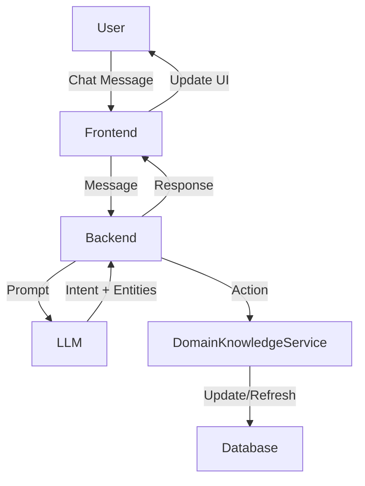

# LLM-Based Intent Detection & Domain Knowledge Management in Agent Chat

## 1. Overview

We are introducing a new attribute for agents called **Domain Knowledge**. This attribute is a tree-structured representation of the topics and subtopics the agent is knowledgeable about. In the agent chat interface, we want to:
- Display and update the agent's Domain Knowledge tree.
- Detect user intent during chat using an LLM:
  - **Add Information**: User wants to add new knowledge to the agent.
  - **Refresh Domain Knowledge**: User wants to update or regenerate the knowledge graph.
  - **Other**: Standard Q&A or unrelated requests.

## 2. Requirements

### Functional
- Each agent has a Domain Knowledge tree (topics/subtopics).
- The chat UI displays the current Domain Knowledge tree.
- Users can:
  - Add new information (nodes) to the tree via chat.
  - Request a refresh/regeneration of the tree.
- The system detects user intent in chat and routes the request accordingly using an LLM.

### Non-Functional
- The Domain Knowledge tree should be efficiently updatable and queryable.
- Intent detection should be accurate and extensible.
- The system should be modular to allow future intent types.

## 3. Data Model

### Agent Example
```json
{
  "id": 123,
  "name": "Financial Analyst",
  "domain_knowledge": {
    "topic": "Investing",
    "children": [
      {
        "topic": "Stock Analysis",
        "children": [
          { "topic": "P/E Ratio", "children": [] },
          { "topic": "EPS", "children": [] }
        ]
      },
      {
        "topic": "Industry Trends",
        "children": []
      }
    ]
  }
}
```

### Domain Knowledge Tree (TypeScript/JSON)
```typescript
type DomainNode = {
  topic: string;
  children: DomainNode[];
};
```

## 4. LLM-Based Intent Detection

### Flow
1. **User sends a message** in chat.
2. **Backend calls LLM** with a prompt that includes:
   - The user message
   - Recent chat history (optional, for context)
   - The current Domain Knowledge tree (optional, for context)
3. **LLM returns**:
   - The detected intent (e.g., "add_information", "refresh_domain_knowledge", "general_query")
   - Any extracted entities (e.g., topic to add, parent node, etc.)
   - (Optional) A natural language explanation for logging/debugging

### Example LLM Prompt
```
You are an assistant managing an agent's domain knowledge. 
Given the following user message and the current domain knowledge tree, 
classify the user's intent as one of: 
- "add_information" (user wants to add a topic or node)
- "refresh_domain_knowledge" (user wants to update/regenerate the tree)
- "general_query" (user is asking a question or making a request unrelated to the tree)

Extract any relevant entities (e.g., topic to add, parent node).

User message: "{user_message}"
Domain knowledge tree: {tree_json}

Respond in JSON:
{
  "intent": "...",
  "entities": { ... }
}
```

### Example LLM Output
```json
{
  "intent": "add_information",
  "entities": {
    "topic": "Dividend Yield",
    "parent": "Stock Analysis"
  }
}
```

## 5. LLM-Based Domain Knowledge Refresh

- When the intent is "refresh_domain_knowledge", the backend can prompt the LLM to regenerate the tree based on:
  - The agent's description, role, and any new information
  - Optionally, recent chat context

### Example Refresh Prompt
```
Given the agent's role and the following new information, generate an updated domain knowledge tree in JSON format.

Agent role: "Financial Analyst"
New information: "User wants to add 'Dividend Yield' under 'Stock Analysis'."
Current tree: {tree_json}

Respond with the updated tree.
```

## 6. System Architecture (LLM-centric)



## 7. API/Service Design

- **POST /agents/:id/chat**
  - Input: { message, chat_history }
  - Backend calls LLM for intent detection and entity extraction.
  - If intent is "add_information", update the tree.
  - If intent is "refresh_domain_knowledge", regenerate the tree.
  - If "general_query", proceed as normal chat.
  - Output: { response, updated_tree (if changed), ... }

- **GET /agents/:id/domain-knowledge**
  - Fetch current tree for display.

## 8. UI/UX Considerations

- Tree visualization (expand/collapse nodes)
- Inline feedback for add/refresh actions
- Error handling for ambiguous or failed intent detection

## 9. Risks & Mitigations

- **LLM hallucination**: Validate LLM output, especially tree structure, before applying.
- **Latency**: LLM calls may be slower than rule-based; consider async updates or streaming.
- **Cost**: LLM usage may incur costs; optimize prompt size and frequency.

## 10. Next Steps

1. Finalize data model for Domain Knowledge tree.
2. Implement LLM prompts and backend call logic.
3. Update backend to support add/refresh actions based on LLM output.
4. Update frontend to display and update the tree.
5. Integrate with chat flow and test end-to-end. 