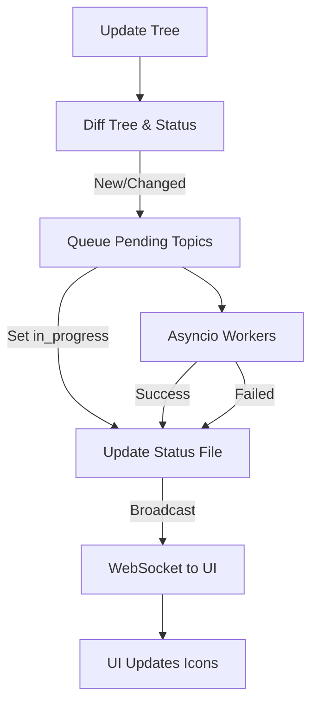

# Knowledge Generation Status Tracking and Workflow Design

## Overview

This document describes a robust, scalable, and user-friendly design for tracking, managing, and visualizing the status of domain knowledge generation in the OpenDXA platform. The design leverages a JSON status file, an asyncio-based job queue, and real-time UI updates via WebSocket.

---

## 1. Status File: `knowledge_status.json`

Each agent maintains a `knowledge_status.json` file in its `knows` folder. This file tracks the generation status and metadata for each topic (leaf) in the domain knowledge tree.

### **Sample Schema**
```json
{
  "topics": [
    {
      "id": "uuid-or-hash",
      "path": "Finance/Market Analysis/Technical Analysis",
      "file": "Finance_Market_Analysis_Technical_Analysis.json",
      "status": "success", // "pending", "in_progress", "failed"
      "last_generated": "2024-07-01T12:34:56Z",
      "last_topic_update": "2024-07-01T12:00:00Z",
      "error": null
    },
    ...
  ]
}
```
- `id`: unique identifier (hash of path, or UUID)
- `path`: full topic path
- `file`: generated knowledge file name
- `status`: generation state
- `last_generated`: ISO timestamp
- `last_topic_update`: ISO timestamp
- `error`: error message if failed

---

## 2. Status File Update Logic

- **On tree update (add/remove/rename/move/edit):**
  - Diff the new and old tree.
  - For new leaves: add to JSON with `status: pending`.
  - For removed leaves: remove from JSON and delete file.
  - For renamed/moved: update path/file, set `status: pending`.
  - For edited: set `status: pending`.
- **On generation start:**
  - Set `status: in_progress` for the topic in JSON.
  - Save file atomically.
- **On generation success:**
  - Set `status: success`, update `last_generated`, clear `error`.
- **On generation failure:**
  - Set `status: failed`, set `error`.
- **Atomic file write:**
  - Always write to a temp file and move/rename to avoid corruption.

---

## 3. Asyncio Queue for Job Management

- Use an `asyncio.Queue` to manage and throttle concurrent knowledge generation jobs (e.g., 4 at a time).
- Before queueing, set status to `in_progress` in the JSON file atomically.
- Only queue topics with `status: pending` or `failed`.
- Never queue topics with `status: in_progress` or `success`.
- Deduplicate jobs by checking the queue and in-progress set before adding.

### **Pseudocode**
```python
import asyncio

class KnowledgeGenerationManager:
    def __init__(self, max_concurrent=4):
        self.queue = asyncio.Queue()
        self.in_progress = set()  # topic IDs currently being processed
        self.max_concurrent = max_concurrent

    async def worker(self):
        while True:
            topic = await self.queue.get()
            if topic is None:
                break  # Sentinel for shutdown
            if topic in self.in_progress:
                self.queue.task_done()
                continue  # Already being processed
            self.in_progress.add(topic)
            try:
                await self.generate_knowledge_for_topic(topic)
                # Update status file: success
            except Exception as e:
                # Update status file: failed
                pass
            finally:
                self.in_progress.remove(topic)
                self.queue.task_done()

    async def add_topic(self, topic):
        if topic not in self.in_progress and topic not in self.queue._queue:
            await self.queue.put(topic)
            # Update status file: in_progress
```

---

## 4. WebSocket for Real-Time UI Updates

- When a topic’s status changes (e.g., from `in_progress` to `success`), broadcast a message via WebSocket to the UI.
- The message should include the topic id/path and new status.

**Example WebSocket message:**
```json
{
  "type": "knowledge_status_update",
  "topic_id": "uuid-or-hash",
  "status": "success"
}
```

---

## 5. UI Integration

- The UI reads the status file to show icons for each topic (done, generating, error, etc.).
- When a WebSocket message is received, update the icon for the relevant topic in real time.
- Optionally, allow retrying failed topics from the UI.

---

## 6. Error Recovery and Stale Jobs

- If a job crashes or is killed, topics may be stuck as `in_progress`.
- Add a `last_update` timestamp and a timeout (e.g., if `in_progress` for >1 hour, set back to `pending` for retry).
- Allow retrying failed or stale topics from the UI.

---

## 7. Atomic File Writes and Deduplication

- Always write the status file atomically (write to temp, then move/rename).
- Use a set or queue to deduplicate jobs.
- For distributed/multi-process setups, consider a distributed queue (e.g., Redis) or a database.

---

## 8. API and Workflow Diagrams

### **Status Transition Table**
| Status        | Can be queued? | UI Icon         | Notes                        |
|---------------|---------------|-----------------|------------------------------|
| pending       | Yes           | “Not started”   | Will be set to in_progress   |
| in_progress   | No            | “Generating…”   | Already queued/running       |
| success       | No            | “Done”          | Only requeue on refresh      |
| failed        | Yes (retry)   | “Error/Retry”   | User can retry               |

### **Workflow Diagram (Mermaid)**


---

## 9. Extensions and Future Work

- Use a database or distributed queue for large-scale or multi-server deployments.
- Add priority or batch operations.
- Track LLM version/model for each topic for future refreshes.
- Add audit logs for all status changes.

---

## 10. Summary

This design enables efficient, incremental, and observable knowledge generation, minimizes wasted computation, and provides a responsive, real-time UI experience for users. 