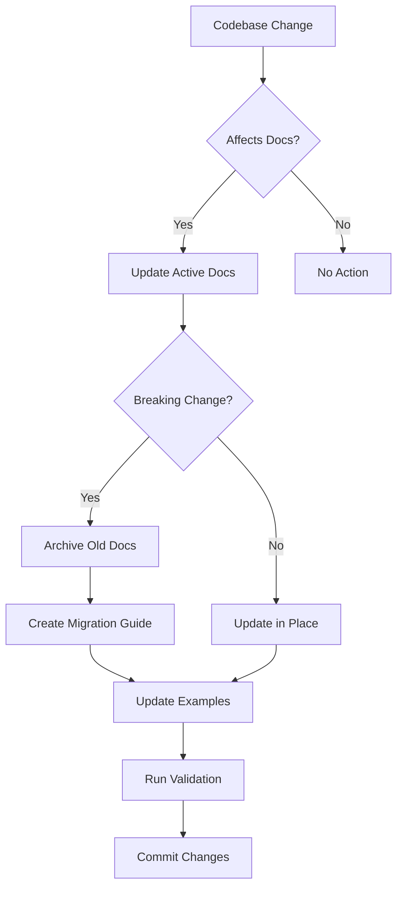

<!-- Dana Documentation Maintenance Guide -->

# Dana Documentation System – Maintenance Guide

This guide defines how we plan, write, validate, and maintain Dana documentation. It operationalizes the rule: document only what is publicly available today in the public repository and on PyPI.

## Golden Rules
- Public-first: Base all active docs on `github.com/aitomatic-oss/dana` and the current `pip install dana-lang` version.
- No futureware: Never document features that are only in internal branches or not yet released on PyPI.
- First success fast: Users should get a working agent in under 5 minutes from the Quickstart.
- Archive aggressively: Move outdated patterns to `docs/.archive/YYYY-MM-DD/` with a reason and migration.

## Repositories Strategy
- Internal `main` is ahead; public repo mirrors current PyPI.
- Active docs must reflect the public repo and current PyPI version.
- Optional preview docs live only in a separate preview branch with a clear banner.

Preview banner to use only in preview branch:
> ⚠️ PREVIEW – Features not yet available in PyPI

## Directory Structure
```
docs/
  .ai/                    # AI maintenance instructions and tooling
    README.md             # This guide
    quickstart-guide.md
    cookbook-guide.md
    language-reference-guide.md
    examples-guide.md
    templates/
      cookbook-recipe.md
      migration-guide.md
      archive-reason.md
      primer-section.md
    validation/
      validate-examples.sh
      check-archive-links.sh
      test-quickstart.sh
      verify-structure.sh
      verify-public-features.sh
    migrations/           # Version migration guides
    examples-generator/   # Tools to auto-generate examples
  .archive/               # Dated archives; never referenced from active docs
  index.md                # Landing
  quickstart.md           # 5-minute first success
  install.md              # Installation instructions
  cookbook/               # Recipes
  primers/                # Deep dives (optional reading)
  reference/              # Language + Runtime API
  examples/               # Copy-paste-run .na files
```

## Documentation Sources
- Production docs source: public repo `aitomatic-oss/dana`.
- Validation target: the latest `dana-lang` on PyPI.
- Question to enforce: “Can a user pip install and use this today?”

## Update Triggers
Priority 1 – update immediately:
- New syntax, breaking changes, built-ins, install changes, new PyPI release.

Priority 2 – update within 24 hours:
- New methods/functions, performance improvements, new patterns, bug fixes affecting examples.

Priority 3 – weekly hygiene:
- Add community use cases, clarify concepts, improve/replace examples, archive outdated patterns.

Never document until public: internal-only, unreleased syntax, experimental features, internal debugging tools.

## Archival Process
When to archive:
- Deprecated syntax, removed features, better patterns replace old ones, non–best-practice examples.

Archive layout:
```
docs/.archive/YYYY-MM-DD/
  reason.md      # Why archived
  migration.md   # How to update
  [files...]     # Original docs
```

Rules:
- Do not link to `.archive` from active docs.
- Provide migration guides and keep archives for historical context.

## Quality Checks (must pass before committing)
1) PyPI compatibility – examples run with `pip install dana-lang`.
2) 5-minute test – Quickstart can be completed in under 5 minutes.
3) Copy-paste – all code blocks run unmodified.
4) Clarity – Dana advantage is clear versus Python alternative.
5) Searchability – answers found in ≤ 3 clicks.
6) Archive check – no links to `.archive` from active docs.
7) Version check – docs match current PyPI version.
8) Public feature check – everything documented exists publicly.

Validation scripts live in `docs/.ai/validation/`.

## Content Guidelines
Quickstart:
- First example runs in <30 seconds, real AI scenario, ≤3 steps, includes expected output.

Cookbook:
- Title: “How to [task]”. Structure: Problem → Solution → Result. Include Python comparison, performance notes, error handling; ≤50 lines per example.

Examples:
- Prefer Dana vs Python comparisons. Use realistic model names. Include outputs and production-grade error handling where relevant.

Primers:
- Optional deep dives. Start with a 3-bullet TL;DR. Link to practical recipes.

## Version Management
- Add a version badge to every page: 
- Frontmatter comment per page: `<!-- Compatible with Dana vX.Y.Z -->`
- Test docs with current PyPI (`pip install dana-lang --upgrade`).
- Archive deprecated versions with migration guides in `.ai/migrations/`.

Version sync workflow (on new PyPI release):
1) Pull latest public repo.
2) Update version badges.
3) Re-run validation scripts.
4) Archive deprecated patterns and write migrations.
5) Update changelog and deploy docs.

## KPIs to Track
```
time_to_first_success < 5m
bounce_rate            < 30%
cookbook_usage         > 60%
primer_completion      > 20%
example_copies         > 80%
search_success_rate    > 90%
archive_references     = 0
```

## Maintenance Workflow


## Quick Reference
Before editing:
```
pip install dana-lang --upgrade
dana --version
```

Validate examples and structure:
```
docs/.ai/validation/validate-examples.sh
docs/.ai/validation/verify-structure.sh
docs/.ai/validation/check-archive-links.sh
docs/.ai/validation/test-quickstart.sh
docs/.ai/validation/verify-public-features.sh
```

When in doubt:
1) Re-read this guide.
2) Use specific guides in `docs/.ai/`.
3) Run validation scripts.
4) Prefer archiving over leaving outdated content.


