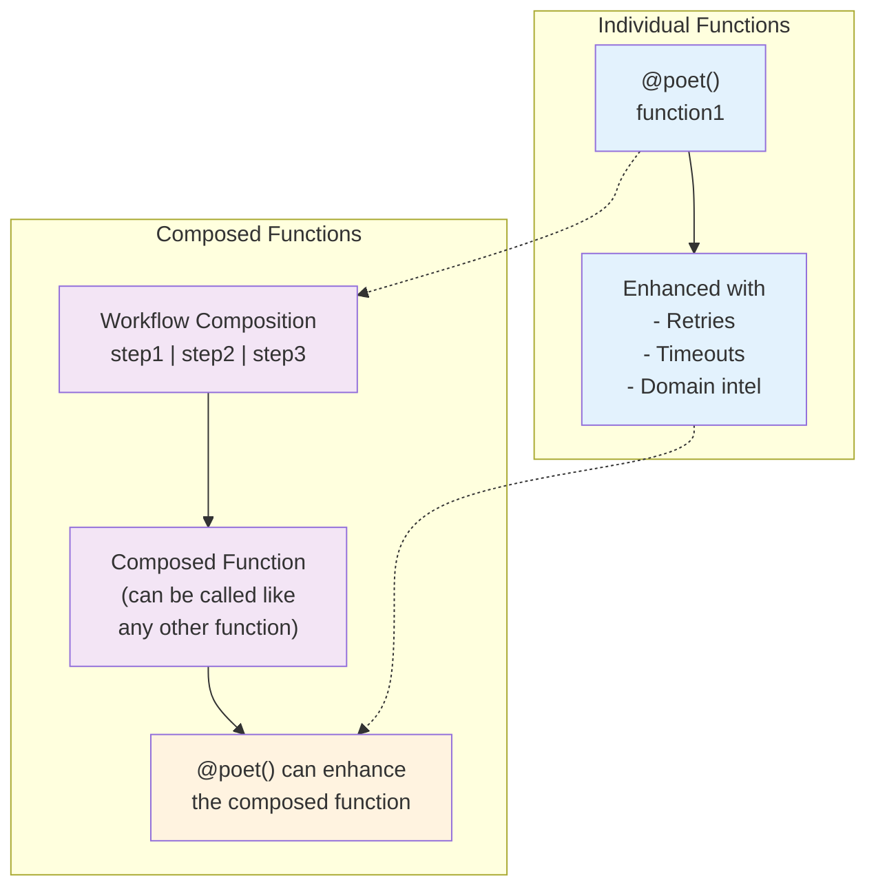
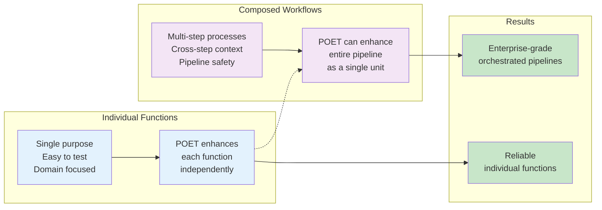

# Dana Workflow Primer: Composed Functions with Enterprise Orchestration

**Dana Workflows** creates composed functions from sequences of steps, enabling enterprise-grade orchestration of complex processes.

## 🎯 Core Concept

A workflow is a **composed function** - it takes multiple individual functions and combines them into a single callable pipeline:

```dana
# Individual functions
def step1(data): return process(data)
def step2(data): return analyze(data) 
def step3(data): return report(data)

# Workflow creates a composed function
workflow = step1 | step2 | step3

# Now you can call it like any function
result = workflow(input_data)
```

## 🔄 The Beautiful Relationship: Workflow + POET

- **POET** enhances individual functions
- **Workflows** are composed functions  
- **POET** can enhance composed functions too!

```dana
# POET enhances individual functions
@poet(domain="document_processing")
def ingest_document(file): return process(file)

@poet(domain="analysis") 
def analyze_content(data): return analyze(data)

@poet(domain="reporting")
def generate_report(analysis): return report(analysis)

# Workflow creates a composed function
document_workflow = ingest_document | analyze_content | generate_report

# The cool thing: POET can enhance the composed function!
@poet(domain="enterprise_workflow", retries=3)
def enhanced_workflow = ingest_document | analyze_content | generate_report

# Now you have enterprise-grade orchestration:
# - Each step has domain intelligence
# - The entire pipeline has enterprise reliability
# - Cross-step context and safety validation
```

## 🏗️ Architecture Diagram



## 🚀 Usage Patterns

### **Simple Composition**
```dana
# Basic workflow using Dana's | operator
workflow = function_a | function_b | function_c
result = workflow(data)
```

### **Workflow with POET Enhancement**
```dana
# Each step enhanced with POET
@poet(domain="ocr")
def extract_text(image): return ocr_process(image)

@poet(domain="nlp") 
def analyze_text(text): return nlp_analysis(text)

@poet(domain="reporting")
def generate_summary(analysis): return create_summary(analysis)

# Create workflow
document_analysis = extract_text | analyze_text | generate_summary

# The entire workflow can be POETed too!
@poet(domain="enterprise_pipeline", retries=2, timeout=60)
def enterprise_analysis = extract_text | analyze_text | generate_summary
```

### **Workflow with Context and Safety**
```dana
# Workflow with enterprise features
from dana.frameworks.workflow import WorkflowEngine, WorkflowStep

# Create steps with validation
steps = [
    WorkflowStep("extract", extract_text, 
                pre_conditions=[validate_image]),
    WorkflowStep("analyze", analyze_text),
    WorkflowStep("summarize", generate_summary,
                post_conditions=[validate_summary])
]

# Execute with orchestration
engine = WorkflowEngine()
result = engine.execute(steps, image_data)
```

## 🎯 Key Benefits

### **For Developers**
- **Natural composition**: Use familiar `|` operator for function chaining
- **Progressive enhancement**: Start simple, add POET when needed
- **Consistent patterns**: Same POET decorator works on individual functions and workflows
- **Enterprise ready**: Automatic reliability, monitoring, and safety

### **For Domain Experts**
- **Declarative workflows**: Specify business processes as function sequences
- **No orchestration code**: Focus on business logic, not pipeline management
- **Deterministic execution**: Consistent, reproducible results
- **Built-in compliance**: Safety validation and audit trails

### **For Operations**
- **Unified monitoring**: Track both individual functions and workflows
- **Automatic reliability**: Retry logic and error recovery at all levels
- **Scalable architecture**: Handle complex workflows with minimal overhead
- **Audit compliance**: Complete execution trails for regulatory requirements

## 🔧 Core Components

### **WorkflowEngine** - Pipeline Orchestration
```dana
from dana.frameworks.workflow import WorkflowEngine

engine = WorkflowEngine()
result = engine.execute(workflow_steps, input_data)
```

### **WorkflowStep** - Step Abstraction
```dana
from dana.frameworks.workflow import WorkflowStep

step = WorkflowStep(
    name="process_data",
    function=my_function,
    pre_conditions=[validate_input],
    post_conditions=[validate_output]
)
```

### **ContextEngine** - Knowledge Management
```dana
from dana.frameworks.workflow import ContextEngine

context = ContextEngine()
context.add_knowledge("business_rule", "source")
insights = context.search_knowledge("domain", limit=10)
```

## 📊 The Power of Composition



## 🎓 Quick Start

1. **Write individual functions** with your business logic
2. **Create workflows** using Dana's `|` operator
3. **Add POET enhancement** to individual functions or the entire workflow
4. **Execute** with automatic enterprise features

```dana
# Complete example
@poet(domain="data_processing")
def load_data(source): return load(source)

@poet(domain="analysis")
def analyze_data(data): return analyze(data)

@poet(domain="reporting") 
def generate_report(analysis): return report(analysis)

# Create workflow
data_pipeline = load_data | analyze_data | generate_report

# Enhance the entire pipeline
@poet(domain="enterprise_pipeline", retries=3)
def enterprise_pipeline = load_data | analyze_data | generate_report

# Execute
result = enterprise_pipeline(data_source)
```

## 📈 Current Status

### ✅ **Production Ready**
- **Core composition**: Dana's `|` operator for function chaining
- **POET integration**: Seamless enhancement of individual functions and workflows
- **Enterprise features**: Safety validation, context management, audit trails
- **Testing**: Comprehensive test coverage with real-world examples

### 🔄 **Future Enhancements**
- **Performance optimization**: Caching and efficiency improvements
- **Advanced patterns**: Parallel execution, conditional branching
- **Ecosystem integration**: Enhanced KNOWS and external system integration

---

**Next Steps**: 
- **[Getting Started](../workflow/getting-started.md)** - Write your first workflow
- **[POET Integration](../poet/primer.md)** - Understanding function enhancement
- **[API Reference](../workflow/api-reference.md)** - Complete workflow API documentation 