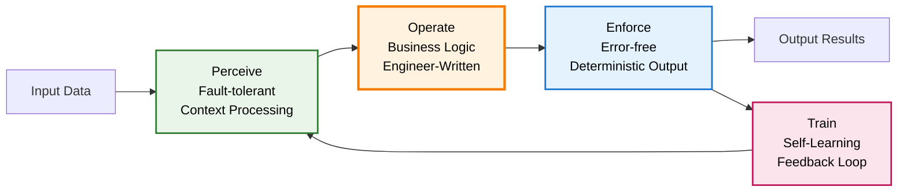

# POET Usage Guide: Complete Reference

```text
Author: Christopher Nguyen & Vinh Luong
Version: 0.4
Status: Design Phase
Module: opendxa.dana.poet
```

## Overview

POET (Perceive-Operate-Enforce-Train) is Dana's intelligent execution pattern that automatically enhances AI interactions with **fault-tolerant context processing**, **self-learning optimization**, and **enterprise-grade reliability**. This guide provides comprehensive usage examples and best practices.

## Core Concepts

### The POET Flow



### What Engineers Write vs. What Runtime Provides

**Engineers Write (Operate):**
- Business logic and decision-making code
- The core operational intelligence

**Runtime Provides Automatically:**
- **Perceive**: Fault-tolerant contextual input processing
- **Enforce**: Error-free deterministic output generation  
- **Train**: Continuous adaptation based on feedback signals

### Comment-Aware Context Analysis
POET automatically extracts and analyzes:
- Comments in your Dana code
- Type hints from variable assignments
- Surrounding code context
- Domain indicators and **intent signals**
- Past learnings from the LearningStore

## Basic Usage

### 1. Simple Reasoning with POET

```dana
# Extract financial data from text
price = reason("Find the cost: Item sells for $29.99") -> float

# POET automatically:
# - PERCEIVE: Detects financial domain from "$" symbol and context, retrieves past learning strategies
# - OPERATE: Applies your business logic for numerical extraction
# - ENCODE: Validates and formats result as float type, generates execution_id
# - TRAIN: Learns from successful extractions to improve future performance
```

### 2. Comment-Driven Optimization

```dana
# Medical data extraction - requires high accuracy
# Patient temperature should be in Celsius
temperature = reason("Patient reports feeling feverish at 101.5°F") -> float

# POET leverages comments to:
# - PERCEIVE: Understand medical context and accuracy requirements, apply past medical learnings
# - OPERATE: Apply temperature conversion logic
# - ENCODE: Ensure precise numerical extraction and validation
# - TRAIN: Store successful medical conversion patterns for future use
```

### 3. Complex Type Handling

```dana
# Extract structured customer data
# Return as key-value pairs for database storage
customer_info = reason("John Smith, age 30, email john@example.com") -> dict

# POET will:
# - PERCEIVE: Parse natural language structure requirements, retrieve past parsing strategies
# - OPERATE: Execute structured data extraction logic
# - ENCODE: Return validated: {"name": "John Smith", "age": 30, "email": "john@example.com"}
# - TRAIN: Learn improved parsing patterns for future customer data
```

### 4. Output Type Adaptability with `reason()`

A key strength of POET-enabled functions like `reason()` is their ability to adapt the output based on the `expected_output_type` inferred from your Dana code (e.g., via type hints on assignment). The same conceptual prompt can yield different, type-appropriate results.

Example: Describing Pi
Consider the task of getting information about Pi:

```dana
# Scenario 1: Requesting a string description
# POET's Perceive phase notes the '-> str' (or type hint on assignment).
# Encode phase ensures a string is returned.
local:pi_description: str = reason("Tell me about Pi.")
# Expected: "Pi is a mathematical constant, approximately 3.14159..."

# Scenario 2: Requesting a floating-point value
# POET's Perceive phase notes '-> float', retrieves past numerical extraction learnings.
# Encode phase ensures a float is returned, potentially parsing it from a more verbose LLM output.
local:pi_float: float = reason("Tell me about Pi.")
# Expected: 3.14159 (or similar float representation)

# Scenario 3: Requesting an integer value (perhaps the whole number part)
# POET's Perceive phase notes '-> int'.
# Encode phase ensures an integer, possibly truncating or rounding.
local:pi_integer: int = reason("Tell me about Pi.")
# Expected: 3

# Scenario 4: Requesting a more structured representation (e.g., a dict)
# POET's Perceive phase notes '-> dict'.
# Encode phase ensures a dictionary.
local:pi_details: dict = reason("Tell me about Pi.")
# Expected: {"symbol": "π", "value": 3.14159, "type": "mathematical constant"} (or similar structure)
```

In each case, the `reason()` function, powered by POET:
1. **Perceives** the core request ("Tell me about Pi.") and also the `expected_output_type` from the Dana code context, retrieving relevant past learnings.
2. **Operates** by querying an LLM, possibly providing the desired output type as a hint in the prompt to the LLM.
3. **Encodes** that the LLM's output can be successfully coerced or represented as the `expected_output_type` (string, float, int, dict), performing necessary transformations or retrying if the initial output isn't suitable, and generates an execution_id.
4. **Trains** (when feedback is received) by updating the LearningStore with successful strategies for Pi-related queries.

This demonstrates how POET allows functions to be flexible in what they accept (the general intent) while being conservative and precise in what they produce, aligning with the caller's specific needs.

## The Purpose of POET: Robust and Intelligent Execution

You've seen POET in action with functions like `reason()`. But why is this model so central to Dana?

POET (Perceive → Operate → Encode → Train) is designed to address common challenges in building reliable AI-powered workflows, especially when interacting with probabilistic systems like Large Language Models (LLMs). Its core goals are to:

1. **Embrace Intent, Enforce Precision (Postel's Law)**:
 * Perceive: Flexibly interpret ambiguous inputs, user intent, and diverse data formats. This phase can gather rich context from your code (comments, type hints via a `CodeContextAnalyzer`) and the environment. Crucially, it can also *transform and optimize* the initial input, for example, by **rewriting a vague user prompt into a more detailed and effective prompt** for an LLM, or by selecting the best strategy for the `Operate` phase using past learnings.
 * Operate: Execute the primary task (e.g., calling an LLM with the optimized prompt, running a tool, or executing a Dana function) using the refined input from the `Perceive` stage.
 * Encode: Rigorously check the output of the `Operate` phase against expected types (using `expected_output_type`), structures, or other quality criteria. This ensures that downstream components receive reliable, predictable data. Also generates execution_id for training correlation.
 * Train: Process feedback correlated with execution_id to update the LearningStore, improving future Perceive and Operate strategies.

2. **Automate Resilience**:
 * The built-in **retry loop** automatically re-attempts the `Operate` (and subsequently `Encode` validation) phase upon validation failure. This handles transient issues or allows for iterative refinement.
 * The `poet_status` object provides context about attempts and failures, enabling more intelligent retry strategies or fallback mechanisms within custom P/O/E functions.

3. **Enable Continuous Learning**:
 * The **Train stage** processes external feedback to continuously improve system performance
 * The **LearningStore** accumulates knowledge across executions to enhance future operations
 * **Execution IDs** enable precise correlation between feedback and execution context

4. **Enhance Developer Experience**:
 * By standardizing this robust execution pattern, POET reduces boilerplate code for error handling, input sanitization, output validation, and retry logic.
 * It allows Dana engineers to focus on the core logic of their `Operate` functions, while leveraging POET for the surrounding scaffolding.
 * Features like automatic context gathering and prompt optimization aim to make interactions with complex AI services more powerful and less error-prone.

In essence, POET provides a structured, configurable, and resilient "wrapper" around core operations, making them more dependable and "smarter" by systematically handling the complexities of real-world AI interactions while continuously learning and improving.

## 🎛️ Advanced Usage (Python Customization)

This section details how developers can customize the POET framework using Python, for instance by creating custom POET executors or configurations. For general Dana usage of POET-enabled functions, refer to the Dana-level decorator documentation and examples.

### 1. Multiple POET Executors/Profiles

```python
from opendxa.dana.poet.executor import POETReason, POETDataProcessor, POETAPIIntegrator

# Reasoning tasks
reasoner = POETReason()
result = reasoner.execute("Analyze this financial report...", context)

# Data processing tasks
processor = POETDataProcessor()
analysis = processor.execute("Find trends in sales data", context, data=sales_data)

# API integration tasks
integrator = POETAPIIntegrator()
api_result = integrator.execute("Get weather for San Francisco", context)
```

### 2. Custom POET Configuration

```python
from opendxa.dana.poet.config import POETConfig

# Create custom configuration
config = POETConfig(
 max_retries=3, # Default from POET decorator, can be part of a profile
 enable_caching=True, # Caching strategy would be specific to POET profile/executor
 fallback_strategy="simple", # Fallback strategy would be specific to POET profile/executor
 custom_system_message="You are a financial analysis expert...", # Relevant for LLM-based POET profiles
 learning_store_config={"type": "persistent", "version": "v1"} # Learning store configuration
)

# Use with POET executor
reasoner = POETReason()
result = reasoner.execute(intent, context, config=config)
```

### 3. Debug Mode and Monitoring (Framework Level)

```python
# Debugging and monitoring are generally part of the POET framework itself or specific executor/profile implementations.
# Dana-level functions decorated with @poet would benefit from this automatically.

# Illustrative Python-level access if directly using executors:
reasoner = POETReason()
reasoner.set_debug_mode(True)

result = reasoner.execute("Complex analysis task...", context)

# Monitor execution history and learning
history = reasoner.get_execution_history()
print(f"Processed {len(history)} requests")

stats = reasoner.get_performance_stats()
print(f"Average processing time: {stats['average_duration']:.2f}s")
print(f"Success rate: {stats['success_rate']:.1%}")
print(f"Learning improvements: {stats['learning_iterations']}")

# Access training data
training_data = reasoner.get_learning_store().get_recent_feedback()
print(f"Recent feedback entries: {len(training_data)}")
```

## 📊 Type-Driven Validation Examples (Leveraging `expected_output_type`)

The POET framework's `Encode` phase is strongly guided by the `expected_output_type` defined in the `@poet` decorator or inferred during the `Perceive` phase. Dana's `reason()` function inherently benefits from this type-driven validation.

### Numerical Types

```dana
# Float extraction with validation (expected_output_type is float)
price = reason("The item costs twenty-nine dollars and ninety-nine cents") -> float
# Result: 29.99
# POET learns successful numerical extraction patterns

# Integer extraction (expected_output_type is int)
count = reason("We have fifteen items in stock") -> int
# Result: 15
# POET learns text-to-number conversion strategies

# Boolean extraction (expected_output_type is bool)
approved = reason("The request was approved by management") -> bool
# Result: true
# POET learns sentiment and approval language patterns
```

### Structured Types

```dana
# Dictionary extraction (expected_output_type is dict or a specific Dana struct)
product = reason("iPhone 14, $999, 128GB storage, Blue color") -> dict
# Result: {"name": "iPhone 14", "price": 999, "storage": "128GB", "color": "Blue"}
# POET learns structured data extraction patterns

# List extraction (expected_output_type is list or list[str], etc.)
colors = reason("Available in red, blue, green, and yellow") -> list
# Result: ["red", "blue", "green", "yellow"]
# POET learns list identification and parsing strategies
```

### Complex Validation

```dana
# JSON-structured response (expected_output_type is a dict or specific Dana struct)
config = reason("Set timeout to 30 seconds, retries to 3, debug mode on") -> dict
# Result: {"timeout": 30, "retries": 3, "debug": true}
# POET learns configuration parsing and validation patterns
```

## Integration Patterns (Dana-centric View)

This section focuses on how Dana engineers interact with POV-enabled functions and contribute to the POV lifecycle, primarily through Dana code.
For details on the POV architecture itself, see the [POV Execution Model documentation](../../reference/02_dana_runtime_and_execution/poet_functions.md).

### 1. Using POET-enabled Functions (e.g., `reason()`)

Many core Dana functions, like `reason()`, are implicitly POET-enabled. You use them like regular functions, and POET works behind the scenes.

```dana
# User provides minimal prompt with context and type hint
# Extract total price from medical invoice
# POET's Perceive phase uses comments, code context, and the -> float hint
# to determine the expected_output_type and guide validation.
private:price: float = reason("get price from 'Invoice total: $125.50'")
```

### 2. Authoring Dana Functions for POET Stages (`@poet` decorator)

Dana functions can be designated as `Perceive` or `Encode` (validation logic) stages for a POET-enabled operation using Dana's `@poet` decorator. The decorated function itself becomes the `Operate` stage.

```dana
# Dana function for the 'Perceive' phase
def my_input_parser(raw_text: str, poet_status: dict) -> dict:
 # poet_status might provide initial context like expected_output_type from decorator
 # Retrieve past learnings for similar input patterns
 local:parsed = {"input": raw_text.lower(), "char_count": len(raw_text)}
 # This dict becomes poet_status.perceived_input for Operate and Encode
 return local:parsed

# Dana function for the 'Encode' phase (validation logic)
def my_output_checker(operate_result: any, poet_status: dict) -> bool:
 # poet_status includes {execution_id, attempt, perceived_input, raw_output, expected_output_type, ...}
 log(f"Attempt {poet_status.attempt} validating {operate_result} against {poet_status.expected_output_type}")
 if poet_status.expected_output_type and typeof(operate_result) != poet_status.expected_output_type:
 return False
 # Further custom checks...
 return len(operate_result) > 5

@poet(
 perceive=my_input_parser,
 validate=my_output_checker, # Used by Encode stage for internal validation
 expected_output_type="str" # Explicitly state the final desired type
)
def process_complex_text(parsed_input: dict) -> str:
 # This is the 'Operate' phase.
 # 'parsed_input' is the output from my_input_parser (poet_status.perceived_input)
 return f"PROCESSED ({parsed_input.char_count} chars): {parsed_input.input.upper()}"

# Usage
local:final_result = process_complex_text("Some initial text.")
```

### 3. Leveraging `poet_status` in Dana

Dana functions used in `Perceive` and `Encode` stages (and potentially `Operate` if structured to receive it) can access the `poet_status` dictionary. This allows for adaptive logic based on retry attempts, last failure reasons, perceived input, and the expected output type.

See the `pov_status` structure in the [POV Execution Model documentation](../../reference/02_dana_runtime_and_execution/poet_functions.md#pov_status-in-dana).

## 🎨 Best Practices for Dana Engineers with POET

### 1. Write Effective Comments and Use Type Hints

The `Perceive` phase of POET (especially its `CodeContextAnalyzer` component) relies heavily on good comments and clear type hints in your Dana code to infer intent and `expected_output_type`.

```dana
# ✅ Good: Specific, actionable context, clear type hint for POET
# Financial analysis - extract currency values in USD.
# Result should be a floating point number.
local:revenue: float = reason("Q3 revenue was $1.2M")

# ❌ Poor: Vague comments, no type hint for POET to leverage
# Get some number
local:value = reason("Extract the number")
```

### 2. Design Clear `Perceive` and `Encode` Functions
When using the `@poet` decorator with custom Dana functions for P and E stages:
* Perceive: Focus on normalizing input and gathering all necessary context, including retrieving relevant learnings from the LearningStore. The output of `Perceive` (`poet_status.perceived_input`) is critical for `Operate` and `Encode`.
* Encode (validation): Be strict. Use `poet_status.expected_output_type` and `poet_status.perceived_input` to perform thorough checks. Set `poet_status.last_internal_failure` clearly on validation failure to aid retries or debugging.

### 3. Understand `expected_output_type`
This is a key part of the POET contract. Ensure it is specified correctly in `@poet` decorators, or provide strong type hints at assignment sites for POET-enabled functions like `reason()` so the `Perceive` phase can infer it accurately. This drives the `Encode` phase validation.

### 4. Enable Learning Through Feedback
Consider how your POET-enabled functions can receive feedback for the Train stage:
* Use meaningful execution_ids returned by POET functions
* Provide feedback through the POET feedback API when outcomes are known
* Design validation functions that capture useful learning signals

### 5. Error Handling for POET-enabled functions
While POET aims to handle many transient errors with retries, fundamental issues or repeated validation failures will still result in errors. Use standard Dana `try-catch` blocks if you need to handle failures from POET-enabled function calls.

```dana
# POET-decorated function can raise an error after max_retries
try:
 local:processed_data = process_complex_text("some input")
catch Error as e:
 log(f"POET processing failed after multiple attempts: {e.message}")
 # Handle the error, e.g., use a fallback or notify user
 # Consider providing negative feedback to POET for learning
```

### 6. Leverage POET Profiles
Use appropriate POET execution profiles for different types of tasks:
* `LLMInteractionPOET` for natural language processing tasks
* `DataValidationPOET` for data quality and transformation tasks  
* `SafeToolCallPOET` for external API and tool integration
* Custom profiles for domain-specific requirements

## Learning and Feedback Integration

### Providing Feedback to POET

```dana
# Execute a POET-enabled function and capture execution_id
local:result, execution_id = reason_with_id("Analyze customer sentiment")

# Later, when outcome is known, provide feedback
poet_feedback(execution_id, {
    "success": true,
    "quality_score": 0.95,
    "user_correction": null
})
```

### Monitoring Learning Progress

```python
# Python-level monitoring of POET learning
from opendxa.dana.poet.monitoring import POETMonitor

monitor = POETMonitor()
learning_stats = monitor.get_learning_statistics()
print(f"Functions improved: {learning_stats['improved_functions']}")
print(f"Average quality improvement: {learning_stats['avg_improvement']:.2%}")
```