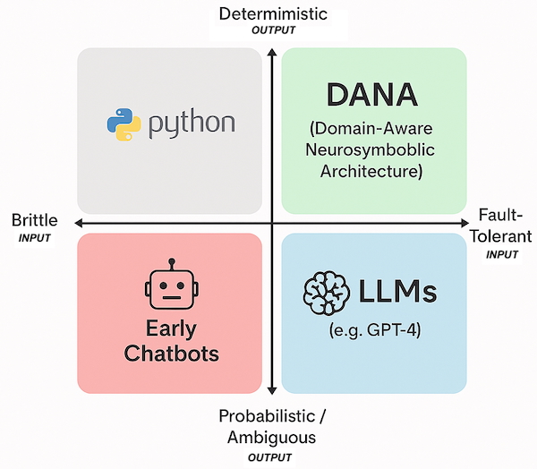

# The Dana Manifesto: Transforming AI Development

*A philosophical and theoretical foundation for reliable, transparent AI automation*

---

## Enough of brittle, black-box AI.

> *You've spent days wiring up LLM calls, passing context, and debugging fragile prompts and automations. The code works—until it doesn't. A new document, a new edge case, and suddenly you're back to square one. Sound familiar?*

For too long, building with AI has meant wrestling with hidden state, endless configuration, and code that's impossible to trust or explain. We're tired of debugging, of losing context, of watching our automations break for reasons we can't see. We've had enough of magic we can't inspect, and complexity we can't control.
It's time for something better.
---

## Dana in the Computing Landscape

 

Dana's unique position in the computing landscape.

Dana occupies a crucial space in the evolving computing landscape — combining the
**fault-tolerance** of modern AI systems with the **deterministic reliability** of traditional
programming:

- Traditional Programming: Traditional languages deliver deterministic, predictable outputs but remain fundamentally rigid. When faced with unexpected inputs or edge cases, they fail rather than adapt.

- Early Chatbots: First-generation conversational systems combined the worst of both worlds — unpredictable outputs with brittle implementation. They broke at the slightest deviation from expected patterns.

- Large Language Models: Modern LLMs brilliantly adapt to diverse inputs but sacrifice determinism. Their probabilistic nature makes them unsuitable for applications requiring consistent, reliable outcomes.

- Dana: By occupying this previously unreachable quadrant, Dana transforms computing expectations. It harnesses LLM adaptability while delivering the deterministic reliability that mission-critical systems demand—all while dramatically accelerating development velocity.

Dana represents the same paradigm shift to agentic computing that JavaScript brought to the Internet — making previously complex capabilities accessible and reliable. Like BASIC's democratization of programming, Dana makes intelligent automation available to all builders, not just specialists. This inevitability comes not from wishful thinking but from resolving the fundamental tension between adaptability and reliability that has constrained computing progress.

---

## Theoretical Foundations

### Neurosymbolic Architecture

Dana embodies a neurosymbolic approach that bridges the gap between symbolic reasoning and neural computation:

- Symbolic Layer: Clear, inspectable logic with explicit state management
- Neural Layer: LLM-powered reasoning and adaptation
- Integration: Seamless combination through the Dana language specification

This architecture enables systems that are both adaptable (neural) and reliable (symbolic), addressing the fundamental limitations of purely neural or purely symbolic approaches.

### Cognitive Computing Principles

Dana is built on cognitive computing principles that mirror human reasoning:

1. **Explicit Memory**: Clear separation of different types of knowledge and state
2. **Contextual Reasoning**: Context-aware processing that adapts to situation
3. **Verification Loops**: Built-in checking and validation mechanisms
4. **Learning Integration**: Continuous improvement through experience

### Domain-Aware Processing

The CORRAL lifecycle (Curate, Organize, Retrieve, Reason, Act, Learn) represents a fundamental approach to domain knowledge management:

- Curate: Systematic knowledge acquisition from diverse sources, including human interviews and synthesis
- Organize: Structured representation and storage
- Retrieve: Context-aware knowledge access
- Reason: Inference and decision-making
- Act: Knowledge application to real-world tasks
- Learn: Feedback integration and improvement

---

## Philosophical Foundations

### Transparency as a First Principle

Dana rejects the black-box approach that has dominated AI development. Every decision, every state change, every reasoning step is visible and auditable. This transparency is not just a feature—it's a fundamental design principle that enables:

- Trust: Systems you can understand and verify
- Debugging: Clear paths to identify and fix issues
- Collaboration: Shared understanding across teams
- Accountability: Clear responsibility for system behavior

### Reliability Through Verification

Traditional AI systems fail silently or unpredictably. Dana builds verification into the core execution model:

- Confidence Tracking: Every operation includes confidence assessment
- Retry Mechanisms: Automatic recovery from low-confidence results
- Error Correction: Built-in suggestion and fix capabilities
- Graceful Degradation: Clear failure modes with human escalation

### Collaborative Intelligence

Dana envisions a future where human and artificial intelligence work together seamlessly:

- Human-AI Partnership: Complementary strengths, not replacement
- Knowledge Sharing: Reusable, auditable automation patterns
- Collective Learning: Community-driven improvement and evolution
- Accessible AI: Democratized access to intelligent automation

---

## Research Implications

### Advancing Neurosymbolic Computing

Dana provides a practical platform for neurosymbolic research:

- Hybrid Architectures: Real-world testing of symbolic-neural integration
- Reasoning Patterns: Observable patterns in AI reasoning and decision-making
- Context Management: Scalable approaches to context-aware processing
- Verification Methods: Practical verification in probabilistic systems

### Cognitive Architecture Research

Dana's design offers insights into cognitive architectures:

- Memory Systems: Multi-scope memory management and access patterns
- Attention Mechanisms: Context-driven focus and processing
- Learning Integration: Continuous learning in production systems
- Meta-Cognition: Self-awareness and self-improvement capabilities

### Human-AI Interaction

Dana enables new research in human-AI collaboration:

- Transparency Effects: Impact of system transparency on trust and adoption
- Collaborative Patterns: Effective human-AI workflow designs
- Knowledge Transfer: Mechanisms for sharing insights between humans and AI
- Explainable AI: Practical approaches to AI explanation and interpretation

---

## Future Directions

### Theoretical Development

- Formal Verification: Mathematical foundations for Dana program correctness
- Complexity Analysis: Computational complexity of neurosymbolic operations
- Learning Theory: Theoretical foundations for continuous system improvement
- Cognitive Models: Mapping Dana operations to cognitive science principles

### Empirical Research

- Performance Studies: Comparative analysis of Dana vs. traditional approaches
- Adoption Patterns: How teams and organizations adopt neurosymbolic systems
- Error Analysis: Systematic study of failure modes and recovery patterns
- Scalability Research: Behavior of Dana systems at scale

### Applied Research

- Domain Applications: Specialized Dana applications in various fields
- Integration Patterns: Best practices for Dana integration with existing systems
- Tool Development: Advanced development and debugging tools for Dana
- Educational Applications: Dana as a platform for teaching AI concepts

---

## The Dana Creed

> We are AI researchers, theorists, and practitioners. We believe in systems that are both powerful and understandable, both adaptive and reliable. We reject the false choice between capability and transparency. We build with Dana because we envision a future where AI augments human intelligence rather than replacing it, where systems are partners rather than black boxes, and where progress is measured not just in performance but in understanding.

---

## Research Community

Dana represents more than a technology—it's a research platform and community:

### Open Research Platform
- Reproducible Results: Transparent, auditable experiments
- Shared Datasets: Common benchmarks and evaluation frameworks
- Collaborative Development: Open-source research tools and extensions

### Academic Partnerships
- University Collaborations: Research partnerships with academic institutions
- Student Projects: Dana as a platform for thesis and research projects
- Conference Presentations: Sharing insights and findings with the research community

### Industry Applications
- Real-World Testing: Production deployments providing research insights
- Case Studies: Documented applications across various domains
- Performance Data: Large-scale performance and reliability metrics

---

## Call to Action

The future of AI is not predetermined. We have the opportunity to shape systems that are both powerful and trustworthy, both capable and comprehensible. Dana is our contribution to this future—a practical platform for building the AI systems we want to live with.

**For Researchers**: Join us in exploring the theoretical foundations and practical implications of neurosymbolic computing.

**For Practitioners**: Help us understand how these systems behave in real-world applications.

**For Educators**: Use Dana to teach the next generation about transparent, reliable AI.

**For Everyone**: Contribute to a future where AI serves humanity through partnership, not replacement.

---

*The future of AI is transparent, reliable, and collaborative. The future of AI is Dana.*

Copyright © 2025 Aitomatic, Inc. Licensed under the <a href="../../../LICENSE.md">MIT License</a>.
 
<a href="https://aitomatic.com">https://aitomatic.com</a>

