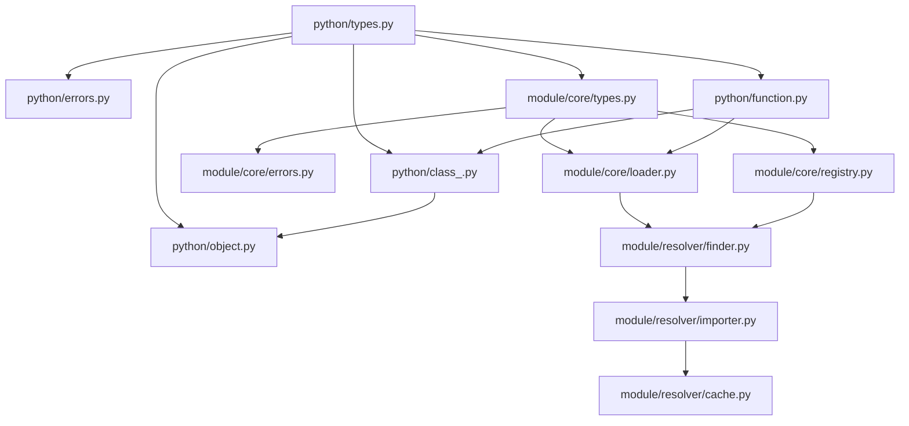

| [Dana-to-Python →](../../.design/dana-to-python.md) | [Python-to-Dana →](../../.design/python-to-dana.md) |
|---|---|

# Python Integration in Dana

```text
Author: Christopher Nguyen
Version: 0.1
Status: Design Phase
Module: opendxa.dana.python
```

## Overview

Dana's Python integration is a critical feature that enables seamless interoperability between Dana and Python code. This document provides a high-level overview of how Python integration works in Dana and points to detailed design documents for specific aspects.

## Core Components

The Python integration system consists of three main components:

1. **Module System Integration** ([modules_and_imports.md](../../.design/modules_and_imports.md))
   - How Dana modules can import Python modules
   - How Python modules are represented in Dana
   - Module resolution and caching

2. **Dana → Python** ([dana_to_python.md](../../.design/dana-to-python.md))
   - Dana code calling Python functions
   - Managing Python objects from Dana
   - Future sandboxing of Python execution

3. **Python → Dana** ([python_to_dana.md](../../.design/python-to-dana.md))
   - Python code calling Dana functions
   - Dana runtime embedding in Python
   - Dana sandbox security model

## Implementation Structure

The Python integration is implemented in the following directory structure:

```
opendxa/dana/python/              # All Python integration in one place
├── __init__.py                  # Exports Python integration components
├── function.py                  # PythonFunction implementation
├── class_.py                    # PythonClass implementation
├── object.py                    # PythonObject implementation
├── types.py                     # Common type definitions/conversions
└── errors.py                    # Python-specific exceptions
```

## Core Abstractions

Three key classes form the foundation of Python integration:

1. **PythonFunction**
   - Wraps Python callable objects
   - Handles type conversion for arguments/return values
   - Manages function context and execution

2. **PythonClass**
   - Wraps Python class types
   - Creates PythonObject instances
   - Handles constructor arguments

3. **PythonObject**
   - Wraps Python object instances
   - Provides attribute and method access
   - Manages object lifecycle

## Type System

The integration provides bidirectional type conversion between Dana and Python:

| Dana Type | Python Type | Notes |
|-----------|-------------|-------|
| `int` | `int` | Direct mapping |
| `float` | `float` | Direct mapping |
| `str` | `str` | Direct mapping |
| `bool` | `bool` | Direct mapping |
| `list` | `list` | Recursive conversion |
| `dict` | `dict` | Recursive conversion |
| `null` | `None` | Direct mapping |
| `any` | `Any` | Type erasure |

## Security Model

The Python integration follows these security principles:

1. **Sandbox Integrity**
   - Dana's sandbox remains isolated
   - Python code can't bypass Dana's security
   - Clear trust boundaries

2. **Resource Control**
   - Controlled access to Python resources
   - Resource lifecycle management
   - Future process isolation support

3. **Type Safety**
   - Strict type checking at boundaries
   - Clear error messages
   - No unsafe type coercion

## Usage Examples

### Dana Importing Python

```dana
# Import Python module
import pandas.py as pd

# Create DataFrame
df = pd.DataFrame({
    "A": [1, 2, 3],
    "B": ["x", "y", "z"]
})

# Use methods
filtered = df.query("A > 1")
```

### Python Importing Dana

```python
from opendxa.dana import dana

# Call Dana function
result = dana.reason("analyze this text")

# Use Dana resources
with dana.get_llm() as llm:
    response = llm.generate("prompt")
```

## Implementation Status

| Component | Status | Notes |
|-----------|--------|-------|
| Module System | In Progress | See ../../.design/modules_and_imports.md |
| Dana → Python | In Progress | See ../../.design/dana-to-python.md |
| Python → Dana | In Progress | See ../../.design/python-to-dana.md |
| PythonFunction | Complete | Core implementation done |
| PythonClass | Planned | Design complete |
| PythonObject | Planned | Design complete |

## Implementation Sequence

The implementation will proceed in the following order to handle dependencies correctly:



### 1. Foundation Layer
First implement the type systems and error handling:
```
opendxa/dana/python/types.py      # Basic type conversions
opendxa/dana/python/errors.py     # Python-specific errors
opendxa/dana/module/core/types.py # Module type definitions
opendxa/dana/module/core/errors.py # Module-specific errors
```

Key tasks:
- Define type conversion mappings
- Implement conversion functions
- Define error hierarchies
- Add error utilities

### 2. Python Integration Core
Build the core Python integration classes:
```
opendxa/dana/python/function.py   # PythonFunction (move from sandbox)
opendxa/dana/python/class_.py     # PythonClass implementation
opendxa/dana/python/object.py     # PythonObject implementation
```

Key tasks:
- Migrate PythonFunction from sandbox
- Implement PythonClass wrapper
- Implement PythonObject wrapper
- Add comprehensive tests

### 3. Module System Core
Implement the core module system:
```
opendxa/dana/module/core/registry.py  # Module registry
opendxa/dana/module/core/loader.py    # Module loader
```

Key tasks:
- Build module registry
- Implement module loader
- Add caching mechanism
- Create test suite

### 4. Module Resolution
Finally, implement the module resolution system:
```
opendxa/dana/module/resolver/finder.py   # Module finder
opendxa/dana/module/resolver/importer.py # Import processing
opendxa/dana/module/resolver/cache.py    # Bytecode caching
```

Key tasks:
- Implement module finder
- Build import processor
- Add bytecode caching
- Integration tests

### Dependencies and Testing

Each component should:
1. Have a comprehensive test suite
2. Pass all linting requirements
3. Include documentation
4. Be reviewed before moving to next component

The implementation can proceed in parallel within each layer, but must complete one layer before moving to the next to maintain dependency clarity.

## Future Considerations

1. **Process Isolation**
   - Running Python code in separate process
   - IPC mechanism design
   - Resource sharing

2. **Performance Optimization**
   - Call overhead reduction
   - Type conversion caching
   - Resource pooling

3. **Developer Tools**
   - IDE integration
   - Type hints
   - Debugging support

## Related Documents

- [Module System Design](../../.design/modules_and_imports.md)
- [Dana to Python Integration](../../.design/dana-to-python.md)
- [Python to Dana Integration](../../.design/python-to-dana.md)
- [External Interfaces](./external_interfaces.md)

## Open Questions

1. How should circular imports between Dana and Python be handled?
2. What's the best way to handle Python exceptions in Dana code?
3. How can we optimize performance while maintaining security?
4. What's the migration path to process isolation?

These questions will be addressed as the implementation progresses. 