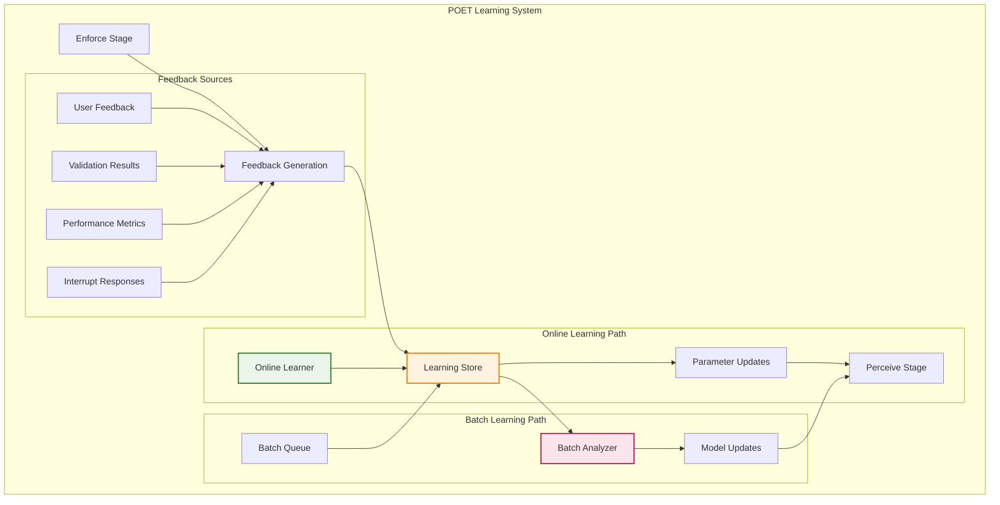

# POET Learning Systems Design

## Overview

This document outlines the implementation design for POET's learning capabilities - the Train (T) stage that enables adaptive intelligence through both online and batch learning modes. The learning system implements POET's **80/20 intelligence distribution**: 

- **80% Generalizable Learning**: Universal patterns like performance optimization, error recovery strategies, and basic parameter tuning that work across all domains
- **20% Domain-Specific Learning**: Industry-specific patterns, compliance adaptations, and specialized optimization strategies
- **AI-Generated Learning**: Custom learning algorithms generated for unique enterprise patterns that don't fit standard approaches

This architecture allows POET functions to improve their performance over time through automated intelligence selection and pattern recognition.

## Goals

### Primary Goals
- **Learning Effectiveness**: 20% improvement in function performance metrics over 30 days
- **Real-Time Learning**: Online parameter updates within 100ms of execution completion
- **Learning Convergence**: Parameters converge to optimal values within 50 function executions
- **Pattern Recognition**: Detect performance patterns across 95% of execution scenarios
- **Adaptive Intelligence**: Automatically adjust learning algorithms based on domain characteristics
- **Learning Persistence**: Zero learning loss during system restarts or updates

### Secondary Goals
- **Computational Efficiency**: Learning overhead <5% of total execution time
- **Memory Management**: Learning data structures <100MB per function
- **Batch Processing**: Process 1000+ execution records in <30 seconds
- **Learning Transparency**: Provide explanations for parameter changes
- **Learning Validation**: Continuous validation of learning effectiveness

## Non-Goals

### Explicit Non-Goals
- **Not Deep Learning**: Uses simple heuristic and statistical methods, not neural networks
- **Not Real-Time ML**: No complex model training during function execution
- **Not Predictive Analytics**: Focuses on function optimization, not business forecasting
- **Not Data Science Platform**: Simple parameter learning, not exploratory data analysis
- **Not Feature Engineering**: Works with predefined parameters, doesn't create new features

### Scope Limitations
- **No External Data Sources**: Learning uses only execution feedback, no external datasets
- **No Model Versioning**: Simple parameter updates, not complex model lifecycle management
- **No A/B Testing**: Single parameter set per function, not experimental parameter testing
- **No Cross-Function Learning**: Each function learns independently, no shared learning models

## Learning Architecture

### Core Learning Components



## Learning Modes

### 1. Online Learning

**Characteristics:**
- Real-time parameter updates from each execution
- Immediate adaptation to changing conditions
- Lightweight computational overhead
- Suitable for dynamic environments

**Intelligence Distribution in Online Learning:**
- **80% Generalizable**: Basic parameter adjustment algorithms, performance trend tracking, simple optimization strategies
- **20% Domain-Specific**: Industry-specific thresholds, compliance boundary enforcement, specialized metric tracking

#### Online Learning Implementation
```python
# opendxa/common/poet/learning/online_learner.py
from typing import Dict, Any, Optional
import numpy as np
from dataclasses import dataclass
from datetime import datetime

@dataclass
class OnlineFeedback:
    """Single execution feedback for online learning"""
    execution_id: str
    function_name: str
    input_signature: str
    output_quality: float       # 0.0 to 1.0 quality score
    performance_metrics: Dict[str, float]
    user_feedback: Optional[Dict[str, Any]] = None
    validation_passed: bool = True
    timestamp: datetime = None

class OnlineLearner:
    """Implements online learning algorithms for POET parameters"""
    
    def __init__(self, learning_rate: float = 0.05, decay_factor: float = 0.95):
        self.learning_rate = learning_rate
        self.decay_factor = decay_factor
        self.parameter_histories = {}
        self.confidence_scores = {}
    
    def update_parameters(self, feedback: OnlineFeedback, current_params: Dict[str, Any]) -> Dict[str, Any]:
        """Update parameters using online learning algorithms"""
        
        updated_params = current_params.copy()
        param_key = f"{feedback.function_name}:{feedback.input_signature}"
        
        # Apply different learning strategies based on parameter type
        for param_name, param_value in current_params.items():
            new_value = self._update_single_parameter(
                param_name, param_value, feedback, param_key
            )
            updated_params[param_name] = new_value
        
        return updated_params
    
    def _update_single_parameter(self, param_name: str, current_value: Any, 
                                feedback: OnlineFeedback, param_key: str) -> Any:
        """Update individual parameter based on its type and feedback"""
        
        if isinstance(current_value, (int, float)):
            return self._update_numerical_parameter(param_name, current_value, feedback, param_key)
        elif isinstance(current_value, str):
            return self._update_categorical_parameter(param_name, current_value, feedback, param_key)
        elif isinstance(current_value, dict):
            return self._update_structured_parameter(param_name, current_value, feedback, param_key)
        else:
            return current_value  # No update for unsupported types
    
    def _update_numerical_parameter(self, param_name: str, current_value: float, 
                                   feedback: OnlineFeedback, param_key: str) -> float:
        """Update numerical parameters using gradient-based methods"""
        
        # Calculate performance gradient
        performance_change = feedback.output_quality - 0.8  # Baseline expectation
        
        # Exponential moving average for gradient estimation
        history_key = f"{param_key}:{param_name}"
        if history_key not in self.parameter_histories:
            self.parameter_histories[history_key] = []
        
        # Store recent performance
        self.parameter_histories[history_key].append({
            'value': current_value,
            'performance': feedback.output_quality,
            'timestamp': feedback.timestamp or datetime.now()
        })
        
        # Keep only recent history (last 100 samples)
        if len(self.parameter_histories[history_key]) > 100:
            self.parameter_histories[history_key] = self.parameter_histories[history_key][-100:]
        
        # Estimate gradient from recent history
        gradient = self._estimate_gradient(self.parameter_histories[history_key])
        
        # Apply learning rate and bounds
        adjustment = self.learning_rate * gradient * performance_change
        new_value = current_value + adjustment
        
        # Apply reasonable bounds (domain-specific)
        return self._apply_parameter_bounds(param_name, new_value)
    
    def _estimate_gradient(self, history: list) -> float:
        """Estimate parameter gradient from recent history"""
        if len(history) < 2:
            return 0.0
        
        # Simple finite difference approximation
        recent = history[-5:]  # Last 5 samples
        if len(recent) < 2:
            return 0.0
        
        values = [h['value'] for h in recent]
        performances = [h['performance'] for h in recent]
        
        # Linear regression for gradient estimation
        if len(set(values)) > 1:  # Avoid division by zero
            return np.polyfit(values, performances, 1)[0]
        return 0.0
```

### 2. Batch Learning

**Characteristics:**
- Periodic analysis of accumulated execution data
- Complex pattern recognition and model training
- Higher computational cost, run during low-usage periods
- Suitable for deep insights and strategy optimization

**Intelligence Distribution in Batch Learning:**
- **80% Generalizable**: Statistical analysis algorithms, correlation detection, clustering methods, trend analysis
- **20% Domain-Specific**: Industry pattern recognition, regulatory compliance analysis, domain-specific feature engineering
- **AI-Generated**: Custom ML models generated for unique enterprise patterns not covered by standard approaches

#### Batch Learning Implementation
```python
# opendxa/common/poet/learning/batch_learner.py
from typing import List, Dict, Any, Tuple
import pandas as pd
from sklearn.linear_model import LinearRegression
from sklearn.ensemble import RandomForestRegressor
from sklearn.cluster import KMeans

@dataclass
class BatchDataset:
    """Accumulated data for batch learning"""
    executions: List[Dict[str, Any]]
    feedback_history: List[OnlineFeedback]
    performance_trends: Dict[str, List[float]]
    context_patterns: List[Dict[str, Any]]

class BatchLearner:
    """Implements batch learning for complex pattern recognition"""
    
    def __init__(self, min_samples: int = 50, analysis_frequency: str = "daily"):
        self.min_samples = min_samples
        self.analysis_frequency = analysis_frequency
        self.models = {}
        self.pattern_clusters = {}
    
    def analyze_and_update(self, dataset: BatchDataset, current_params: Dict[str, Any]) -> Dict[str, Any]:
        """Perform batch analysis and generate parameter updates"""
        
        if len(dataset.executions) < self.min_samples:
            return current_params  # Not enough data for batch learning
        
        # Convert to structured data
        df = self._create_analysis_dataframe(dataset)
        
        # Perform different types of analysis
        updates = {}
        
        # 1. Performance correlation analysis
        correlation_updates = self._analyze_performance_correlations(df, current_params)
        updates.update(correlation_updates)
        
        # 2. Context pattern clustering
        pattern_updates = self._analyze_context_patterns(df, current_params)
        updates.update(pattern_updates)
        
        # 3. Temporal trend analysis
        trend_updates = self._analyze_temporal_trends(df, current_params)
        updates.update(trend_updates)
        
        # 4. Strategy effectiveness analysis
        strategy_updates = self._analyze_strategy_effectiveness(df, current_params)
        updates.update(strategy_updates)
        
        return self._merge_parameter_updates(current_params, updates)
    
    def _analyze_performance_correlations(self, df: pd.DataFrame, 
                                        current_params: Dict[str, Any]) -> Dict[str, Any]:
        """Analyze correlations between parameters and performance"""
        
        updates = {}
        
        # Identify numerical parameters for correlation analysis
        numerical_params = [col for col in df.columns if df[col].dtype in ['int64', 'float64']]
        
        if 'output_quality' in df.columns and len(numerical_params) > 1:
            # Train regression model to understand parameter impacts
            X = df[numerical_params].fillna(0)
            y = df['output_quality']
            
            model = RandomForestRegressor(n_estimators=100, random_state=42)
            model.fit(X, y)
            
            # Extract feature importance
            feature_importance = dict(zip(numerical_params, model.feature_importances_))
            
            # Update parameters based on importance and current performance
            for param, importance in feature_importance.items():
                if importance > 0.1:  # Significant impact threshold
                    current_performance = df['output_quality'].mean()
                    if current_performance < 0.8:  # Below target performance
                        # Suggest parameter adjustment based on model insights
                        optimal_value = self._find_optimal_parameter_value(model, X, y, param)
                        updates[f"{param}_suggested"] = optimal_value
        
        return updates
    
    def _analyze_context_patterns(self, df: pd.DataFrame, 
                                current_params: Dict[str, Any]) -> Dict[str, Any]:
        """Identify patterns in execution contexts"""
        
        updates = {}
        
        # Cluster similar execution contexts
        context_features = self._extract_context_features(df)
        
        if len(context_features) > 10:  # Minimum samples for clustering
            kmeans = KMeans(n_clusters=min(5, len(context_features) // 10))
            clusters = kmeans.fit_predict(context_features)
            
            # Analyze performance by cluster
            df['context_cluster'] = clusters
            cluster_performance = df.groupby('context_cluster')['output_quality'].agg(['mean', 'std', 'count'])
            
            # Identify high and low performing contexts
            best_cluster = cluster_performance['mean'].idxmax()
            worst_cluster = cluster_performance['mean'].idxmin()
            
            # Extract parameter patterns for best performing cluster
            best_cluster_data = df[df['context_cluster'] == best_cluster]
            optimal_patterns = self._extract_optimal_patterns(best_cluster_data)
            
            updates['context_patterns'] = {
                'best_cluster_params': optimal_patterns,
                'cluster_performance': cluster_performance.to_dict(),
                'pattern_confidence': cluster_performance.loc[best_cluster, 'count'] / len(df)
            }
        
        return updates
    
    def _analyze_temporal_trends(self, df: pd.DataFrame, 
                               current_params: Dict[str, Any]) -> Dict[str, Any]:
        """Analyze performance trends over time"""
        
        updates = {}
        
        if 'timestamp' in df.columns:
            df['timestamp'] = pd.to_datetime(df['timestamp'])
            df = df.sort_values('timestamp')
            
            # Calculate rolling performance metrics
            df['performance_trend'] = df['output_quality'].rolling(window=10).mean()
            df['performance_volatility'] = df['output_quality'].rolling(window=10).std()
            
            # Detect degradation patterns
            recent_performance = df['performance_trend'].tail(20).mean()
            historical_performance = df['performance_trend'].head(20).mean()
            
            if recent_performance < historical_performance * 0.95:  # 5% degradation
                updates['performance_degradation_detected'] = {
                    'recent_avg': recent_performance,
                    'historical_avg': historical_performance,
                    'degradation_rate': (historical_performance - recent_performance) / historical_performance,
                    'recommended_action': 'parameter_refresh'
                }
            
            # Seasonal pattern detection
            if len(df) > 100:  # Enough data for seasonal analysis
                seasonal_patterns = self._detect_seasonal_patterns(df)
                if seasonal_patterns:
                    updates['seasonal_patterns'] = seasonal_patterns
        
        return updates
```

### 3. Hybrid Learning

**Combines online and batch approaches:**
- Online learning for immediate adaptation
- Batch learning for deep pattern analysis
- Intelligent switching based on data availability and performance

#### Hybrid Learning Controller
```python
# opendxa/common/poet/learning/hybrid_learner.py
class HybridLearner:
    """Coordinates online and batch learning strategies"""
    
    def __init__(self, online_learner: OnlineLearner, batch_learner: BatchLearner):
        self.online_learner = online_learner
        self.batch_learner = batch_learner
        self.learning_mode = "online"  # Current active mode
        self.batch_queue = []
        self.last_batch_update = None
    
    def process_feedback(self, feedback: OnlineFeedback, current_params: Dict[str, Any]) -> Dict[str, Any]:
        """Process feedback using appropriate learning strategy"""
        
        # Always queue for potential batch learning
        self.batch_queue.append(feedback)
        
        # Apply online learning for immediate updates
        if self.learning_mode in ["online", "hybrid"]:
            updated_params = self.online_learner.update_parameters(feedback, current_params)
        else:
            updated_params = current_params
        
        # Check if batch learning should be triggered
        if self._should_trigger_batch_learning():
            batch_updates = self._perform_batch_learning(current_params)
            updated_params = self._merge_learning_results(updated_params, batch_updates)
        
        return updated_params
    
    def _should_trigger_batch_learning(self) -> bool:
        """Determine if batch learning should be triggered"""
        
        # Time-based trigger
        if self.last_batch_update is None:
            return len(self.batch_queue) >= self.batch_learner.min_samples
        
        time_since_last = datetime.now() - self.last_batch_update
        
        # Daily batch learning or when sufficient new data
        return (time_since_last.days >= 1 and len(self.batch_queue) >= 20) or \
               len(self.batch_queue) >= self.batch_learner.min_samples * 2
```

## Learning Store Design

### Parameter Storage and Retrieval
```python
# opendxa/common/poet/learning/learning_store.py
from typing import Dict, Any, List, Optional
import json
import sqlite3
from datetime import datetime, timedelta

class LearningStore:
    """Persistent storage for learned parameters and execution history"""
    
    def __init__(self, db_path: str = "poet_learning.db"):
        self.db_path = db_path
        self._init_database()
    
    def _init_database(self):
        """Initialize database schema"""
        with sqlite3.connect(self.db_path) as conn:
            conn.executescript("""
                CREATE TABLE IF NOT EXISTS function_parameters (
                    id INTEGER PRIMARY KEY AUTOINCREMENT,
                    function_name TEXT NOT NULL,
                    parameter_name TEXT NOT NULL,
                    parameter_value TEXT NOT NULL,  -- JSON encoded
                    confidence_score REAL DEFAULT 0.5,
                    last_updated TIMESTAMP DEFAULT CURRENT_TIMESTAMP,
                    created_at TIMESTAMP DEFAULT CURRENT_TIMESTAMP,
                    UNIQUE(function_name, parameter_name)
                );
                
                CREATE TABLE IF NOT EXISTS execution_history (
                    id INTEGER PRIMARY KEY AUTOINCREMENT,
                    execution_id TEXT UNIQUE NOT NULL,
                    function_name TEXT NOT NULL,
                    input_signature TEXT,
                    output_quality REAL,
                    performance_metrics TEXT,  -- JSON encoded
                    feedback_data TEXT,        -- JSON encoded
                    timestamp TIMESTAMP DEFAULT CURRENT_TIMESTAMP
                );
                
                CREATE TABLE IF NOT EXISTS learning_patterns (
                    id INTEGER PRIMARY KEY AUTOINCREMENT,
                    pattern_type TEXT NOT NULL,
                    pattern_data TEXT NOT NULL,  -- JSON encoded
                    effectiveness_score REAL,
                    usage_count INTEGER DEFAULT 0,
                    created_at TIMESTAMP DEFAULT CURRENT_TIMESTAMP
                );
                
                CREATE INDEX IF NOT EXISTS idx_function_params ON function_parameters(function_name);
                CREATE INDEX IF NOT EXISTS idx_execution_function ON execution_history(function_name);
                CREATE INDEX IF NOT EXISTS idx_execution_timestamp ON execution_history(timestamp);
            """)
    
    def store_parameters(self, function_name: str, parameters: Dict[str, Any], 
                        confidence: float = 0.5):
        """Store learned parameters for a function"""
        with sqlite3.connect(self.db_path) as conn:
            for param_name, param_value in parameters.items():
                conn.execute("""
                    INSERT OR REPLACE INTO function_parameters 
                    (function_name, parameter_name, parameter_value, confidence_score, last_updated)
                    VALUES (?, ?, ?, ?, ?)
                """, (function_name, param_name, json.dumps(param_value), confidence, datetime.now()))
    
    def get_parameters(self, function_name: str, 
                      min_confidence: float = 0.3) -> Dict[str, Any]:
        """Retrieve learned parameters for a function"""
        with sqlite3.connect(self.db_path) as conn:
            cursor = conn.execute("""
                SELECT parameter_name, parameter_value, confidence_score 
                FROM function_parameters 
                WHERE function_name = ? AND confidence_score >= ?
                ORDER BY confidence_score DESC
            """, (function_name, min_confidence))
            
            parameters = {}
            for row in cursor.fetchall():
                param_name, param_value_json, confidence = row
                try:
                    parameters[param_name] = json.loads(param_value_json)
                except json.JSONDecodeError:
                    continue  # Skip corrupted data
            
            return parameters
    
    def store_execution_feedback(self, feedback: OnlineFeedback):
        """Store execution feedback for learning"""
        with sqlite3.connect(self.db_path) as conn:
            conn.execute("""
                INSERT OR REPLACE INTO execution_history 
                (execution_id, function_name, input_signature, output_quality, 
                 performance_metrics, feedback_data, timestamp)
                VALUES (?, ?, ?, ?, ?, ?, ?)
            """, (
                feedback.execution_id,
                feedback.function_name,
                feedback.input_signature,
                feedback.output_quality,
                json.dumps(feedback.performance_metrics),
                json.dumps(feedback.user_feedback) if feedback.user_feedback else None,
                feedback.timestamp or datetime.now()
            ))
    
    def get_execution_history(self, function_name: str, 
                            days_back: int = 30) -> List[Dict[str, Any]]:
        """Retrieve execution history for analysis"""
        cutoff_date = datetime.now() - timedelta(days=days_back)
        
        with sqlite3.connect(self.db_path) as conn:
            cursor = conn.execute("""
                SELECT * FROM execution_history 
                WHERE function_name = ? AND timestamp >= ?
                ORDER BY timestamp DESC
            """, (function_name, cutoff_date))
            
            columns = [description[0] for description in cursor.description]
            history = []
            
            for row in cursor.fetchall():
                record = dict(zip(columns, row))
                # Parse JSON fields
                if record['performance_metrics']:
                    record['performance_metrics'] = json.loads(record['performance_metrics'])
                if record['feedback_data']:
                    record['feedback_data'] = json.loads(record['feedback_data'])
                history.append(record)
            
            return history
```

## Domain-Specific Learning Examples

### 1. HVAC Control Learning
```python
class HVACLearningHandler:
    """Specialized learning for HVAC control parameters"""
    
    def __init__(self, learning_store: LearningStore):
        self.learning_store = learning_store
        self.thermal_model_learner = OnlineLearner(learning_rate=0.02)  # Conservative for safety
        self.equipment_efficiency_learner = OnlineLearner(learning_rate=0.05)
    
    def update_thermal_parameters(self, feedback: OnlineFeedback) -> Dict[str, Any]:
        """Update thermal model parameters based on temperature response"""
        
        current_params = self.learning_store.get_parameters("hvac_thermal_model")
        
        # Extract thermal-specific feedback
        thermal_feedback = self._extract_thermal_feedback(feedback)
        
        # Update parameters with safety bounds
        updated_params = self.thermal_model_learner.update_parameters(
            thermal_feedback, current_params
        )
        
        # Apply HVAC-specific constraints
        bounded_params = self._apply_hvac_safety_bounds(updated_params)
        
        # Store with high confidence if feedback is positive
        confidence = 0.8 if feedback.output_quality > 0.9 else 0.5
        self.learning_store.store_parameters("hvac_thermal_model", bounded_params, confidence)
        
        return bounded_params
    
    def _apply_hvac_safety_bounds(self, params: Dict[str, Any]) -> Dict[str, Any]:
        """Apply safety constraints to HVAC parameters"""
        bounded = params.copy()
        
        # Example bounds for thermal lag coefficients
        if 'thermal_lag' in bounded:
            bounded['thermal_lag'] = max(5.0, min(60.0, bounded['thermal_lag']))
        
        # Temperature setpoint bounds
        if 'setpoint_offset' in bounded:
            bounded['setpoint_offset'] = max(-5.0, min(5.0, bounded['setpoint_offset']))
        
        return bounded
```

### 2. Prompt Optimization Learning
```python
class PromptOptimizationLearner:
    """Specialized learning for LLM prompt optimization"""
    
    def __init__(self, learning_store: LearningStore):
        self.learning_store = learning_store
        self.prompt_variants = {}
        self.effectiveness_tracker = {}
    
    def learn_prompt_strategies(self, feedback: OnlineFeedback) -> Dict[str, Any]:
        """Learn optimal prompting strategies based on success patterns"""
        
        # Analyze what made this prompt successful or unsuccessful
        prompt_analysis = self._analyze_prompt_effectiveness(feedback)
        
        # Update prompt template library
        self._update_prompt_templates(prompt_analysis)
        
        # Learn context-specific strategies
        context_strategies = self._learn_context_strategies(feedback)
        
        return {
            'prompt_templates': self.prompt_variants,
            'context_strategies': context_strategies,
            'effectiveness_scores': self.effectiveness_tracker
        }
    
    def _analyze_prompt_effectiveness(self, feedback: OnlineFeedback) -> Dict[str, Any]:
        """Analyze what elements of the prompt contributed to success/failure"""
        
        # Extract prompt components from feedback
        prompt_data = feedback.user_feedback.get('prompt_used', '') if feedback.user_feedback else ''
        
        analysis = {
            'length': len(prompt_data),
            'has_examples': 'example' in prompt_data.lower(),
            'has_role_instruction': any(role in prompt_data.lower() for role in ['you are', 'act as', 'as a']),
            'has_format_instruction': any(fmt in prompt_data.lower() for fmt in ['format', 'json', 'xml']),
            'has_constraints': any(constraint in prompt_data.lower() for constraint in ['must', 'should', 'ensure']),
            'effectiveness': feedback.output_quality
        }
        
        return analysis
```

## Performance Optimization

### Learning Efficiency Strategies
```python
class LearningOptimizer:
    """Optimizes learning performance and resource usage"""
    
    def __init__(self, max_memory_mb: int = 100, max_cpu_percent: float = 10.0):
        self.max_memory_mb = max_memory_mb
        self.max_cpu_percent = max_cpu_percent
        self.learning_budget = ResourceBudget(max_memory_mb, max_cpu_percent)
    
    def optimize_learning_schedule(self, pending_updates: List[OnlineFeedback]) -> List[OnlineFeedback]:
        """Prioritize and schedule learning updates within resource budget"""
        
        # Priority scoring based on impact and urgency
        scored_updates = []
        for update in pending_updates:
            priority_score = self._calculate_learning_priority(update)
            scored_updates.append((priority_score, update))
        
        # Sort by priority and select within budget
        scored_updates.sort(reverse=True, key=lambda x: x[0])
        
        selected_updates = []
        current_cost = 0
        
        for score, update in scored_updates:
            estimated_cost = self._estimate_learning_cost(update)
            if current_cost + estimated_cost <= self.learning_budget.available_cost():
                selected_updates.append(update)
                current_cost += estimated_cost
            else:
                break
        
        return selected_updates
    
    def _calculate_learning_priority(self, feedback: OnlineFeedback) -> float:
        """Calculate priority score for learning update"""
        
        priority = 0.0
        
        # High priority for poor performance
        if feedback.output_quality < 0.7:
            priority += 0.4
        
        # High priority for user feedback
        if feedback.user_feedback:
            priority += 0.3
        
        # High priority for validation failures
        if not feedback.validation_passed:
            priority += 0.5
        
        # Recent feedback gets higher priority
        age_hours = (datetime.now() - (feedback.timestamp or datetime.now())).total_seconds() / 3600
        recency_bonus = max(0, 0.2 - age_hours * 0.01)
        priority += recency_bonus
        
        return min(1.0, priority)
```

## Integration with POET Pipeline

### Train Stage Implementation
```python
# opendxa/common/poet/stages/train.py
class TrainStage:
    """POET Train stage - learning and adaptation"""
    
    def __init__(self, learning_store: LearningStore, learning_mode: LearningMode):
        self.learning_store = learning_store
        self.learning_mode = learning_mode
        self.online_learner = OnlineLearner()
        self.batch_learner = BatchLearner()
        self.hybrid_learner = HybridLearner(self.online_learner, self.batch_learner)
    
    def process_execution_feedback(self, poet_status: POETStatus, 
                                 user_feedback: Optional[Dict[str, Any]] = None):
        """Process feedback from completed execution"""
        
        # Create feedback object
        feedback = OnlineFeedback(
            execution_id=poet_status.execution_id,
            function_name=poet_status.function_name,
            input_signature=self._create_input_signature(poet_status.perceived_input),
            output_quality=self._calculate_output_quality(poet_status),
            performance_metrics=self._extract_performance_metrics(poet_status),
            user_feedback=user_feedback,
            validation_passed=poet_status.is_internally_validated,
            timestamp=datetime.now()
        )
        
        # Store feedback for learning
        self.learning_store.store_execution_feedback(feedback)
        
        # Apply learning based on mode
        if self.learning_mode == LearningMode.ONLINE:
            self._apply_online_learning(feedback)
        elif self.learning_mode == LearningMode.BATCH:
            self._queue_for_batch_learning(feedback)
        elif self.learning_mode == LearningMode.HYBRID:
            self._apply_hybrid_learning(feedback)
    
    def _apply_online_learning(self, feedback: OnlineFeedback):
        """Apply immediate online learning"""
        current_params = self.learning_store.get_parameters(feedback.function_name)
        updated_params = self.online_learner.update_parameters(feedback, current_params)
        
        # Store updated parameters with confidence based on feedback quality
        confidence = min(0.9, feedback.output_quality + 0.1)
        self.learning_store.store_parameters(
            feedback.function_name, updated_params, confidence
        )
```

## Plugin-Learning Integration

### Overview

The plugin-learning integration extends the POET learning system to enable domain-specific learning within plugins. This creates a bi-directional learning loop where:
1. Plugins provide domain intelligence to the POET pipeline
2. Plugins receive feedback about their performance
3. Plugins adapt their domain-specific parameters based on learning insights
4. Plugins share domain knowledge across similar functions

### Extended Plugin Learning Interface

```python
class POETPlugin(ABC):
    # ... existing methods ...
    
    # New learning integration methods
    def receive_feedback(self, feedback: ExecutionFeedback) -> None:
        """Receive feedback about plugin performance for domain learning"""
        pass
    
    def update_from_learning(self, learning_insights: Dict[str, Any]) -> None:
        """Update plugin behavior based on learning insights"""
        pass
    
    def get_domain_metrics(self, execution_result: Dict[str, Any]) -> Dict[str, float]:
        """Extract domain-specific metrics for learning"""
        return {}
    
    def adapt_parameters(self, current_params: Dict[str, Any], performance_history: List[float]) -> Dict[str, Any]:
        """Adapt domain-specific parameters based on performance"""
        return current_params
    
    def get_learnable_parameters(self) -> Dict[str, Dict[str, Any]]:
        """Get plugin parameters that can be learned/optimized"""
        return {}
    
    def apply_learned_parameters(self, learned_params: Dict[str, Any]) -> None:
        """Apply learned parameters to plugin behavior"""
        pass
```

### Domain-Specific Learning Examples

#### Building Management Plugin Learning
```python
class BuildingManagementPlugin(POETPlugin):
    def __init__(self):
        super().__init__()
        # Learnable domain parameters
        self.learned_deadband = 2.0
        self.learned_efficiency_threshold = 0.8
        self.learned_comfort_weight = 0.7
        self.learned_equipment_stress_limit = 0.9
        
        # Learning history
        self.performance_history = deque(maxlen=100)
        self.parameter_adjustments = {}
    
    def receive_feedback(self, feedback: ExecutionFeedback) -> None:
        """Learn from HVAC system performance feedback"""
        # Extract domain-specific metrics
        efficiency = feedback.performance_metrics.get('energy_efficiency', 0.8)
        comfort = feedback.performance_metrics.get('comfort_score', 0.8)
        equipment_stress = feedback.performance_metrics.get('equipment_stress', 0.5)
        
        # Store performance for trend analysis
        self.performance_history.append({
            'efficiency': efficiency,
            'comfort': comfort,
            'equipment_stress': equipment_stress,
            'timestamp': feedback.timestamp,
            'deadband_used': self.learned_deadband
        })
        
        # Adaptive learning based on performance
        self._adapt_hvac_parameters(efficiency, comfort, equipment_stress)
    
    def _adapt_hvac_parameters(self, efficiency: float, comfort: float, stress: float):
        """Adapt HVAC parameters based on performance feedback"""
        
        # Learn optimal deadband
        if efficiency < self.learned_efficiency_threshold and comfort > 0.8:
            # Can widen deadband for efficiency without hurting comfort
            self.learned_deadband = min(4.0, self.learned_deadband * 1.05)
        elif comfort < 0.7:
            # Tighten deadband for better comfort
            self.learned_deadband = max(0.5, self.learned_deadband * 0.95)
        
        # Learn equipment stress limits
        if stress > self.learned_equipment_stress_limit:
            self.learned_equipment_stress_limit = max(0.7, stress - 0.1)
        
        # Learn efficiency vs comfort tradeoff
        if len(self.performance_history) > 20:
            recent_performance = list(self.performance_history)[-20:]
            avg_efficiency = sum(p['efficiency'] for p in recent_performance) / 20
            avg_comfort = sum(p['comfort'] for p in recent_performance) / 20
            
            # Adjust comfort weight based on recent performance
            if avg_efficiency > 0.85 and avg_comfort > 0.8:
                self.learned_comfort_weight = min(1.0, self.learned_comfort_weight + 0.02)
            elif avg_comfort < 0.7:
                self.learned_comfort_weight = max(0.5, self.learned_comfort_weight - 0.02)
    
    def get_domain_metrics(self, execution_result: Dict[str, Any]) -> Dict[str, float]:
        """Extract HVAC-specific learning metrics"""
        hvac_output = execution_result.get('result', {})
        
        return {
            'energy_efficiency': self._calculate_energy_efficiency(hvac_output),
            'comfort_score': self._calculate_comfort_score(hvac_output),
            'equipment_stress': self._calculate_equipment_stress(hvac_output),
            'temperature_stability': self._calculate_temperature_stability(hvac_output),
            'learned_deadband_effectiveness': self._evaluate_deadband_effectiveness(),
        }
    
    def get_learnable_parameters(self) -> Dict[str, Dict[str, Any]]:
        """Get HVAC parameters that can be learned"""
        return {
            'learned_deadband': {
                'current_value': self.learned_deadband,
                'range': (0.5, 4.0),
                'type': 'continuous',
                'impact': 'comfort_vs_efficiency_tradeoff'
            },
            'learned_efficiency_threshold': {
                'current_value': self.learned_efficiency_threshold,
                'range': (0.6, 0.95),
                'type': 'continuous',
                'impact': 'energy_optimization_aggressiveness'
            },
            'learned_comfort_weight': {
                'current_value': self.learned_comfort_weight,
                'range': (0.3, 1.0),
                'type': 'continuous',
                'impact': 'comfort_prioritization'
            }
        }
```

#### Financial Services Plugin Learning
```python
class FinancialServicesPlugin(POETPlugin):
    def __init__(self):
        super().__init__()
        # Learnable risk assessment parameters
        self.learned_risk_threshold = 0.7
        self.learned_income_weight = 0.4
        self.learned_credit_score_weight = 0.6
        self.learned_debt_ratio_penalty = 1.5
        
        # Learning analytics
        self.approval_accuracy_history = deque(maxlen=200)
        self.false_positive_rate = deque(maxlen=50)
        
    def receive_feedback(self, feedback: ExecutionFeedback) -> None:
        """Learn from credit assessment outcomes"""
        # Track approval accuracy
        actual_outcome = feedback.user_feedback.get('actual_outcome', 'unknown')
        predicted_approval = feedback.performance_metrics.get('approved', False)
        
        if actual_outcome != 'unknown':
            accuracy = 1.0 if (actual_outcome == 'approved') == predicted_approval else 0.0
            self.approval_accuracy_history.append(accuracy)
            
            # Learn from misclassifications
            if accuracy == 0.0:
                self._adapt_risk_parameters(feedback, actual_outcome, predicted_approval)
    
    def _adapt_risk_parameters(self, feedback: ExecutionFeedback, actual: str, predicted: bool):
        """Adapt risk assessment parameters based on prediction errors"""
        
        credit_score = feedback.performance_metrics.get('credit_score', 650)
        debt_ratio = feedback.performance_metrics.get('debt_ratio', 0.3)
        
        if actual == 'approved' and not predicted:
            # False negative - model too strict
            if credit_score > 700:
                self.learned_credit_score_weight = min(0.8, self.learned_credit_score_weight + 0.02)
            if debt_ratio < 0.2:
                self.learned_debt_ratio_penalty = max(1.0, self.learned_debt_ratio_penalty - 0.05)
                
        elif actual == 'denied' and predicted:
            # False positive - model too lenient
            if credit_score < 650:
                self.learned_credit_score_weight = max(0.4, self.learned_credit_score_weight - 0.02)
            if debt_ratio > 0.4:
                self.learned_debt_ratio_penalty = min(2.0, self.learned_debt_ratio_penalty + 0.05)
    
    def get_domain_metrics(self, execution_result: Dict[str, Any]) -> Dict[str, float]:
        """Extract financial assessment learning metrics"""
        return {
            'risk_score_confidence': self._calculate_risk_confidence(execution_result),
            'approval_consistency': self._calculate_approval_consistency(),
            'parameter_stability': self._calculate_parameter_stability(),
            'historical_accuracy': self._calculate_historical_accuracy(),
        }
```

### Plugin Learning Coordination

#### Cross-Plugin Learning Manager
```python
class PluginLearningCoordinator:
    """Coordinates learning across multiple plugins and domains"""
    
    def __init__(self, plugin_registry: PluginRegistry, learning_store: LearningStore):
        self.plugin_registry = plugin_registry
        self.learning_store = learning_store
        self.domain_knowledge_base = {}
        self.cross_plugin_patterns = defaultdict(list)
    
    def coordinate_plugin_learning(self, execution_results: List[Dict[str, Any]]):
        """Coordinate learning across all active plugins"""
        
        # Collect domain metrics from all plugins
        domain_metrics = {}
        for plugin_name in self.plugin_registry.list_plugins():
            plugin = self.plugin_registry.get_plugin(plugin_name)
            if plugin:
                for result in execution_results:
                    metrics = plugin.get_domain_metrics(result)
                    domain_metrics[plugin_name] = metrics
        
        # Identify cross-domain learning opportunities
        learning_insights = self._identify_cross_domain_patterns(domain_metrics)
        
        # Distribute learning insights to relevant plugins
        self._distribute_learning_insights(learning_insights)
    
    def _identify_cross_domain_patterns(self, domain_metrics: Dict[str, Dict[str, float]]) -> Dict[str, Any]:
        """Identify patterns that could benefit multiple domains"""
        
        insights = {}
        
        # Pattern: Performance degradation correlation
        performance_metrics = {}
        for domain, metrics in domain_metrics.items():
            performance_score = metrics.get('performance_score', 0.8)
            performance_metrics[domain] = performance_score
        
        # If multiple domains show performance degradation, might be system-wide issue
        low_performers = [d for d, score in performance_metrics.items() if score < 0.6]
        if len(low_performers) > 1:
            insights['system_wide_degradation'] = {
                'affected_domains': low_performers,
                'recommended_action': 'conservative_parameter_adjustment',
                'confidence': 0.8
            }
        
        # Pattern: Resource utilization optimization
        resource_patterns = self._analyze_resource_usage_patterns(domain_metrics)
        if resource_patterns:
            insights['resource_optimization'] = resource_patterns
        
        return insights
    
    def _distribute_learning_insights(self, insights: Dict[str, Any]):
        """Distribute learning insights to relevant plugins"""
        
        for insight_type, insight_data in insights.items():
            relevant_plugins = self._get_relevant_plugins(insight_type, insight_data)
            
            for plugin_name in relevant_plugins:
                plugin = self.plugin_registry.get_plugin(plugin_name)
                if plugin:
                    plugin.update_from_learning(insight_data)
```

### Integration with Existing Learning System

#### Enhanced ExecutionFeedback with Plugin Metrics
```python
@dataclass
class ExecutionFeedback:
    # ... existing fields ...
    
    # New plugin-specific fields
    plugin_metrics: Dict[str, Dict[str, float]] = field(default_factory=dict)
    plugin_performance: Dict[str, float] = field(default_factory=dict)
    domain_specific_feedback: Dict[str, Any] = field(default_factory=dict)
    plugin_learning_opportunities: List[str] = field(default_factory=list)
```

#### Plugin-Aware Learning Store
```python
class PluginLearningStore(LearningStore):
    """Extended learning store with plugin-specific capabilities"""
    
    def store_plugin_parameters(self, plugin_name: str, parameters: Dict[str, Any], 
                               confidence: float = 0.8):
        """Store learned parameters for specific plugin"""
        key = f"plugin:{plugin_name}:parameters"
        self.store_parameters(key, parameters, confidence)
    
    def get_plugin_parameters(self, plugin_name: str) -> Dict[str, Any]:
        """Retrieve learned parameters for specific plugin"""
        key = f"plugin:{plugin_name}:parameters"
        return self.get_parameters(key)
    
    def store_cross_plugin_insights(self, insight_type: str, insights: Dict[str, Any]):
        """Store learning insights that span multiple plugins"""
        key = f"cross_plugin:{insight_type}"
        self.store_parameters(key, insights)
    
    def get_domain_performance_history(self, domain: str, days: int = 30) -> List[Dict[str, Any]]:
        """Get performance history for specific domain"""
        # Implementation would query stored performance data
        return []
```

## Next Steps

1. **Plugin Learning Interface Implementation** - Extend POETPlugin base class with learning methods
2. **Domain-Specific Learning Algorithms** - Implement learning for each of the 4 existing plugins
3. **Integration Patterns Document** - How POET learning integrates with existing opendxa components
4. **Example Implementations** - Concrete examples for HVAC, prompt optimization, and MCP integration
5. **Testing Framework** - Validation strategies for learning effectiveness
6. **Performance Monitoring** - Metrics and observability for learning systems
7. **Safety and Bounds** - Ensuring learned parameters stay within safe operational limits

## Related Components

- **Learning Store**: Persistent parameter storage and retrieval
- **Resource Budget Manager**: Controls learning computational costs  
- **Domain-Specific Learners**: Specialized learning for different problem domains
- **Feedback Correlation System**: Links execution results to learning signals
- **Performance Monitor**: Tracks learning effectiveness over time