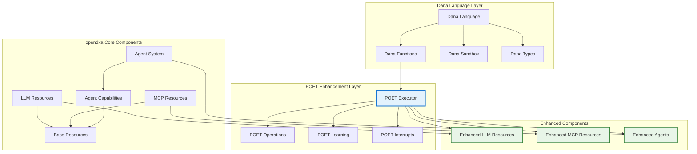

# POET Integration Patterns

## Overview

This document outlines how POET integrates with existing opendxa components and provides patterns for enhancing current functionality with intelligent execution capabilities. POET is designed to seamlessly enhance existing systems through its **80/20 intelligence architecture**:

- **80% Generalizable Integration**: Universal patterns for enhancing any function with reliability, performance optimization, and basic learning
- **20% Domain-Specific Integration**: Industry-specific enhancements for compliance, specialized validation, and domain expertise
- **AI-Generated Integration**: Custom integration patterns automatically created for unique enterprise architectures

This approach provides clear migration paths while ensuring immediate value through automated intelligence application.

## Integration Architecture

### POET in the opendxa Ecosystem



## Core Integration Patterns

### 1. Dana Language Integration

#### POET-Enhanced Dana Functions
```python
# opendxa/dana/sandbox/interpreter/functions/poet_enhanced_functions.py
from opendxa.common.poet.executor import poet
from opendxa.dana.sandbox.interpreter.functions.dana_function import DanaFunction

class POETDanaFunction(DanaFunction):
    """Dana function enhanced with POET capabilities"""
    
    def __init__(self, original_function: DanaFunction, poet_config: Dict[str, Any]):
        super().__init__(
            name=original_function.name,
            args=original_function.args,
            body=original_function.body,
            context=original_function.context
        )
        self.original_function = original_function
        self.poet_config = poet_config
        self._setup_poet_decorator()
    
    def _setup_poet_decorator(self):
        """Apply POET decorator to the Dana function"""
        
        # Extract POET configuration from Dana decorator syntax
        poet_params = self._parse_dana_poet_config(self.poet_config)
        
        # Create POET-enhanced execution method
        @poet(**poet_params)
        def enhanced_execute(args, context):
            return self.original_function.execute(args, context)
        
        self.execute = enhanced_execute
    
    def _parse_dana_poet_config(self, config: Dict[str, Any]) -> Dict[str, Any]:
        """Convert Dana POET configuration to Python POET parameters"""
        
        python_config = {}
        
        # Map Dana config to Python config
        if 'retries' in config:
            python_config['retries'] = config['retries']
        
        if 'learning' in config:
            python_config['learning'] = config['learning']
        
        if 'interrupts' in config:
            python_config['interrupts'] = config['interrupts']
        
        # Handle Dana function references for custom handlers
        if 'perceive' in config:
            python_config['perceive_handler'] = self._resolve_dana_function(config['perceive'])
        
        if 'enforce' in config:
            python_config['enforce_handler'] = self._resolve_dana_function(config['enforce'])
        
        if 'train' in config:
            python_config['train_handler'] = self._resolve_dana_function(config['train'])
        
        return python_config

# Dana language syntax for POET
"""
# Example Dana code with POET
@poet(
    retries=3,
    learning="on",
    interrupts="auto",
    perceive="Dana::optimize_input",
    enforce="Dana::validate_output"
)
def process_document(doc_text: str) -> ProcessedDoc:
    # Core business logic
    return extract_key_information(doc_text)
"""
```

#### Enhanced Reason Function
```python
# opendxa/dana/sandbox/interpreter/functions/core/enhanced_reason_function.py
from opendxa.common.poet.executor import poet
from opendxa.common.resource.llm_resource import LLMResource

class EnhancedReasonFunction:
    """POET-enhanced reason() function with adaptive learning"""
    
    def __init__(self, llm_resource: LLMResource):
        self.llm_resource = llm_resource
        self.context_analyzer = CodeContextAnalyzer()
    
    @poet(
        learning="on",
        perceive_handler="reason_perceive",
        enforce_handler="reason_enforce",
        train_handler="reason_train"
    )
    def reason(self, prompt: str, context: Dict[str, Any]) -> Any:
        """Enhanced reason function with POET capabilities"""
        
        # Extract expected output type from Dana context
        expected_type = context.get('expected_output_type', 'str')
        
        # Generate response using LLM resource
        response = self.llm_resource.generate(
            prompt=prompt,
            temperature=0.7,
            max_tokens=1000
        )
        
        return response
    
    def reason_perceive(self, args, poet_status: Dict[str, Any]) -> Dict[str, Any]:
        """Custom perceive handler for reason function"""
        
        prompt = args[0] if args else ""
        context = args[1] if len(args) > 1 else {}
        
        # Analyze code context for enhanced prompting
        code_context = self.context_analyzer.analyze_call_site(
            function_name="reason",
            call_context=context
        )
        
        # Retrieve learned prompt optimizations
        learned_params = poet_status.get('learnings_applied', {})
        
        # Optimize prompt based on context and learnings
        optimized_prompt = self._optimize_prompt(
            prompt, code_context, learned_params
        )
        
        return {
            'original_prompt': prompt,
            'optimized_prompt': optimized_prompt,
            'code_context': code_context,
            'expected_type': code_context.get('expected_output_type', 'str')
        }
    
    def reason_enforce(self, raw_output: Any, poet_status: Dict[str, Any]) -> tuple[Any, bool]:
        """Custom enforce handler for reason function"""
        
        perceived_input = poet_status.get('perceived_input', {})
        expected_type = perceived_input.get('expected_type', 'str')
        
        # Type coercion and validation
        validated_output, is_valid = self._validate_and_coerce_output(
            raw_output, expected_type
        )
        
        if not is_valid:
            poet_status['last_internal_failure'] = f"Failed to convert output to {expected_type}"
            return None, False
        
        return validated_output, True
    
    def _optimize_prompt(self, prompt: str, code_context: Dict[str, Any], 
                        learned_params: Dict[str, Any]) -> str:
        """Optimize prompt based on context and learned parameters"""
        
        optimized = prompt
        
        # Add type hint if context suggests specific output type
        expected_type = code_context.get('expected_output_type')
        if expected_type and expected_type != 'str':
            if expected_type == 'float':
                optimized += "\n\nReturn only a numerical value as a float."
            elif expected_type == 'int':
                optimized += "\n\nReturn only a whole number as an integer."
            elif expected_type == 'bool':
                optimized += "\n\nReturn only 'true' or 'false'."
            elif expected_type == 'dict':
                optimized += "\n\nReturn the response as a JSON object."
            elif expected_type == 'list':
                optimized += "\n\nReturn the response as a JSON array."
        
        # Apply learned prompt strategies
        if 'effective_strategies' in learned_params:
            strategies = learned_params['effective_strategies']
            if 'add_examples' in strategies and strategies['add_examples'] > 0.8:
                # Add examples if they've been effective
                optimized = self._add_contextual_examples(optimized, code_context)
        
        return optimized
```

### 2. Resource Enhancement Patterns

#### Enhanced LLM Resource
```python
# opendxa/common/resource/enhanced_llm_resource.py
from opendxa.common.resource.llm_resource import LLMResource
from opendxa.common.poet.executor import poet

class EnhancedLLMResource(LLMResource):
    """LLM Resource enhanced with POET capabilities"""
    
    @poet(
        learning="on",
        perceive_handler="llm_perceive",
        enforce_handler="llm_enforce",
        train_handler="llm_train",
        retries=3
    )
    def generate(self, prompt: str, **kwargs) -> str:
        """Enhanced generate with POET reliability and learning"""
        return super().generate(prompt, **kwargs)
    
    @poet(
        learning="batch",
        perceive_handler="embedding_perceive",
        enforce_handler="embedding_enforce"
    )
    def embed(self, text: str) -> List[float]:
        """Enhanced embedding with POET optimization"""
        return super().embed(text)
    
    def llm_perceive(self, args, poet_status: Dict[str, Any]) -> Dict[str, Any]:
        """LLM-specific perceive logic"""
        
        prompt = args[0] if args else ""
        kwargs = args[1] if len(args) > 1 else {}
        
        # Analyze prompt for optimization opportunities
        prompt_analysis = self._analyze_prompt_characteristics(prompt)
        
        # Retrieve learned optimal parameters
        learned_params = self._get_learned_llm_params(prompt_analysis)
        
        # Optimize generation parameters
        optimized_kwargs = self._optimize_generation_params(kwargs, learned_params)
        
        return {
            'original_prompt': prompt,
            'optimized_prompt': prompt,  # Could be enhanced based on learning
            'generation_params': optimized_kwargs,
            'prompt_analysis': prompt_analysis
        }
    
    def llm_enforce(self, raw_output: str, poet_status: Dict[str, Any]) -> tuple[str, bool]:
        """LLM-specific output validation"""
        
        # Check for common LLM output issues
        if not raw_output or raw_output.strip() == "":
            return None, False
        
        # Check for hallucination indicators
        if self._detect_potential_hallucination(raw_output):
            poet_status['last_internal_failure'] = "Potential hallucination detected"
            return None, False
        
        # Validate against expected format if specified
        perceived_input = poet_status.get('perceived_input', {})
        if 'expected_format' in perceived_input:
            if not self._validate_output_format(raw_output, perceived_input['expected_format']):
                return None, False
        
        return raw_output.strip(), True
```

#### Enhanced MCP Resource
```python
# opendxa/common/resource/mcp/enhanced_mcp_resource.py
from opendxa.common.resource.mcp.mcp_resource import MCPResource
from opendxa.common.poet.executor import poet

class EnhancedMCPResource(MCPResource):
    """MCP Resource enhanced with POET reliability patterns"""
    
    @poet(
        learning="on",
        perceive_handler="mcp_perceive",
        enforce_handler="mcp_enforce",
        retries=5,  # Higher retries for external services
        timeout=30.0
    )
    def call_tool(self, tool_name: str, parameters: Dict[str, Any]) -> Any:
        """Enhanced tool calling with POET reliability"""
        return super().call_tool(tool_name, parameters)
    
    @poet(
        learning="batch",
        perceive_handler="resource_perceive",
        enforce_handler="resource_enforce"
    )
    def list_resources(self) -> List[Dict[str, Any]]:
        """Enhanced resource listing with caching and optimization"""
        return super().list_resources()
    
    def mcp_perceive(self, args, poet_status: Dict[str, Any]) -> Dict[str, Any]:
        """MCP-specific perceive logic with connection optimization"""
        
        tool_name = args[0] if args else ""
        parameters = args[1] if len(args) > 1 else {}
        
        # Check connection health and optimize if needed
        connection_health = self._assess_connection_health()
        
        # Retrieve learned optimal timeouts and retry strategies
        learned_params = self._get_learned_mcp_params(tool_name)
        
        # Optimize parameters based on historical performance
        optimized_params = self._optimize_tool_parameters(parameters, learned_params)
        
        return {
            'tool_name': tool_name,
            'original_parameters': parameters,
            'optimized_parameters': optimized_params,
            'connection_health': connection_health,
            'learned_params': learned_params
        }
    
    def mcp_enforce(self, raw_output: Any, poet_status: Dict[str, Any]) -> tuple[Any, bool]:
        """MCP-specific output validation"""
        
        # Validate MCP response structure
        if not self._is_valid_mcp_response(raw_output):
            poet_status['last_internal_failure'] = "Invalid MCP response structure"
            return None, False
        
        # Check for error conditions
        if self._is_mcp_error_response(raw_output):
            error_msg = self._extract_mcp_error(raw_output)
            poet_status['last_internal_failure'] = f"MCP error: {error_msg}"
            return None, False
        
        # Validate response completeness
        if not self._is_response_complete(raw_output):
            poet_status['last_internal_failure'] = "Incomplete MCP response"
            return None, False
        
        return raw_output, True
```

### 3. Agent System Integration

#### Enhanced Agent Capabilities
```python
# opendxa/agent/capability/enhanced_capabilities.py
from opendxa.agent.capability.base_capability import BaseCapability
from opendxa.common.poet.executor import poet

class EnhancedDomainExpertise(BaseCapability):
    """Domain expertise capability enhanced with POET learning"""
    
    @poet(
        learning="hybrid",
        perceive_handler="expertise_perceive",
        enforce_handler="expertise_enforce",
        train_handler="expertise_train"
    )
    def analyze_domain_problem(self, problem_description: str, 
                              domain_context: Dict[str, Any]) -> Dict[str, Any]:
        """Analyze domain-specific problems with adaptive expertise"""
        
        # Core analysis logic
        analysis = self._perform_domain_analysis(problem_description, domain_context)
        
        return analysis
    
    def expertise_perceive(self, args, poet_status: Dict[str, Any]) -> Dict[str, Any]:
        """Domain expertise perceive logic"""
        
        problem_description = args[0] if args else ""
        domain_context = args[1] if len(args) > 1 else {}
        
        # Identify domain from context and problem characteristics
        detected_domain = self._detect_problem_domain(problem_description, domain_context)
        
        # Retrieve domain-specific learned patterns
        domain_expertise = self._get_domain_expertise(detected_domain)
        
        # Enrich context with domain knowledge
        enriched_context = self._enrich_domain_context(domain_context, domain_expertise)
        
        return {
            'problem_description': problem_description,
            'detected_domain': detected_domain,
            'enriched_context': enriched_context,
            'domain_expertise': domain_expertise
        }

class EnhancedMemoryCapability(BaseCapability):
    """Memory capability enhanced with POET pattern learning"""
    
    @poet(
        learning="on",
        perceive_handler="memory_perceive",
        enforce_handler="memory_enforce"
    )
    def store_experience(self, experience: Dict[str, Any]) -> str:
        """Store experience with POET-enhanced categorization"""
        return super().store_experience(experience)
    
    @poet(
        learning="on",
        perceive_handler="recall_perceive",
        enforce_handler="recall_enforce"
    )
    def recall_relevant_experiences(self, query: str, 
                                   context: Dict[str, Any]) -> List[Dict[str, Any]]:
        """Recall experiences with POET-enhanced relevance scoring"""
        return super().recall_relevant_experiences(query, context)
```

### 4. Migration Patterns

#### Gradual Enhancement Strategy with Intelligence Distribution

POET's 80/20 architecture enables progressive migration where each enhancement level provides increasing value:

1. **Basic Enhancement (80% Generalized)**: Core reliability and performance improvements
2. **Domain Enhancement (80% + 20% Domain)**: Add industry-specific intelligence  
3. **Custom Enhancement (80% + 20% AI-Generated)**: Full customization for unique needs

#### Gradual Enhancement Strategy
```python
# opendxa/common/poet/migration/enhancement_strategy.py
from typing import Callable, Any, Dict
from opendxa.common.poet.executor import poet

class POETMigrationManager:
    """Manages gradual migration to POET-enhanced components"""
    
    def __init__(self):
        self.enhancement_registry = {}
        self.migration_status = {}
    
    def register_for_enhancement(self, component_type: str, 
                                enhancement_config: Dict[str, Any]):
        """Register component for POET enhancement"""
        self.enhancement_registry[component_type] = enhancement_config
    
    def enhance_function_gradually(self, original_function: Callable, 
                                  enhancement_level: str = "basic",
                                  domain: Optional[str] = None) -> Callable:
        """Apply POET enhancement based on specified level and intelligence distribution"""
        
        if enhancement_level == "basic":
            return self._apply_basic_poet(original_function)
        elif enhancement_level == "domain":
            return self._apply_domain_poet(original_function, domain)
        elif enhancement_level == "custom":
            return self._apply_custom_poet(original_function, domain)
        else:
            return original_function
    
    def _apply_basic_poet(self, func: Callable) -> Callable:
        """Apply 80% generalized intelligence only - core reliability and performance"""
        @poet(learning="off", retries=2, interrupts="auto")
        def enhanced_func(*args, **kwargs):
            return func(*args, **kwargs)
        return enhanced_func
    
    def _apply_domain_poet(self, func: Callable, domain: Optional[str]) -> Callable:
        """Apply 80% generalized + 20% domain-specific intelligence"""
        @poet(learning="on", retries=3, interrupts="auto", domain=domain)
        def enhanced_func(*args, **kwargs):
            return func(*args, **kwargs)
        return enhanced_func
    
    def _apply_custom_poet(self, func: Callable, domain: Optional[str]) -> Callable:
        """Apply 80% generalized + 20% AI-generated custom intelligence"""
        custom_plugin = self._generate_ai_plugin(func, domain)
        @poet(
            learning="hybrid",
            retries=5,
            interrupts="on",
            custom_plugin=custom_plugin
        )
        def enhanced_func(*args, **kwargs):
            return func(*args, **kwargs)
        return enhanced_func

# Migration configuration with intelligence distribution
MIGRATION_ROADMAP = {
    "phase_1": {
        "components": ["reason", "basic_llm_calls"],
        "enhancement_level": "basic",          # 80% generalized intelligence
        "intelligence_type": "generalized_only",
        "duration_weeks": 2,
        "expected_improvements": ["reliability", "basic_performance"]
    },
    "phase_2": {
        "components": ["mcp_resources", "agent_capabilities"],
        "enhancement_level": "domain",         # 80% generalized + 20% domain
        "intelligence_type": "domain_specific",
        "domains": ["identified_from_usage"],
        "duration_weeks": 4,
        "expected_improvements": ["domain_optimization", "compliance", "specialized_validation"]
    },
    "phase_3": {
        "components": ["complex_workflows", "unique_enterprise_logic"],
        "enhancement_level": "custom",         # 80% generalized + 20% AI-generated
        "intelligence_type": "ai_generated",
        "custom_requirements": ["analyzed_from_patterns"],
        "duration_weeks": 6,
        "expected_improvements": ["full_customization", "unique_optimizations", "enterprise_specific"]
    }
}
```

### 5. Performance Integration Patterns

#### Resource-Aware POET Configuration
```python
# opendxa/common/poet/performance/resource_aware_config.py
import psutil
from typing import Dict, Any

class ResourceAwarePOETConfig:
    """Dynamically adjusts POET configuration based on system resources"""
    
    def __init__(self):
        self.base_configs = {
            "high_performance": {
                "learning": "hybrid",
                "retries": 5,
                "batch_size": 100,
                "learning_rate": 0.1
            },
            "balanced": {
                "learning": "on",
                "retries": 3,
                "batch_size": 50,
                "learning_rate": 0.05
            },
            "resource_constrained": {
                "learning": "off",
                "retries": 1,
                "batch_size": 10,
                "learning_rate": 0.01
            }
        }
    
    def get_optimal_config(self, function_name: str, 
                          priority: str = "normal") -> Dict[str, Any]:
        """Get optimal POET configuration based on current system state"""
        
        # Assess system resources
        cpu_percent = psutil.cpu_percent(interval=1)
        memory_percent = psutil.virtual_memory().percent
        
        # Determine resource class
        if cpu_percent < 50 and memory_percent < 70:
            resource_class = "high_performance"
        elif cpu_percent < 80 and memory_percent < 85:
            resource_class = "balanced"
        else:
            resource_class = "resource_constrained"
        
        # Adjust based on priority
        config = self.base_configs[resource_class].copy()
        
        if priority == "critical":
            config["retries"] = min(config["retries"] + 2, 10)
        elif priority == "low":
            config["retries"] = max(config["retries"] - 1, 1)
            if config["learning"] == "hybrid":
                config["learning"] = "on"
        
        return config
```

### 6. Monitoring and Observability Integration

#### POET Metrics Integration
```python
# opendxa/common/poet/monitoring/metrics_integration.py
from opendxa.common.utils.logging.dxa_logger import DXALogger
from typing import Dict, Any

class POETMetricsCollector:
    """Integrates POET metrics with opendxa monitoring systems"""
    
    def __init__(self, logger: DXALogger):
        self.logger = logger
        self.metrics = {
            "execution_count": 0,
            "success_rate": 0.0,
            "average_retries": 0.0,
            "learning_effectiveness": 0.0,
            "interrupt_frequency": 0.0
        }
    
    def record_poet_execution(self, poet_status: Dict[str, Any], 
                             execution_result: Dict[str, Any]):
        """Record POET execution metrics"""
        
        self.metrics["execution_count"] += 1
        
        # Update success rate
        if execution_result.get("success", False):
            success_count = self.metrics["execution_count"] * self.metrics["success_rate"]
            self.metrics["success_rate"] = (success_count + 1) / self.metrics["execution_count"]
        
        # Update average retries
        retries = poet_status.get("attempt", 1) - 1
        total_retries = (self.metrics["execution_count"] - 1) * self.metrics["average_retries"]
        self.metrics["average_retries"] = (total_retries + retries) / self.metrics["execution_count"]
        
        # Log structured metrics
        self.logger.info("poet_execution_completed", extra={
            "execution_id": poet_status.get("execution_id"),
            "function_name": poet_status.get("function_name"),
            "retries_used": retries,
            "learning_applied": bool(poet_status.get("learnings_applied")),
            "validation_passed": poet_status.get("is_internally_validated", False),
            "execution_time_ms": execution_result.get("duration_ms", 0)
        })
```

## Testing Integration Patterns

### POET-Enhanced Testing Framework
```python
# opendxa/common/poet/testing/test_framework.py
import unittest
from opendxa.common.poet.executor import poet

class POETTestCase(unittest.TestCase):
    """Test case base class for POET-enhanced functions"""
    
    def setUp(self):
        self.poet_test_config = {
            "learning": "off",  # Disable learning during tests
            "retries": 1,       # Minimal retries for faster tests
            "interrupts": "off" # No interrupts during automated tests
        }
    
    def assert_poet_execution_successful(self, function_result, poet_status):
        """Assert that POET execution completed successfully"""
        self.assertTrue(poet_status.get("is_internally_validated", False))
        self.assertIsNotNone(function_result)
        self.assertLessEqual(poet_status.get("attempt", 0), poet_status.get("max_retries", 1))
    
    def test_with_poet_learning_disabled(self, poet_function):
        """Test decorator to disable learning for test functions"""
        def decorator(test_func):
            def wrapped_test(*args, **kwargs):
                # Temporarily override learning settings
                original_config = getattr(poet_function, '_poet_config', {})
                test_config = original_config.copy()
                test_config.update(self.poet_test_config)
                
                # Run test with modified config
                return test_func(*args, **kwargs)
            return wrapped_test
        return decorator
```

## Configuration Management Integration

### Environment-Specific POET Configuration
```python
# opendxa/common/poet/config/environment_config.py
import os
from typing import Dict, Any

class POETEnvironmentConfig:
    """Manages POET configuration across different environments"""
    
    def __init__(self):
        self.env_configs = {
            "development": {
                "default_learning": "off",
                "default_retries": 1,
                "default_interrupts": "on",
                "enable_detailed_logging": True
            },
            "staging": {
                "default_learning": "on",
                "default_retries": 3,
                "default_interrupts": "auto",
                "enable_detailed_logging": True
            },
            "production": {
                "default_learning": "hybrid",
                "default_retries": 5,
                "default_interrupts": "auto",
                "enable_detailed_logging": False,
                "enable_performance_monitoring": True
            }
        }
    
    def get_environment_config(self) -> Dict[str, Any]:
        """Get POET configuration for current environment"""
        env = os.getenv("OPENDXA_ENV", "development").lower()
        return self.env_configs.get(env, self.env_configs["development"])
    
    def apply_environment_defaults(self, user_config: Dict[str, Any]) -> Dict[str, Any]:
        """Apply environment defaults to user configuration"""
        env_config = self.get_environment_config()
        
        # Start with environment defaults
        final_config = env_config.copy()
        
        # Override with user-specified values
        final_config.update(user_config)
        
        return final_config
```

## Next Steps

1. **Example Implementations** - Concrete examples showing POET integration in action
2. **Performance Benchmarks** - Measuring POET enhancement impact
3. **Migration Guide** - Step-by-step migration procedures
4. **Advanced Integration Patterns** - Complex integration scenarios
5. **Troubleshooting Guide** - Common integration issues and solutions

## Summary

POET integration provides multiple patterns for enhancing existing opendxa components:

- **Transparent Enhancement**: Existing functions gain POET capabilities without code changes
- **Custom Handlers**: Domain-specific logic for Perceive, Enforce, and Train stages  
- **Gradual Migration**: Phased adoption with configurable enhancement levels
- **Resource Awareness**: Dynamic configuration based on system resources
- **Environment Adaptation**: Different behaviors for development, staging, and production
- **Monitoring Integration**: Comprehensive metrics and observability
- **Testing Support**: Specialized testing frameworks for POET-enhanced components

These patterns ensure POET can be adopted incrementally while providing immediate value and maintaining system reliability.