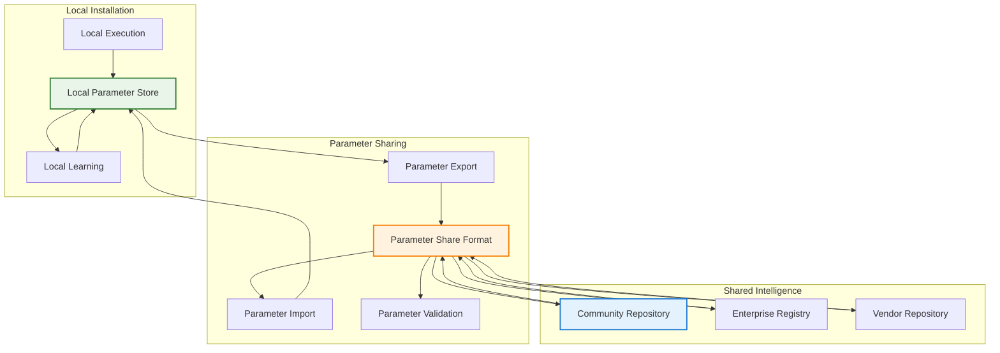

# POET Parameter Storage and Sharing Architecture

## Problem Statement

POET's learning capabilities depend on storing, retrieving, and evolving parameters over time. We need to solve several critical challenges:

1. **Local Learning Storage**: Where and how to persist learned parameters for a single installation
2. **Parameter Evolution**: How to handle parameters that change over time while maintaining version compatibility
3. **Cross-Installation Sharing**: How to export learned intelligence so others can benefit from optimized parameters
4. **Performance Requirements**: Fast parameter retrieval during function execution
5. **Security and Privacy**: Ensuring shared parameters don't leak sensitive information
6. **Compatibility Management**: Handling parameter format evolution across POET versions

## Goals

### Primary Goals
- **Persistent Learning**: Parameters survive system restarts and continue improving over time
- **Performance**: Sub-10ms parameter retrieval for function execution
- **Shareable Intelligence**: Export/import learned parameters to accelerate adoption
- **Version Compatibility**: Handle parameter format evolution gracefully
- **Security**: Validate shared parameters and protect sensitive data
- **Scalability**: Support thousands of functions with millions of parameter updates

### Secondary Goals
- **Cross-Platform Compatibility**: Parameters work across different operating systems
- **Backup and Recovery**: Reliable parameter backup and restoration
- **Analytics and Monitoring**: Insights into learning effectiveness and parameter evolution
- **Integration**: Seamless integration with existing opendxa architecture

## Non-Goals

### Explicit Non-Goals
- **Real-time Synchronization**: Not building a distributed parameter synchronization system
- **Cloud-Native Storage**: Not requiring cloud infrastructure for basic functionality
- **Universal Parameter Registry**: Not building a centralized global parameter sharing service
- **Machine Learning Platform**: Not replacing dedicated ML platforms for complex model training
- **Data Lake Integration**: Not integrating with enterprise data lakes or warehouses

### Out of Scope
- **User Authentication**: Parameter sharing uses existing opendxa security mechanisms
- **Network Protocols**: Using standard HTTP/file-based sharing, not custom protocols
- **Multi-Tenant Architecture**: Single installation focus, not enterprise multi-tenancy

## Design Overview

### Architecture Philosophy

POET parameter management follows a **three-tier architecture**:

1. **Local Tier**: High-performance local storage for active learning
2. **Export Tier**: Standardized format for sharing learned intelligence
3. **Import Tier**: Validation and integration of external parameters



## Local Parameter Storage Design

### Storage Architecture

#### Hybrid Storage Approach
```python
# opendxa/common/poet/storage/parameter_store.py
from typing import Dict, Any, Optional, List
import sqlite3
import json
import hashlib
import threading
from datetime import datetime, timedelta

class POETParameterStore:
    """
    Hybrid storage combining SQLite for metadata and structured storage 
    for high-performance parameter retrieval
    """
    
    def __init__(self, storage_path: str = "~/.opendxa/poet/parameters"):
        self.storage_path = Path(storage_path).expanduser()
        self.storage_path.mkdir(parents=True, exist_ok=True)
        
        # SQLite for metadata and indexing
        self.db_path = self.storage_path / "parameters.db"
        self.db_lock = threading.RLock()
        
        # Memory cache for hot parameters
        self.parameter_cache = {}
        self.cache_lock = threading.RLock()
        
        # File-based storage for large parameter sets
        self.parameter_files = self.storage_path / "parameter_data"
        self.parameter_files.mkdir(exist_ok=True)
        
        self._init_database()
        self._load_hot_cache()
    
    def _init_database(self):
        """Initialize SQLite schema for parameter metadata"""
        with sqlite3.connect(self.db_path) as conn:
            conn.executescript("""
                CREATE TABLE IF NOT EXISTS parameter_metadata (
                    id INTEGER PRIMARY KEY AUTOINCREMENT,
                    function_name TEXT NOT NULL,
                    parameter_key TEXT NOT NULL,
                    parameter_hash TEXT NOT NULL,
                    created_at TIMESTAMP DEFAULT CURRENT_TIMESTAMP,
                    updated_at TIMESTAMP DEFAULT CURRENT_TIMESTAMP,
                    access_count INTEGER DEFAULT 0,
                    last_accessed TIMESTAMP DEFAULT CURRENT_TIMESTAMP,
                    confidence_score REAL DEFAULT 0.5,
                    learning_source TEXT DEFAULT 'local',
                    file_path TEXT,
                    UNIQUE(function_name, parameter_key)
                );
                
                CREATE TABLE IF NOT EXISTS parameter_versions (
                    id INTEGER PRIMARY KEY AUTOINCREMENT,
                    parameter_id INTEGER,
                    version_number INTEGER,
                    parameter_data TEXT,
                    performance_metrics TEXT,
                    created_at TIMESTAMP DEFAULT CURRENT_TIMESTAMP,
                    FOREIGN KEY(parameter_id) REFERENCES parameter_metadata(id)
                );
                
                CREATE TABLE IF NOT EXISTS learning_history (
                    id INTEGER PRIMARY KEY AUTOINCREMENT,
                    function_name TEXT NOT NULL,
                    execution_id TEXT NOT NULL,
                    parameter_changes TEXT,
                    performance_before REAL,
                    performance_after REAL,
                    learning_type TEXT,
                    created_at TIMESTAMP DEFAULT CURRENT_TIMESTAMP
                );
                
                CREATE INDEX IF NOT EXISTS idx_function_name ON parameter_metadata(function_name);
                CREATE INDEX IF NOT EXISTS idx_access_pattern ON parameter_metadata(access_count DESC, last_accessed DESC);
                CREATE INDEX IF NOT EXISTS idx_confidence ON parameter_metadata(confidence_score DESC);
            """)
```

#### Parameter Storage Strategies

```python
class ParameterStorageStrategy:
    """Strategy pattern for different parameter storage needs"""
    
    @abstractmethod
    def store_parameters(self, function_name: str, parameters: Dict[str, Any]) -> str:
        pass
    
    @abstractmethod
    def retrieve_parameters(self, function_name: str, parameter_key: str) -> Dict[str, Any]:
        pass

class InMemoryStrategy(ParameterStorageStrategy):
    """High-frequency, small parameters - keep in memory cache"""
    
    def store_parameters(self, function_name: str, parameters: Dict[str, Any]) -> str:
        cache_key = f"{function_name}:{hash(str(parameters))}"
        with self.cache_lock:
            self.parameter_cache[cache_key] = {
                'parameters': parameters,
                'timestamp': datetime.now(),
                'access_count': 0
            }
        return cache_key
    
    def retrieve_parameters(self, function_name: str, parameter_key: str) -> Dict[str, Any]:
        with self.cache_lock:
            if parameter_key in self.parameter_cache:
                entry = self.parameter_cache[parameter_key]
                entry['access_count'] += 1
                return entry['parameters']
        return {}

class FileBasedStrategy(ParameterStorageStrategy):
    """Large parameter sets - store in optimized files"""
    
    def store_parameters(self, function_name: str, parameters: Dict[str, Any]) -> str:
        parameter_hash = hashlib.sha256(json.dumps(parameters, sort_keys=True).encode()).hexdigest()
        file_path = self.parameter_files / f"{function_name}_{parameter_hash}.json"
        
        with open(file_path, 'w') as f:
            json.dump({
                'parameters': parameters,
                'metadata': {
                    'function_name': function_name,
                    'created_at': datetime.now().isoformat(),
                    'parameter_hash': parameter_hash
                }
            }, f, indent=2)
        
        return str(file_path)

class HybridStrategy(ParameterStorageStrategy):
    """Intelligent strategy selection based on parameter characteristics"""
    
    def __init__(self):
        self.memory_strategy = InMemoryStrategy()
        self.file_strategy = FileBasedStrategy()
        
        # Thresholds for strategy selection
        self.memory_size_threshold = 1024  # bytes
        self.access_frequency_threshold = 10  # accesses per hour
    
    def select_strategy(self, parameters: Dict[str, Any], access_pattern: Dict[str, Any]) -> ParameterStorageStrategy:
        """Select optimal storage strategy based on parameter characteristics"""
        
        parameter_size = len(json.dumps(parameters).encode())
        access_frequency = access_pattern.get('accesses_per_hour', 0)
        
        if parameter_size < self.memory_size_threshold and access_frequency > self.access_frequency_threshold:
            return self.memory_strategy
        else:
            return self.file_strategy
```

## Parameter Export Format Design

### Standardized Parameter Package Format

```python
# opendxa/common/poet/sharing/parameter_package.py
from dataclasses import dataclass
from typing import Dict, Any, List, Optional
import json
import hashlib
from datetime import datetime

@dataclass
class ParameterPackageMetadata:
    """Metadata for parameter packages"""
    package_id: str
    package_name: str
    version: str
    author: str
    description: str
    created_at: datetime
    poet_version: str
    functions_included: List[str]
    performance_metrics: Dict[str, float]
    compatibility: Dict[str, str]
    license: str = "MIT"
    privacy_level: str = "public"  # public, private, enterprise

@dataclass
class FunctionParameters:
    """Parameters for a specific function"""
    function_name: str
    parameters: Dict[str, Any]
    confidence_scores: Dict[str, float]
    learning_history: List[Dict[str, Any]]
    performance_metrics: Dict[str, float]
    domain: Optional[str] = None
    validation_requirements: Optional[Dict[str, Any]] = None

@dataclass 
class ParameterPackage:
    """Complete parameter package for sharing"""
    metadata: ParameterPackageMetadata
    functions: List[FunctionParameters]
    shared_intelligence: Dict[str, Any]  # Cross-function learnings
    validation_data: Optional[Dict[str, Any]] = None

class ParameterPackageFormat:
    """Standardized format for parameter packages"""
    
    FORMAT_VERSION = "1.0"
    
    @classmethod
    def create_package(cls, 
                      functions: List[str],
                      source_store: POETParameterStore,
                      metadata: ParameterPackageMetadata) -> ParameterPackage:
        """Create a parameter package from local parameters"""
        
        function_parameters = []
        
        for function_name in functions:
            # Extract parameters for this function
            params = source_store.get_all_parameters(function_name)
            confidence = source_store.get_confidence_scores(function_name)
            history = source_store.get_learning_history(function_name)
            performance = source_store.get_performance_metrics(function_name)
            
            # Privacy filtering - remove sensitive data
            filtered_params = cls._filter_sensitive_parameters(params)
            filtered_history = cls._filter_sensitive_history(history)
            
            function_parameters.append(FunctionParameters(
                function_name=function_name,
                parameters=filtered_params,
                confidence_scores=confidence,
                learning_history=filtered_history,
                performance_metrics=performance,
                domain=source_store.get_function_domain(function_name)
            ))
        
        # Extract shared intelligence patterns
        shared_intelligence = cls._extract_shared_patterns(source_store, functions)
        
        return ParameterPackage(
            metadata=metadata,
            functions=function_parameters,
            shared_intelligence=shared_intelligence
        )
    
    @classmethod
    def _filter_sensitive_parameters(cls, parameters: Dict[str, Any]) -> Dict[str, Any]:
        """Remove or anonymize sensitive parameter data"""
        
        filtered = {}
        sensitive_patterns = [
            'api_key', 'password', 'token', 'secret', 'private_key',
            'user_id', 'customer_id', 'account_number', 'ssn'
        ]
        
        for key, value in parameters.items():
            # Check if key contains sensitive patterns
            if any(pattern in key.lower() for pattern in sensitive_patterns):
                continue  # Skip sensitive parameters
            
            # Check if value looks like sensitive data
            if isinstance(value, str) and (
                len(value) > 20 and value.isalnum() or  # Looks like a token
                '@' in value or  # Looks like email
                value.startswith('http') and 'auth' in value  # Looks like auth URL
            ):
                continue  # Skip potentially sensitive values
            
            filtered[key] = value
        
        return filtered
    
    @classmethod
    def export_package(cls, package: ParameterPackage, export_path: str) -> str:
        """Export parameter package to file"""
        
        # Create package data structure
        package_data = {
            'format_version': cls.FORMAT_VERSION,
            'metadata': {
                'package_id': package.metadata.package_id,
                'package_name': package.metadata.package_name,
                'version': package.metadata.version,
                'author': package.metadata.author,
                'description': package.metadata.description,
                'created_at': package.metadata.created_at.isoformat(),
                'poet_version': package.metadata.poet_version,
                'functions_included': package.metadata.functions_included,
                'performance_metrics': package.metadata.performance_metrics,
                'compatibility': package.metadata.compatibility,
                'license': package.metadata.license,
                'privacy_level': package.metadata.privacy_level
            },
            'functions': [
                {
                    'function_name': func.function_name,
                    'parameters': func.parameters,
                    'confidence_scores': func.confidence_scores,
                    'learning_summary': cls._summarize_learning_history(func.learning_history),
                    'performance_metrics': func.performance_metrics,
                    'domain': func.domain,
                    'validation_requirements': func.validation_requirements
                }
                for func in package.functions
            ],
            'shared_intelligence': package.shared_intelligence,
            'checksum': None  # Will be calculated after serialization
        }
        
        # Calculate package checksum
        package_json = json.dumps(package_data, sort_keys=True, indent=2)
        package_data['checksum'] = hashlib.sha256(package_json.encode()).hexdigest()
        
        # Write package file
        final_json = json.dumps(package_data, indent=2)
        with open(export_path, 'w') as f:
            f.write(final_json)
        
        return export_path
```

## Parameter Import and Validation

### Import Validation System

```python
# opendxa/common/poet/sharing/parameter_import.py
from typing import Dict, Any, List, Tuple
import json
import hashlib
from datetime import datetime

class ParameterImportValidator:
    """Validates imported parameter packages for security and compatibility"""
    
    def __init__(self):
        self.validation_rules = {
            'format_version': self._validate_format_version,
            'metadata': self._validate_metadata,
            'functions': self._validate_functions,
            'shared_intelligence': self._validate_shared_intelligence,
            'checksum': self._validate_checksum
        }
    
    def validate_package(self, package_path: str) -> Tuple[bool, List[str], ParameterPackage]:
        """
        Validate imported parameter package
        
        Returns:
            (is_valid, validation_errors, parsed_package)
        """
        
        try:
            with open(package_path, 'r') as f:
                package_data = json.load(f)
        except Exception as e:
            return False, [f"Failed to parse package file: {e}"], None
        
        validation_errors = []
        
        # Run all validation rules
        for rule_name, rule_func in self.validation_rules.items():
            try:
                is_valid, errors = rule_func(package_data)
                if not is_valid:
                    validation_errors.extend([f"{rule_name}: {error}" for error in errors])
            except Exception as e:
                validation_errors.append(f"{rule_name}: Validation error - {e}")
        
        # Parse package if validation passed
        if not validation_errors:
            try:
                package = self._parse_package(package_data)
                return True, [], package
            except Exception as e:
                validation_errors.append(f"Package parsing error: {e}")
        
        return False, validation_errors, None
    
    def _validate_format_version(self, package_data: Dict[str, Any]) -> Tuple[bool, List[str]]:
        """Validate package format version compatibility"""
        
        supported_versions = ["1.0"]
        package_version = package_data.get('format_version')
        
        if not package_version:
            return False, ["Missing format_version"]
        
        if package_version not in supported_versions:
            return False, [f"Unsupported format version: {package_version}. Supported: {supported_versions}"]
        
        return True, []
    
    def _validate_metadata(self, package_data: Dict[str, Any]) -> Tuple[bool, List[str]]:
        """Validate package metadata"""
        
        required_fields = [
            'package_id', 'package_name', 'version', 'author', 
            'created_at', 'poet_version', 'functions_included'
        ]
        
        metadata = package_data.get('metadata', {})
        errors = []
        
        for field in required_fields:
            if field not in metadata:
                errors.append(f"Missing required metadata field: {field}")
        
        # Validate POET version compatibility
        poet_version = metadata.get('poet_version')
        if poet_version and not self._is_poet_version_compatible(poet_version):
            errors.append(f"Incompatible POET version: {poet_version}")
        
        return len(errors) == 0, errors
    
    def _validate_functions(self, package_data: Dict[str, Any]) -> Tuple[bool, List[str]]:
        """Validate function parameter data"""
        
        functions = package_data.get('functions', [])
        errors = []
        
        if not functions:
            errors.append("Package contains no function parameters")
            return False, errors
        
        for i, func_data in enumerate(functions):
            # Validate required function fields
            required_fields = ['function_name', 'parameters', 'confidence_scores']
            for field in required_fields:
                if field not in func_data:
                    errors.append(f"Function {i}: Missing required field {field}")
            
            # Validate parameter structure
            parameters = func_data.get('parameters', {})
            if not isinstance(parameters, dict):
                errors.append(f"Function {i}: Parameters must be a dictionary")
            
            # Validate confidence scores
            confidence_scores = func_data.get('confidence_scores', {})
            if not isinstance(confidence_scores, dict):
                errors.append(f"Function {i}: Confidence scores must be a dictionary")
            
            # Check for potentially dangerous parameters
            dangerous_patterns = ['eval', 'exec', 'import', 'open', 'file']
            for param_name in parameters.keys():
                if any(pattern in param_name.lower() for pattern in dangerous_patterns):
                    errors.append(f"Function {i}: Potentially dangerous parameter name: {param_name}")
        
        return len(errors) == 0, errors
    
    def _validate_checksum(self, package_data: Dict[str, Any]) -> Tuple[bool, List[str]]:
        """Validate package integrity checksum"""
        
        provided_checksum = package_data.get('checksum')
        if not provided_checksum:
            return False, ["Missing package checksum"]
        
        # Recalculate checksum without the checksum field
        package_copy = package_data.copy()
        del package_copy['checksum']
        
        calculated_checksum = hashlib.sha256(
            json.dumps(package_copy, sort_keys=True).encode()
        ).hexdigest()
        
        if provided_checksum != calculated_checksum:
            return False, ["Package checksum mismatch - package may be corrupted or tampered"]
        
        return True, []

class ParameterImporter:
    """Imports and integrates parameter packages into local store"""
    
    def __init__(self, local_store: POETParameterStore):
        self.local_store = local_store
        self.validator = ParameterImportValidator()
    
    def import_package(self, 
                      package_path: str, 
                      import_strategy: str = "merge",
                      trust_level: str = "verify") -> Tuple[bool, List[str]]:
        """
        Import parameter package into local store
        
        Args:
            package_path: Path to parameter package file
            import_strategy: "merge", "replace", "selective"
            trust_level: "trusted", "verify", "sandbox"
        
        Returns:
            (success, messages)
        """
        
        # Validate package
        is_valid, validation_errors, package = self.validator.validate_package(package_path)
        
        if not is_valid:
            return False, validation_errors
        
        messages = []
        
        try:
            # Apply import strategy
            if import_strategy == "merge":
                messages.extend(self._merge_parameters(package))
            elif import_strategy == "replace":
                messages.extend(self._replace_parameters(package))
            elif import_strategy == "selective":
                messages.extend(self._selective_import(package))
            else:
                return False, [f"Unknown import strategy: {import_strategy}"]
            
            # Record import in history
            self._record_import(package, import_strategy, trust_level)
            
            return True, messages
            
        except Exception as e:
            return False, [f"Import failed: {e}"]
    
    def _merge_parameters(self, package: ParameterPackage) -> List[str]:
        """Merge imported parameters with existing ones"""
        
        messages = []
        
        for func_params in package.functions:
            function_name = func_params.function_name
            
            # Get existing parameters
            existing_params = self.local_store.get_all_parameters(function_name)
            existing_confidence = self.local_store.get_confidence_scores(function_name)
            
            # Merge parameters, preferring higher confidence
            merged_params = existing_params.copy()
            updated_count = 0
            
            for param_name, param_value in func_params.parameters.items():
                imported_confidence = func_params.confidence_scores.get(param_name, 0.5)
                existing_confidence_score = existing_confidence.get(param_name, 0.0)
                
                if imported_confidence > existing_confidence_score:
                    merged_params[param_name] = param_value
                    updated_count += 1
            
            # Store merged parameters
            if updated_count > 0:
                self.local_store.store_parameters(
                    function_name, 
                    merged_params,
                    source="imported_merge"
                )
                messages.append(f"Updated {updated_count} parameters for {function_name}")
            else:
                messages.append(f"No parameter updates for {function_name} (existing parameters had higher confidence)")
        
        return messages
```

## Sharing Mechanisms Design

### Community Parameter Repository

```python
# opendxa/common/poet/sharing/community_repository.py
from typing import Dict, Any, List, Optional
import requests
import json
from pathlib import Path

class CommunityParameterRepository:
    """Interface to community parameter sharing repository"""
    
    def __init__(self, repository_url: str = "https://poet-parameters.opendxa.org"):
        self.repository_url = repository_url
        self.local_cache = Path("~/.opendxa/poet/cache").expanduser()
        self.local_cache.mkdir(parents=True, exist_ok=True)
    
    def search_packages(self, 
                       domain: Optional[str] = None,
                       function_name: Optional[str] = None,
                       min_performance: Optional[float] = None) -> List[Dict[str, Any]]:
        """Search for parameter packages in community repository"""
        
        search_params = {}
        if domain:
            search_params['domain'] = domain
        if function_name:
            search_params['function'] = function_name
        if min_performance:
            search_params['min_performance'] = min_performance
        
        try:
            response = requests.get(
                f"{self.repository_url}/api/search",
                params=search_params,
                timeout=10
            )
            response.raise_for_status()
            return response.json().get('packages', [])
        except Exception as e:
            print(f"Failed to search community repository: {e}")
            return []
    
    def download_package(self, package_id: str) -> Optional[str]:
        """Download parameter package from repository"""
        
        try:
            # Download package metadata first
            metadata_response = requests.get(
                f"{self.repository_url}/api/packages/{package_id}/metadata",
                timeout=10
            )
            metadata_response.raise_for_status()
            metadata = metadata_response.json()
            
            # Download actual package
            package_response = requests.get(
                f"{self.repository_url}/api/packages/{package_id}/download",
                timeout=30
            )
            package_response.raise_for_status()
            
            # Save to local cache
            package_path = self.local_cache / f"{package_id}.json"
            with open(package_path, 'w') as f:
                f.write(package_response.text)
            
            return str(package_path)
            
        except Exception as e:
            print(f"Failed to download package {package_id}: {e}")
            return None
    
    def publish_package(self, package_path: str, api_key: str) -> bool:
        """Publish parameter package to community repository"""
        
        try:
            with open(package_path, 'r') as f:
                package_data = json.load(f)
            
            # Upload package
            response = requests.post(
                f"{self.repository_url}/api/packages/upload",
                json=package_data,
                headers={'Authorization': f'Bearer {api_key}'},
                timeout=60
            )
            response.raise_for_status()
            
            return True
            
        except Exception as e:
            print(f"Failed to publish package: {e}")
            return False

class EnterpriseParameterRegistry:
    """Enterprise-specific parameter sharing within organizations"""
    
    def __init__(self, registry_config: Dict[str, Any]):
        self.registry_url = registry_config.get('url')
        self.auth_config = registry_config.get('auth', {})
        self.organization = registry_config.get('organization')
    
    def share_parameters(self, 
                        package: ParameterPackage,
                        access_level: str = "organization") -> bool:
        """Share parameters within enterprise"""
        
        # Enterprise-specific sharing logic
        # - Access control based on organization roles
        # - Approval workflows for sensitive parameters
        # - Compliance with enterprise data governance
        pass
    
    def discover_parameters(self, 
                           criteria: Dict[str, Any]) -> List[ParameterPackage]:
        """Discover relevant parameters within enterprise"""
        
        # Enterprise-specific discovery
        # - Role-based access to parameter packages
        # - Department-specific parameter sharing
        # - Compliance-filtered parameter access
        pass
```

## Performance Optimization

### Caching and Indexing Strategy

```python
# opendxa/common/poet/storage/performance_optimization.py
from typing import Dict, Any, Optional
import threading
import time
from collections import OrderedDict

class ParameterCache:
    """High-performance LRU cache for frequently accessed parameters"""
    
    def __init__(self, max_size: int = 10000, ttl_seconds: int = 3600):
        self.max_size = max_size
        self.ttl_seconds = ttl_seconds
        self.cache = OrderedDict()
        self.access_times = {}
        self.lock = threading.RLock()
    
    def get(self, key: str) -> Optional[Dict[str, Any]]:
        """Get parameters from cache"""
        
        with self.lock:
            if key in self.cache:
                # Check TTL
                if time.time() - self.access_times[key] < self.ttl_seconds:
                    # Move to end (most recently used)
                    self.cache.move_to_end(key)
                    return self.cache[key]
                else:
                    # Expired - remove from cache
                    del self.cache[key]
                    del self.access_times[key]
        
        return None
    
    def put(self, key: str, value: Dict[str, Any]):
        """Put parameters in cache"""
        
        with self.lock:
            if key in self.cache:
                # Update existing entry
                self.cache[key] = value
                self.cache.move_to_end(key)
            else:
                # Add new entry
                self.cache[key] = value
                
                # Evict oldest if over capacity
                if len(self.cache) > self.max_size:
                    oldest_key = next(iter(self.cache))
                    del self.cache[oldest_key]
                    del self.access_times[oldest_key]
            
            self.access_times[key] = time.time()

class ParameterIndex:
    """Indexing system for fast parameter lookup"""
    
    def __init__(self):
        self.function_index = {}      # function_name -> parameter_keys
        self.domain_index = {}        # domain -> function_names
        self.confidence_index = {}    # confidence_range -> parameter_keys
        self.access_index = {}        # access_frequency -> parameter_keys
    
    def index_parameters(self, function_name: str, parameters: Dict[str, Any], metadata: Dict[str, Any]):
        """Add parameters to indexes"""
        
        # Function index
        if function_name not in self.function_index:
            self.function_index[function_name] = set()
        self.function_index[function_name].update(parameters.keys())
        
        # Domain index
        domain = metadata.get('domain')
        if domain:
            if domain not in self.domain_index:
                self.domain_index[domain] = set()
            self.domain_index[domain].add(function_name)
        
        # Confidence index
        for param_key, confidence in metadata.get('confidence_scores', {}).items():
            confidence_bucket = int(confidence * 10) / 10  # Round to nearest 0.1
            if confidence_bucket not in self.confidence_index:
                self.confidence_index[confidence_bucket] = set()
            self.confidence_index[confidence_bucket].add(f"{function_name}:{param_key}")
    
    def find_high_confidence_parameters(self, min_confidence: float = 0.8) -> List[str]:
        """Find parameters with high confidence scores"""
        
        high_confidence_params = []
        for confidence_level, param_keys in self.confidence_index.items():
            if confidence_level >= min_confidence:
                high_confidence_params.extend(param_keys)
        
        return high_confidence_params
```

## Security and Privacy

### Parameter Security Framework

```python
# opendxa/common/poet/security/parameter_security.py
from typing import Dict, Any, List
import hashlib
import hmac
import json
from cryptography.fernet import Fernet

class ParameterSecurityManager:
    """Manages security and privacy for parameter storage and sharing"""
    
    def __init__(self, encryption_key: Optional[bytes] = None):
        self.encryption_key = encryption_key or Fernet.generate_key()
        self.cipher = Fernet(self.encryption_key)
        
        # Sensitive parameter patterns
        self.sensitive_patterns = [
            'password', 'secret', 'token', 'key', 'auth',
            'credential', 'api_key', 'private', 'confidential'
        ]
    
    def classify_parameter_sensitivity(self, param_name: str, param_value: Any) -> str:
        """Classify parameter sensitivity level"""
        
        # Check parameter name
        param_name_lower = param_name.lower()
        if any(pattern in param_name_lower for pattern in self.sensitive_patterns):
            return "sensitive"
        
        # Check parameter value characteristics
        if isinstance(param_value, str):
            if len(param_value) > 20 and param_value.isalnum():
                return "potentially_sensitive"  # Looks like a token
            if '@' in param_value and '.' in param_value:
                return "sensitive"  # Looks like email
            if param_value.startswith(('http', 'ftp', 'ssh')) and any(
                auth_term in param_value for auth_term in ['auth', 'token', 'key']
            ):
                return "sensitive"  # Looks like auth URL
        
        return "public"
    
    def filter_parameters_for_sharing(self, parameters: Dict[str, Any]) -> Dict[str, Any]:
        """Filter parameters safe for sharing"""
        
        filtered_params = {}
        
        for param_name, param_value in parameters.items():
            sensitivity = self.classify_parameter_sensitivity(param_name, param_value)
            
            if sensitivity == "public":
                filtered_params[param_name] = param_value
            elif sensitivity == "potentially_sensitive":
                # Anonymize potentially sensitive data
                if isinstance(param_value, str):
                    filtered_params[param_name] = f"<anonymized_{len(param_value)}_chars>"
                else:
                    filtered_params[param_name] = f"<anonymized_{type(param_value).__name__}>"
            # Skip sensitive parameters entirely
        
        return filtered_params
    
    def encrypt_sensitive_parameters(self, parameters: Dict[str, Any]) -> Dict[str, Any]:
        """Encrypt sensitive parameters for local storage"""
        
        encrypted_params = {}
        
        for param_name, param_value in parameters.items():
            sensitivity = self.classify_parameter_sensitivity(param_name, param_value)
            
            if sensitivity in ["sensitive", "potentially_sensitive"]:
                # Encrypt the parameter value
                param_json = json.dumps(param_value)
                encrypted_value = self.cipher.encrypt(param_json.encode())
                encrypted_params[param_name] = {
                    'encrypted': True,
                    'value': encrypted_value.decode('utf-8')
                }
            else:
                encrypted_params[param_name] = param_value
        
        return encrypted_params
    
    def validate_imported_parameters(self, parameters: Dict[str, Any]) -> Tuple[bool, List[str]]:
        """Validate imported parameters for security threats"""
        
        threats = []
        
        # Check for code injection attempts
        dangerous_patterns = [
            'eval(', 'exec(', 'import ', '__import__',
            'open(', 'file(', 'subprocess', 'os.system'
        ]
        
        for param_name, param_value in parameters.items():
            if isinstance(param_value, str):
                for pattern in dangerous_patterns:
                    if pattern in param_value:
                        threats.append(f"Potential code injection in parameter {param_name}: {pattern}")
            
            # Check parameter names for suspicious patterns
            if any(suspicious in param_name.lower() for suspicious in ['__', 'eval', 'exec']):
                threats.append(f"Suspicious parameter name: {param_name}")
        
        return len(threats) == 0, threats
```

## Implementation Timeline

### Phase 1: Local Storage Foundation (4 weeks)
- [ ] Core parameter store implementation
- [ ] SQLite schema and indexing
- [ ] Basic caching system
- [ ] Local parameter persistence

### Phase 2: Export/Import Framework (3 weeks)  
- [ ] Parameter package format design
- [ ] Export functionality with privacy filtering
- [ ] Import validation and integration
- [ ] Security framework implementation

### Phase 3: Sharing Mechanisms (4 weeks)
- [ ] Community repository interface
- [ ] Enterprise registry integration
- [ ] Package discovery and search
- [ ] Publishing and distribution tools

### Phase 4: Performance Optimization (2 weeks)
- [ ] Advanced caching strategies
- [ ] Parameter indexing optimization
- [ ] Load testing and tuning
- [ ] Memory usage optimization

### Phase 5: Security Hardening (2 weeks)
- [ ] Comprehensive security validation
- [ ] Encryption for sensitive parameters
- [ ] Import sanitization and sandboxing
- [ ] Security audit and penetration testing

## Success Metrics

### Performance Metrics
- **Parameter Retrieval**: < 10ms for cached parameters, < 50ms for disk-based
- **Storage Efficiency**: < 100MB for 10,000 function parameter sets
- **Cache Hit Rate**: > 90% for frequently accessed parameters
- **Import Validation**: < 5 seconds for typical parameter packages

### Adoption Metrics
- **Community Sharing**: 50+ parameter packages in community repository within 6 months
- **Enterprise Usage**: 80% of enterprise installations using parameter sharing
- **Learning Effectiveness**: 25% average improvement in function performance with shared parameters

### Security Metrics
- **Zero Security Incidents**: No successful attacks through parameter sharing
- **Privacy Compliance**: 100% sensitive parameter filtering accuracy
- **Validation Effectiveness**: < 0.1% false positives in security validation

This design provides a comprehensive foundation for POET parameter storage and sharing while maintaining security, performance, and usability.