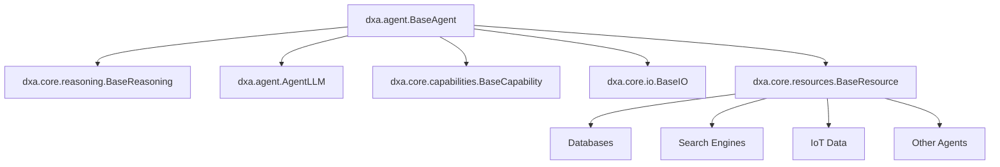

# DXA - Domain-Expert Agent

DXA is a framework for building and deploying intelligent agents powered by Large Language Models (LLMs). It provides a modular, extensible architecture for creating agents that can reason, interact, and leverage various resources.

## Architecture Overview

An Agent in DXA is composed of two primary components:
- A Reasoning control loop that manages the agent's decision-making process
- An LLM (Large Language Model) that provides the cognitive capabilities



## Core Components

DXA follows a modular design where each component serves a specific purpose in the agent's functionality. The core components work together to create a flexible and powerful agent system:

### Reasoning (`dxa.core.reasoning`)
The reasoning system is the agent's "brain," coordinating decision-making and actions:
- Planning systems: For creating and executing multi-step plans
- Goal management: For tracking and prioritizing objectives
- Task execution: For carrying out specific actions
- Decision trees: For structured decision-making processes

### Agents (`dxa.agent`)
The agent module now includes several specialized agent types:
- `BaseAgent`: The foundation for all agent types
- `AutonomousAgent`: For agents that operate independently
- `CollaborativeAgent`: For multi-agent systems where agents work together
- `InteractiveAgent`: For direct human interaction with real-time conversation capabilities
- `WebSocketAgent`: For web-based communication, enabling remote agent interactions
- `AutomationAgent`: Specialized for workflow automation tasks

Additional components in the `dxa.agent` module:
- `AgentLLM`: Internal LLM implementation for agents
- `AgentProgress`: For reporting task progress
- `AgentConfig` and `LLMConfig`: For configuration management
- `StateManager`: Manages agent state, observations, and messages

### Capabilities (`dxa.core.capabilities`)
Capabilities are modular features that can be added to any agent to extend its functionality:
- Memory management: Handles storage and retrieval of agent experiences and knowledge
- Expertise domains: Defines areas of specialized knowledge and skills
- Core reasoning abilities: Provides basic cognitive functions like planning and decision-making
- Custom capability extensions: Allows for adding new specialized abilities

### I/O (`dxa.core.io`)
I/O handlers manage all communication between the agent and its environment:
- Text-based interfaces: For command-line and chat interactions
- API endpoints: For web service integration
- File system operations: For reading and writing files
- Custom I/O handlers: For specialized communication needs

### Resources (`dxa.core.resources`)
Resources provide access to external tools and services:
- Database connections: For persistent storage
- Search engine integrations: For accessing external knowledge
- IoT device interfaces: For interacting with physical devices
- Inter-agent communication: For coordinating with other agents

## Examples

The `examples/` directory now includes several implementations demonstrating various use cases:

1. `collaborative_research.py`: Demonstrates multi-agent collaboration for research tasks
2. `websocket_solver.py`: Shows how to create a WebSocket-based problem-solving agent
3. `interactive_math.py`: Implements an interactive math tutor agent
4. `automation_web.py`: Showcases web scraping automation using an agent

These examples cover a range of agent types and scenarios:

- Collaborative problem-solving
- Network-based agent communication
- Interactive console-based agents
- Workflow automation

We encourage you to explore these examples to better understand the full potential of the DXA framework.

## Getting Started

The simplest way to create an agent is to use one of the pre-built agent classes:

```python
from dxa.agent import InteractiveAgent

agent = InteractiveAgent()
agent.run()
```

## Advanced Usage

For custom agent behaviors, you can use the factory pattern:

```python
from dxa.core.factory import create_agent

custom_agent = create_agent(
    agent_type="websocket",
    config={
        "name": "custom_agent",
        "llm_config": {...},
        "reasoning_config": {...},
        "resources_config": {...}
    }
)
```

## Module Structure

```
dxa/
├── agent/
│   ├── __init__.py
│   ├── base_agent.py
│   ├── autonomous_agent.py
│   ├── collaborative_agent.py
│   ├── interactive_agent.py
│   ├── websocket_agent.py
│   ├── automation_agent.py
│   ├── agent_llm.py
│   ├── progress.py
│   ├── config.py
│   └── state.py
├── core/
│   ├── capabilities/
│   ├── io/
│   ├── reasoning/
│   └── resources/
└── examples/
    ├── __init__.py
    ├── collaborative_research.py
    ├── websocket_solver.py
    ├── interactive_math.py
    └── automation_web.py
```

## Contributing

DXA is proprietary software developed by Aitomatic, Inc. Contributions are limited to authorized Aitomatic employees and contractors. If you're an authorized contributor:

1. Please ensure you have signed the necessary Confidentiality and IP agreements
2. Follow the internal development guidelines
3. Submit your changes through the company's approved development workflow
4. Contact the project maintainers for access to the [Contributing Guide]

For external users or organizations interested in collaborating with Aitomatic on DXA development, please contact our business development team.

## License

This software is proprietary and confidential. Copyright © 2024 Aitomatic, Inc. All rights reserved.

Unauthorized copying, transfer, or reproduction of this software, via any medium, is strictly prohibited. This software is protected by copyright law and international treaties.