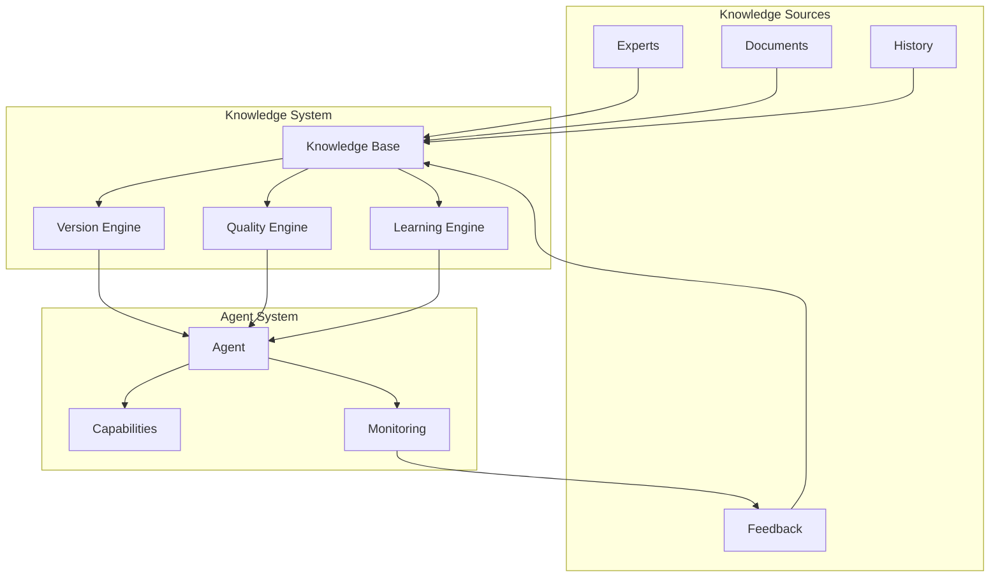

# Memory and Knowledge in OpenDXA

## Overview

The memory and knowledge systems in OpenDXA enable agents to access, utilize, store, and evolve information and domain expertise. The system is designed to handle both short-term context and long-term structured/unstructured knowledge, making it suitable for enterprise applications.

## Core Concepts

### 1. Knowledge Types
- Technical Knowledge
  - Data processing capabilities
  - Language understanding
  - Pattern recognition
  - Analysis techniques
- Domain Knowledge
  - Industry-specific expertise
  - Process knowledge
  - Best practices
  - Historical data

### 2. Knowledge Operations
- Knowledge storage
- Knowledge retrieval
- Knowledge validation
- Knowledge evolution
- Knowledge sharing

## Architecture



## Implementation

### 1. Knowledge Base Integration
```python
from opendxa.knowledge import KnowledgeBase
from opendxa.domain import DomainExpert

# Initialize knowledge base
kb = KnowledgeBase()
kb.load_domain_knowledge("semiconductor")

# Create domain expert
expert = DomainExpert(
    knowledge_base=kb,
    domain="semiconductor",
    expertise_level="advanced"
)
```

### 2. Knowledge Access
```python
# Query knowledge base
result = kb.query("semiconductor process control")

# Use in execution
agent.execute(
    objective="Analyze process data",
    knowledge_context=result
)
```

### 3. Knowledge Evolution
```python
# Add new knowledge
kb.add_knowledge(
    domain="semiconductor",
    content=new_knowledge,
    source="expert_review"
)

# Update existing knowledge
kb.update_knowledge(
    id="process_control_001",
    updates=updates,
    reason="new_optimization"
)
```

## Key Differentiators

1. **Structured Knowledge Management**
   - Clear organization
   - Version control
   - Quality tracking
   - Evolution support

2. **Domain Expertise Integration**
   - Expert knowledge
   - Process definitions
   - Validation rules
   - Quality metrics

3. **Continuous Learning**
   - Feedback integration
   - Performance tracking
   - Quality improvement
   - Knowledge evolution

## Best Practices

1. **Knowledge Organization**
   - Clear structure
   - Proper categorization
   - Version control
   - Access management

2. **Knowledge Quality**
   - Validation
   - Verification
   - Regular updates
   - Quality metrics

3. **Knowledge Evolution**
   - Learning mechanisms
   - Feedback loops
   - Performance tracking
   - Continuous improvement

## Common Patterns

1. **Knowledge Access**
   ```python
   # Query knowledge base
   result = kb.query("semiconductor process control")
   
   # Use in execution
   agent.execute(
       objective="Analyze process data",
       knowledge_context=result
   )
   ```

2. **Knowledge Update**
   ```python
   # Add new knowledge
   kb.add_knowledge(
       domain="semiconductor",
       content=new_knowledge,
       source="expert_review"
   )
   
   # Update existing knowledge
   kb.update_knowledge(
       id="process_control_001",
       updates=updates,
       reason="new_optimization"
   )
   ```

3. **Knowledge Evolution**
   ```python
   # Track changes
   history = kb.get_history("process_control_001")
   
   # Analyze evolution
   analysis = kb.analyze_evolution(
       domain="semiconductor",
       timeframe="last_month"
   )
   ```

## Knowledge Examples

1. **Technical Knowledge**
   - Data processing
   - Analysis techniques
   - Pattern recognition
   - Language understanding

2. **Domain Knowledge**
   - Industry expertise
   - Process knowledge
   - Best practices
   - Historical data

3. **Expert Knowledge**
   - Expert insights
   - Process optimization
   - Quality control
   - Troubleshooting

## Next Steps

- Learn about [Agents](../core-concepts/agent.md)
- Understand [Execution Flow](../core-concepts/execution-flow.md)

---
<p align="center">
Copyright © 2024 Aitomatic, Inc. Licensed under the [MIT License](../../LICENSE.md).
<br/>
<a href="https://aitomatic.com">https://aitomatic.com</a>
</p> 