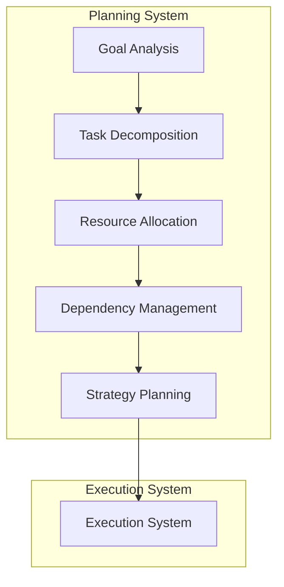

<!-- markdownlint-disable MD041 -->
<!-- markdownlint-disable MD033 -->
<p align="center">
  
</p>

[Project Overview](../../README.md)


# Planning in OpenDXA

## Overview

Planning in OpenDXA enables agents to decompose complex objectives into manageable tasks, allocate resources effectively, and manage dependencies between tasks. The planning system combines strategic thinking with tactical execution to achieve goals efficiently.

## Core Concepts

### 1. Planning Components
- Task Decomposition
  - Goal analysis
  - Task breakdown
  - Dependency mapping
  - Resource allocation
- Strategy Development
  - Approach selection
  - Risk assessment
  - Contingency planning
  - Optimization criteria
- Execution Planning
  - Task sequencing
  - Resource scheduling
  - Timeline management
  - Progress tracking

### 2. Planning Operations
- Goal analysis
- Task decomposition
- Resource allocation
- Dependency management
- Strategy selection

## Architecture



## Implementation

### 1. Basic Planning
```python
from opendxa.planning import Planner
from opendxa.execution import Workflow

# Initialize planner
planner = Planner()

# Create workflow
workflow = Workflow(objective="Analyze data")

# Plan tasks
tasks = planner.plan(
    objective="Analyze data",
    context=context,
    resources=available_resources
)

# Add tasks to workflow
for task in tasks:
    workflow.add_task(task)
```

### 2. Resource Allocation
```python
from opendxa.planning import ResourcePlanner

# Initialize resource planner
resource_planner = ResourcePlanner()

# Allocate resources
allocation = resource_planner.allocate(
    tasks=tasks,
    resources=available_resources,
    constraints=constraints
)

# Apply allocation
workflow.apply_allocation(allocation)
```

### 3. Dependency Management
```python
from opendxa.planning import DependencyManager

# Initialize dependency manager
dependency_manager = DependencyManager()

# Analyze dependencies
dependencies = dependency_manager.analyze(tasks)

# Apply dependencies
workflow.apply_dependencies(dependencies)
```

## Key Differentiators

1. **Strategic Planning**
   - Goal-oriented decomposition
   - Resource optimization
   - Risk management
   - Adaptive planning

2. **Tactical Execution**
   - Task sequencing
   - Resource scheduling
   - Progress tracking
   - Error handling

3. **Flexible Adaptation**
   - Dynamic replanning
   - Resource reallocation
   - Strategy adjustment
   - Recovery planning

## Best Practices

1. **Goal Analysis**
   - Clear objectives
   - Measurable outcomes
   - Realistic expectations
   - Proper scoping

2. **Task Decomposition**
   - Logical breakdown
   - Clear dependencies
   - Proper granularity
   - Resource alignment

3. **Resource Management**
   - Efficient allocation
   - Proper scheduling
   - Contingency planning
   - Performance monitoring

## Common Patterns

1. **Basic Planning**
   ```python
   # Initialize planner
   planner = Planner()
   
   # Plan tasks
   tasks = planner.plan(
       objective="Process data",
       context=context
   )
   
   # Create workflow
   workflow = Workflow(objective="Process data")
   workflow.add_tasks(tasks)
   ```

2. **Resource Allocation**
   ```python
   # Allocate resources
   allocation = resource_planner.allocate(
       tasks=tasks,
       resources=resources
   )
   
   # Apply allocation
   workflow.apply_allocation(allocation)
   ```

3. **Dependency Management**
   ```python
   # Analyze dependencies
   dependencies = dependency_manager.analyze(tasks)
   
   # Apply dependencies
   workflow.apply_dependencies(dependencies)
   
   # Validate workflow
   workflow.validate()
   ```

## Planning Examples

1. **Data Analysis**
   - Data gathering
   - Processing steps
   - Analysis tasks
   - Result generation

2. **Process Automation**
   - Task breakdown
   - Resource allocation
   - Dependency mapping
   - Execution planning

3. **Decision Making**
   - Option analysis
   - Risk assessment
   - Strategy selection
   - Implementation planning

## Next Steps

- Learn about [Reasoning](./reasoning.md)
- Understand [Execution Flow](../core-concepts/execution-flow.md)

---
<p align="center">
Copyright © 2025 Aitomatic, Inc. Licensed under the <a href="../../LICENSE.md">MIT License</a>.
<br/>
<a href="https://aitomatic.com">https://aitomatic.com</a>
</p>
