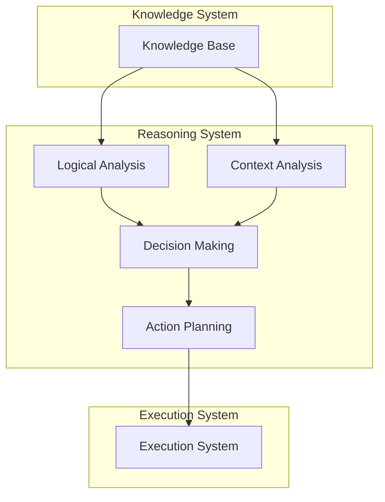

<!-- markdownlint-disable MD041 -->
<!-- markdownlint-disable MD033 -->
<p align="center">
  
</p>

[Project Overview](../../README.md)


# Reasoning in OpenDXA

## Overview

Reasoning in OpenDXA enables agents to analyze situations, make decisions, and solve problems using available knowledge and context. The reasoning system combines logical analysis with domain expertise to support effective decision-making.

## Core Concepts

### 1. Reasoning Components
- Logical Analysis
  - Pattern recognition
  - Rule application
  - Inference making
  - Conclusion drawing
- Context Analysis
  - Situation assessment
  - Constraint evaluation
  - Option generation
  - Impact analysis
- Decision Making
  - Option evaluation
  - Risk assessment
  - Trade-off analysis
  - Action selection

### 2. Reasoning Operations
- Situation analysis
- Knowledge application
- Option generation
- Decision making
- Action planning

## Architecture



## Implementation

### 1. Basic Reasoning
```python
from opendxa.reasoning import Reasoner
from opendxa.knowledge import KnowledgeBase

# Initialize reasoner
reasoner = Reasoner()

# Create knowledge base
kb = KnowledgeBase()
kb.load_domain_knowledge("semiconductor")

# Analyze situation
analysis = reasoner.analyze(
    situation=current_situation,
    knowledge_base=kb,
    context=context
)
```

### 2. Decision Making
```python
from opendxa.reasoning import DecisionMaker

# Initialize decision maker
decision_maker = DecisionMaker()

# Generate options
options = decision_maker.generate_options(
    analysis=analysis,
    constraints=constraints
)

# Make decision
decision = decision_maker.decide(
    options=options,
    criteria=decision_criteria
)
```

### 3. Action Planning
```python
from opendxa.reasoning import ActionPlanner

# Initialize action planner
action_planner = ActionPlanner()

# Plan actions
actions = action_planner.plan(
    decision=decision,
    context=context,
    resources=resources
)
```

## Key Differentiators

1. **Logical Reasoning**
   - Pattern recognition
   - Rule application
   - Inference making
   - Conclusion drawing

2. **Contextual Analysis**
   - Situation assessment
   - Constraint evaluation
   - Option generation
   - Impact analysis

3. **Decision Support**
   - Option evaluation
   - Risk assessment
   - Trade-off analysis
   - Action selection

## Best Practices

1. **Situation Analysis**
   - Clear understanding
   - Context awareness
   - Constraint identification
   - Impact assessment

2. **Knowledge Application**
   - Relevant knowledge
   - Proper context
   - Accurate application
   - Validation

3. **Decision Making**
   - Clear criteria
   - Thorough analysis
   - Risk consideration
   - Action planning

## Common Patterns

1. **Basic Reasoning**
   ```python
   # Initialize reasoner
   reasoner = Reasoner()
   
   # Analyze situation
   analysis = reasoner.analyze(
       situation=situation,
       knowledge_base=kb
   )
   
   # Generate options
   options = decision_maker.generate_options(analysis)
   ```

2. **Decision Making**
   ```python
   # Evaluate options
   evaluations = decision_maker.evaluate(
       options=options,
       criteria=criteria
   )
   
   # Make decision
   decision = decision_maker.decide(evaluations)
   ```

3. **Action Planning**
   ```python
   # Plan actions
   actions = action_planner.plan(
       decision=decision,
       context=context
   )
   
   # Validate plan
   plan = action_planner.validate(actions)
   ```

## Reasoning Examples

1. **Problem Solving**
   - Situation analysis
   - Option generation
   - Decision making
   - Action planning

2. **Risk Assessment**
   - Risk identification
   - Impact analysis
   - Mitigation planning
   - Action selection

3. **Process Optimization**
   - Current state analysis
   - Improvement options
   - Impact evaluation
   - Implementation planning

## Next Steps

- Learn about [Planning](./planning.md)
- Understand [Execution Flow](../core-concepts/execution-flow.md)

---
<p align="center">
Copyright © 2025 Aitomatic, Inc. Licensed under the <a href="../../LICENSE.md">MIT License</a>.
<br/>
<a href="https://aitomatic.com">https://aitomatic.com</a>
</p>
