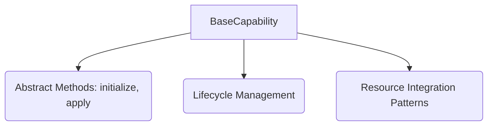

<p align="center">
  
</p>

[Project Overview](../../README.md) | [Main Documentation](../README.md)

# OpenDXA Capability System Concepts

The Capability System defines *what* an agent can do at a higher cognitive level. Capabilities bridge the gap between an agent's core logic (Planning, Reasoning) and its available Resources.

This document focuses on the **Base Capability Framework** (`opendxa.base.capability`), which provides the foundational interfaces and abstractions. Specific, concrete capability implementations (like `MemoryCapability`, `KnowledgeCapability`) are often found in `opendxa.agent.capability`.

## Overview

The Base Capability framework provides:

*   **Core Interface (`BaseCapability`):** An abstract base class defining the standard methods all capabilities must implement.
*   **Standardized Lifecycle:** Defines expected stages like initialization, application (execution), and cleanup.
*   **Resource Integration Patterns:** Shows how capabilities typically access and manage needed resources.



## Key Components

### 1. `BaseCapability` Class

This abstract class is the cornerstone. Any class representing an agent capability should inherit from it and implement its core methods:

```python
from typing import Dict, Any
# Assuming Context and Result types are defined elsewhere

class BaseCapability:
    """Base class for all capabilities in OpenDXA."""

    # Often includes mixins like Loggable, Configurable, Identifiable
    # ...

    async def initialize(self, config: Dict[str, Any]) -> None:
        """Initialize the capability with configuration.

        This method is called to set up the capability, often involving
        loading configuration, initializing required resources, and setting up internal state.

        Args:
            config: Configuration dictionary for the capability.
        """
        raise NotImplementedError

    async def apply(self, context: Context) -> Result:
        """Apply the capability's logic within the given context.

        This is the main execution method where the capability performs its function,
        potentially using resources accessed via the context.

        Args:
            context: Execution context providing access to state, resources, etc.

        Returns:
            Result object indicating the outcome of applying the capability.
        """
        raise NotImplementedError

    async def cleanup(self) -> None:
        """Clean up resources used by the capability."""
        # Optional: Default implementation might do nothing
        pass
```

### 2. Capability Lifecycle

The typical lifecycle involves:

1.  **Initialization (`initialize`):** Load configuration, acquire/initialize necessary resources, set up internal state.
2.  **Application (`apply`):** Execute the core logic using the provided context (which gives access to resources and state).
3.  **Cleanup (`cleanup`):** Release resources, clean up state (optional, often handled by agent lifecycle).

### 3. Resource Integration Pattern

Capabilities often need access to one or more [Resources](resource_system.md). A common pattern is to initialize required resources during the capability's `initialize` phase based on configuration.

```python
class ResourceAwareCapability(BaseCapability):
    """Capability that requires specific resources."""

    def __init__(self):
        self.resources: Dict[str, BaseResource] = {}
        # ... other initializations

    async def initialize(self, config):
        # Example: Initialize required resources based on config
        resource_configs = config.get("resources", {})
        for resource_name, res_config in resource_configs.items():
            # Assume _initialize_resource looks up and initializes
            # the resource instance (e.g., using a factory or direct instantiation)
            self.resources[resource_name] = await self._initialize_resource(
                resource_name,
                res_config
            )
        # ... other initialization

    async def apply(self, context):
        # Access initialized resources during application
        llm = self.resources.get("llm")
        if llm:
            response = await llm.query("...")
        # ... capability logic ...

    async def _initialize_resource(self, name: str, config: Dict) -> BaseResource:
        # Placeholder for actual resource initialization logic
        print(f"Initializing resource {name} with config {config}")
        # Replace with actual resource factory or instantiation
        # Example: return await ResourceFactory.create(config)
        pass
```

## Usage Guide

### Creating a Basic Capability

```python
from opendxa.base.capability import BaseCapability

class MySimpleCapability(BaseCapability):
    async def initialize(self, config):
        print(f"Initializing MySimpleCapability with config: {config}")
        self.greeting = config.get("greeting", "Hello")

    async def apply(self, context):
        target = context.get_state("target_name", "world") # Example state access
        result_message = f"{self.greeting}, {target}!"
        print(f"Applying MySimpleCapability: {result_message}")
        # Assuming Result is a simple dict or dataclass
        return {"success": True, "message": result_message}
```

### Extending Base Capability

Subclass `BaseCapability` and implement the abstract methods.

```python
class SpecializedCapability(MySimpleCapability): # Inherits from another capability
    async def initialize(self, config):
        await super().initialize(config)
        # Add specialized initialization
        self.special_sauce = config.get("special_sauce", "extra flavor")

    async def apply(self, context):
        base_result = await super().apply(context)
        # Add specialized processing
        base_result["message"] += f" with {self.special_sauce}"
        base_result["special"] = True
        return base_result
```

## Best Practices

1.  **Interface Compliance:** Faithfully implement `initialize` and `apply`.
2.  **Resource Management:** Initialize needed resources in `initialize`, handle potential errors, and consider cleanup if resources aren't managed externally.
3.  **State Interaction:** Access and modify state through the provided `context`, using the `StateManager` patterns (see [State Management Concepts](state_management.md)).
4.  **Clear Errors:** Raise specific and informative exceptions on failure.
5.  **Modularity:** Design capabilities to be focused and reusable.

---
<p align="center">
Copyright © 2024 Aitomatic, Inc. Licensed under the [MIT License](../../LICENSE.md).
<br/>
<a href="https://aitomatic.com">https://aitomatic.com</a>
</p> 