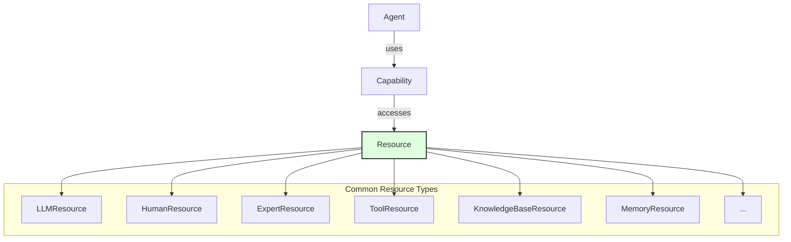

<p align="center">
  
</p>

[Project Overview](../../README.md) | [Main Documentation](../README.md)

# OpenDXA Resource System Concepts

The Resource System provides the foundational building blocks for DXA agents, representing the concrete tools, services, data sources, and interfaces that agents can utilize. While [Capabilities](capability_system.md) define *how* agents think or perform high-level functions, Resources define *what* external or internal functionalities they can access and interact with.

The system manages everything from LLM interactions (`LLMResource`) to human-in-the-loop operations (`HumanResource`) and external tool calls (`ToolResource`), providing a consistent interface (`BaseResource`) for all external interactions.

## Design Philosophy

> Simple things should be easy, complex things should be possible.

This principle guides the resource system design:

*   **Consistent Interface:** All resources inherit from `BaseResource` and ideally implement `initialize`, `query`, and potentially `can_handle` methods.
*   **Composable:** Agents can be configured with multiple resources.
*   **Extensible:** New resource types can be created by inheriting from `BaseResource`.
*   **Discoverable (MCP):** Resources can optionally implement the Model Context Protocol (MCP) for standardized tool discovery and interaction.

## Architecture

Resources are typically accessed by Capabilities within an Agent's execution flow.



## Base Resource Structure

All resources should ideally inherit from `BaseResource`:

```python
class BaseResource:
    """Base class for all resources."""

    # Mixins like Identifiable, Loggable, Configurable are often included
    # ... (mixin initializers)

    async def initialize(self) -> None:
        """Set up the resource (e.g., connect to DB, load model)."""
        # Default implementation might do nothing
        pass

    async def query(self, request: Dict[str, Any]) -> Dict[str, Any]:
        """Perform the primary action of the resource."""
        raise NotImplementedError

    def can_handle(self, request: Dict[str, Any]) -> bool:
        """Check if this resource can handle the given request (optional)."""
        # Default might be True or raise NotImplementedError
        return True

    async def cleanup(self) -> None:
        """Clean up resource (e.g., close connections)."""
        # Default implementation might do nothing
        pass
```

## Common Resource Examples

### LLMResource
Interacts with Large Language Models.

```python
class LLMResource(BaseResource):
    # ... (initialization with model name, API keys etc.)

    async def query(self, request: Dict[str, Any]) -> Dict[str, Any]:
        """Send query to the configured LLM."""
        # Simplified example
        prompt = request.get("prompt", "")
        system_prompt = request.get("system_prompt")
        messages = []
        if system_prompt: messages.append({"role": "system", "content": system_prompt})
        if prompt: messages.append({"role": "user", "content": prompt})

        # Assume self._client is an initialized LLM client (e.g., OpenAI, Anthropic)
        response = await self._client.chat.completions.create(
            model=self.model,
            messages=messages,
            # ... other parameters
        )

        return {
            "content": response.choices[0].message.content,
            "model": self.model,
            # ... other response data
        }
```

### HumanResource
Facilitates interaction with a human user.

```python
class HumanResource(BaseResource):
    # ... (initialization with user info, communication channel)

    async def query(self, request: Dict[str, Any]) -> Dict[str, Any]:
        """Prompt the human user for input."""
        prompt = request.get("prompt", "Please provide input:")
        # Logic to display prompt and get input (e.g., via console, web UI)
        user_input = await self._get_human_input(prompt)
        return {"response": user_input}
```

### ExpertResource
Often combines an LLM with specific domain knowledge or context.

```python
class ExpertResource(BaseResource):
    # ... (initialization with expertise config, LLM resource)

    async def query(self, request: Dict[str, Any]) -> Dict[str, Any]:
        """Query using domain expertise context."""
        if not self.can_handle(request):
             raise ValueError("Request cannot be handled")

        # Enhance request with domain knowledge/context
        enhanced_request = self._enhance_with_expertise(request)

        # Process through internal LLM resource
        response = await self.llm_resource.query(enhanced_request)
        response["expertise_applied"] = True
        return response
```

### ToolResource
Interacts with external tools or APIs, often using MCP.
*(See specific documentation for ToolResource and MCP for details)*

## Resource Integration & MCP

The resource system provides a standardized way to integrate external tools and services, potentially using the **Model Context Protocol (MCP)** for advanced features:

1.  **Standardized Interface:** Consistent API via `BaseResource`.
2.  **Transport Types:** Support for different communication methods (STDIO, HTTP, etc.) for tools.
3.  **Tool Discovery (MCP):** Runtime discovery of tools and their schemas.
4.  **Error Handling:** Consistent patterns for handling resource failures.

## Usage Guide

Resources are typically configured and added to an agent, then accessed via capabilities during execution.

```python
# Configure agent with various resources
agent = Agent("assistant") \
    .with_resources({
        "gpt4": LLMResource(name="gpt4", config={"model": "openai:gpt-4"}),
        "user": HumanResource(name="user"),
        "domain_expert": ExpertResource(name="domain_expert", config={...}),
        "calculator": ToolResource(name="calculator", config={...})
    })

# Inside a capability or execution step:
# Assuming context provides access to agent resources
llm_resource = await context.get_resource("gpt4")
response = await llm_resource.query({"prompt": "Explain quantum computing"})

user_resource = await context.get_resource("user")
feedback = await user_resource.query({"prompt": "Review draft", "content": response["content"]})
```

## Best Practices

1.  **Resource Management Lifecycle:** Ensure resources are properly initialized (`initialize`) before use and cleaned up (`cleanup`) afterwards, often managed by the agent's lifecycle.
2.  **Explicit Initialization:** Call `initialize` explicitly if not relying on agent lifecycle management.
3.  **Error Handling:** Implement robust error handling (retries, fallbacks) within resource usage.
4.  **Configuration:** Use the `Configurable` mixin for standardized configuration loading.
5.  **Logging:** Use the `Loggable` mixin for standardized logging.
6.  **Performance:** Consider async operations, caching (if applicable), and resource pooling for performance-critical resources.

---
<p align="center">
Copyright © 2024 Aitomatic, Inc. Licensed under the <a href="../../LICENSE.md">MIT License</a>.
<br/>
<a href="https://aitomatic.com">https://aitomatic.com</a>
</p> 