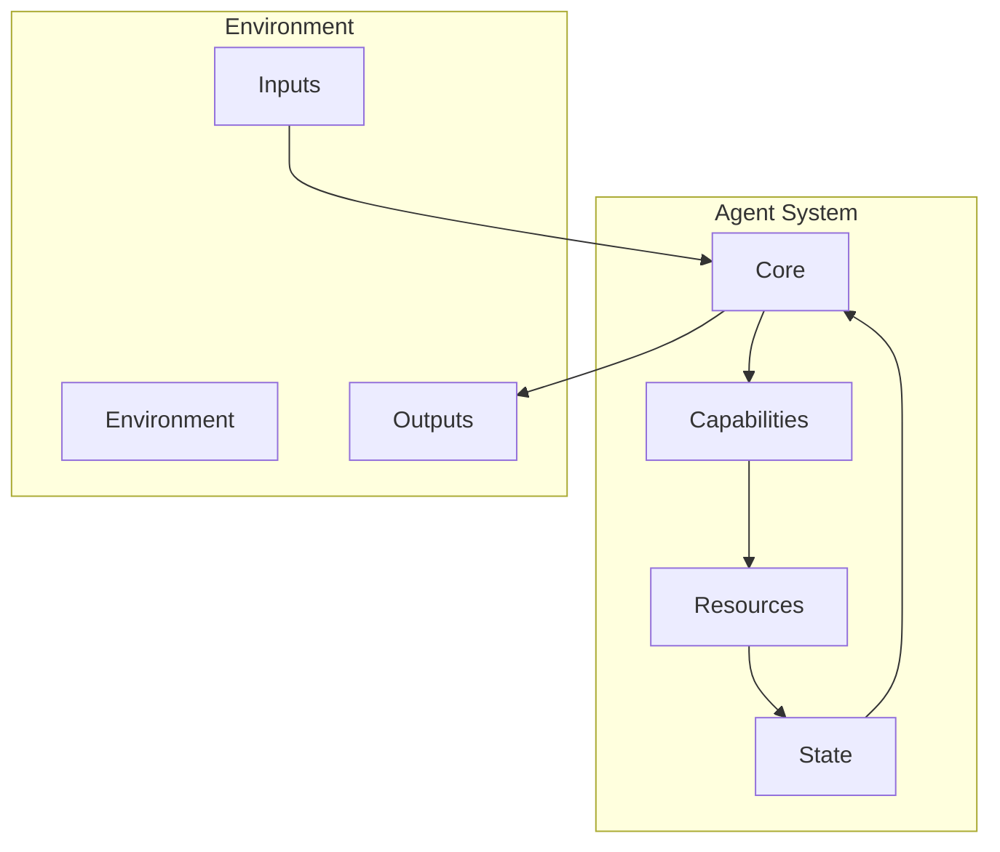

# Agents in OpenDXA

## Overview

Agents in OpenDXA are autonomous entities that can perceive their environment, make decisions, and take actions to achieve specific goals. They combine capabilities, knowledge, and resources to perform complex tasks effectively.

## Core Concepts

### 1. Agent Components
- Core System
  - Perception
  - Decision making
  - Action execution
  - [State management](./state-management.md)
- Capabilities
  - Memory
  - Planning
  - Reasoning
  - Learning
- Resources
  - Tools
  - Knowledge
  - Data
  - Services

### 2. Agent Operations
- Environment perception
- [State management](./state-management.md)
- Decision making
- Action execution
- [Learning and adaptation](../cognitive-functions/learning.md)

## Architecture



## Implementation

### 1. Basic Agent
```python
from opendxa.agent import Agent
from opendxa.capability import MemoryCapability

# Create agent
agent = Agent()

# Add capability
memory = MemoryCapability()
agent.add_capability(memory)

# Initialize
await agent.initialize(config)

# Execute
result = await agent.execute(
    objective="Analyze data",
    context=context
)
```

### 2. Resource Integration
```python
from opendxa.resources import LLMResource, ToolResource

# Add resources
agent.add_resource(LLMResource())
agent.add_resource(ToolResource())

# Use resources
result = await agent.use_resource(
    resource="llm",
    operation="query",
    params={"prompt": "Analyze data"}
)
```

### 3. State Management
```python
# Set state
agent.set_state("analysis.status", "in_progress")

# Get state
status = agent.get_state("analysis.status")

# Update state
agent.update_state("analysis.result", result)
```
*See [State Management](./state-management.md) for more details on ExecutionContext.*

## Key Differentiators

1. **Autonomous Operation**
   - Independent decision making
   - Self-directed action
   - Adaptive behavior
   - Continuous learning

2. **Capability Integration**
   - Multiple capabilities
   - Shared resources
   - Coordinated execution
   - State management

3. **Resource Management**
   - Efficient allocation
   - Proper cleanup
   - Error recovery
   - Performance monitoring

## Best Practices

1. **Agent Design**
   - Clear purpose
   - Proper capabilities
   - Resource management
   - State handling

2. **Capability Usage**
   - Appropriate selection
   - Efficient combination
   - Error handling
   - Performance monitoring

3. **Resource Management**
   - Proper allocation
   - Efficient usage
   - Cleanup
   - Error recovery

## Common Patterns

1. **Basic Agent**
   ```python
   # Create agent
   agent = Agent()
   
   # Add capabilities
   agent.add_capability(MemoryCapability())
   agent.add_capability(PlanningCapability())
   
   # Initialize
   await agent.initialize(config)
   
   # Execute
   result = await agent.execute(objective, context)
   ```

2. **Resource Usage**
   ```python
   # Add resources
   agent.add_resource(LLMResource())
   agent.add_resource(ToolResource())
   
   # Use resources
   result = await agent.use_resource(
       resource="llm",
       operation="query",
       params=params
   )
   ```

3. **State Management**
   ```python
   # Set state
   agent.set_state("task.status", "in_progress")
   
   # Get state
   status = agent.get_state("task.status")
   
   # Update state
   agent.update_state("task.result", result)
   ```

## Agent Examples

1. **Data Analysis Agent**
   - Data gathering
   - Analysis execution
   - Result generation
   - Report creation

2. **Process Automation Agent**
   - Task execution
   - Resource management
   - Error handling
   - Progress tracking

3. **Decision Support Agent**
   - Situation analysis
   - Option generation
   - Decision making
   - Action planning

## Next Steps

- Learn about [Capabilities](./capabilities.md)
- Understand [Resources](./resources.md)

---
<p align="center">
Copyright © 2024 Aitomatic, Inc. Licensed under the [MIT License](../../LICENSE.md).
<br/>
<a href="https://aitomatic.com">https://aitomatic.com</a>
</p>