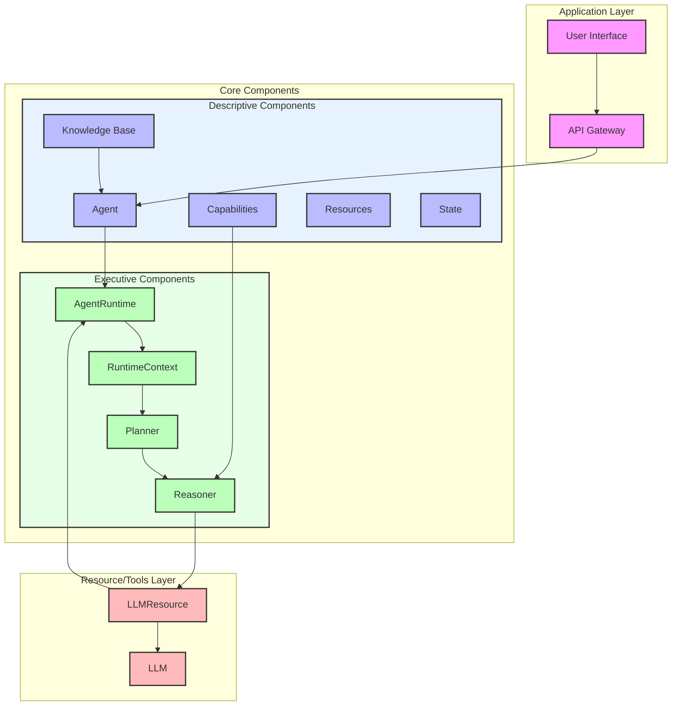
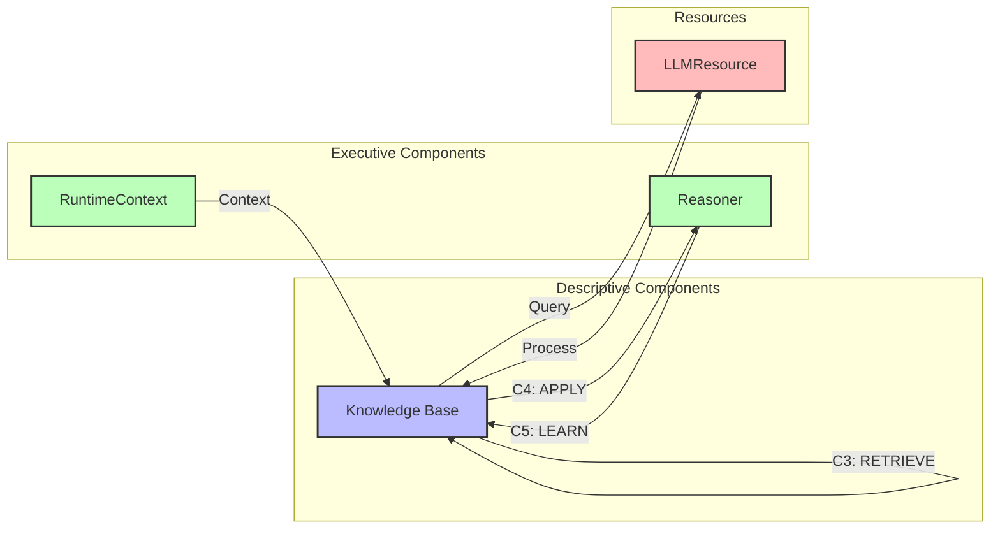

<!-- markdownlint-disable MD041 -->
<!-- markdownlint-disable MD033 -->
<p align="center">
  
</p>

[Project Overview](../../README.md)

# OpenDXA Architecture

## Overview

OpenDXA is built on a modular, extensible architecture that enables the creation and deployment of autonomous agents. The system is designed to be flexible, scalable, and maintainable, with clear separation of concerns and well-defined interfaces between components.

## Core Components

| Descriptive Components | Executive Components |
|----------------------|---------------------|
| **Agent**<br>- Autonomous entity<br>- Capability integration<br>- Resource management | **AgentRuntime**<br>- Plan execution<br>- RuntimeContext management<br>- Resource coordination |
| **Knowledge**<br>- Information storage<br>- Data persistence<br>- Context sharing<br>- CORAL lifecycle | **RuntimeContext**<br>- State management<br>- Execution tracking<br>- State container coordination |
| **Capabilities**<br>- Core functionalities<br>- Extensible modules<br>- Shared services | **Planner**<br>- Plan creation<br>- Node management<br>- Execution flow control |
| **Resources**<br>- Tools and utilities<br>- Knowledge bases<br>- External services | **Reasoner**<br>- Node execution<br>- Signal processing<br>- State updates |
| **State**<br>- Agent state<br>- World state<br>- Execution state | **LLMResource**<br>- LLM communication<br>- Model configuration<br>- Response handling |

### CORAL: Domain Knowledge Lifecycle

OpenDXA's key differentiator is its emphasis on domain knowledge management through the CORAL lifecycle:

1. **CAPTURE**
   - Knowledge acquisition from various sources
   - Initial processing and validation
   - Integration with existing knowledge base

2. **ORGANIZE**
   - Structured storage and categorization
   - Relationship mapping and context linking
   - Metadata management and tagging

3. **RETRIEVE**
   - Context-aware knowledge access
   - Semantic search and relevance ranking
   - Dynamic query optimization

4. **APPLY**
   - Contextual knowledge application
   - Decision support and reasoning
   - Action planning and execution

5. **LEARN**
   - Feedback integration
   - Knowledge refinement
   - Continuous improvement

This lifecycle is implemented through the interaction of various components:
- Knowledge Base for storage and retrieval
- LLMResource for processing and understanding
- Capabilities for specialized knowledge operations
- RuntimeContext for application context
- State for tracking knowledge evolution

## System Architecture



### CORAL: Domain Knowledge Lifecycle

OpenDXA's key differentiator is its emphasis on domain knowledge management through the CORAL lifecycle:

1. **CAPTURE**
   - Knowledge acquisition from various sources
   - Initial processing and validation
   - Integration with existing knowledge base

2. **ORGANIZE**
   - Structured storage and categorization
   - Relationship mapping and context linking
   - Metadata management and tagging

3. **RETRIEVE**
   - Context-aware knowledge access
   - Semantic search and relevance ranking
   - Dynamic query optimization

4. **APPLY**
   - Contextual knowledge application
   - Decision support and reasoning
   - Action planning and execution

5. **LEARN**
   - Feedback integration
   - Knowledge refinement
   - Continuous improvement



## Component Interactions

### 1. Request Flow
1. User request received through API
2. Agent instance created/selected
3. AgentRuntime initialized with RuntimeContext
4. Planner creates execution plan
5. Reasoner executes plan steps
6. LLMResource handles LLM communication
7. Results returned through API

### 2. Agent Initialization
```python
from opendxa.agent import Agent
from opendxa.config import AgentConfig
from opendxa.base.resource import LLMResource

# Create agent with configuration
agent = Agent(name="researcher")
agent_config = AgentConfig(
    model="gpt-4",
    max_tokens=2000,
    temperature=0.7
)

# Configure LLM resource
llm_resource = LLMResource(
    name="agent_llm",
    config={"model": "gpt-4"}
)

# Initialize agent with LLM and capabilities
agent = agent.with_llm(llm_resource)
agent = agent.with_capabilities({
    "memory": MemoryCapability(),
    "planning": PlanningCapability()
})
```

### 3. Plan Execution
```python
from opendxa.execution import Plan, PlanFactory
from opendxa.base.execution import RuntimeContext
from opendxa.base.state import AgentState, WorldState, ExecutionState

# Create execution plan
plan = PlanFactory.create_basic_plan(
    objective="Analyze customer feedback",
    capabilities=["memory", "planning"]
)

# Create runtime context
context = RuntimeContext(
    agent_state=agent.state,
    world_state=WorldState(),
    execution_state=ExecutionState()
)

# Execute plan through AgentRuntime
result = await agent.runtime.execute(plan, context)
```

## Implementation Details

### 1. Agent Runtime
```python
from opendxa.execution import AgentRuntime
from opendxa.base.execution import RuntimeContext

# AgentRuntime manages plan execution with RuntimeContext
runtime = AgentRuntime(agent)

# Create and use RuntimeContext
context = RuntimeContext(
    agent_state=agent.state,
    world_state=WorldState(),
    execution_state=ExecutionState()
)

# Execute plan with context
result = await runtime.execute(plan, context)
```

### 2. State Management
```python
from opendxa.base.state import (
    AgentState,
    WorldState,
    ExecutionState,
    StateManager
)

# Initialize state containers
agent_state = AgentState()
world_state = WorldState()
execution_state = ExecutionState()

# Create state manager
state_manager = StateManager(
    state_containers={
        'agent': agent_state,
        'world': world_state,
        'execution': execution_state
    }
)
```

### 3. LLM Communication
```python
from opendxa.base.resource import LLMResource

# Create and configure LLM resource
llm_resource = LLMResource(
    name="agent_llm",
    config={
        "model": "gpt-4",
        "max_tokens": 2000,
        "temperature": 0.7
    }
)

# Use LLM resource
response = await llm_resource.query(prompt)
```

## Best Practices

1. **Agent Configuration**
   - Use AgentConfig for consistent settings
   - Configure LLMResource appropriately
   - Manage capabilities efficiently

2. **Plan Execution**
   - Create clear objectives
   - Use appropriate capabilities
   - Handle errors gracefully

3. **State Management**
   - Maintain consistent state through RuntimeContext
   - Use appropriate state containers
   - Handle state transitions properly

## Common Patterns

1. **Agent Creation**
   ```python
   # Create and configure agent
   agent = Agent(name="task_agent")
   agent = agent.with_llm(LLMResource(config))
   agent = agent.with_capabilities(capabilities)
   ```

2. **Plan Execution**
   ```python
   # Create and execute plan
   plan = PlanFactory.create_basic_plan(objective)
   context = RuntimeContext(agent_state, world_state, execution_state)
   result = await agent.runtime.execute(plan, context)
   ```

3. **State Updates**
   ```python
   # Update and track state through RuntimeContext
   context.set('agent.objective', new_objective)
   status = context.get('execution.status')
   ```

## Next Steps

- Learn about [Agents](./agent.md)
- Understand [Capabilities](./capabilities.md)
- Explore [Resources](./resources.md)

---
<p align="center">
Copyright © 2025 Aitomatic, Inc. Licensed under the <a href="../../LICENSE.md">MIT License</a>.
<br/>
<a href="https://aitomatic.com">https://aitomatic.com</a>
</p>
