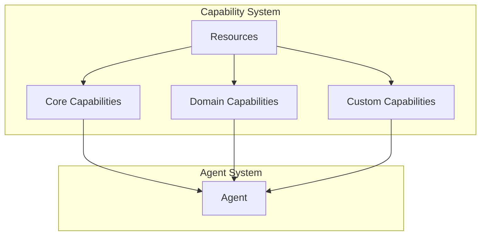

<!-- markdownlint-disable MD041 -->
<!-- markdownlint-disable MD033 -->
<p align="center">
  
</p>

[Project Overview](../../README.md)


# Capabilities in OpenDXA

## Overview

Capabilities in OpenDXA are modular components that provide specific functionality to agents. They enable agents to perform complex tasks by combining different capabilities in a flexible and reusable way.

## Core Concepts

### 1. Capability Types
- Core Capabilities
  - Memory
  - Planning
  - Reasoning
  - Learning
- Domain Capabilities
  - Data analysis
  - Process automation
  - Decision support
  - Knowledge management
- Custom Capabilities
  - User-defined
  - Domain-specific
  - Task-specific
  - Integration-specific

### 2. Capability Operations
- Initialization
- Configuration
- Execution
- State management
- Resource management

## Architecture



## Implementation

### 1. Basic Capability
```python
from opendxa.capability import BaseCapability

class CustomCapability(BaseCapability):
    def __init__(self):
        super().__init__()
        self.name = "custom"
        self.version = "1.0.0"

    async def initialize(self, config):
        await super().initialize(config)
        # Custom initialization

    async def execute(self, operation, params):
        # Custom execution logic
        return result
```

### 2. Capability Usage
```python
from opendxa.agent import Agent
from opendxa.capability import MemoryCapability

# Create agent
agent = Agent()

# Add capability
memory = MemoryCapability()
agent.add_capability(memory)

# Use capability
result = await agent.use_capability(
    capability="memory",
    operation="store",
    params={"key": "data", "value": value}
)
```

### 3. Capability Composition
```python
from opendxa.capability import CompositeCapability

# Create composite capability
composite = CompositeCapability()

# Add capabilities
composite.add_capability(MemoryCapability())
composite.add_capability(PlanningCapability())

# Use composite
result = await composite.execute(
    operation="plan_and_store",
    params=params
)
```

## Key Differentiators

1. **Modular Design**
   - Independent components
   - Reusable functionality
   - Easy integration
   - Flexible composition

2. **Domain Integration**
   - Domain-specific capabilities
   - Custom extensions
   - Specialized operations
   - Tailored solutions

3. **Resource Management**
   - Efficient allocation
   - Proper cleanup
   - Error handling
   - Performance monitoring

## Best Practices

1. **Capability Design**
   - Clear purpose
   - Proper interfaces
   - Resource management
   - Error handling

2. **Capability Usage**
   - Appropriate selection
   - Efficient combination
   - State management
   - Performance monitoring

3. **Resource Management**
   - Proper allocation
   - Efficient usage
   - Cleanup
   - Error recovery

## Common Patterns

1. **Basic Capability**
   ```python
   class CustomCapability(BaseCapability):
       def __init__(self):
           super().__init__()
           self.name = "custom"
           self.version = "1.0.0"

       async def initialize(self, config):
           await super().initialize(config)
           # Custom initialization

       async def execute(self, operation, params):
           # Custom execution logic
           return result
   ```

2. **Capability Usage**
   ```python
   # Add capability
   agent.add_capability(CustomCapability())

   # Use capability
   result = await agent.use_capability(
       capability="custom",
       operation="execute",
       params=params
   )
   ```

3. **Capability Composition**
   ```python
   # Create composite
   composite = CompositeCapability()

   # Add capabilities
   composite.add_capability(Capability1())
   composite.add_capability(Capability2())

   # Use composite
   result = await composite.execute(
       operation="combined",
       params=params
   )
   ```

## Capability Examples

1. **Memory Capability**
   - Data storage
   - Information retrieval
   - State management
   - History tracking

2. **Planning Capability**
   - Task decomposition
   - Resource allocation
   - Schedule generation
   - Progress tracking

3. **Reasoning Capability**
   - Situation analysis
   - Decision making
   - Problem solving
   - Action planning

## Next Steps

- Learn about [Agents](./agent.md)
- Understand [Resources](./resources.md)

---
<p align="center">
Copyright © 2025 Aitomatic, Inc. Licensed under the <a href="../../LICENSE.md">MIT License</a>.
<br/>
<a href="https://aitomatic.com">https://aitomatic.com</a>
</p>
