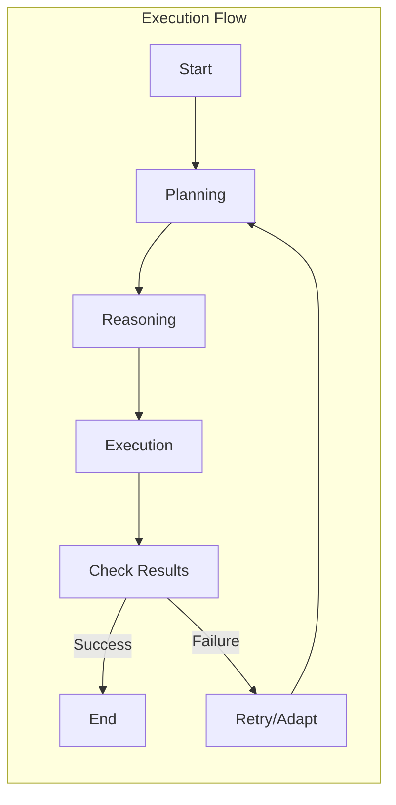

# Execution Flow in OpenDXA

## Overview

The execution flow in OpenDXA defines how agents plan, reason, and execute tasks. It combines declarative knowledge with imperative actions to achieve complex objectives.

## Core Concepts

### 1. Execution Components
- Planning System
  - Strategic task decomposition
  - Resource allocation
  - Dependency management
  - Goal refinement
- Reasoning System
  - Tactical decision making
  - Context analysis
  - Knowledge application
  - Problem solving
- Execution Context
  - [State management](./state-management.md)
  - Resource access
  - Progress tracking
  - Error handling

### 2. Execution Operations
- Workflow execution
- [State management](./state-management.md)
- Resource coordination
- Error handling
- Progress tracking

## Architecture



## Implementation

### 1. Workflow Execution
```python
from opendxa.execution import WorkflowExecutor
from opendxa.execution.workflow import Workflow

# Create workflow
workflow = Workflow(objective="Analyze data")
workflow.add_node("ANALYZE", "Analyze dataset")

# Execute
executor = WorkflowExecutor()
result = await executor.execute(workflow)
```

### 2. State Management
```python
from opendxa.execution import ExecutionContext

# Create context
context = ExecutionContext()

# Access state
context.set_state("analysis.result", result)
value = context.get_state("analysis.result")
```
*See [State Management](./state-management.md) for comprehensive details.*

### 3. Error Handling
```python
try:
    result = await executor.execute(workflow)
except ExecutionError as e:
    # Handle error
    context.handle_error(e)
    # Retry or adapt
```

## Key Differentiators

1. **Declarative-Imperative Integration**
   - Clear separation of planning and execution
   - Knowledge-driven execution
   - Context-aware reasoning
   - Adaptive error handling

2. **Robust Execution**
   - State management
   - Resource coordination
   - Error recovery
   - Progress tracking

3. **Flexible Workflows**
   - Dynamic task decomposition
   - Resource allocation
   - Dependency management
   - Goal refinement

## Best Practices

1. **Workflow Design**
   - Clear objectives
   - Proper decomposition
   - Error handling
   - State management *(See [State Management](./state-management.md))*

2. **Execution Control**
   - Resource management
   - Progress tracking
   - Error recovery
   - Performance monitoring

3. **State Management**
   - Clear state structure
   - Proper access control
   - State persistence
   - Context maintenance

## Common Patterns

1. **Basic Execution**
   ```python
   # Create workflow
   workflow = Workflow(objective="Process data")
   
   # Add nodes
   workflow.add_node("GATHER", "Gather data")
   workflow.add_node("PROCESS", "Process data")
   workflow.add_node("ANALYZE", "Analyze results")
   
   # Add edges
   workflow.add_edge("GATHER", "PROCESS")
   workflow.add_edge("PROCESS", "ANALYZE")
   
   # Execute
   result = await executor.execute(workflow)
   ```

2. **State Management**
   ```python
   # Set state
   context.set_state("data.raw", raw_data)
   context.set_state("data.processed", processed_data)
   
   # Get state
   raw_data = context.get_state("data.raw")
   processed_data = context.get_state("data.processed")
   ```
   *See [State Management](./state-management.md) for comprehensive details.*

3. **Error Handling**
   ```python
   try:
       result = await executor.execute(workflow)
   except ExecutionError as e:
       # Log error
       logger.error(f"Execution failed: {e}")
       
       # Update state
       context.set_state("execution.status", "failed")
       context.set_state("execution.error", str(e))
       
       # Handle based on type
       if isinstance(e, ResourceError):
           # Handle resource error
       elif isinstance(e, StateError):
           # Handle state error
   ```

## Execution Examples

1. **Data Processing**
   - Data gathering
   - Data transformation
   - Analysis execution
   - Result generation

2. **Process Automation**
   - Task decomposition
   - Resource allocation
   - Execution control
   - Error handling

3. **Decision Making**
   - Context analysis
   - Knowledge application
   - Option evaluation
   - Action selection

## Next Steps

- Learn about [Agents](./agent.md)
- Understand [Planning](../cognitive-functions/planning.md)
- Understand [Reasoning](../cognitive-functions/reasoning.md)
- Understand [Memory & Knowledge](../cognitive-functions/memory-knowledge.md)

---
<p align="center">
Copyright © 2024 Aitomatic, Inc. Licensed under the [MIT License](../../LICENSE.md).
<br/>
<a href="https://aitomatic.com">https://aitomatic.com</a>
</p> 